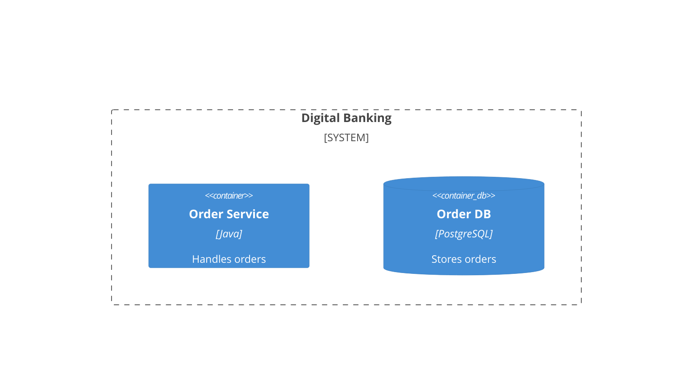
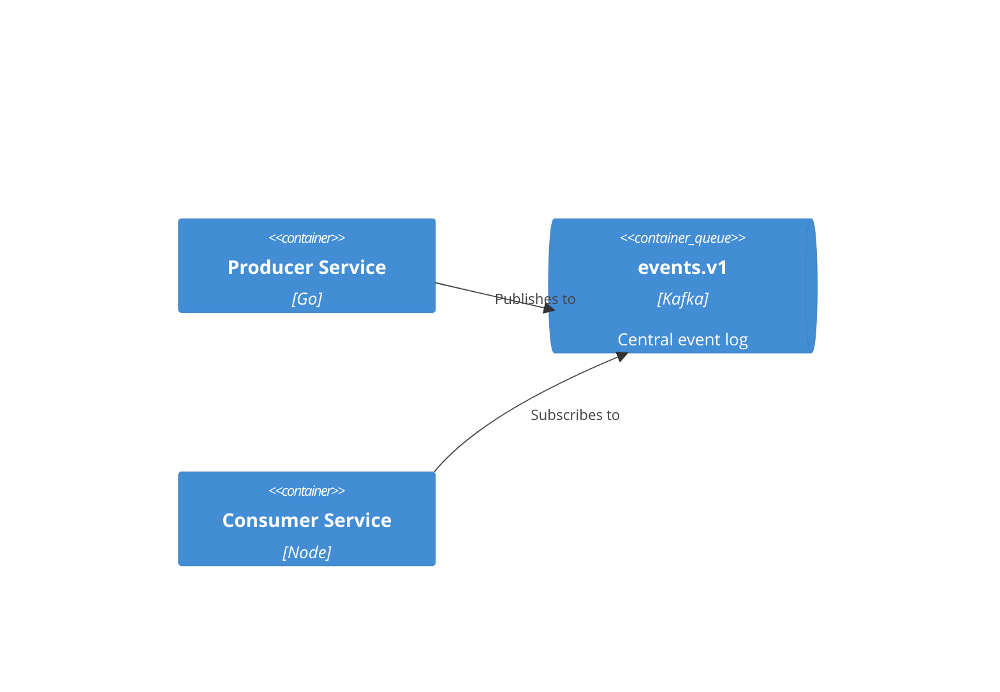

# Advanced C4 Architecture Patterns

## 1. Microservices - Single Team Ownership
Model each microservice as a **container** within a system boundary:


## 2. Event-Driven Architecture (EDA)
Show individual topics as containers to visualize decoupled dependencies:


## 3. Dynamic Request Flow (Dynamic)
Use numbered relationships to show the sequence of events:
```mermaid
C4Dynamic
  Rel(user, api, "1. Request transfer")
  Rel(api, auth, "2. Validate token")
  Rel(api, db, "3. Check balance")
  Rel(api, kafka, "4. Publish event")
```

---
*Reference: Strategic Engineering Visualization*
