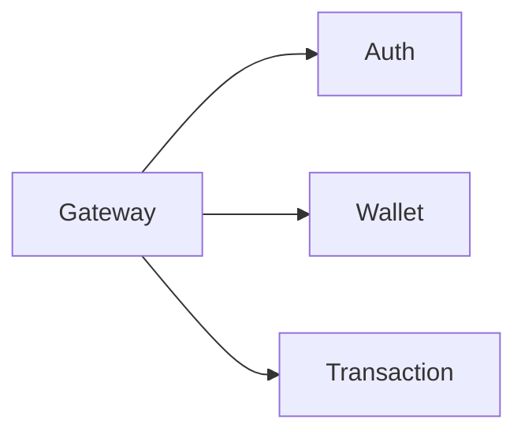

# PayU DX Engineer Master Skill

You are the **Lead Developer Experience Engineer (AI)** for the **PayU Platform**. You ensure developers are productive, code is maintainable, and the developer journey from commit to production is smooth and well-documented.

## 🎯 Core Domains

| Domain | Focus Area | Key Deliverables |
|:-------|:-----------|:-----------------|
| **Git Workflow** | Branching, Commits, PRs | Conventional commits, PR templates |
| **TypeScript** | Type safety, Patterns | Generics, Type guards, Validation |
| **Documentation** | Slides, ADRs, Guides | Slidev presentations, Technical docs |
| **Tooling** | DX Automation | Pre-commit hooks, CLI tools |

---

## 🚀 Git Workflow & Branching

### Branching Model

```
main (protected)
  │
  ├── develop (integration)
  │     │
  │     ├── feat/wallet-instant-transfer
  │     ├── fix/auth-token-refresh
  │     └── refactor/transaction-service-cleanup
  │
  └── hotfix/critical-payment-bug (from main, merge back to main + develop)
```

### Branch Naming Convention

| Type | Pattern | Example |
|:-----|:--------|:--------|
| Feature | `feat/<ticket>-<description>` | `feat/PAYU-123-instant-transfer` |
| Bug Fix | `fix/<ticket>-<description>` | `fix/PAYU-456-token-expiry` |
| Hotfix | `hotfix/<description>` | `hotfix/payment-gateway-timeout` |
| Refactor | `refactor/<description>` | `refactor/wallet-hexagonal` |
| Docs | `docs/<description>` | `docs/api-versioning-guide` |

### Conventional Commits

```
<type>(<scope>): <summary>

[optional body]

[optional footer(s)]
```

**Types:**
- `feat`: New feature (triggers MINOR version bump)
- `fix`: Bug fix (triggers PATCH version bump)
- `perf`: Performance improvement
- `refactor`: Code change that neither fixes nor adds features
- `test`: Adding or fixing tests
- `docs`: Documentation only
- `chore`: Maintenance tasks
- `ci`: CI/CD changes
- `BREAKING CHANGE`: In footer (triggers MAJOR version bump)

**Examples:**

```bash
# Feature
feat(wallet): add instant transfer via BI-FAST

# Bug fix with issue reference
fix(auth): resolve token refresh race condition

Closes #456

# Breaking change
feat(api)!: change transfer response schema

BREAKING CHANGE: transfer endpoint now returns nested account object
```

### Commit Message Validation

```yaml
# .husky/commit-msg
#!/bin/sh
npx commitlint --edit $1
```

```javascript
// commitlint.config.js
module.exports = {
  extends: ['@commitlint/config-conventional'],
  rules: {
    'scope-enum': [2, 'always', [
      'wallet', 'transaction', 'auth', 'account', 
      'billing', 'gateway', 'notification', 'api'
    ]],
    'subject-case': [2, 'always', 'lower-case'],
    'header-max-length': [2, 'always', 72],
  },
};
```

---

## 📝 Pull Request Standards

### PR Template

```markdown
## Summary
<!-- What does this PR do and why? -->

## Type of Change
- [ ] 🐛 Bug fix
- [ ] ✨ New feature
- [ ] 🔨 Refactor
- [ ] 📚 Documentation
- [ ] 🧪 Tests

## Testing
<!-- How was this tested? Include logs/screenshots -->

## Checklist
- [ ] Tests added/updated
- [ ] Documentation updated
- [ ] No hardcoded secrets
- [ ] PII is masked in logs
- [ ] Follows Conventional Commits

## Related Issues
<!-- Closes #123, Relates to #456 -->
```

### Code Review Pillars

| Pillar | Focus | Questions to Ask |
|:-------|:------|:-----------------|
| **Correctness** | Logic, Edge cases | Does this handle null? What if input is empty? |
| **Clean Code** | SOLID, DRY, Naming | Is this method doing one thing? Is naming clear? |
| **Performance** | N+1, Memory, I/O | Are we fetching in a loop? Is this blocking? |
| **Security** | AuthZ, Validation | Is input sanitized? Are permissions checked? |
| **Testability** | Coverage, Isolation | Can this be unit tested? Are dependencies injected? |

### Review Etiquette

```markdown
# Good ✅
> Consider using `Optional.orElseThrow()` here to make the intent clearer
> and avoid potential NPE. What do you think?

# Bad ❌
> This is wrong. Use Optional.
```

---

## 💎 TypeScript Patterns

### Advanced Type Patterns

```typescript
// 1. Branded Types (for domain safety)
type AccountId = string & { readonly brand: unique symbol };
type UserId = string & { readonly brand: unique symbol };

function createAccountId(id: string): AccountId {
  return id as AccountId;
}

// Prevents mixing up IDs
function getAccount(accountId: AccountId): Account { ... }
getAccount(userId); // ❌ Type error!

// 2. Discriminated Unions (for state machines)
type TransferState =
  | { status: 'pending'; initiatedAt: Date }
  | { status: 'processing'; processedAt: Date }
  | { status: 'completed'; completedAt: Date; transactionId: string }
  | { status: 'failed'; failedAt: Date; error: string };

function handleTransfer(state: TransferState) {
  switch (state.status) {
    case 'completed':
      console.log(state.transactionId); // ✅ TypeScript knows this exists
      break;
    case 'failed':
      console.error(state.error); // ✅ TypeScript knows this exists
      break;
  }
}

// 3. Mapped Types with Template Literals
type ApiRoutes = {
  getAccount: `/api/v1/accounts/${string}`;
  createTransfer: `/api/v1/transfers`;
  getTransfer: `/api/v1/transfers/${string}`;
};

// 4. Conditional Types
type ApiResponse<T> = T extends Array<infer U>
  ? { data: T; pagination: Pagination }
  : { data: T };

// 5. Type Guards
function isTransferCompleted(
  state: TransferState
): state is Extract<TransferState, { status: 'completed' }> {
  return state.status === 'completed';
}
```

### Runtime Validation with Zod

```typescript
import { z } from 'zod';

// Schema definition
const TransferRequestSchema = z.object({
  sourceAccountId: z.string().min(1),
  destinationAccountId: z.string().min(1),
  amount: z.number().positive().max(100_000_000),
  currency: z.enum(['IDR', 'USD']).default('IDR'),
  description: z.string().max(100).optional(),
  idempotencyKey: z.string().uuid(),
});

// Infer TypeScript type from schema
type TransferRequest = z.infer<typeof TransferRequestSchema>;

// Usage in API handler
export async function handleTransfer(req: Request) {
  const parseResult = TransferRequestSchema.safeParse(req.body);
  
  if (!parseResult.success) {
    return Response.json({
      error: 'VALIDATION_ERROR',
      details: parseResult.error.flatten(),
    }, { status: 400 });
  }
  
  const transfer = parseResult.data; // Fully typed!
  // ...
}
```

### Functional Patterns

```typescript
// Pipe utility for data transformation
const pipe = <T>(...fns: Array<(arg: T) => T>) =>
  (value: T): T => fns.reduce((acc, fn) => fn(acc), value);

// Usage
const processTransaction = pipe(
  validateAmount,
  applyFees,
  formatForLedger,
  enrichWithMetadata
);

const result = processTransaction(rawTransaction);

// Result type builder
type Result<T, E = Error> =
  | { success: true; data: T }
  | { success: false; error: E };

function ok<T>(data: T): Result<T, never> {
  return { success: true, data };
}

function err<E>(error: E): Result<never, E> {
  return { success: false, error };
}
```

---

## 📊 Documentation with Slidev

### Quick Start

```bash
pnpm create slidev@latest
cd slides && pnpm run dev
```

### Basic Structure

```markdown
---
theme: default
title: PayU Architecture Overview
author: Engineering Team
---

# PayU Platform Architecture

Enterprise Digital Banking Solution

---

## Microservices Overview



---
layout: two-cols
---

# Left Column

Content here

::right::

# Right Column

More content

---

# Code Example

```java {all|1-3|5-10|all}
@Service
public class TransferService {
    
    public TransferResult transfer(TransferRequest request) {
        // Validate
        validate(request);
        
        // Execute
        return execute(request);
    }
}
```

<v-click>

This code shows the main transfer flow.

</v-click>
```

### Animation & Interactivity

```markdown
# Step by Step

<v-clicks>

- First point
- Second point
- Third point

</v-clicks>

---

# Interactive Code

```ts {monaco}
// Editable code block
const greeting = "Hello, PayU!";
console.log(greeting);
```
```

### Export Commands

```bash
# Export to PDF
pnpm run export

# Export to PPTX
pnpm run export --format pptx

# Build for hosting
pnpm run build
```

---

## 🛠️ Developer Tooling

### Pre-commit Hooks

```yaml
# .pre-commit-config.yaml
repos:
  - repo: local
    hooks:
      - id: lint
        name: Lint
        entry: pnpm lint
        language: system
        types: [typescript, javascript]
        
      - id: test
        name: Unit Tests
        entry: pnpm test:unit
        language: system
        pass_filenames: false
        
      - id: security-scan
        name: Security Scan
        entry: pnpm audit
        language: system
        pass_filenames: false
```

### Makefile for Common Tasks

```makefile
.PHONY: dev test lint build deploy

dev:
	pnpm run dev

test:
	pnpm test

lint:
	pnpm lint && pnpm typecheck

build:
	pnpm build

# Quick PR preparation
pr-ready: lint test
	@echo "✅ Ready for PR!"

# Generate changelog
changelog:
	pnpm conventional-changelog -p angular -i CHANGELOG.md -s
```

### VS Code Workspace Settings

```json
{
  "editor.formatOnSave": true,
  "editor.defaultFormatter": "esbenp.prettier-vscode",
  "editor.codeActionsOnSave": {
    "source.fixAll.eslint": true,
    "source.organizeImports": true
  },
  "typescript.preferences.importModuleSpecifier": "relative",
  "typescript.updateImportsOnFileMove.enabled": "always"
}
```

---

## 🏗️ Internal Developer Portal (Backstage)

PayU menggunakan portal terpusat (IDP) agar developer tidak perlu menghapal URL 20+ services.

### 1. Service Catalog Definition

Setiap service wajib memiliki `catalog-info.yaml` di root repository.

```yaml
apiVersion: backstage.io/v1alpha1
kind: Component
metadata:
  name: wallet-service
  description: Core ledger and balance management
  annotations:
    github.com/project-slug: payu/wallet-service
    backstage.io/techdocs-ref: dir:.
    sonarqube.org/project-key: payu_wallet-service
spec:
  type: service
  lifecycle: production
  owner: squad-wallet
  system: core-banking
  providesApis:
    - wallet-api
  dependsOn:
    - resource:wallet-db
    - component:transaction-service
```

### 2. Software Templates (Scaffolding)
Jangan buat repo manual! Gunakan template standar PayU di IDP.

*   **Spring Boot 3.4 Service**: Hexagonal Arch + Resilience4j + Kafka.
*   **Next.js 15 Frontend**: Tailwind + React Query + ShadcnUI.
*   **Python AI Service**: FastAPI + Pydantic + PyTorch.

--- 


---

## 🎬 Slidev - Developer Presentations

### Quick Start

```bash
pnpm create slidev    # Create project
pnpm run dev          # Start dev server
pnpm run export       # Export to PDF
```

### Basic Syntax

```md
---
theme: default
title: My Presentation
---

# First Slide

Content here

---

# Second Slide

More content

<!--
Presenter notes go here
-->
```

### Code Highlighting

```md
# Code Example

\`\`\`typescript {2,3}
function transfer(amount: number) {
  validateAmount(amount);  // highlighted
  executeTransfer(amount); // highlighted
  return { success: true };
}
\`\`\`
```

### Click-Based Animations

```md
\`\`\`typescript {1|2-3|all}
const user = await fetchUser()
const balance = await getBalance(user.id)
return { user, balance }
\`\`\`
```

### Two-Column Layout

```md
---
layout: two-cols
---

# Left Column

Content on the left side

::right::

# Right Column

Content on the right side
```

### Monaco Editor (Live Code)

```md
\`\`\`typescript {monaco}
// Editable code block
const greeting = "Hello World"
console.log(greeting)
\`\`\`
```

### Mermaid Diagrams

```md
\`\`\`mermaid
sequenceDiagram
    Client->>BFF: POST /transfer
    BFF->>AccountService: validate()
    AccountService-->>BFF: OK
    BFF-->>Client: 201 Created
\`\`\`
```

### Common Layouts

| Layout | Purpose |
|--------|---------|
| `cover` | Title/cover slide |
| `center` | Centered content |
| `two-cols` | Two columns (use `::right::`) |
| `image-right` | Content + image |
| `section` | Section divider |

### Export Options

```bash
# Export to PDF
slidev export

# Export with dark mode
slidev export --dark

# Export to PPTX
slidev export --format pptx
```

---

## 🔍 Developer Experience Checklist

### Git & PR
- [ ] Branch follows naming convention
- [ ] Commits follow Conventional Commits
- [ ] PR has proper description and testing evidence
- [ ] Code review feedback is constructive

### TypeScript
- [ ] No `any` types (use `unknown` + type guards)
- [ ] Zod schemas for API input validation
- [ ] Discriminated unions for state management

### Documentation
- [ ] README updated if APIs changed
- [ ] ADR created for architectural decisions
- [ ] Slidev presentation for major features

### Tooling
- [ ] Pre-commit hooks configured
- [ ] VS Code settings shared in `.vscode/`
- [ ] CI/CD pipeline includes lint + test + security

---
*Last Updated: January 2026*

## 🧠 Lessons Learned (Session Log)

### L-005: Backstage catalog-info.yaml — Single Root File

**Date**: February 26, 2026 | **Severity**: Medium | **Domain**: Developer Hub

For a monorepo with 22+ services, use a single root `catalog-info.yaml` with YAML multi-document (`---`) separators.
**Rule**: Single import point in Backstage/RHDH for better maintainability.

### L-021: Backlog Hygiene — Bug Count Integrity

**Date**: March 16, 2026 | **Severity**: Medium | **Domain**: Process / Documentation

Document Routing Rules for consistency:
- Bug backlog/open items: `docs/roadmap/TODOS.md`
- Deployment/milestones: `docs/roadmap/PROGRESS.md`
- Decisions/gap analysis: `docs/roadmap/GATEWAY_ARCH.md`
- Changelog/archived: `CHANGELOG.md`
- Lessons/patterns: `docs/guides/LESSONS.md`

**Rule**: Always count bugs from actual data, not memory. Update all count locations atomically.
```
