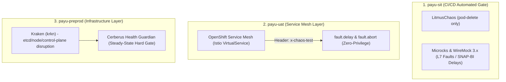

# ADR-0024: Tiered Chaos Engineering & Fault Injection Strategy

**Status**: Accepted  
**Date**: 2026-08-18  
**Deciders**: Principal Architect, Platform Engineer, Core Banking Lead, Security Architect  

## Context

Platform Core Banking & Payment Gateway PayU melayani transaksi finansial kritikal dan integrasi eksternal (standar SNAP-BI). Sistem wajib memiliki ketahanan tinggi terhadap kegagalan komponen (pod restart mendadak, degradasi latensi downstream partner, hingga kegagalan kontrol infrastruktur).

Namun, pengujian resiliensi pada platform Red Hat OpenShift 4.20 menghadapi sejumlah batasan operasional dan teknis:
1. **RHCOS (Red Hat Enterprise Linux CoreOS) & CRI-O Runtime**: Host OS bersifat *immutable* dengan kernel RHEL 9 (5.14.0-xxx) dan SELinux *enforcing*. Helper pod LitmusChaos 3.28.0 (`go-runner`) mengalami *futex deadlock* saat inisialisasi thread lokal ketika mencoba berinteraksi dengan socket CRI-O. Hanya eksperimen berbasis K8s API (`pod-delete`) yang berjalan andal.
2. **Container Hardening (UBI9 Non-Root)**: Seluruh container PayU menggunakan UBI9 non-root (UID 1001), drop ALL capabilities, dan read-only root filesystem. Container sengaja tidak memuat utilitas manipulasi jaringan/kernel OS seperti `tc` (iproute2) atau `stress-ng`. Injeksi network chaos yang membutuhkan hak `CAP_NET_ADMIN` atau privileged SCC dilarang.
3. **Evolusi Perkakas Simulasi**: Alat lama seperti Toxiproxy sudah tidak aktif dikembangkan (maintenance mode), sehingga diperlukan alternatif modern (2025/2026) yang native terhadap Kubernetes/OpenShift.

## Decision Drivers

- **Least Privilege & Container Security**: Eksperimen chaos tidak boleh menurunkan postur keamanan cluster (tanpa privileged SCC / root access pada node RHCOS).
- **Blast Radius Control**: Injeksi kegagalan aplikasi harus dapat ditargetkan secara presisi (misalnya via HTTP header) agar tidak mengganggu transaksi/tester lain.
- **Active Cloud-Native Tooling**: Menggunakan perkakas yang aktif dimaintain di ekosistem CNCF / Red Hat OperatorHub (2025/2026).
- **Financial Transaction Integrity**: Menjamin kepatuhan aturan non-negotiable PayU: zero double-entry errors, double-debit prevention, dan idempotency replay.
- **Regulatory & Audit Compliance**: Memenuhi bukti uji ketahanan operasional untuk **PCI-DSS v4.0 (Req 11.3 & 12.0)** serta regulasi **OJK/BI**.

## Considered Options

### Option 1: Full-Stack LitmusChaos Helper Pods di Semua Environment
- **Pros**: Satu kontroler terpadu untuk semua jenis eksperimen (pod, network, disk, CPU).
- **Cons**: Mengalami deadlock di RHCOS + CRI-O, membutuhkan SCC privileged/hostPath, gagal pada container minimalis UBI9 yang tidak memiliki binary `tc`/`stress-ng`.

### Option 2: Mengadopsi Chaos Mesh di Seluruh Cluster
- **Pros**: Menggunakan arsitektur `chaos-daemon` (DaemonSet), menghindari deadlock helper pod.
- **Cons**: Membutuhkan `chaos-daemon` privileged dengan akses host di setiap node RHCOS. Menambah beban operasional dan memperluas attack surface di luar standar keamanan perbankan.

### Option 3: Tiered Chaos & Fault Injection Strategy (Terpilih)
- **Pros**: Membagi tanggung jawab chaos secara berjenjang sesuai peruntukan environment tanpa eskalasi hak akses sistem operasi.
- **Cons**: Perlu konfigurasi perkakas yang berbeda antara SIT (API/Mock layer), UAT (Mesh layer), dan Pre-Prod (Infra layer).

---

## Decision

Kami menetapkan **Tiered Chaos Engineering & Fault Injection Strategy** yang memisahkan skenario pengujian berdasarkan lingkungan:

### 1. Level SIT (`payu-sit` — CI/CD Promotion Gate)
- **Pod Lifecycle Chaos**: Menggunakan **LitmusChaos hanya untuk `pod-delete`** (menggunakan Kubernetes API langsung tanpa helper pod) yang diintegrasikan ke Tekton promotion pipeline (`k6-smoke-test-gate`).
- **Partner & Dependency Simulation**:
  - Menggunakan **Microcks** (OpenShift Operator) untuk mocking kontrak OpenAPI REST, AsyncAPI (Kafka), dan gRPC dengan konfigurasi response delay.
  - Menggunakan **WireMock 3.x** (containerized/Testcontainers) untuk mensimulasikan kegagalan jaringan downstream seperti HTTP 5xx bursts, latensi dinamis, dan TCP anomalies (`Fault.MALFORMED_RESPONSE_CHUNK`, `Fault.CONNECTION_RESET_BY_PEER`).

### 2. Level UAT (`payu-uat` — Service Mesh Active)
- **Zero-Privilege L7 Network Chaos**: Memanfaatkan **OpenShift Service Mesh (Istio OSSM 3.4)** dengan `VirtualService` Fault Injection (`fault.delay` dan `fault.abort`).
- **Targeted Header Injection**: Injeksi latensi atau abort wajib dipicu secara selektif menggunakan header HTTP (contoh: `x-chaos-injection: partner-timeout`), menjaga blast radius ke pengujian lain tetap terisolasi.

### 3. Level Pre-Production (`payu-preprod` — Infrastructure Chaos)
- **Control Plane & Node Disruption**: Menggunakan **Kraken (krkn)** dari ekosistem Red Hat Chaos untuk menguji ketahanan terhadap kegagalan etcd quorum, evakuasi node worker, dan degradasi OpenShift API server.
- **Cerberus Steady-State Guardian**: Cerberus wajib bertindak sebagai *hard gate*. Skenario chaos berikutnya dilarang dijalankan jika cluster belum mencapai status *steady state* (seluruh `ClusterOperators` status `Available=True`, `Degraded=False`).

### 4. Financial Safety & Transaction Invariants
- Seluruh pengujian chaos pada alur finansial wajib memvalidasi:
  - **Single ACID Transaction**: Penulisan Idempotency Record (`X-Idempotency-Key`), Ledger Entries (Double-Entry), dan Baris Outbox (`outbox_events`) di-commit dalam satu transaksi database PostgreSQL yang atomik.
  - **Replay Safety**: Saat pod crash di tengah eksekusi dan client melakukan auto-retry, service harus mengembalikan response dari cache idempotency tanpa menduplikasi jurnal ledger atau outbox event.

---

## Consequences

### Positive
- **Stabilitas CI/CD**: Menghilangkan kegagalan pipeline akibat *deadlock* helper pod Litmus di OpenShift 4.20 / CRI-O.
- **Keamanan Terjaga**: Tidak memerlukan penambahan privilege Linux (`NET_ADMIN`) atau privileged SCC pada node RHCOS.
- **Compliance Ready**: Menghasilkan data uji dan bukti ketahanan operasional yang terdokumentasi rapi untuk audit PCI-DSS v4.0 (Req 11.3) dan OJK/BI.
- **Determinisme Pengujian**: Mocking via Microcks/WireMock 3.x dan Istio VirtualService memberikan kontrol latensi/kegagalan yang presisi dan reproducible.

### Negative / Trade-offs
- Injeksi network chaos level L4/L3 mentah (seperti interface packet drop atau MTU corruption) ditiadakan di level SIT dan digantikan dengan simulasi L7 pada layer Mock / Service Mesh.
- Memerlukan pemeliharaan konfigurasi stubs Microcks/WireMock dan VirtualService di repositori GitOps.

---

## Implementation & Audit References

- [ADR-0008: Resilience Patterns (Circuit Breaker & Retry)](./0008-resilience-patterns.md)
- [ADR-0022: Money & Idempotency Standard](./0022-money-idempotency-standard.md)
- [DevSecOps Architecture](../architecture/DEVSECOPS_ARCHITECTURE.md)
- [Litmus OpenShift Compatibility Report](../guides/LITMUS_CHAOS_OPENSHIFT_COMPATIBILITY.md)
- [PCI-DSS v4.0 Evidence Report](../compliance/PCI-DSS-v4.0-Evidence-Report.md)
- [Platform Todos Roadmap](../roadmap/TODOS.md)
