# ADR-0025: SNAP-BI & Partner Gateway Security Standards

**Status**: Accepted  
**Date**: 2026-08-18  
**Deciders**: Principal Architect, Security Architect, Core Banking Lead, API Architect  

## Context

PayU menyediakan antarmuka integrasi terbuka bagi mitra eksternal (seperti TokoBapak, Nobar, dan agregator pembayaran) menggunakan standar resmi Bank Indonesia: **SNAP-BI (Standar Nasional Open API Pembayaran Indonesia)**.

Integrasi perbankan terbuka membawa sejumlah tantangan keamanan dan integritas transaksi:
1. **Kriptografi Dual-Signature**: SNAP-BI mewajibkan tanda tangan asimetris (RSA-SHA256) untuk pertukaran token B2B dan tanda tangan simetris (HMAC-SHA512) untuk transaksi finansial (Payment, VA, QRIS, Refund). Kesalahan normalisasi payload atau mutasi URL path oleh API Gateway dapat merusak validasi tanda tangan (*signature mismatch*).
2. **Replay Attack vs Financial Idempotency**: Harus ada batasan tegas antara perlindungan paket jaringan (toleransi waktu ±300 detik) dan perlindungan transaksi ganda (*double-debit prevention*).
3. **Risiko Egress Webhook (SSRF & DNS Rebinding)**: Pengiriman event callback ke URL partner rentan dimanfaatkan untuk menyerang infrastruktur internal (Cloud Metadata `169.254.169.254`, internal Kubernetes services, atau serangan *Time-of-Check to Time-of-Use* via DNS Rebinding).

## Decision Drivers

- **Kepatuhan Regulasi Bank Indonesia (BI)**: Wajib 100% patuh terhadap spesifikasi SNAP-BI v1.0.2 untuk lulus audit sistem pembayaran.
- **Integritas Finansial & Zero Double-Debit**: Menjamin tidak ada transaksi ganda akibat retry jaringan.
- **Defense-in-Depth Webhook Security**: Memastikan dispatcher webhook tidak dapat dijadikan vektor SSRF ke dalam jaringan internal PayU.
- **Edge Gateway & Least Privilege**: Memastikan edge gateway (APIcast / 3scale / Quarkus Gateway) menjaga integritas path tanpa memodifikasi payload.

---

## Decision

Kami menetapkan arsitektur dan standar implementasi keamanan **SNAP-BI & Partner Gateway** sebagai berikut:

```mermaid
flowchart TD
    subgraph INGRESS["1. Partner Ingress Flow (SNAP-BI)"]
        PARTNER["External Partner"] -->|HTTPS + SNAP-BI Headers| EDGE["Edge Gateway (APIcast / 3scale)"]
        EDGE -->|Rate Limiting + WAF| GW["Gateway Service (Quarkus)"]
        GW -->|Preserve Canonical Path| PS["partner-service (Spring Boot)"]
        PS -->|Validate Sig & Timestamp| IDM["Idempotency Filter (DB ACID)"]
    end

    subgraph EGRESS["2. Partner Egress Flow (Webhook Callback)"]
        EVENT["Outbox / Payment Event"] --> DISPATCH["Webhook Dispatcher Service"]
        DISPATCH --> DNS["Custom DNS Resolver (Block Private CIDR & Loopback)"]
        DNS -->|Direct IP Socket| WEBHOOK_DEST["Partner Webhook Endpoint"]
    end
```

### 1. Kriptografi & Validasi Tanda Tangan (Dual-Signature Standard)
- **B2B Token Authentication (`/v1.0/access-token/b2b`)**:
  - Algoritma: **SHA256withRSA (RSA-2048)**.
  - String-to-Sign: `X-CLIENT-KEY + "|" + X-TIMESTAMP`.
  - Verifikasi: Public Key partner yang terdaftar dan terenkripsi di database PayU.
- **Transactional Endpoints (VA, QRIS, Payment, Refund)**:
  - Algoritma: **HMAC-SHA512** (output 88 karakter Base64).
  - String-to-Sign:
    $$\text{HTTPMethod} : \text{EndpointUrl} : \text{AccessToken} : \text{Lowercase(Hex(SHA256(minify(Body))))} : \text{X-TIMESTAMP}$$
  - Kunci: `client_secret` partner.

### 2. Canonical Path & Gateway Routing Invariant
- **No Path Divergence (Lesson L-254)**:
  - Edge Gateway dan Quarkus Gateway dilarang melakukan rewrite yang mengubah format endpoint path publik.
  - `partner-service` wajib menghitung `EndpointUrl` secara dinamis dari `HttpServletRequest.getRequestURI()` (bukan konstanta hardcoded) untuk mendukung kanonikal path SNAP-BI (`/v1.0/*`) dan backward compatibility (`/v1/partner/*`).

### 3. Pemisahan Replay Window vs Financial Idempotency
- **Transport Security Window (`X-TIMESTAMP`)**:
  - Divalidasi dengan toleransi ketat **±300 detik (5 menit)** dari server clock PayU.
  - Request dengan timestamp di luar batas toleransi langsung ditolak dengan kode error SNAP-BI `4017300` / HTTP 401 Unauthorized.
- **Financial Idempotency (`partnerReferenceNo` / `X-EXTERNAL-ID`)**:
  - Disimpan dalam tabel `idempotency_records` dengan masa retensi (TTL) minimal 24 jam.
  - Jika request datang dengan `partnerReferenceNo` yang sama:
    - Jika di dalam 300 detik: Mengembalikan respon sukses yang di-cache (`200 OK`).
    - Jika partner me-retry setelah 300 detik dengan **timestamp baru** dan signature baru: Validasi signature lolos, layer bisnis mengenali idempotency key, dan mengembalikan respon sukses sebelumnya tanpa melakukan debit ulang.

### 4. Webhook Trust Boundary & Proteksi SSRF/DNS Rebinding
- **Skema Wajib**: Hanya protokol `HTTPS` port 443 yang diizinkan (menolak plain HTTP dan custom ports).
- **Anti-SSRF IP Blocklist**:
  - Seluruh target IP hasil resolve wajib diperiksa terhadap daftar blokir:
    - IPv4 Private (RFC 1918): `10.0.0.0/8`, `172.16.0.0/12`, `192.168.0.0/16`
    - Loopback: `127.0.0.0/8`, `::1`
    - Link-Local & Cloud Metadata (RFC 3927): `169.254.0.0/16`, `fe80::/10`
    - Internal Cluster DNS / Namespaces (`*.svc.cluster.local`)
- **Anti-DNS Rebinding (Safe Socket Factory)**:
  - Webhook client dilarang melakukan validasi DNS dan koneksi HTTP secara terpisah. Client wajib melakukan DNS resolution satu kali, memvalidasi seluruh IP, lalu membuka socket TCP langsung ke alamat IP yang telah divalidasi dengan SNI dan header `Host` domain asli.
- **Ukuran Payload & Timeout**:
  - Ukuran payload webhook dibatasi maksimal **64 KiB**.
  - Connect timeout maksimal 3 detik, read timeout maksimal 5 detik. Retry dilakukan via outbox worker dengan exponential backoff dan fallback ke `.dlq`.

---

## Consequences

### Positive
- **Kepatuhan Penuh SNAP-BI**: Sesuai dengan spesifikasi teknis Bank Indonesia, memudahkan sertifikasi dan onboarding mitra (TokoBapak, Nobar).
- **Zero Double-Debit**: Idempotency terlindungi di level ACID database terlepas dari retry badai di layer jaringan.
- **Perlindungan Total Infrastruktur Internal**: SSRF dan DNS rebinding dicegah di layer socket sebelum paket keluar dari pod webhook.
- **Konsistensi Tanda Tangan**: Mencegah kegagalan verifikasi signature akibat perubahan routing gateway.

### Negative / Trade-offs
- Payload JSON harus di-minifikasi (strip whitespace) sebelum di-hash SHA-256, memerlukan sedikit CPU overhead pada request payload besar.
- Partner wajib mendaftarkan Public Key X.509 dan me-rotate `client_secret` secara berkala via Merchant Portal.

---

## Implementation & Audit References

- [ADR-0010: Security Standards](file:///home/ubuntu/payu/docs/adr/0010-security-standards.md)
- [ADR-0022: Money & Idempotency Standard](file:///home/ubuntu/payu/docs/adr/0022-money-idempotency-standard.md)
- [ADR-0024: Tiered Chaos Engineering & Fault Injection Strategy](file:///home/ubuntu/payu/docs/adr/0024-chaos-engineering-and-fault-injection-strategy.md)
- [Gateway Architecture](file:///home/ubuntu/payu/docs/roadmap/GATEWAY_ARCH.md)
- [Lesson Learned L-254 (SNAP-BI Endpoint Path Binding)](file:///home/ubuntu/payu/docs/guides/LESSONS.md)
- [PCI-DSS v4.0 Evidence Report](file:///home/ubuntu/payu/docs/compliance/PCI-DSS-v4.0-Evidence-Report.md)
