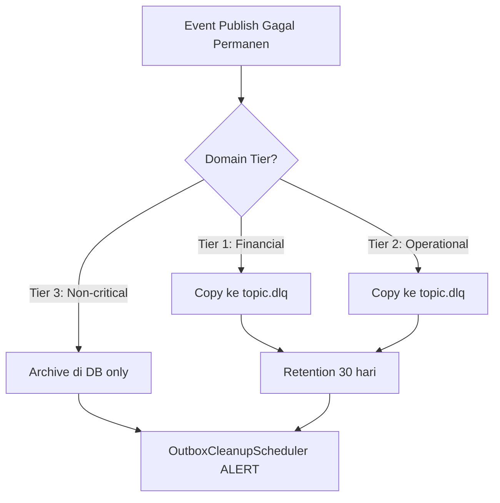

# ADR-0026: Kafka Topic Governance & Dead Letter Queue Strategy

**Status**: Accepted  
**Date**: 2026-08-18  
**Deciders**: Principal Architect, Integration Architect, Platform Engineer  
**Supersedes**: —  
**Related**: [ADR-0025](0025-snap-bi-and-partner-gateway-security-standard.md) (DLQ dalam webhook), ARCH-TOPIC-002, ARCH-DLQ-001  

## Context

PayU menggunakan Apache Kafka (via Strimzi/AMQ Streams) sebagai event backbone antar ~15 microservice. Sebelum keputusan ini, ada beberapa risiko operasional:

1. **Auto-create topics**: Sebagian besar dari ~65 topic di-create otomatis oleh Kafka broker saat producer pertama kali menulis. Topic auto-create menggunakan konfigurasi default broker (RF 1, partisi 1) — **risiko kehilangan event finansial** jika satu broker mati.

2. **Legacy KafkaTopic resources**: 14 KafkaTopic Strimzi lama (prefix `account-events`, `wallet-events`, dll.) tidak matching dengan topic name sebenarnya di code (`payu.account.user-created.v1`), menyebabkan *ghost resources* yang membingungkan ops.

3. **Tidak ada DLQ coverage sistematis**: `outbox-starter` sudah publish events via transactional outbox pattern, tetapi event yang gagal permanen (>maxRetries) hanya di-archive di database. Tidak ada DLQ topic untuk replay — operator harus scan database manual.

4. **EVENT_CATALOG.md stale**: Dokumentasi event hanya mencakup 15 topics (Januari 2026), padahal code sudah referensi 65+ topics.

### Decision Drivers

- **Regulasi OJK/BI**: POJK No. 4/2021 (manajemen risiko operasional) dan PBI No. 23/6/2021 (sistem pembayaran) mewajibkan mekanisme recovery terdokumentasi untuk seluruh transaksi gagal.
- **Zero data-loss financial events**: Event finansial (transfer, payment, settlement) tidak boleh hilang tanpa jejak.
- **Operational visibility**: Tim ops harus bisa melihat, me-replay, dan me-monitor event yang gagal tanpa akses database langsung.
- **Cost efficiency**: Tidak semua topic butuh DLQ — menambah 65+ DLQ topics tanpa justifikasi = waste cluster resources.

---

## Decision

### 1. Declarative-Only Topics (auto-create OFF)

Semua Kafka topics **wajib** dideklarasikan sebagai `KafkaTopic` custom resource di [`01-kafka-topics-code.yaml`](../../infrastructure/platform/messaging/base/01-kafka-topics-code.yaml). Cluster Kafka harus menjalankan `auto.create.topics.enable=false`.

**Naming convention**:
```
payu.{domain}.{event-type}.v{version}[.dlq]
```

**Default configuration** per topic:
- Partitions: 3 (minimum untuk consumer parallelism)
- Replication Factor: 3 (minimum untuk durability di 3-broker cluster)
- Cleanup policy: `delete`

### 2. Tiered DLQ Strategy

Tidak semua domain butuh DLQ. Kami menerapkan **tiered approach** berdasarkan impact analysis:



| Tier | Domains | DLQ? | Retention | Rationale |
|:---|:---|:---:|:---:|:---|
| **1 — Financial** | transaction, wallet, payment, partner, lending | ✅ | 30d | Event loss = selisih rekonsiliasi, regulatory finding |
| **2 — Operational** | account, kyc | ✅ | 30d | KYC/account loss = regulatory risk (UU PDP, OJK) |
| **3 — Non-critical** | billing, cache, cms, dispute, fx, integration, investment, promotion, saga, security, statement, webhook | ❌ | — | UX/ops impact only; recovery via re-trigger atau DB replay |

**DLQ retention 30 hari**: Cukup untuk operational recovery buffer. Data finansial jangka panjang tetap di database (outbox_events table, immutable).

### 3. DLQ Mechanism — Best-Effort, Non-Throwing

`OutboxPublisher.sendToDlq()` mengirim event gagal permanen ke `<destinationTopic>.dlq` secara **best-effort**:

```java
private void sendToDlq(OutboxEvent event) {
    String dlqTopic = baseTopic + ".dlq";
    try {
        kafkaTemplate.send(buildRecord(event, dlqTopic)).get(10, SECONDS);
    } catch (Exception e) {
        log.error("Failed to move event {} to DLQ: {}", event.getId(), e.getMessage());
        // Non-throwing — archived DB row is the audit record
    }
}
```

**Invariant**: `sendToDlq` **tidak boleh throw**. Jika DLQ unreachable, event tetap tersimpan di `outbox_events` table sebagai audit record. `OutboxCleanupScheduler` akan log `OUTBOX-001 ALERT` untuk event ini.

### 4. DLQ Consumer — Deliberately Deferred

Consumer per-service yang membaca dari `.dlq` topics **tidak diimplementasikan saat ini**. Alasan:

1. Alert destination (Slack/PagerDuty) belum ready (blocked: DEVSECOPS-017, Vault credentials)
2. Consumer log-only akan duplikat `OutboxCleanupScheduler` alert — YAGNI
3. Event sudah aman di 2 tempat: DLQ topic (30 hari) + database (indefinite)

**Kapan ditambahkan**: Saat alert destination ready, buat consumer di shared starter yang consume `.dlq`, push alert ke Slack/PagerDuty, dan expose Prometheus metric `outbox.dlq.messages.total`.

### 5. DLQ Replay — CLI Tool (Planned)

Replay tool shell script (`scripts/dlq-replay.sh`) untuk memindahkan event dari DLQ topic kembali ke original topic:

```bash
./scripts/dlq-replay.sh --topic payu.transaction.initiated.v1.dlq --event-id <id>
./scripts/dlq-replay.sh --topic payu.transaction.initiated.v1.dlq --from 2026-08-01 --to 2026-08-02
```

### 6. EVENT_CATALOG.md — Generated from Manifest

`EVENT_CATALOG.md` di-regenerate dari `01-kafka-topics-code.yaml` sebagai single source of truth. Mencakup:
- Domain sections dengan service ownership (producer/consumer)
- DLQ tier classification
- Gap analysis (topics di code tapi belum di manifest)

---

## Consequences

### Positive

- **Zero silent data loss**: Semua topic finansial punya DLQ fallback. Event yang gagal publish tersimpan di 2 tempat (DLQ topic + database).
- **Deterministic cluster state**: `auto.create.topics.enable=false` + declarative manifest = no surprise topics, RF/partition terjamin.
- **Regulatory compliance**: Recovery mechanism terdokumentasi untuk setiap tier domain, sesuai POJK/PBI.
- **Cost-efficient**: Hanya 42 DLQ topics (bukan 65+), hemat ~23 × 3 × 3 = 207 partition replicas.
- **Accurate documentation**: EVENT_CATALOG.md selalu sinkron dengan manifest.

### Negative / Trade-offs

- **DLQ consumer deferred**: Sampai alert destination ready, monitoring DLQ bergantung pada log scanning (`OUTBOX-001 ALERT`) — bukan push notification. Mitigasi: Prometheus log-rule alert bisa dibuat dari pattern ini.
- **No schema registry**: Event schema tidak di-enforce di broker level. Mitigasi: CloudEvents envelope + type versioning (`v{N}`) di topic name.
- **Manual replay**: Replay dari DLQ masih manual (CLI tool). Mitigasi: Cukup untuk MVP; otomatis replay engine = future enhancement.

---

## Implementation & Audit References

- [01-kafka-topics-code.yaml](../../infrastructure/platform/messaging/base/01-kafka-topics-code.yaml) — 107 KafkaTopic manifest
- [EVENT_CATALOG.md](../architecture/EVENT_CATALOG.md) — regenerated event catalog
- [OutboxPublisher.sendToDlq](../../backend/shared/outbox-starter/src/main/java/id/payu/outbox/publisher/OutboxPublisher.java) — DLQ send implementation
- [OutboxCleanupScheduler](../../backend/shared/outbox-starter/src/main/java/id/payu/outbox/scheduler/OutboxCleanupScheduler.java) — OUTBOX-001 ALERT
- [ADR-0022: Money & Idempotency Standard](0022-money-idempotency-standard.md)
- [ADR-0025: SNAP-BI & Partner Gateway Security Standard](0025-snap-bi-and-partner-gateway-security-standard.md)
- [AGENTS.md Rule #4](../../AGENTS.md) — outbox-starter mandate, CloudEvents 1.0.2, `.dlq` suffix convention
