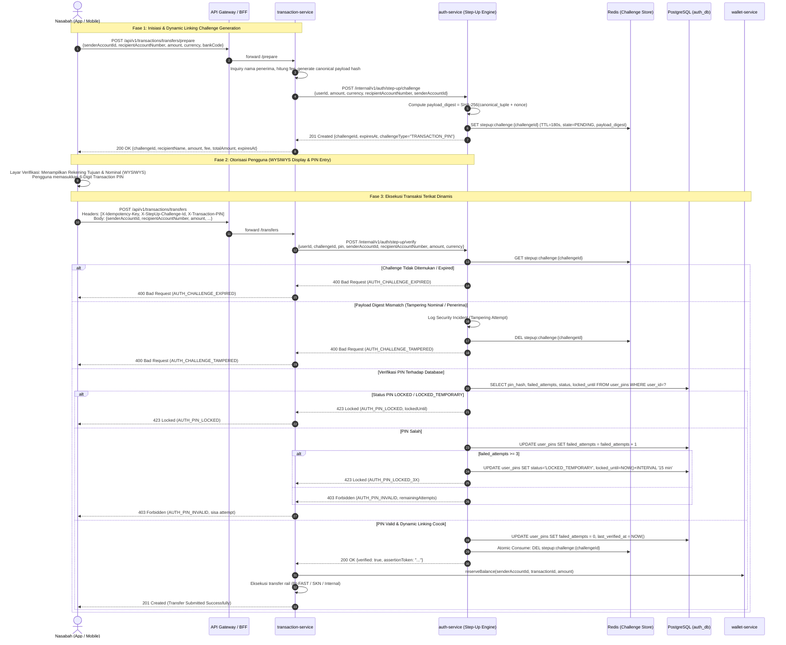

# ADR-0028: Step-Up Authentication, Dynamic Linking & Transaction PIN Security Standard

**Status**: Accepted  
**Date**: 2026-08-18  
**Deciders**: Principal Architect, Cybersecurity Architect, Core Banking Engineer, API Architect  
**Supersedes**: —  
**Related**: [ADR-0010](0010-security-standards.md) (Security Standards), [ADR-0022](0022-money-idempotency-standard.md) (Money & Idempotency Standard), [ADR-0025](0025-snap-bi-and-partner-gateway-security-standard.md) (SNAP-BI Security Standard), [FLOWS.md](../product/FLOWS.md) (IMP-8), [PRD.md](../product/PRD.md) (§16.2), ARCH-GLOBAL-002

---

## Context

Pada arsitektur perbankan digital dan e-wallet modern, autentikasi awal berbasis session token (OIDC / OAuth 2.0 Bearer JWT via Keycloak) hanya membuktikan bahwa pengguna berhasil login ke aplikasi. Bearer token ini **tidak memadai** untuk mengotorisasi mutasi dana bernilai moneter secara langsung karena beberapa risiko keamanan:

1. **Session Hijacking & Token Theft**: Jika bearer token dicuri melalui Cross-Site Scripting (XSS), malware perangkat, atau interception, penyerang dapat mengeksekusi transfer dana tanpa sepengetahuan pemilik akun.
2. **Device Left Unlocked (Shoulder Surfing)**: Pengguna yang meninggalkan perangkat dalam keadaan terbuka dapat disalahgunakan oleh pihak ketiga untuk mengirim dana.
3. **Man-in-the-Middle (MITM) & Parameter Tampering**: Penyerang dapat memanipulasi nominal transfer atau mengganti nomor rekening tujuan di tengah proses eksekusi jika payload transaksi tidak terikat secara kriptografis ke otorisasi pengguna.
4. **Regulasi Perbankan & FinTech**:
   - **PSD2 RTS Article 5 (Dynamic Linking)**: Mandat bahwa setiap transaksi pembayaran elektronik jarak jauh wajib mengikat otorisasi nasabah secara unik dan kriptografis dengan *nominal (amount)* dan *identitas penerima (payee/beneficiary)*.
   - **Financial-grade API (FAPI 1.0/2.0)**: Standar pengamanan transaksi bernilai tinggi dengan verifikasi otorisasi eksplisit per transaksi.
   - **POJK No. 11/POJK.03/2022 & PADG BI No. 24/7/PADG/2022**: Kewajiban penerapan *Multi-Factor Authentication (MFA)* dan verifikasi otentikasi ganda pada transaksi transfer dana perbankan digital.
   - **UU PDP No. 27/2022 & PCI-DSS 4.0**: Perlindungan kredensial otorisasi (PIN/Biometrik) agar tidak bocor, tidak disimpan dalam bentuk plaintext, dan dimasking secara ketat pada logging dan audit trail.

Sebelum ADR ini, `transaction-service` memiliki atribut `transactionPin` pada DTO `InitiateTransferRequest`, namun belum ada mekanisme verifikasi aktif, credential store, maupun protocol dynamic linking antara `transaction-service` dan `auth-service` (tercatat sebagai blocker `ARCH-GLOBAL-002` di `docs/roadmap/TODOS.md`).

---

## Decision

Kami menetapkan arsitektur standar **Step-Up Authentication & Dynamic Linking** untuk seluruh transaksi mutasi dana keluar (Transfers, QRIS Payment, Batch Disbursement, Perubahan Limit Akun) dengan prinsip-prinsip berikut:



---

## Technical Specifications

### 1. Transaction PIN Credential Store (`auth_db`)

Kredensial Transaction PIN disimpan di database `auth_db` pada skema PostgreSQL yang terisolasi dengan hashing **Argon2id** (RFC 9106, rekomendasi resmi OWASP untuk password/PIN storage):

```sql
CREATE TABLE IF NOT EXISTS user_pins (
    user_id UUID PRIMARY KEY,
    pin_hash VARCHAR(255) NOT NULL,
    failed_attempts INT NOT NULL DEFAULT 0,
    status VARCHAR(32) NOT NULL DEFAULT 'ACTIVE', -- ACTIVE, LOCKED_TEMPORARY, LOCKED_PERMANENT, MUST_CHANGE
    locked_until TIMESTAMP WITH TIME ZONE NULL,
    last_verified_at TIMESTAMP WITH TIME ZONE NULL,
    last_changed_at TIMESTAMP WITH TIME ZONE NOT NULL DEFAULT NOW(),
    created_at TIMESTAMP WITH TIME ZONE NOT NULL DEFAULT NOW(),
    updated_at TIMESTAMP WITH TIME ZONE NOT NULL DEFAULT NOW()
);

CREATE INDEX idx_user_pins_status ON user_pins(status);
```

#### Parameter Argon2id (Spring Security `Argon2PasswordEncoder`)
- **Type**: `Argon2id` (resistensi optimal terhadap GPU brute-force dan side-channel attack).
- **Salt Length**: 16 bytes (128-bit secure random, digenerate otomatis dan disematkan dalam hash string).
- **Hash Length**: 32 bytes (256-bit).
- **Parallelism ($p$)**: 1.
- **Memory Cost ($m$)**: 65536 KiB (64 MiB).
- **Iterations ($t$)**: 3 rounds.
- Format Tersimpan: `$argon2id$v=19$m=65536,t=3,p=1$<salt>$<hash>`.

### 2. Lockout Policy & Anti-Brute-Force
- **Maksimum Percobaan Gagal**: **3 kali berturut-turut**.
- **Percobaan ke-1 & ke-2 Gagal**: Mengembalikan error `403 Forbidden` dengan informasi sisa percobaan (`remainingAttempts: 2` atau `1`).
- **Percobaan ke-3 Gagal**:
  - Akun masuk status `LOCKED_TEMPORARY` selama **15 menit** (`locked_until = NOW() + 15 MIN`).
  - Respons `423 Locked` (`AUTH_PIN_LOCKED`).
- **Percobaan ke-5 Gagal Akumulatif (Setelah Cooldown)**:
  - Akun masuk status `LOCKED_PERMANENT`.
  - Memerlukan reset PIN via verifikasi identitas (OTP multi-kanal + KYC / Card Verification).
- **Keberhasilan Verifikasi**: Reset counter `failed_attempts = 0` dan update `last_verified_at`.

### 3. Dynamic Linking Protocol (PSD2 RTS Article 5)

Dynamic Linking menjamin 4 pilar keamanan transaksi:
1. **WYSIWYS (What You See Is What You Sign)**: Aplikasi client wajib menyajikan nama penerima yang sudah divalidasi (*account inquiry*), nomor rekening, nama bank/operator, nominal transfer, dan biaya transfer secara jelas sebelum prompt PIN.
2. **Cryptographic Binding**:
   $$\text{payload\_digest} = \text{SHA-256}(\text{senderAccountId} \parallel \text{recipientAccountNumber} \parallel \text{amount.toPlainString()} \parallel \text{currency} \parallel \text{nonce})$$
3. **Integrity Guard**: Jika saat `POST /execute`, parameter `amount`, `recipientAccountNumber`, atau `currency` diubah oleh penyerang, perbandingan `payload_digest` akan gagal dan challenge langsung dibatalkan (*immediate invalidation*).
4. **Single-Use & Bounded TTL**: Challenge hanya valid selama **180 detik (3 menit)** dan dihapus secara atomik (`DEL` di Redis) setelah pertama kali diverifikasi untuk mencegah *replay attack*.

### 4. Hexagonal Ports & Service Contracts

#### `auth-service` (Step-Up Domain Port)
```java
public interface StepUpAuthPort {
    StepUpChallenge createTransactionChallenge(CreateChallengeCommand command);
    StepUpVerificationResult verifyTransactionAuth(VerifyChallengeCommand command);
    void setupTransactionPin(UUID userId, String rawPin);
    void changeTransactionPin(UUID userId, String oldPin, String newPin);
    void resetTransactionPin(UUID userId, String resetToken, String newPin);
}
```

#### `transaction-service` (Step-Up Client Port)
```java
public interface StepUpVerificationPort {
    void verifyStepUp(String userId, String challengeId, String pin, 
                      UUID senderAccountId, String recipientAccountNumber, 
                      BigDecimal amount, String currency);
}
```

### 5. Biometric & Platform Authenticator Evolution

1. **Mobile Local Biometric (FaceID / TouchID)**:
   - Sesuai prinsip [cybersecurity-architect/SKILL.md:L86](../../.agents/skills/cybersecurity-architect/SKILL.md#L86), biometrik lokal pada mobile adalah *local device unlocker*, bukan bukti otorisasi backend mandiri.
   - Mobile app memanfaatkan Biometrik lokal untuk meng-unlock encrypted PIN / private key di **iOS Keychain (Secure Enclave)** atau **Android Keystore (TEE)**.
2. **FIDO2 / WebAuthn Client Assertion (Fase Lanjutan)**:
   - Challenge di-*sign* menggunakan asymmetric keypair (ECDSA P-256) yang terdaftar di `auth-service`. Header `X-Transaction-Signature` dikirimkan sebagai alternatif `X-Transaction-PIN`.

---

## Error Handling & RFC 9457 Codes

| HTTP Status | Error Code | Deskripsi Bisnis |
|:---|:---|:---|
| `400 Bad Request` | `AUTH_CHALLENGE_EXPIRED` | Sesi challenge otorisasi transaksi telah kedaluwarsa (> 180s). |
| `400 Bad Request` | `AUTH_CHALLENGE_TAMPERED` | Data transaksi (nominal/penerima) tidak cocok dengan challenge awal. |
| `403 Forbidden` | `AUTH_PIN_INVALID` | PIN transaksi yang dimasukkan salah. Menampilkan sisa percobaan. |
| `409 Conflict` | `AUTH_CHALLENGE_CONSUMED` | Challenge transaksi sudah digunakan sebelumnya (Replay Guard). |
| `423 Locked` | `AUTH_PIN_LOCKED` | PIN transaksi terblokir sementara karena salah 3 kali. |
| `429 Too Many Requests` | `AUTH_RATE_LIMITED` | Terlalu banyak permintaan challenge/verifikasi dalam 1 menit. |

---

## Consequences

### Positif
- **Kepatuhan Regulasi Penuh**: Memenuhi standar PSD2 RTS Article 5, FAPI 2.0, POJK No. 11/POJK.03/2022, dan SNAP-BI.
- **Perlindungan Session Hijacking**: Penyerang dengan akses token HTTP tidak dapat memindahkan saldo nasabah tanpa mengetahui 6-digit PIN.
- **Integritas Transaksi Anti-Tampering**: Manipulasi nilai nominal atau rekening tujuan saat transit langsung menggugurkan challenge transaksi.
- **Zero Raw PIN Logging**: Kredensial PIN di-mask `@Sensitive(CRITICAL)` dan dilindungi hashing memory-hard Argon2id.

### Mitigasi & Trade-Offs
- **Latensi Tambahan**: Verifikasi Argon2id membutuhkan waktu komputasi ~50-100ms. Dikelola dengan worker thread pool terdedikasi di `auth-service`.
- **Dua Langkah Transaksi (Prepare/Execute)**: Frontend web dan mobile perlu alur UX 2-step (Layar konfirmasi transfer -> Layar input PIN).

---

## Implementation Roadmap (ARCH-GLOBAL-002)

1. **Database & Starter (`auth-service`)**:
   - Flyway migration `V2__user_pins_schema.sql`.
   - Implementasi `Argon2PasswordEncoder` bean di `SecurityConfig`.
2. **Domain & Application Logic (`auth-service`)**:
   - Model `UserPin`, `StepUpChallenge`, service `StepUpAuthService`, Redis adapter `RedisChallengeStore`.
   - Internal REST / Web controller `/internal/v1/auth/step-up/*` dan `/api/v1/auth/pin/*` (setup, change, reset).
3. **Transaction Flow Integration (`transaction-service`)**:
   - Tambahkan endpoint `POST /api/v1/transactions/transfers/prepare` (generate challenge).
   - Update `InitiateTransferCommandHandler` untuk memanggil `StepUpVerificationPort` sebelum reservasi saldo ke `wallet-service`.
   - Terapkan guard serupa pada QRIS payment dan Scheduled Transfer.
4. **Unit & Contract Testing**:
   - Test case: PIN valid, PIN salah (1x, 2x, 3x lockout), challenge expired, payload tampering, concurrency idempotency.
