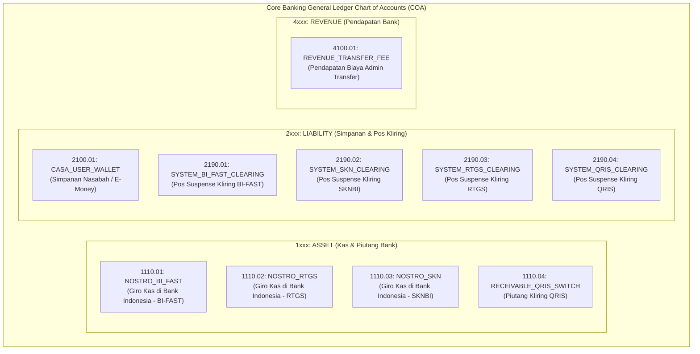
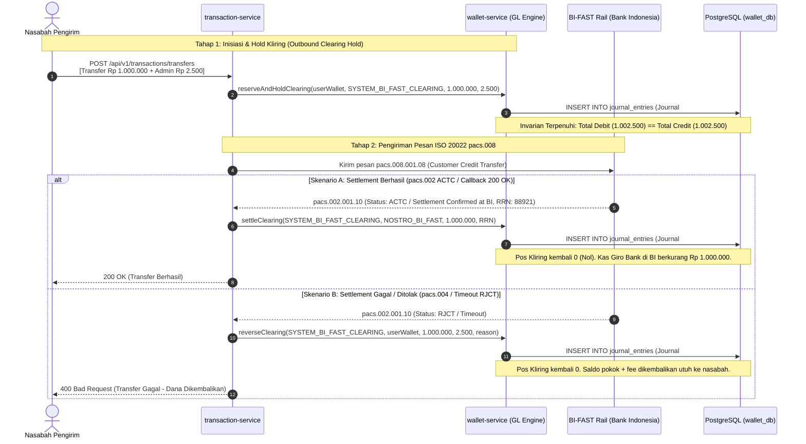

# ADR-0029: ISO 20022 Interbank Clearing, Suspense Account Ledgering & Central Bank Settlement Standard

**Status**: Accepted  
**Date**: 2026-08-18  
**Deciders**: Principal Architect, Core Banking Engineer, Data Architect, Cybersecurity Architect  
**Supersedes**: —  
**Related**: [ADR-0006](0006-postgresql-primary-database.md) (PostgreSQL Primary Database), [ADR-0010](0010-security-standards.md) (Security Standards), [ADR-0022](0022-money-idempotency-standard.md) (Money & Idempotency Standard), [ADR-0025](0025-snap-bi-and-partner-gateway-security-standard.md) (SNAP-BI Standard), [ADR-0028](0028-step-up-authentication-and-dynamic-linking-standard.md) (Step-Up Auth), [FLOWS.md](../product/FLOWS.md) (IMP-9), [PRD.md](../product/PRD.md) (§16.3), ARCH-GLOBAL-003

---

## Context

Dalam industri perbankan dan *core banking systems*, terdapat perbedaan mendasar antara **Transfer Internal (Intrabank / P2P)** dan **Transfer Antar-Bank (Interbank Clearing & Settlement)**:

1. **Transfer Internal (1-Hop Atomic)**:
   - Terjadi dalam satu buku besar bank yang sama.
   - Bersifat atomik langsung: Debit Saldo Pengirim (Liabilitas Bank berkurang) dan Kredit Saldo Penerima (Liabilitas Bank bertambah). Total liabilitas bank tetap seimbang tanpa melibatkan pergerakan kas luar.
2. **Transfer Antar-Bank (Interbank Clearing: BI-FAST, SKNBI, RTGS, QRIS)**:
   - Melibatkan jaringan eksternal (Bank Indonesia Central Settlement System atau Switching Company: ASPI / Artajasa / Rintis / Alto / Jalin).
   - Dana tidak dapat langsung didebit/dikredit terhadap kas bank sentral secara atomik instan karena ada jeda propagasi jaringan (*asynchronous network latency*), verifikasi kepesertaan, dan konfirmasi pesan ISO 20022 (`pacs.008` Customer Credit Transfer $\rightarrow$ `pacs.002` Payment Status Report).
3. **Regulasi & Kepatuhan Audit**:
   - **PBI No. 23/6/PBI/2021 (Penyelenggaraan BI-FAST)** & **PADG BI No. 24/7/PADG/2022**: Mengatur kewajiban likuiditas rekening *settlement* di Bank Indonesia serta pencatatan audit trail real-time.
   - **PSAK Perbankan (Pedoman Standar Akuntansi Perbankan Indonesia / PSAPI)**: Mewajibkan pencatatan akuntansi berbasis **Double-Entry Bookkeeping** yang mencatat pos perantara (*Suspense / Clearing Transit Account*) dan rekening *Nostro / Giro Kas pada Bank Indonesia*.

Sebelum ADR ini dibuat, implementasi `commitReservation` pada `wallet-service` ([WalletService.java:L247-L250](../../backend/wallet-service/src/main/java/id/payu/wallet/application/service/WalletService.java#L247-L250)) hanya mencatat **1 baris DEBIT pada wallet nasabah** tanpa jurnal pasangannya (KREDIT ke pos kliring bank dan pemotongan kas Giro BI saat penyelesaian), sehingga melanggar invarian buku besar berpasangan ($sum(\text{debit}) \neq sum(\text{credit})$) dan menyebabkan selisih audit trail dengan Bank Sentral (`ARCH-GLOBAL-003`).

---

## Decision

Kami menetapkan arsitektur pembukuan standar **Double-Entry General Ledger dengan Suspense Account Routing & Central Bank Settlement** di `wallet-service` untuk seluruh transaksi interbank (BI-FAST, SKN, RTGS, QRIS).



---

## Double-Entry Accounting Lifecycle

### 1. Transfer Keluar Antar-Bank (Outbound BI-FAST: Rp 1.000.000 + Biaya Admin Rp 2.500)



---

### 2. Transfer Masuk Antar-Bank (Inbound BI-FAST: Rp 500.000 dari Bank Lain)

Ketika bank menerima transfer masuk dari nasabah bank lain melalui pesan ISO 20022 `pacs.008`:

1. **Tahap 1: Pengakuan Settlement Bank Sentral (*Receipt Posting*)**:
   - **DEBIT**: `NOSTRO_BI_FAST` (`1110.01` - Aset Kas Bank di BI bertambah) $\rightarrow$ Rp 500.000
   - **CREDIT**: `SYSTEM_BI_FAST_CLEARING` (`2190.01` - Pos Suspense Inbound) $\rightarrow$ Rp 500.000
2. **Tahap 2: Pengkreditan ke Rekening Penerima (*Beneficiary Crediting*)**:
   - Dilakukan setelah validasi kepemilikan rekening & AML screening:
   - **DEBIT**: `SYSTEM_BI_FAST_CLEARING` (`2190.01` - Pos Suspense dilepas kembali ke 0) $\rightarrow$ Rp 500.000
   - **CREDIT**: `CASA_USER_WALLET` (`2100.01` - Liabilitas Simpanan Nasabah bertambah) $\rightarrow$ Rp 500.000

---

### 3. Pembayaran QRIS (Merchant Payment Rp 100.000)

1. **Tahap 1: Otorisasi Pembayaran (Debit User $\rightarrow$ Kredit Pos Kliring QRIS)**:
   - **DEBIT**: `CASA_USER_WALLET` (`2100.01`) $\rightarrow$ Rp 100.000
   - **CREDIT**: `SYSTEM_QRIS_CLEARING` (`2190.04`) $\rightarrow$ Rp 100.000
2. **Tahap 2: End-of-Day (EOD) Netting Settlement dengan Switching Company**:
   - **DEBIT**: `SYSTEM_QRIS_CLEARING` (`2190.04`) $\rightarrow$ Rp 100.000
   - **CREDIT**: `RECEIVABLE_QRIS_SWITCH` (`1110.04`) $\rightarrow$ Rp 100.000

---

## Technical Specifications & Constants

### 1. System Account Identifiers (Well-Known UUIDs)

Untuk menjaga konsistensi tanpa hardcoding string sembarangan, `wallet-service` mendefinisikan akun-akun sistem dengan UUID deterministik:

```java
package id.payu.wallet.domain.constant;

import java.util.UUID;

public final class SystemAccountConstants {
    private SystemAccountConstants() {}

    // 1xxx: Aset / Nostro Accounts (Kas Bank Indonesia)
    public static final String NOSTRO_BI_FAST = "00000000-0000-0000-0000-000000000101";
    public static final String NOSTRO_RTGS    = "00000000-0000-0000-0000-000000000102";
    public static final String NOSTRO_SKN     = "00000000-0000-0000-0000-000000000103";
    public static final String NOSTRO_QRIS    = "00000000-0000-0000-0000-000000000104";

    // 2xxx: Suspense / Clearing Transit Accounts
    public static final String SYSTEM_BI_FAST_CLEARING = "00000000-0000-0000-0000-000000000201";
    public static final String SYSTEM_RTGS_CLEARING    = "00000000-0000-0000-0000-000000000202";
    public static final String SYSTEM_SKN_CLEARING     = "00000000-0000-0000-0000-000000000203";
    public static final String SYSTEM_QRIS_CLEARING    = "00000000-0000-0000-0000-000000000204";

    // 4xxx: Revenue Accounts
    public static final String REVENUE_TRANSFER_FEE   = "00000000-0000-0000-0000-000000000401";
}
```

### 2. Invarian Domain & Double-Entry Integrity

1. **Journal Balance Assertion**:
   Setiap pembuatan jurnal wajib memanggil [JournalEntry.java:L53-L65](../../backend/wallet-service/src/main/java/id/payu/wallet/domain/model/JournalEntry.java#L53-L65):
   $$\sum_{e \in \text{entries}} \text{debit}(e) == \sum_{e \in \text{entries}} \text{credit}(e)$$
   Jika tidak seimbang, transaksi dibatalkan (*fail-fast* dengan `UnbalancedJournalException`).
2. **Immutability of Financial Records**:
   Dilarang melakukan `UPDATE` atau `DELETE` pada tabel `ledger_entries` maupun `journal_entries`. Setiap koreksi kegagalan/timeout wajib dibukukan melalui jurnal pembalik (*reversal journal*) dengan `reference_type = 'REVERSAL'`.
3. **Database Concurrency & Idempotency Guard**:
   Callback settlement interbank menggunakan *pessimistic lock* `FOR UPDATE` ([InitiateTransferCommandHandler.java:L168](../../backend/transaction-service/src/main/java/id/payu/transaction/application/cqrs/command/InitiateTransferCommandHandler.java#L168)) pada entitas transaksi untuk menjamin callback yang dikirim berulang oleh BI-FAST hanya memicu 1 kali mutasi settlement di `wallet-service`.

---

## Inter-Service Port Contracts

### `wallet-service` (Input Port: `WalletClearingUseCase`)
```java
public interface WalletClearingUseCase {
    /**
     * Membukukan hold kliring transfer keluar:
     * Debit User CASA + Kredit Pos Kliring + Kredit Fee
     */
    String reserveAndHoldClearing(String accountId, String clearingAccountSlug, 
                                  BigDecimal amount, BigDecimal fee, 
                                  String referenceId, String description);

    /**
     * Membukukan penyelesaian kliring saat BI-FAST sukses:
     * Debit Pos Kliring + Kredit Nostro Kas BI
     */
    void settleClearing(String clearingAccountSlug, String settlementAccountSlug, 
                        BigDecimal amount, String referenceId);

    /**
     * Membukukan pembatalan kliring saat transfer ditolak:
     * Debit Pos Kliring + Debit Fee + Kredit User CASA
     */
    void reverseClearing(String clearingAccountSlug, String accountId, 
                         BigDecimal amount, BigDecimal fee, 
                         String referenceId, String reason);
}
```

---

## Consequences

### Positif
- **Kepatuhan Audit Bank Sentral 100%**: Rekonsiliasi antara buku besar internal PayU dengan laporan mutasi Giro BI (`camt.053`) selalu seimbang tanpa selisih.
- **Integritas Double-Entry Sejati**: Tidak ada lagi *orphan single-entry debits* di tabel `ledger_entries`.
- **Transparansi Posisi Likuiditas**: Manajemen risiko perbankan dapat memonitor posisi kas *Nostro* di Bank Indonesia secara real-time.

### Mitigasi & Trade-Offs
- **Volume Data Jurnal Bertambah**: Setiap transfer keluar menghasilkan 2 `JournalEntry` (Hold + Settle), masing-masing dengan 2-3 `LedgerEntry`. Dioptimalkan dengan indexing `(reference_type, reference_id)` dan partitioning tabel historis.

---

## Implementation Roadmap (ARCH-GLOBAL-003)

1. **Database Flyway Migration (`wallet-service`)**:
   - `V19__init_system_clearing_and_nostro_accounts.sql`: Inisialisasi entitas `ChartOfAccount` dan wallet sistem untuk pos kliring & Nostro kas BI.
2. **Domain & Application Service (`wallet-service`)**:
   - Implementasi `WalletClearingService` yang mengimplementasikan `WalletClearingUseCase`.
   - Update `WalletGrpcService` dan `WalletRestAdapter` untuk mengekspos endpoint `reserveAndHoldClearing`, `settleClearing`, dan `reverseClearing`.
3. **Transaction Flow Integration (`transaction-service`)**:
   - Refactor `InitiateTransferCommandHandler` dan `BifastServiceAdapter` / `SknServiceAdapter` / `RgsServiceAdapter` untuk memanggil clearing port pada saat inisiasi dan settlement callback.
4. **Test Suite**:
   - Invariant unit test: `ClearingLedgerDoubleEntryInvariantTest` (verifikasi balance debit==credit pada semua flow: success, reject, timeout, partial refund).
