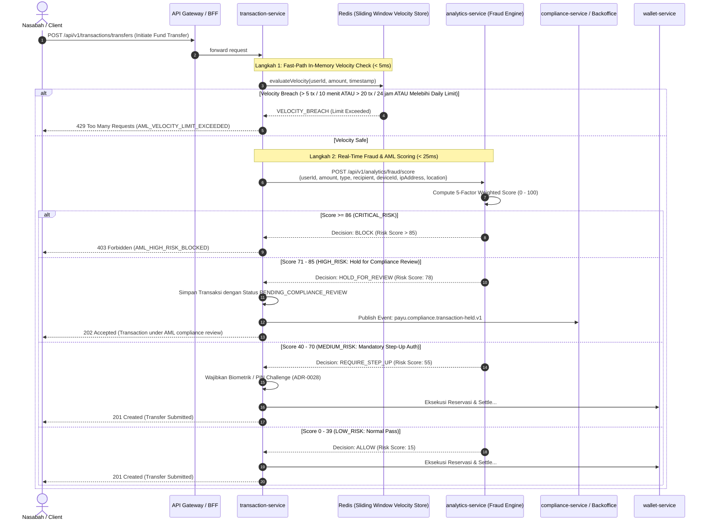

# ADR-0030: Real-Time Transaction Velocity Counter, Fraud Risk Pre-Check & AML Decision Pipeline

**Status**: Accepted  
**Date**: 2026-08-18  
**Deciders**: Principal Architect, AI Engineer, Cybersecurity Architect, Core Banking Engineer  
**Supersedes**: —  
**Related**: [ADR-0010](0010-security-standards.md) (Security Standards), [ADR-0022](0022-money-idempotency-standard.md) (Money & Idempotency Standard), [ADR-0028](0028-step-up-authentication-and-dynamic-linking-standard.md) (Step-Up Auth & Dynamic Linking), [ADR-0029](0029-iso20022-interbank-clearing-and-suspense-ledgering.md) (ISO 20022 Clearing), [FLOWS.md](../product/FLOWS.md) (IMP-10), [PRD.md](../product/PRD.md) (§16.4), ARCH-GLOBAL-004

---

## Context

Dalam platform perbankan digital dan payment gateway tier-1, sistem pemindahan dana rentan terhadap berbagai pola serangan dan tindak kejahatan finansial:

1. **Account Draining Attacks**: Setelah kredensial terkompromi, bot atau penyerang melakukan penarikan/transfer kilat beruntun (*burst transactions*) untuk menguras saldo sebelum korban menyadari.
2. **Smurfing / Structuring (Pencucian Uang - AML)**: Pelaku memecah transaksi bernilai besar menjadi beberapa transaksi kecil di bawah ambang batas pelaporan regulasi (misal: di bawah Rp 100.000.000 untuk menghindari pelaporan otomatis ke PPATK).
3. **Anomali Perilaku & Perangkat Baru**: Transaksi dengan nominal drastis di jam tidak wajar (01:00 - 05:00) dari lokasi geografis atau IP luar negeri yang belum pernah digunakan nasabah.
4. **Mandat Regulasi & Standar Global**:
   - **FATF Recommendations 10 & 16**: Penerapan *Risk-Based Approach (RBA)* real-time untuk memantau frekuensi transaksi mencurigakan (*wire transfer monitoring*).
   - **POJK No. 12/POJK.01/2017 & POJK No. 23/POJK.01/2019 (Penerapan Program APU PPT)**: Kewajiban bank mendeteksi Transaksi Keuangan Mencurigakan (TKM) secara proaktif sebelum dana berpindah tangan.
   - **Strict Latency Budget**: Pemeriksaan risiko wajib selesai dalam tempo sub-millisecond ($\le 30\text{ms}$) agar tidak mendegradasi *Service Level Agreement (SLA)* transfer real-time (BI-FAST target p95 $\le 500\text{ms}$).

Sebelum ADR ini, `transaction-service` belum memiliki integrasi evaluasi kecepatan transaksi (*velocity*) in-memory maupun pra-pemeriksaan skor risiko ke `analytics-service` sebelum reservasi dana (`ARCH-GLOBAL-004`).

---

## Decision

Kami menetapkan arsitektur standar **Real-Time Transaction Velocity Counter & AML Risk Scoring Pre-Check** yang dieksekusi secara sekuensial sebelum reservasi saldo di `wallet-service`:



---

## Technical Specifications

### 1. In-Memory Sliding-Window Velocity Store (Redis Sorted Sets)

Pengecekan frekuensi pergerakan dana menggunakan struktur data **Redis ZSET (Sorted Sets)** untuk presisi waktu hingga level milidetik:

* **Redis Key Formats**:
  - `aml:velocity:tx_count:{userId}:10m` (Jendela geser 10 menit)
  - `aml:velocity:tx_count:{userId}:24h` (Jendela geser 24 jam)
  - `aml:velocity:amount:{userId}:24h` (Akumulasi nominal 24 jam)
* **Atomic Redis Lua Script** (`evaluate_velocity.lua`):
  ```lua
  local key_count = KEYS[1]
  local key_amount = KEYS[2]
  local now = tonumber(ARGV[1])
  local window_10m = now - 600000
  local window_24h = now - 86400000
  local amount = tonumber(ARGV[2])
  local max_10m = tonumber(ARGV[3])
  local max_daily_amount = tonumber(ARGV[4])

  -- 1. Hapus entri di luar sliding window
  redis.call('ZREMRANGEBYSCORE', key_count, '-inf', window_10m)

  -- 2. Hitung jumlah transaksi dalam 10 menit
  local current_10m = redis.call('ZCARD', key_count)
  if current_10m >= max_10m then
      return {0, 'VELOCITY_BURST_LIMIT_EXCEEDED'}
  end

  -- 3. Cek limit akumulasi nominal harian
  local current_daily_amt = tonumber(redis.call('GET', key_amount) or '0')
  if (current_daily_amt + amount) > max_daily_amount then
      return {0, 'DAILY_LIMIT_EXCEEDED'}
  end

  -- 4. Catat transaksi baru
  redis.call('ZADD', key_count, now, ARGV[5]) -- member = tx_reference
  redis.call('PEXPIRE', key_count, 600000)
  redis.call('INCRBYFLOAT', key_amount, amount)
  redis.call('PEXPIRE', key_amount, 86400000)

  return {1, 'OK'}
  ```

### 2. Batas Velocity Sesuai KYC Tier

| KYC Tier | Max Frekuensi (10 Menit) | Max Frekuensi (24 Jam) | Limit Transaksi Tunggal | Limit Akumulasi Harian |
|:---|:---:|:---:|:---|:---|
| **Tier 1 (Basic / Unverified)** | 3 transaksi | 10 transaksi | Rp 2.000.000 | Rp 10.000.000 |
| **Tier 2 (Full Verified eKYC)** | 5 transaksi | 30 transaksi | Rp 100.000.000 | Rp 250.000.000 |
| **Tier 3 (Merchant / Business)** | 20 transaksi | 200 transaksi | Rp 500.000.000 | Rp 2.000.000.000 |

### 3. Model Scoring Risiko 5-Faktor (`analytics-service`)

`FraudDetectionEngine` di [backend/analytics-service/src/app/ml/fraud_detection.py](file:///home/ubuntu/payu/backend/analytics-service/src/app/ml/fraud_detection.py) menghitung skor komposit ($0.0 - 100.0$) berdasarkan formula pembobotan:

$$\text{RiskScore} = \sum (\text{FactorWeight}_i \times \text{FactorScore}_i)$$

| Faktor Risiko | Bobot ($W_i$) | Indikator Anomali |
|:---|:---:|:---|
| **`amount_anomaly`** | 25% | Nominal $\ge 3\times$ dari rata-rata historis nasabah atau mendekati batas lapor (misal: Rp 99.000.000). |
| **`velocity_check`** | 30% | Frekuensi transaksi per menit/jam yang melonjak drastis (*rapid-fire withdrawals*). |
| **`behavioral_pattern`** | 20% | Transaksi di jam tidur (01:00 - 05:00) atau jenis transaksi baru yang tidak lazim. |
| **`location_anomaly`** | 15% | Lonjakan lokasi geografis $> 500\text{ km}$ dalam selang waktu singkat (*impossible travel*) atau penggunaan Tor/VPN. |
| **`account_age`** | 10% | Akun baru berumur $< 7\text{ hari}$ yang langsung melakukan transfer bernilai tinggi (*mule account indicator*). |

### 4. Matriks Keputusan & Status Transaksi

```mermaid
graph TD
    SCORE[Skor Risiko Transaksi] -->|< 40 (Low)| ALLOW[ALLOW: Lanjut Eksekusi Transaksi]
    SCORE -->|40 - 70 (Medium)| STEP_UP[REQUIRE_STEP_UP: Wajibkan PIN / Biometrik]
    SCORE -->|71 - 85 (High)| HOLD[HOLD_FOR_REVIEW: Masuk Antrean Backoffice AML]
    SCORE -->|> 85 (Critical)| BLOCK[BLOCK_REJECT: Tolak 403 Forbidden]
```

---

## Inter-Service Contracts

### `transaction-service` (Outbound Port: `RiskEvaluationPort`)
```java
package id.payu.transaction.domain.port.out;

import java.math.BigDecimal;
import java.util.UUID;

public interface RiskEvaluationPort {
    /**
     * Memeriksa sliding-window velocity di Redis (< 5ms)
     */
    VelocityCheckResult checkVelocity(UUID userId, BigDecimal amount, String transactionType);

    /**
     * Memanggil analytics-service untuk skor risiko fraud (< 25ms)
     */
    FraudScoreResult evaluateFraudRisk(FraudRiskEvaluationCommand command);
}
```

### Response Codes (RFC 9457)

| HTTP Status | Error Code | Deskripsi Bisnis |
|:---|:---|:---|
| `429 Too Many Requests` | `AML_VELOCITY_BURST_EXCEEDED` | Melebihi batas maksimal 5 transaksi dalam 10 menit. |
| `429 Too Many Requests` | `AML_DAILY_LIMIT_EXCEEDED` | Akumulasi nominal transfer harian telah melebihi batas limit akun. |
| `403 Forbidden` | `AML_HIGH_RISK_BLOCKED` | Transaksi diblokir otomatis oleh sistem pencegahan fraud (Skor > 85). |
| `202 Accepted` | `AML_TRANSACTION_HELD` | Transaksi ditahan sementara untuk investigasi tim kepatuhan AML. |

---

## Consequences

### Positif
- **Mitigasi Pembobolan Akun Kilat**: *Account draining* otomatis terblokir pada transaksi ke-6 dalam interval 10 menit.
- **Deteksi Smurfing & Mule Account**: Akun baru atau transaksi yang mendekati ambang lapor otomatis masuk antrean review analis.
- **Latency Terjaga**: Fast-path Redis mengecek limit dalam $< 5\text{ms}$; panggilan ML asinkron/terbatas dengan timeout 50ms (fail-safe ke `STEP_UP`).

### Mitigasi & Trade-Offs
- **Dependensi Redis Cluster**: Kehilangan konektivitas ke Redis dapat mengganggu velocity check. Diterapkan *circuit breaker* (Resilience4j) dengan mode *fail-secure* (wajibkan Step-Up PIN jika Redis down).

---

## Implementation Roadmap (ARCH-GLOBAL-004)

1. **Redis Velocity Lua Scripts (`transaction-service` / `shared/cache-starter`)**:
   - Terapkan `evaluate_velocity.lua` dengan unit test Redis Testcontainers.
2. **Client Adapter (`transaction-service`)**:
   - Tambahkan `AnalyticsServiceWebClient` dengan circuit breaker timeout 50ms.
   - Refactor `InitiateTransferCommandHandler` untuk menjalankan `checkVelocity()` dan `evaluateFraudRisk()` sebelum reservasi saldo ke `wallet-service`.
3. **Compliance Queue Event (`payu.compliance.transaction-held.v1`)**:
   - Publikasi event ketika status transaksi `PENDING_COMPLIANCE_REVIEW`.
4. **Test Suite**:
   - `VelocityLimitBreachTest` (verifikasi 429 pada transaksi ke-6).
   - `FraudRiskScoreThresholdTest` (verifikasi transisi ALLOW, STEP_UP, HOLD, BLOCK).
