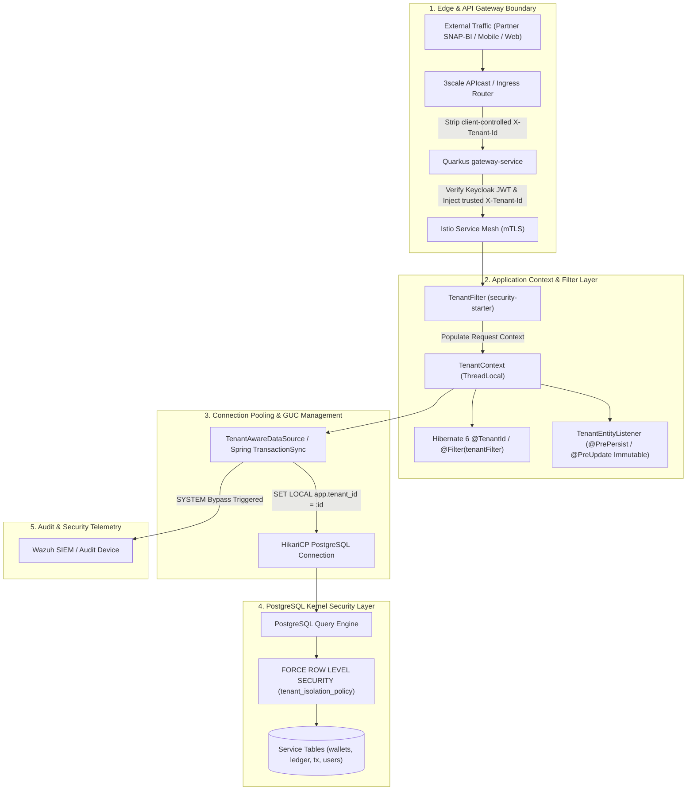

# ADR-0033: Database Row-Level Security (PostgreSQL RLS) & Multi-Tenant Isolation Standard

**Status**: Accepted  
**Date**: 2026-08-18  
**Deciders**: Principal Architect, Data Architect, Cybersecurity Architect, Core Banking Lead, Platform Engineer  

---

## Context

PayU beroperasi sebagai platform perbankan digital terpadu dan payment gateway multi-tenant (SNAP-BI, Virtual Account, QRIS, Transfer, Lending, dan Escrow). Platform ini melayani beragam institusi mitra B2B (seperti TokoBapak, Nobar, Dolan, Sinau, Maca) serta pengguna retail B2C.

Dalam arsitektur *Database-per-Service* PayU ([ADR-0007](0007-database-per-service.md)), model penyimpanan data mengadopsi pola **Shared Database, Shared Schema with Discriminator Column (`tenant_id`)** guna efisiensi operasional dan utilisasi resource di OpenShift. Namun, penggabungan data banyak penyewa dalam skema database bersama membawa tantangan keamanan dan kepatuhan finansial yang sangat krusial:

1. **Kepatuhan Regulasi & Standar Industri Finansial**:
   - **PCI-DSS v4.0 Requirement 3.3, 3.4 & Requirement 7.2, 7.3**: Mewajibkan isolasi data sensitif (kartu/transaksi) antar-penyewa dengan pemisahan logis yang terbukti aman (*strong logical isolation*) dan prinsip hak akses terkecil (*least privilege*).
   - **POJK No. 11/POJK.03/2022 (MRTI OJK) Pasal 18 & 21**: Kewajiban bank digital untuk melindungi kerahasiaan dan integritas data nasabah serta mencegah kebocoran data antar-entitas mitra.
   - **Bank Indonesia PADG SNAP-BI**: Menjamin data transaksi dan konfigurasi webhook/API key sebuah mitra tidak dapat dibaca atau dimutasi oleh mitra lain.
2. **Risiko Kegagalan Isolasi Tingkat Aplikasi (*Application-Layer Failure*)**:
   - Isolasi yang hanya mengandalkan kode aplikasi (`WHERE tenant_id = :tenantId` di JPA/Hibernate atau `PartnerIsolationMatrixTest`) rentan bocor jika developer membuat native SQL query, JPA entity graph query tanpa filter, atau celah SQL Injection.
3. **Tantangan Connection Pooling (HikariCP) & Session State Leakage**:
   - HikariCP memelihara *pool* koneksi fisik TCP yang dipakai berulang kali lintas request. Penggunaan variabel sesi database PostgreSQL (*Grand Unified Configuration* / GUC `app.tenant_id`) tanpa manajemen *lifecycle* yang tepat dapat mencemari koneksi (*Connection State Pollution*) dan membocorkan data tenant sebelumnya kepada tenant berikutnya.
4. **Bypass Table Owner di PostgreSQL**:
   - Secara default, Table Owner dan Superuser di PostgreSQL mengabaikan RLS (*bypass RLS*). Jika aplikasi microservice terhubung sebagai Table Owner tanpa proteksi eksplisit, aturan RLS tidak akan dievaluasi.
5. **Kebutuhan Sistem Lintas-Tenant (*Cross-Tenant System Operations*)**:
   - Operasi rekonsiliasi finansial (`SnapBiReconciliationService`), Transactional Outbox poller (`outbox-starter`), CDC, dan batch settlement akhir hari (EOD) membutuhkan akses lintas-tenant tanpa melanggar prinsip keamanan.

---

## Decision Drivers

- **Bank-Grade Defense-in-Depth (4-Layer Isolation)**: Isolasi ditegakkan berlapis dari Edge Gateway, Application ThreadLocal, ORM Data-Access, hingga Kernel PostgreSQL.
- **Fail-Closed by Default**: Jika konteks tenant kosong (`app.tenant_id IS NULL`), database wajib mengembalikan 0 baris (*deny all*).
- **Zero Connection Pollution**: Menjamin variabel sesi PostgreSQL di-reset secara deterministik sebelum koneksi dikembalikan ke pool HikariCP.
- **Zero-Trust Database Roles**: Memisahkan role database untuk migrasi (DDL/Owner) dari role runtime aplikasi (DML Only, non-privileged, subject to `FORCE RLS`).
- **Predictable High Performance**: Seluruh query RLS wajib memanfaatkan indeks komposit dengan `tenant_id` sebagai *leading column* sehingga overhead RLS $< 0.5\text{ms}$ ($p99 < 5\text{ms}$).
- **Immutable Audit Trail**: Seluruh pembukaan konteks `SYSTEM` (cross-tenant bypass) wajib dicatat dalam SIEM log (RFC 5424 / Wazuh).

---

## Decision

Kami menetapkan **Standar Arsitektur Row-Level Security (PostgreSQL RLS) dan Isolasi Multi-Tenant** PayU sebagai berikut:



---

### 1. Model 4-Lapisan Isolasi Multi-Tenant (Defense-in-Depth)

| Lapisan | Komponen | Tanggung Jawab & Mekanisme |
| :--- | :--- | :--- |
| **Layer 1: Edge Perimeter** | 3scale APIcast + `gateway-service` | Membersihkan (*strip*) header `X-Tenant-Id` dari client publik; mengekstrak identitas tenant yang sah dari Keycloak signed JWT claim (`azp`, `client_id`, atau `tenant_id`); menyuntikkan header `X-Tenant-Id` terverifikasi ke dalam mesh mTLS. |
| **Layer 2: Application Context** | `security-starter` (`TenantFilter` & `TenantContext`) | Menangkap header terverifikasi ke `ThreadLocal<String>`, memvalidasi format tenant ID, dan menjamin `TenantContext.clear()` dipanggil di blok `finally`. |
| **Layer 3: ORM / Data Access** | Hibernate 6 `@TenantId` & `TenantEntityListener` | Menyuntikkan `tenant_id` otomatis pada operasi INSERT (`@PrePersist`), menolak perubahan `tenant_id` pada UPDATE (`@PreUpdate`), dan menerapkan Hibernate Filter pada JPQL/HQL query. |
| **Layer 4: Database Kernel** | PostgreSQL 16 `FORCE ROW LEVEL SECURITY` | Memvalidasi setiap baris data pada level kernel database menggunakan GUC `app.tenant_id`. Mengamankan aplikasi dari native SQL, JDBC raw queries, SQL injection, dan kelalaian developer. |

---

### 2. Siklus Hidup GUC PostgreSQL & Connection Pooling HikariCP

Untuk mencegah pencemaran status koneksi (*Connection State Pollution*) di HikariCP:

1. **Pendekatan `SET LOCAL` dalam Blok Transaksi**:
   - `datasource-starter` mengimplementasikan `TenantAwareTransactionSynchronization` terdaftar pada Spring `TransactionSynchronizationManager`.
   - Pada saat transaksi dimulai (`afterCompletion` / `beforeCommit` lifecycle), perintah berikut dijalankan pada koneksi JDBC:
     ```sql
     SET LOCAL app.tenant_id = '<current_tenant_id>';
     ```
   - **Karakteristik `SET LOCAL`**: Secara otomatis dikembalikan (*reverted*) ke nilai default/NULL saat transaksi `COMMIT` atau `ROLLBACK`.
2. **Safety Wrapper pada `TenantAwareHikariDataSource`**:
   - Saat koneksi diambil dari pool (`getConnection()`), jika terdapat transaksi aktif, `app.tenant_id` diset.
   - Saat koneksi dikembalikan (`Connection.close()`), wrapper memastikan status sesi dalam kondisi bersih dengan mengeksekusi:
     ```sql
     RESET app.tenant_id;
     ```
   - HikariCP pool dikonfigurasi dengan:
     ```properties
     spring.datasource.primary.hikari.connection-init-sql=RESET ALL;
     ```

---

### 3. Kebijakan Database Roles & Standar Migrasi RLS

Kami memisahkan 3 role database dengan hak akses terisolasi pada setiap microservice:

1. **`payu_migrator` (DDL & Schema Migration)**:
   - Digunakan secara eksklusif oleh Flyway migration runner pada saat deployment.
   - Memiliki status Table Owner dan atribut `BYPASSRLS`.
2. **`payu_app` (DML Runtime Application)**:
   - Digunakan oleh aplikasi microservice saat melayani traffic transaksi.
   - Hak akses terbatas: `SELECT, INSERT, UPDATE, DELETE` pada tabel aplikasi.
   - Atribut: **`NOBYPASSRLS`** (tidak boleh bypass RLS).
3. **`payu_readonly` (Audit & Analytics)**:
   - Digunakan untuk query analitik read-only atau read-replica.
   - Hak akses: `SELECT` saja, **`NOBYPASSRLS`** (tunduk pada RLS tenant).

#### Standar Skrip Migrasi Flyway (DDL Template):
Setiap tabel yang memiliki kolom `tenant_id` **wajib** menyertakan DDL berikut:

```sql
-- 1. Enable RLS dan FORCE RLS (berlaku mutlak termasuk bagi Table Owner)
ALTER TABLE <table_name> ENABLE ROW LEVEL SECURITY;
ALTER TABLE <table_name> FORCE ROW LEVEL SECURITY;

-- 2. Buat Policy Isolasi Tenant yang Fail-Closed
DROP POLICY IF EXISTS tenant_isolation_<table_name> ON <table_name>;
CREATE POLICY tenant_isolation_<table_name> ON <table_name>
    AS RESTRICTIVE
    USING (
        current_setting('app.tenant_id', true) = 'SYSTEM'
        OR current_setting('app.is_system_bypass', true) = 'true'
        OR tenant_id = current_setting('app.tenant_id', true)
    )
    WITH CHECK (
        current_setting('app.tenant_id', true) = 'SYSTEM'
        OR tenant_id = current_setting('app.tenant_id', true)
    );
```

> **Catatan `AS RESTRICTIVE` & Fail-Closed**:
> Jika `app.tenant_id` belum diset (bernilai `NULL`), fungsi `current_setting('app.tenant_id', true)` menghasilkan `NULL`. Karena `tenant_id = NULL` bernilai *false* dalam SQL tri-state logic, PostgreSQL secara otomatis menolak seluruh baris (*0 rows returned*).

---

### 4. Penanganan Cross-Tenant System Operations & Audit Logging

Proses latar belakang (*background workers*) yang membutuhkan pembacaan lintas-tenant diatur dengan protokol ketat:

1. **Protokol Eksekusi `SYSTEM` Scope**:
   ```java
   TenantContext.executeInTenant("SYSTEM", () -> {
       // Operasi rekonsiliasi SNAP-BI / Outbox poller dispatch
       reconciliationService.reconcileAllPartners();
   });
   ```
2. **Mandatory SIEM Telemetry & Audit Trail**:
   - Setiap aktivasi `TenantContext.executeInTenant("SYSTEM", ...)` memicu `AuditEvent` ke SIEM (Wazuh / RFC 5424) dengan payload:
     - `service_name`: Nama microservice pemanggil.
     - `caller_thread`: Thread ID dan class execution path.
     - `action`: `CROSS_TENANT_SYSTEM_BYPASS`.
     - `timestamp`: ISO-8601 UTC.
   - Hal ini mencegah penyalahgunaan hak akses (*insider threat*) dan memenuhi audit PCI-DSS Requirement 10.

---

### 5. Invarian Skema Indeks & Optimasi Performa

Untuk memastikan PostgreSQL Query Planner mengeksekusi *Index Scan* secara konsisten dan menghindari *Sequential Scan* saat RLS aktif:

1. **Leading Column Invariant**:
   - Seluruh composite index dan unique constraint pada tabel tenant-aware **wajib menempatkan `tenant_id` pada urutan kolom paling kiri (leading column)**.
2. **Standar Penamaan & Struktur Indeks**:
   ```sql
   -- Unique Constraints (Scoped per Tenant)
   CREATE UNIQUE INDEX uk_users_tenant_email ON users (tenant_id, email_hash);
   CREATE UNIQUE INDEX uk_users_tenant_phone ON users (tenant_id, phone_number_hash);
   CREATE UNIQUE INDEX uk_api_keys_tenant_key ON api_keys (tenant_id, key_hash);

   -- Operational & Search Queries
   CREATE INDEX idx_wallets_tenant_user ON wallets (tenant_id, user_id);
   CREATE INDEX idx_ledger_tenant_account_date ON ledger_entries (tenant_id, account_id, created_at DESC);
   CREATE INDEX idx_tx_tenant_status_created ON transactions (tenant_id, status, created_at DESC);
   ```

---

### 6. Kontrak Keycloak JWT & Partner Scoping RBAC

1. **Struktur Token JWT Keycloak (Client Scopes & Claims)**:
   Setiap token yang diterbitkan oleh Keycloak (RHBK) untuk partner B2B wajib menyertakan klaim:
   ```json
   {
     "iss": "https://auth.payu.id/realms/payu",
     "sub": "user-uuid-12345",
     "azp": "tokobapak-partner-client",
     "partner_id": "PARTNER-TOKOBAPAK-01",
     "tenant_id": "PARTNER-TOKOBAPAK-01",
     "roles": ["ROLE_PARTNER_ADMIN", "ROLE_MERCHANT_MANAGER"]
   }
   ```
2. **Validasi Endpoint Scoping**:
   - `gateway-service` dan microservice controller memverifikasi keselarasan antara URL Path Parameter `{partnerId}` dengan klaim `jwt.partner_id`.
   - Jika terjadi *mismatch* (misal partner TokoBapak mencoba memanggil `/merchants/partners/PARTNER-NOBAR-02/...`), request langsung ditolak dengan HTTP `403 Forbidden` (`AUTH_007: Cross-tenant access denied`).

---

## Consequences

### Positive
- **Kompatibilitas Penuh PCI-DSS v4.0 & POJK**: Memenuhi persyaratan audit perbankan tertinggi untuk isolasi data multi-tenant.
- **True Defense-in-Depth**: Kebocoran data tidak akan terjadi meskipun terdapat celah SQL Injection atau bug ORM di layer aplikasi.
- **Koneksi Bersih & Bebas Polusi**: HikariCP terlindungi dari kebocoran variabel sesi lintas-request berkat `SET LOCAL` dan safety interceptor.
- **Performa Terjaga**: Indeks komposit terstandarisasi menjaga latensi query database tetap di bawah 5 milidetik ($p99 < 5\text{ms}$).

### Negative & Mitigations
- **Overhead Transaksional Kecil**: Eksekusi `SET LOCAL` menambah latensi sangat minim ($< 0.2\text{ms}$) per transaksi database.
- **Disiplin Penulisan Skrip Migrasi**: Setiap tabel baru ber-tenant wajib menyertakan DDL `ENABLE/FORCE RLS` dan indeks `tenant_id` terdepan; diverifikasi secara otomatis melalui ArchUnit dan Flyway migration test suite.

---

## References

- [ADR-0006: PostgreSQL Primary Database](0006-postgresql-primary-database.md)
- [ADR-0007: Database per Service](0007-database-per-service.md)
- [ADR-0010: Security Standards](0010-security-standards.md)
- [ADR-0022: Money & Idempotency Standard](0022-money-idempotency-standard.md)
- [ADR-0025: SNAP-BI & Partner Gateway Security Standards](0025-snap-bi-and-partner-gateway-security-standard.md)
- [ADR-0032: Perimeter Security WAF & Centralized SIEM](0032-perimeter-security-waf-coraza-and-siem-wazuh.md)
- PCI-DSS v4.0 Requirement 3 (Protect Stored Account Data) & Requirement 7 (Restrict Access to System Components)
- POJK No. 11/POJK.03/2022 tentang Penyelenggaraan Teknologi Informasi oleh Bank Umum
- Bank Indonesia Peraturan Anggota Dewan Gubernur (PADG) SNAP-BI
