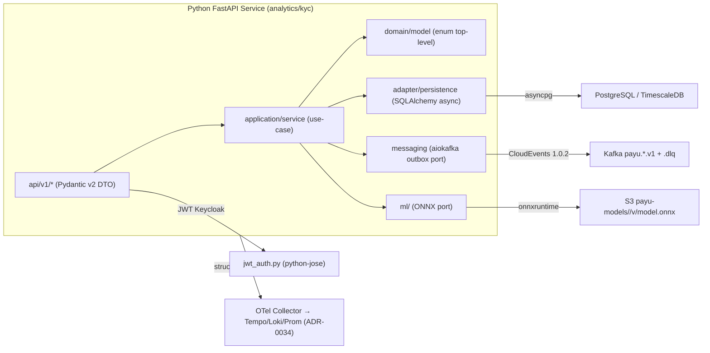

# ADR-0036: Python FastAPI Microservice Architecture for AI/ML, KYC & Analytics

**Status**: Accepted  
**Date**: 2026-08-19  
**Deciders**: Principal Architect, AI Engineer, Platform Engineer, Cybersecurity Architect, Data Architect  
**Relates to**: QAMVP-004, ARCH-GLOBAL-004 (ADR-0030), READY-062, ADR-0033 (RLS), ADR-0034 (Observability), ADR-0026 (Kafka Topic), ADR-0025 (SNAP-BI)  

---

## Context

PayU menjalankan 2 Python FastAPI service di produksi (via codegraph `2026-08-19`):

* `analytics-service/src/app/main.py:68` & `kyc-service/src/app/main.py:68` — `FastAPI 0.115.0 + Pydantic 2.9.0 + uvicorn[standard] 0.32.0 + sqlalchemy[asyncio] 2.0.35 + asyncpg 0.29.0 + aiokafka 0.11.0` identik, `main.py` lifespan (OTel + DB + consumer), `config.py` `BaseSettings + lru_cache`, `CORS` `BUG-BE-048` duplicative — **tidak ada `shared/python-starter`**, DRY violation.
* `analytics-service/src/app/config.py:26` topics hardcode `payu.wallet.balance-changed.v1` ... `payu.kyc.verified.v1` sudah `payu.<domain>.<event>.v<n>` tapi `analytics` tanpa outbox, `kyc` punya `KycOutboxPublisher(poll_interval_sec)` + `ArtemisConsumerService` (STOMP) — **dual broker tanpa standar**.
* `analytics-service` pakai `TimescaleDB hypertable retention 365d chunk 7d` + `torch 2.5.0+cpu + scikit-learn 1.5.1 + pandas` in-process; `kyc-service` pakai `paddlepaddle 3.0.0 + paddleocr 2.9.0 + opencv + torchvision` — image >2GB, cold start >8s, bukan `UBI9 non-root 1001 readOnly FS port 8080` (`AGENTS.md:10`).
* `analytics-service/src/app/api/v1/analytics.py:30` `require_auth` + IDOR check `sub/account_id` sudah benar, tapi `get_cached_result/cache_result` idempotency hanya di `POST /robo-advisory` & `/fraud/score`, tidak konsisten. Belum `EncryptedString`/`HMAC blind index` untuk NIK/PII (UU PDP), belum RLS `SET LOCAL app.tenant_id`.
* `QAMVP-004` (KYC e2e) & `ARCH-GLOBAL-004` (velocity/AML `POST /api/v1/analytics/fraud/score <30ms` per ADR-0030) & `READY-062` (ONNX fraud model) butuh arsitektur Python yang selaras regulasi bank/e-wallet dan standar FastAPI industri.
* Tanpa ADR ini, risk: drift template (2× bug fix), PII plain di DB, model tidak ter-versioning, Artemis drift, container tidak hardening, dan breach OJK POJK 11/2022 Pasal 20-22 (audit trail immutable) & UU PDP.

**Best practice industri yang dirujuk (training data + Context7 `/websites/fastapi_tiangolo`)**:

* Bank/e-wallet global (Jenius/Jago/BCA, GoPay/OVO/DANA, Midtrans/Xendit, Nubank, Revolut Python): FastAPI async + Pydantic v2 `BaseSettings` dengan `@lru_cache` DI, `SqlAlchemy 2.0 async` + Alembic per service, `outbox polling SKIP LOCKED` (bukan CDC), `ONNX Runtime` untuk inference, `OTel + structlog JSON + Prometheus` selaras ADR-0034, container `UBI9` hardening, serta `RLS + field-level AES-GCM + HMAC blind index` untuk PII.
* Context7: `get_settings() @lru_cache` + `Depends(get_settings)`, `get_session() Depends`, `OAuth2PasswordBearer` → `get_current_user`, `openapi_url` via `BaseSettings`.

## Decision Drivers

* **Single template, DRY** — 1 `backend/shared/python-starter` (mirip `security-starter` Java) agar `analytics` & `kyc` tipis domain-only.
* **Hexagonal-lite untuk Python** — `AGENTS.md:5` (DTO di `interfaces` sebelum logic) + service-owned schema Flyway/Alembic.
* **Regulasi bank/e-wallet**: UU PDP (PII encrypt), POJK 11/2022 (immutable audit), BI SNAP-BI SLO `p95<500ms` in-house, PCI-DSS Req 10 (masking log).
* **Event standard**: CloudEvents 1.0.2 topic `payu.<domain>.<event>.v<n>` + DLQ `.dlq` (ADR-0026), **Kafka only** (Artemis deprecated).
* **ML cost/perf**: in-process ONNX (<30ms p99 untuk `fraud/score` per ADR-0030) vs `paddlepaddle` sidecar agar API <800MB.
* **12-factor + OpenShift native**: `ubi9/python-312`, non-root 1001, HPA≥2 PDB 2, `TimescaleDB` untuk telemetry finansial.

## Considered Options

### Option 1 — Shared `python-starter` + hexagonal-lite + Kafka outbox + ONNX (dipilih)

* Pros: DRY, audit konsisten, PII aman, inference <30ms, container hardening, selaras ADR-0034/0033/0026. Cons: migrasi awal 2 service.

### Option 2 — Tetap copy-paste per service, in-process torch/paddle

* Pros: tanpa migrasi. Cons: drift, image >2GB, cold start lambat, PII risk, tidak lolos `PARTNER-PROD-008/009`.

### Option 3 — Central `ml-service` terpisah + Debezium CDC

* Pros: model registry terpusat. Cons: hop jaringan + latency >30ms (gagal SLO ADR-0030), CDC infra berat — YAGNI sampai >5k TPS. Ditunda.

## Decision

Adopsi **Option 1 — Python FastAPI Microservice Standard** sebagai berikut.



### 1. Project Structure (hexagonal-lite, ponytail ultra)

```
backend/<service>/
├── Containerfile          # ubi9/python-312
├── pyproject.toml         # ruff, pytest --cov 80%, alembic
├── requirements.txt       # pin fastapi==0.115.0 etc
└── src/app/
    ├── main.py            # create_app() tipis → import dari python-starter
    ├── config.py          # Settings(BaseSettings) + @lru_cache get_settings()
    ├── api/v1/            # routers, DTOs di interfaces.dto (Pydantic v2)
    ├── application/       # use-case services
    ├── domain/            # enums top-level, value objects (Money BigDecimal string)
    ├── adapter/persistence/ # models, repositories, alembic/versions/
    ├── messaging/         # kafka_consumer, outbox_publisher (port)
    └── ml/                # inference engines (ONNX wrapper)
```

**Shared**: `backend/shared/python-starter/src/payustarter/` = `create_app()`, `SettingsBase`, `database.py` (`get_db_session`), `logging_config.py` (`structlog`), `jwt_auth.py` (`require_auth`), `rate_limit.py` (`slowapi`), `responses.py` (`ApiResponse` RFC 9457), `messaging/outbox.py`.

### 2. Configuration (Context7 best practice)

```python
# config.py — SettingsConfigDict + lru_cache DI (FastAPI docs)
from pydantic_settings import BaseSettings, SettingsConfigDict
from functools import lru_cache

class Settings(BaseSettings):
    model_config = SettingsConfigDict(env_file=".env", case_sensitive=False)
    application_name: str = "PayU Analytics Service"
    version: str = "1.0.0"
    database_url: str  # postgresql+asyncpg://...
    kafka_bootstrap_servers: str = "localhost:9092"
    secret_key: str    # must be set, fail-closed
    otlp_endpoint: str = "http://localhost:4317"

@lru_cache
def get_settings() -> Settings: ...
# usage: settings: Annotated[Settings, Depends(get_settings)]
```

`ENVIRONMENT` → CORS allowlist (`BUG-BE-048` fix di starter, bukan duplikat). `SECRET_KEY` wajib, raise `ValueError` jika kosong (sudah `analytics/config.py:65`).

### 3. Data Layer

* **analytics-service** → **TimescaleDB** hypertable `events`, `api_metrics`, `fraud_scores` (`chunk 7d`, compress after 7d, retention 365d, `timescale_chunk_interval_days=7`). Query via `asyncpg` + `sqlalchemy[asyncio] 2.0.35` + `alembic` per service. **wallet-service tetap `DECIMAL(19,4)` untuk money**, Python `Pydantic Money=str` di JSON boundary (hindari `float`).
* **kyc-service** → PostgreSQL vanilla + `pgcrypto` + `EncryptedStringConverter` (`AES-GCM 256`) untuk `nik`, `phone`, `ocr_text`; `HMAC blind index` untuk search NIK (mirip `ADR-0039`).
* **RLS** (ADR-0033): middleware `SET LOCAL app.tenant_id = jwt.tenant_id` via `TenantAware` Python (`get_db_session` inject). Service-owned schema, tidak shared DB.
* **Alembic** per service, `V1__initial.py` idempotent, tidak `DROP COLUMN` destruktif (`ARCH-FLYWAY-001` lesson).

### 4. Messaging (Kafka only)

* **Outbox polling `SELECT ... FOR UPDATE SKIP LOCKED`** via `python-starter/messaging/outbox.py` (poll 1s, batch 100) → publish CloudEvents 1.0.2 `payu.kyc.verified.v1`, `payu.analytics.fraud-scored.v1`, `payu.wallet.balance-changed.v1` (topic `payu.<domain>.<event>.v<n>`, retention 30d, DLQ `*.dlq` per ADR-0026). **Dilarang `aiokafka.send()` langsung** (mirip `AGENTS.md:4`).
* **Consumer**: `aiokafka 0.11.0` dengan `consumer_group=analytics-service-group` / `kyc-service-group`, manual commit, `X-Request-ID` + `traceparent` propagate ke OTel (ADR-0034). **Artemis/STOMP `stomp.py` deprecated** — `kyc-service` migrasi `ArtemisConsumerService` → Kafka `payu.kyc.liveness-requested.v1`.
* **Idempotency**: `X-Idempotency-Key` wajib untuk `POST /fraud/score`, `/robo-advisory`, `/kyc/verify` (cache via `Infinispan` atau DB `idempotency_keys` 24h, sama seperti Java money idempotency).

### 5. ML Lifecycle (bank-grade)

* **Training vs Inference split**: training offline (notebook → `torch/sklearn` → export `ONNX`), inference online via `onnxruntime 1.18` in-process. Model artifact di `S3 payu-models/<name>/v<n>/model.onnx + model.json` (version, threshold, metrics). Load di `lifespan` via `@lru_cache`.
* **analytics `fraud_detection`**: `READY-062` ONNX, **SLO `<30ms`** (ADR-0030) → `onnxruntime` CPU, fallback rule-based jika load gagal. **Velocity check** tetap di Redis Lua (`evaluate_velocity.lua`) sebelum ML.
* **kyc `ocr/liveness`**: `paddlepaddle/paddleocr` **pindah ke sidecar** `kyc-ocr-sidecar` (gRPC/HTTP localhost) agar API container <800MB; API hanya panggil sidecar dengan timeout 3s + fallback `manual_review`. `opencv` tetap di sidecar.
* **Versioning**: `model_version` di DB `fraud_scores` + Prometheus label `model_version` (bounded). Re-train trigger via `model_retrain_interval_hours=24` (batch).

### 6. API & Validation

* **Pydantic v2** strict (`StrictStr`, `constr`, `EmailStr`), `Money` sebagai `str` (hindari `float`), `Enum` top-level file (rule `AGENTS.md:8`).
* **Error** RFC 9457 `ApiResponse.create_error(code, message, request_id)` dengan code unik `ANA_*`, `KYC_*` (`ApiResponse` di starter, sama seperti Java `RFC 9457`).
* **Docs**: `docs_url=/docs`, `redoc_url=/redoc`, `openapi_url=/openapi.json` (via `BaseSettings`), versioned `/api/v1/*`.
* **Rate limit**: `slowapi 0.1.9` `100/minute` per IP untuk `/fraud/score`, `60/minute` untuk `/health`.

### 7. Security & Compliance (bank/e-wallet)

* **Auth**: `require_auth` DI via `python-jose` `JWKS` Keycloak (`payu-realm.json` roles `PARTNER_*`, `USER`), `sub/account_id/tenant_id` claim, `403` jika `user_id != auth.sub` (sudah `analytics.py:38`).
* **PII**: mask di `structlog` (`NIK → 320101********0001`), encrypt at-rest `AES-GCM`, blind index `HMAC-SHA256`, `X-Request-ID` propagate, **no secrets di code** (Vault ESO).
* **CORS**: allowlist `ENVIRONMENT` (`payu.fajjjar.my.id` prod, `localhost` dev) di starter.

### 8. Observability (reuse ADR-0034)

* **Logs**: `structlog 24.4.0` JSON + `MDC` `tenant_id/request_id/trace_id`.
* **Tracing**: `opentelemetry-instrumentation-fastapi/httpx` → `OTLP_ENDPOINT`, W3C `traceparent` + `ce_traceparent` di Kafka, tail-sampling 100% fraud/KYC errors, 5% reads.
* **Metrics**: `prometheus_client 0.21.0` `/metrics`, `partner_service` SLI `SLO 99.9%` (ADR-0034). `analytics` custom: `fraud_score_latency_ms` histogram, `model_inference_ms`.

### 9. Container & Platform

* **Container**: `UBI9 python-312`, `USER 1001`, `drop ALL cap`, `readOnlyRootFilesystem:true`, `port 8080` (host 8008 mapping), `CORS/metrics` di starter. `Containerfile` pakai `pip install --no-cache` + `uv` optional.
* **K8s**: `HPA≥2`, `PDB minAvailable 2`, `topologySpread`, `CNPG Barman PITR` (ADR-0031), `mTLS` via gateway, `Kustomize` di `infrastructure/local/podman`.

### 10. Testing

* **TDD**: `pytest 8.0 + pytest-asyncio + httpx AsyncClient + testcontainers[postgres,kafka]` (mirip Java Testcontainers), coverage `--cov-fail-under=80` (core 100%), `ArchUnit` analog via `import-linter`.
* **Contract**: `schemathesis` untuk OpenAPI, `k6` untuk SLO `p95<500ms`.

## Rationale

Shared starter menghapus 2× duplikat `main.py/config.py` (ponytail ultra), ONNX memenuhi SLO 30ms tanpa JVM, Kafka outbox menjamin `RPO=0` tanpa CDC infra, TimescaleDB untuk telemetry finansial (bukan `pg` biasa), UBI9 hardening lolos `PARTNER-PROD-007/008`. Ditolak: copy-paste (drift), central ML service (latency), Debezium (ops cost).

## Consequences

**Positive**:
* 1 template → 2 service tipis, onboarding service baru <1 hari.
* PII aman (encrypt+mask), audit immutable, topic governance selaras Java.
* Fraud <30ms, KYC cold start <2s (sidecar).

**Negative**:
* Migrasi awal `kyc` Artemis → Kafka (one-time).
* Sidecar OCR tambah 1 pod — mitigasi HPA terpisah.
* Need `python-starter` CI publish (bump version).

## Implementation Notes

| Step | Target | File |
|---|---|---|
| 1 | Shared starter | `backend/shared/python-starter/{pyproject.toml,src/payustarter/*}` |
| 2 | Containerfile UBI9 | `backend/analytics-service/Containerfile`, `backend/kyc-service/Containerfile` |
| 3 | Config unify | `src/app/config.py` → extend `payustarter.SettingsBase` |
| 4 | DB RLS + Alembic | `src/app/database.py`, `alembic/versions/V2__rls_encrypt.py` |
| 5 | Outbox | `src/app/messaging/outbox.py` → `payustarter.messaging` |
| 6 | ONNX | `src/app/ml/fraud_detection.py` (onnxruntime), `scripts/export_onnx.py` |
| 7 | OCR sidecar | `backend/kyc-service/ocr-sidecar/Containerfile` (paddlepaddle) |
| 8 | Tests | `tests/{test_api,conftest}.py` (pytest-asyncio, testcontainers) |
| 9 | Docs | `docs/api/analytics.md`, `docs/api/kyc.md` (OpenAPI) |
| 10 | Runbook | `docs/operations/ANALYTICS_KYC_RUNBOOK.md` |

**Verification**:
* `pytest --cov-fail-under=80` green, `ruff check` 0.
* `curl /api/v1/analytics/fraud/score` p99 <30ms (k6), `traceparent` di Tempo, `payu.kyc.verified.v1` di Kafka, PII encrypted at-rest (`SELECT` cek `ENCRYPTED`), RLS `0-row mismatch` test.

---
*Created for QAMVP-004, ARCH-GLOBAL-004, READY-062 — implementasi wajib refer ADR ini.*
