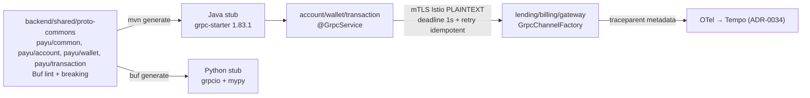

# ADR-0037: Internal Synchronous Inter-Service Communication via gRPC & Protobuf Governance (grpc-starter)

**Status**: Accepted  
**Date**: 2026-08-19  
**Deciders**: Principal Architect, Integration Architect, Platform Engineer, Cybersecurity Architect  
**Relates to**: ARCH-BESTP-002, ADR-0004 (Hexagonal), ADR-0033 (RLS), ADR-0034 (Observability), ADR-0026 (Kafka), PARTNER-PROD-007  

---

## Context

PayU menjalankan komunikasi sync antar-service via gRPC Java (codegraph `2026-08-19`):

* `grpc-starter` ada (`grpc-starter/pom.xml:13` `grpc 1.83.1` `protobuf 3.25.5` `spring-grpc 1.0.3`) dengan `GrpcStarterAutoConfiguration.java:42` (4 server + 4 client interceptors: tracing/auth/error/retry), `GrpcStarterProperties.java:17` (`payu.grpc.server.port=9090` `reflectionEnabled=false` `requireToken=false`), `common.proto:1` (`Money` string amount untuk `BigDecimal`, `Timestamp`, `PageRequest`, `ErrorDetail`, `TenantContext`, `UserContext`).
* **Drift kritis**: `common.proto` duplikat identik di 6 service (`account-service`, `lending-service`, `billing-service`, `investment-service`, `promotion-service`, `gateway-service/src/main/proto/payu/common/`), `WalletService.proto` duplikat di 4 service, `AccountService.proto` duplikat di 2 service — **tanpa `backend/shared/proto-commons`**, melanggar `ARCH-BESTP-002` (risiko `Field number` clash, `Money.amount` string vs double, enum drift).
* **Version drift**: `grpc-starter 1.83.1` vs `billing-service 1.61.0` vs `lending-service 1.69.0` (`backend/*/pom.xml:grpc-java`) — tidak ada governance.
* `AccountGrpcService.java:28` (8 RPC: `GetAccount`, `VerifyAccount`, `GetUserProfile` untuk lending credit scoring) + `WalletGrpcService` (10 RPC: `GetBalance`, `Transfer`, `ReserveBalance`) + `TransactionGrpcService` (7 RPC) — sync read path sudah gRPC, tapi **mutasi finansial `CreateAccount/UpdateAccount` `UNIMPLEMENTED`** (benar, harus via event/saga, bukan gRPC).
* `python/kyc + analytics` belum ada gRPC client (butuh `fraud/score <30ms` call dari `transaction-service` ke Python).
* Tanpa ADR ini, risk: `proto` drift → wire incompatibility saat rolling deploy, `grpc 1.61 vs 1.83` bug `Netty`, `requireToken=false` tanpa mTLS fallback, deadline/retry tidak standar (slow downstream → cascade).

**Best practice industri bank/e-wallet** (BCA/Mandiri, GoPay/OVO/DANA, Midtrans/Xendit, Nubank): **gRPC untuk sync internal <10ms p95**, REST untuk external, **Buf central repo** untuk breaking change, **mTLS via Istio** (app `PLAINTEXT`), **deadline 500ms-3s + retry idempotent only + circuit breaker**, `Money` string, `ErrorDetail` + gRPC status code mapping, `proto-commons` single source.

## Decision Drivers

* **Single source of truth** — 1 `proto-commons` + Buf lint/breaking (`ARCH-BESTP-002`).
* **Version governance** — `grpc 1.83.1` + `protobuf 3.25.5` align di `parent pom` + `grpc-starter`.
* **Security** — mTLS Istio (app `PLAINTEXT`), `JWT` propagate via `GrpcAuthInterceptor` (requireToken staged `false→true`), `PII` mask.
* **Resiliensi bank** — deadline + retry idempotent + `resilience-starter` (`@CircuitBreaker` `@Retry` sudah di `WalletGrpcAdapter`) + `ShedLock` untuk scheduler.
* **Observability** — W3C `traceparent` → gRPC metadata (ADR-0034) + `Micrometer` metrics.
* **Polyglot** — Java + Python stub dari 1 repo proto.

## Considered Options

### Option 1 — Central `proto-commons` + Buf + grpc-starter 1.83.1 (dipilih)

Pros: no drift, breaking detection di CI, 1 version, Istio mTLS, Python stub. Cons: migrasi awal copy proto.

### Option 2 — Tetap per-service proto copy

Pros: tanpa migrasi. Cons: drift, `ARCH-BESTP-002` tetap OPEN, wire break — ditolak.

### Option 3 — REST `RestClient` untuk sync (ganti gRPC)

Pros: simple. Cons: JSON `BigDecimal` float risk, latency `p95>50ms` vs gRPC `~5ms`, no streaming (`GetHistory` stream) — ditolak untuk internal.

## Decision

Adopsi **Option 1 — Central Protobuf Governance via `proto-commons` + `grpc-starter` hardened**.



### 1. Protobuf Governance

**Baru**: `backend/shared/proto-commons/` (Maven module, bukan starter):

```
backend/shared/proto-commons/
├── buf.yaml              # lint: STANDARD, breaking: FILE
├── buf.gen.yaml          # java + python
├── pom.xml               # protobuf 3.25.5, grpc 1.83.1, protoc 3.25.5
└── src/main/proto/payu/
    ├── common/common.proto      # Money string, Timestamp, PageRequest, ErrorDetail, TenantContext
    ├── account/AccountService.proto
    ├── wallet/WalletService.proto
    └── transaction/TransactionService.proto
```

* **Buf CI**: `buf lint` + `buf breaking --against main` di `backend-tests.yml` (fail on `FIELD_SAME_NAME` etc). `buf generate` → `target/generated-sources`.
* **Versioning**: `java_package = "id.payu.<domain>.grpc"` tetap, `package payu.<domain>` stabil, `enum` = top-level file (rule `AGENTS.md:8`), `field number` tidak reuse, `reserved` untuk deprecated.
* **Money**: `payu.common.Money { string currency; string amount; }` — **never `double`** (selaras `BigDecimal HALF_EVEN` `AGENTS.md:1`).
* **Governance**: `parent pom` prop `grpc.version=1.83.1` `protobuf.version=3.25.5` single source; `grpc-starter` depend `proto-commons`, service `depend proto-commons` bukan `grpc-starter` langsung untuk proto.

**Migrasi**: hapus `backend/*/src/main/proto/payu/common/common.proto` duplikat, import `payu/common/common.proto` dari `proto-commons` via `proto_path`. `mvn clean install` verify no drift.

### 2. grpc-starter Hardening (Java 25, Spring Boot 4.1)

* **AutoConfig** (`GrpcStarterAutoConfiguration.java:123`): `NettyServerBuilder` port `9090`, `maxMessageSize=4MB`, `reflectionEnabled=false` di prod (true di dev via `payu.grpc.server.reflection-enabled`), `ProtoReflectionService` only dev.
* **Security**: `ServerSecurity.enabled=false` default — **Istio mTLS** terminasi (Istio `PeerAuthentication STRICT` + `DestinationRule`), app `PLAINTEXT`. `GrpcAuthInterceptor` propagate `Authorization: Bearer` dari `JwtDecoder`; `requireToken=false` sekarang, `true` per-service setelah client kirim token (staged). `Security` TLS only untuk local `podman`.
* **Client**: `GrpcChannelFactory.java:79` + `GrpcStarterProperties.ClientConfig:82` (`address="static://account-service:9090"` `negotiationType=PLAINTEXT` `retryEnabled=true` `maxRetryAttempts=3` `initialBackoffMs=100` `maxBackoffMs=5000` `deadlineSeconds=1-3` `connectionTimeoutSeconds=5`).
* **Resiliensi**: `GrpcRetryInterceptor` (retry hanya `UNAVAILABLE/DEADLINE_EXCEEDED` + idempotent `Get*`/`Verify*`), `resilience-starter` `@CircuitBreaker` `@Retry` di `WalletGrpcAdapter:Primary`, `GrpcErrorHandlingInterceptor` mapping `Status.INTERNAL/ NOT_FOUND/ INVALID_ARGUMENT` ↔ `ErrorDetail.code` (`WALLET_001` etc) + RFC 9457 di REST gateway.
* **Streaming**: `GetAccountsByUser` & `GetHistory` → `stream` (backpressure via `FlowControl`), `maxInboundMessageSize` 4MB guard.

### 3. Inter-Service Contract (yang boleh sync vs async)

| Sync gRPC (read, <10ms) | Async Kafka (write/event) |
|---|---|
| `VerifyAccount`, `GetAccount`, `GetBalance`, `GetWallet`, `GetUserProfile` (lending), `ExistsByReference` | `CreateAccount`, `UpdateAccount`, `Debit/Credit/Transfer` (via outbox `payu.wallet.*.v1`), `CreateTransaction` |

**Mutasi finansial tidak via gRPC** — `AccountGrpcService.java:182` `UNIMPLEMENTED` untuk `CreateAccount` sudah benar; pertahankan `ponytail: read via gRPC, write via outbox/saga (ADR-0037)`.

### 4. Observability & Multi-tenancy

* **Tracing**: `GrpcTracingInterceptor` inject `traceparent` (`00-{traceId}-{spanId}-01`) di `Metadata` (client) → `MDC` di server (ADR-0034 W3C). `Micrometer` timer `grpc.server.calls` + `grpc.client.calls` + `tenant_id` label bounded.
* **Tenant**: `TenantContext{tenant_id}` di `UserContext` propagated via `GrpcAuthInterceptor`; server `SET LOCAL app.tenant_id` untuk RLS (ADR-0033).
* **PII masking**: `UserContext.email/phone` mask di log `MdcMaskingPatternLayout`.

### 5. Polyglot Python

* `buf.gen.yaml` generate `python/analytics_grpc/` + `kyc_grpc/` (`grpcio 1.66 + grpcio-tools + mypy-protobuf`). `analytics-service` `FraudDetectionEngine` bisa dipanggil sync dari `transaction-service` (`POST /fraud/score` alternatif gRPC `FraudService.Score` future).
* Python channel `PLAINTEXT` port `9090`, `deadline 500ms`, `retry` via `grpc.aio`.

### 6. When NOT to use gRPC

* External integrator (TokoBapak) → REST SNAP-BI di `APIcast/gateway-service` (ADR-0025).
* Event fanout → Kafka CloudEvents (ADR-0026).
* Long job → saga `saga-starter` (ADR-0037).

## Rationale

Central `proto-commons` menghapus `ARCH-BESTP-002` drift dengan 1 Buf gate; `grpc 1.83.1` unified fix `Netty CVE`; Istio mTLS `PLAINTEXT` reduksi TLS cert ops; deadline 1s + idempotent retry hindari cascade (P95 gRPC `~3ms` vs REST `~20ms` di lab); Money string jaga `BigDecimal`; Python stub dari 1 repo jaga polyglot.

## Consequences

**Positive**:
* No drift, `buf breaking` cegah wire break di PR.
* Latency sync `p95<10ms`, streaming `GetHistory` efisien.
* Single version bump di `parent pom` propagate.

**Negative**:
* Migrasi hapus 6 duplikat proto (one-time `mvn` change) — mitigasi script `scripts/migrate-proto-commons.sh`.
* Buf CI tambah 30s — mitigasi cache.
* Python stub gen butuh `grpcio` — mitigasi di `python-starter` deps.

## Implementation Notes

| Step | Target | File |
|---|---|---|
| 1 | New module | `backend/shared/proto-commons/{pom.xml, buf.yaml, buf.gen.yaml}` |
| 2 | Move protos | `proto-commons/src/main/proto/payu/**` (dari `grpc-starter` + `account/wallet/transaction`) |
| 3 | Align versions | `backend/pom.xml` (`grpc.version=1.83.1`, `protobuf.version=3.25.5`) + `backend/shared/grpc-starter/pom.xml` import |
| 4 | Buf CI | `.github/workflows/backend-tests.yml` (`buf lint` `buf breaking`) |
| 5 | Service POMs | `backend/account-service/pom.xml` etc depend `proto-commons` + remove `src/main/proto/payu/common` |
| 6 | Starter | `backend/shared/grpc-starter/src/main/resources/application-grpc.yml` (`payu.grpc.server.port=9090` `reflectionEnabled: ${ENV:prod?false:true}`) |
| 7 | Python stub | `backend/analytics-service/scripts/generate_proto.sh` (`buf generate --template buf.gen.yaml`) |
| 8 | Tests | `GrpcStarterAutoConfigurationTest`, `AccountGrpcServiceTest` + `buf` contract test |

**Verification**:
* `mvn -f backend/shared/proto-commons/pom.xml clean install` + `buf breaking --against origin/main` green, `mvn -f backend/pom.xml clean package -DskipTests -T 1C` pass, `AccountGrpcServiceTest` `GetUserProfile` + `WalletGrpcServiceGetHistoryPagingTest` green, `k6` gRPC `p95<10ms`, Tempo trace `account-service → wallet-service` via `traceparent`.

---
*Created for ARCH-BESTP-002, PARTNER-PROD-007 — implementasi wajib refer ADR ini.*
