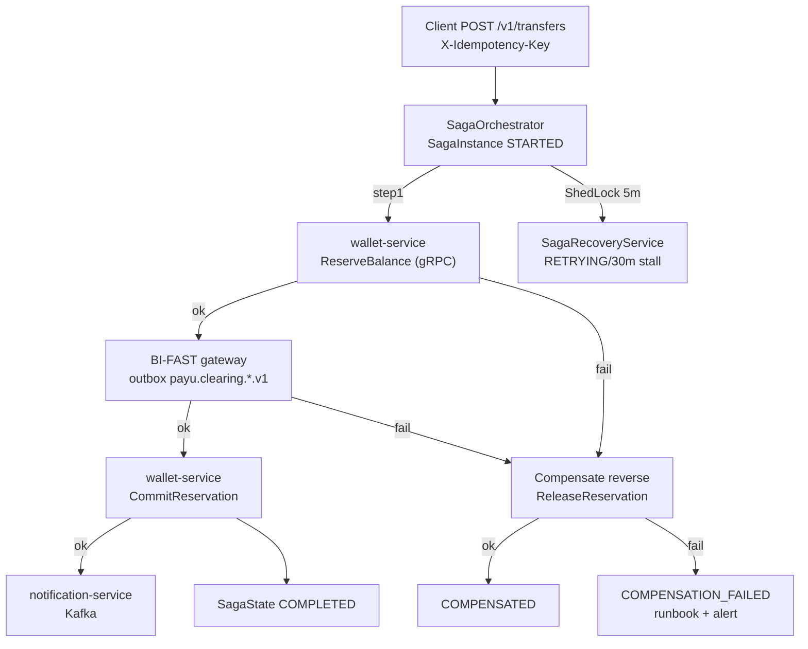

# ADR-0038: Distributed Transaction Management — Orchestrated Saga Pattern with Persistent State Machine

**Status**: Accepted  
**Date**: 2026-08-19  
**Deciders**: Principal Architect, Integration Architect, Core Banking Lead, Platform Engineer  
**Relates to**: ARCH-GLOBAL-003 (ADR-0029 clearing), ARCH-GLOBAL-004 (ADR-0030 AML), ADR-0026 (Kafka), ADR-0037 (gRPC), ADR-0022 (Money Idempotency)  

---

## Context

PayU adalah platform perbankan digital dengan `Database per Service` (ADR-0007) — transaksi bisnis span multi-service (contoh: `transfer BI-FAST`: `account-service` → `wallet-service` (reserve) → `transaction-service` → `wallet-service` (commit) → `notification-service`). `2PC/XA` tidak opsi (blocking, tidak scalable) — butuh mekanisme transaksi terdistribusi (cross-check `microservices.io/patterns/data/saga.html` 2026-08-19 sebelum tulis ADR ini).

Temuan codegraph `2026-08-19`:

* `saga-starter` sudah ada (`shared/saga-starter/src/main/java/id/payu/saga/orchestrator/ReactiveSagaOrchestrator.java:32` + `SagaOrchestrator.java:209` sync) dengan `SagaState.java:7` (`PENDING→STARTED→IN_PROGRESS→COMPLETED` / `FAILED→COMPENSATING→COMPENSATED/COMPENSATION_FAILED` / `TIMED_OUT/RETRYING/PAUSED/CANCELLED`), `SagaInstance.java:20` persistent (`sagaId`, `sagaType`, `currentState`, `payload`, `stepContext`, `retryCount`), `SagaRecoveryService.java:22` (`@SchedulerLock` `fixedDelay 300s` retry 5m, stall 30m, `ShedLock`), `SagaStep.java:16` (`canExecute`, `maxRetries`, `retryDelay` backoff).
* `promotion-service/CashbackSagaOrchestrator.java:37` pakai `EnableSaga` untuk 3-step `creditWallet→recordCashback` dengan kompensasi reverse — **hanya 1 contoh**, tidak ada standar orchestrated vs choreographed.
* Saga belum governed: tidak ada ADR, tidak ada `saga_instance` DDL di `flyway/`, tidak ada `outbox` coupling, `ReactiveSagaOrchestrator` pakai `boundedElastic` + `retryWhen backoff` tapi `SagaOrchestrator` sync pakai `CompletableFuture` blocking, deadline tidak standar, tidak ada `idempotency` header `X-Idempotency-Key` di step, observability `traceparent` belum propagate ke compensation.
* Tanpa standar ini, risk bank: `ACID` isolation hilang (concurrent saga anomaly), `lack of automatic rollback` → manual compensation bug → ledger imbalance (`DECIMAL(19,4)` double-entry), dan `COMPENSATION_FAILED` tanpa runbook → manual intervention.

**Best practice industri bank/e-wallet** (internet check `microservices.io/patterns/data/saga.html` + training: GoPay/OVO/DANA, BCA/Mandiri, Nubank, Eventuate Tram):
* **Orchestration > Choreography** untuk finansial (explicit, auditable, 1 state machine, mudah drill) — choreography hanya untuk event fanout non-finansial.
* **Persistent state machine** (DB `saga_instance`) + **Transactional Outbox** (atomically `UPDATE` + `publish`), `idempotent` step (`X-Idempotency-Key` / `reference_id`), `compensating transaction` explicit, `countermeasure` untuk isolation (e.g. `PENDING` + `reserve`).
* **Bank pattern**: `transfer` → `reserve` (pessimistic) → `BI-FAST` → `commit` → `compensate release` on fail; `loan origination` BPMN via Kogito (ADR-0015 Phase 3) tetap orchestrate via saga.

## Decision Drivers

* **Jangan 2PC** — saga dengan kompensation explicit (forces `microservices.io`).
* **Orchestrated, bukan choreography** — 1 orchestrator auditable, mudah `pause/resume/cancel`.
* **Persistent + ShedLock recovery** — `SagaRecoveryService` existing jadi standar.
* **Idempotency + Money precision** — `BigDecimal HALF_EVEN` + `X-Idempotency-Key` per step (ADR-0022).
* **Observability** — `traceparent` (ADR-0034) + `SagaState.isTerminal()` metric.
* **Hexagonal** — saga `application/service` via `Port`, bukan di controller.

## Considered Options

### Option 1 — Orchestrated Saga + persistent `saga_instance` + outbox (dipilih)

Pros: explicit, recoverable, audit, `ShedLock` dedup, selaras `saga-starter` existing. Cons: orchestrator SPOF → mitigasi `HPA 2 + DB lock`.

### Option 2 — Choreography (event-driven)

Pros: decouple. Cons: implicit, susah trace untuk money (`Transfer` → `ReserveCredit` → `Debit`), risk cycle, POJK audit gagal — ditolak untuk finansial, dipakai hanya untuk `notification` fanout.

### Option 3 — 2PC / Saga + CDC Debezium

Pros: ACID. Cons: blocking, `pg` lock, infra berat — ditolak per `microservices.io` forces.

## Decision

Adopsi **Orchestrated Saga dengan Persistent State Machine** via `saga-starter` sebagai standar transaksi terdistribusi finansial.



### 1. State Machine (reuse `SagaState.java:7`)

```
PENDING → STARTED → IN_PROGRESS (EXECUTING_<step>) → COMPLETED
                      ↘ FAILED → COMPENSATING → COMPENSATED
                                      ↘ COMPENSATION_FAILED (manual)
                               → TIMED_OUT/RETRYING → PAUSED → CANCELLED
```

* `isTerminal()` = `COMPLETED/FAILED/COMPENSATED/COMPENSATION_FAILED/CANCELLED`; `isRetryable()` = `FAILED/TIMED_OUT/RETRYING`; `isCompensating()` = `COMPENSATING/COMPENSATED/COMPENSATION_FAILED`.
* `transitionTo()` append `audit` + `version` optimistic lock; `SagaInstance.complete()` set `completedAt`.

### 2. Orchestrator

* **Sync** `SagaOrchestrator` untuk fast path (<500ms, 3 step) + **Reactive** `ReactiveSagaOrchestrator` untuk IO-heavy (Kafka). Pilih 1 — jangan mix di 1 saga. `initialize(sagaType, steps)` → `executeWithId(sagaId=UUID/X-Idempotency-Key, data)`.
* `SagaStep<T>`: `name`, `canExecute(T) → boolean`, `action: T→StepResult<T>`, `compensation: T→StepResult<T>`, `maxRetries=3`, `retryDelay=100ms` exponential `*2`, `maxRetries` + `retryDelay` di `SagaProperties`.
* `StepResult<T>`: `success`, `context`, `metadata`, `triggerCompensation` (default true on `!success`).

**Transaksi finansial wajib** `X-Idempotency-Key` = `sagaId` (client header → orchestrator `executeWithId`) — idempotent re-POST return same `SagaResult`.

### 3. Persistence

* Table `saga_instance` (Flyway per service, bukan shared DB): `saga_id PK`, `saga_type`, `current_state`, `payload JSONB`, `step_context JSONB`, `retry_count`, `max_retries`, `created_at`, `updated_at`, `completed_at`, `version`. Index `current_state+updated_at` untuk recovery scan.
* `SagaRepository`: `findBySagaId`, `findRetryableSagas(since)`, `findStalledSagas(since)`.
* **Atomic**: step `updateSagaState(EXECUTING_<step>)` + `save()` + `outbox` insert dalam 1 `@Transactional` (ADR-0026 `outbox-starter`), bukan `aiokafka.send()` langsung.

### 4. Compensation

* Reverse order `Collections.reverse(executedSteps)`; `compensateSingleStep` via `step.getCompensation().apply(prepareCompensationContext(currentData, stepContext))`. Jika 1 compensation `!success` → `COMPENSATION_FAILED` + `SagaResult.builder().finalState(COMPENSATION_FAILED).errorStep("COMPENSATION")`.
* **Money**: compensation `Credit` untuk `Debit` dengan `BigDecimal` `HALF_EVEN`, `DECIMAL(19,4)` — double-entry check.

### 5. Recovery (bank-grade)

* `SagaRecoveryService.java:189` `@SchedulerLock(lockAtLeastFor=PT1S, lockAtMostFor=PT5M)` `@Scheduled(fixedDelay=300000)` (5m) → `recoverRetryableSagas(5m cutoff)` + `recoverStalledSagas(30m)`. `COMPENSATING` stall → `WARN` manual (jangan auto-retry).
* `isMaxRetriesExceeded()` → `FAILED` + `recordError("RECOVERY", "Max retries exceeded")`.

### 6. Security & Tenant

* `saga_instance.payload` mask PII (NIK/PIN) di log (`MdcMaskingPatternLayout`), `tenant_id` propagate dari `UserContext` gRPC (ADR-0037) → `SET LOCAL` untuk query.

### 7. Observability (ADR-0034)

* `traceparent` propagate di `executeSteps` + `compensateReactive` (Reactor `Context`); `Micrometer` `saga_completed_total{type, state}` + `saga_duration_seconds` histogram + `saga_compensation_failed` alert `P1`.
* `SagaMonitorService` dashboard `SagaState` per type.

### 8. When NOT to use Saga

* Single service ACID → `@Transactional` local.
* Fanout `payu.*.v1` → Kafka choreography (notif, analytics).
* Loan BPMN long-running → `loan-origination-process` (Kogito) orchestrate via saga step (ADR-0015).

## Rationale

`microservices.io` saga forces: `2PC not option` → saga compensating; orchestrated dipilih untuk finansial karena explicit 1 state machine auditable vs choreography implicit (bank OJK audit). `saga-starter` existing `ReactiveSagaOrchestrator:51` + `SagaState.isTerminal()` sudah bank-grade, tinggal governance + outbox + idempotency. `ShedLock` cegah double `scheduledRecovery` (`GW-CONCUR-001` lesson).

## Consequences

**Positive**:
* Ledger konsisten tanpa 2PC, `COMPENSATED` auditable, `COMPENSATION_FAILED` alert.
* Idempotent `sagaId = Idempotency-Key` → safe retry.
* `ShedLock` + stall 30m auto-heal.

**Negative**:
* Kurang `isolation` (saga anomaly) → mitigasi `reserve` pessimistic + `PENDING` state (countermeasure).
* Orchestrator SPOF → mitigasi `HPA 2` + `DB` lock + `HPA≥2` (PARTNER-PROD-007).
* Compensation code wajib — mitigasi template `SagaStep.withCompensation()`.

## Implementation Notes

| Step | Target | File |
|---|---|---|
| 1 | Starter | `backend/shared/saga-starter` (existing, add `SagaProperties: compensationEnabled, maxRetries=3, stallThreshold=30m`) |
| 2 | DDL | `backend/*/src/main/resources/db/migration/Vxx__saga_instance.sql` (per service: transaction, wallet, promotion) |
| 3 | Orchestrator | `backend/transaction-service/src/main/java/id/payu/transaction/application/saga/TransferSagaOrchestrator.java` (reserve→BI-FAST→commit) |
| 4 | Outbox | `application/service` → `outbox-starter` publish `payu.saga.*.v1` |
| 5 | Recovery | `SagaRecoveryService.scheduledRecovery` enable `payu.saga.compensation-enabled=true` |
| 6 | Tests | `SagaOrchestratorIntegrationTest.java:12` + `SagaRecoveryServiceTest`, `CashbackSagaOrchestratorTest` green |
| 7 | Runbook | `docs/operations/SAGA_RUNBOOK.md` (COMPENSATION_FAILED manual) |

**Verification**:
* `SagaOrchestratorIntegrationTest` `COMPLETED` + `COMPENSATED` + `COMPENSATION_FAILED` + `idempotency` re-execute same `sagaId` → same result, `SagaRecoveryServiceTest` stall 30m → `RETRYING`, `k6` transfer `p95<500ms` in-house (BI-FAST), Tempo trace `sagaId` across 3 services, `SELECT * FROM saga_instance WHERE state=COMPENSATION_FAILED` → 0 + alert.

---
*Created for ARCH-GLOBAL-003/004, saga-starter governance — implementasi wajib refer ADR ini.*
