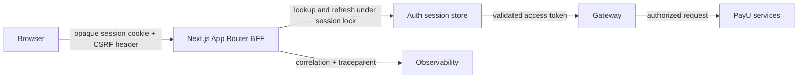

# ADR-0039: Next.js App Router BFF Security, Token Relay & Session Management Standard

**Status**: Accepted  
**Date**: 2026-08-19  
**Deciders**: Principal Architect, Frontend Architect, Cybersecurity Architect, Platform Engineer  
**Relates to**: ADR-0011 (Frontend Architecture), ADR-0022 (Money & Idempotency), ADR-0028 (Step-Up Auth), ADR-0033 (RLS), ADR-0034 (Observability), SEC-RBAC-001, FE-SEC-001  

## Evidence and References

This decision was checked against current internet documentation before writing:

* Next.js App Router documentation, version 16.3.1: Route Handlers are public endpoints; BFF handlers must validate input, protect access, use timeouts, and avoid leaking sensitive response data. Next.js also recommends server-side data access for Server Components instead of an internal HTTP round trip.
* Next.js authentication guide: use server-managed sessions in `httpOnly` cookies, use Proxy for optimistic redirects only, and do not treat Proxy as the final authorization boundary.
* OWASP Session Management Cheat Sheet: use `Secure`, `HttpOnly`, explicit `SameSite`, host-only cookies, session rotation, expiration, and never put session credentials in `localStorage` or `sessionStorage`.
* OWASP CSRF Prevention Cheat Sheet: cookie-authenticated state-changing requests need a CSRF defense; SameSite is defense in depth, not the only control. Signed double-submit or synchronizer tokens and Origin/Fetch Metadata checks are recommended.

## Context

The PayU web application is already using a Next.js BFF:

* `frontend/web-app/src/lib/api.ts:13` sends browser requests to same-origin `/api/v1` and does not expose tokens to JavaScript.
* `frontend/web-app/src/app/api/v1/[...path]/route.ts:210` reads `accessToken` from an `httpOnly` cookie, forwards it as `Authorization`, uses a fixed `GATEWAY_URL`, validates an API path allowlist, limits request bodies, and returns `no-store` responses.
* `frontend/web-app/src/app/api/v1/[...path]/route.ts:310` refreshes on upstream `401` and retries the original request. `src/lib/api.ts:104` also refreshes on `401`, creating two refresh owners and a possible refresh-token rotation race.
* `frontend/web-app/src/app/api/auth/refresh/route.ts:11` decodes an access-token payload without verifying its signature. The decoded data is used to build the user response. Decoding is not authentication and must never be an authorization source.
* `frontend/web-app/src/app/api/auth/authorize/route.ts:40` and `callback/route.ts:65` implement state and PKCE checks, but the temporary OIDC cookies do not set production `Secure` and the flow does not carry a `nonce`.
* The BFF has no explicit CSRF token or Origin/Fetch Metadata policy for cookie-authenticated state-changing requests.
* `frontend/web-app/src/app/api/auth/refresh/route.ts:5`, `logout/route.ts:5`, and `callback/route.ts:71` have production fallbacks for `GATEWAY_URL`, while the generic BFF fails closed outside development/test. Configuration policy is inconsistent.
* `frontend/web-app/next.config.ts:61` says CSP is handled by `middleware.ts`, but no `middleware.ts` or `proxy.ts` exists in the web app. Security-header ownership is therefore unclear.
* `backend/auth-service` already stores hashed refresh-token metadata in `DistributedCache` (`RefreshTokenService.java:34-67`), providing a foundation for a server-managed session migration.

Without a single policy, the web boundary risks CSRF, refresh-token races, replay of a state-changing request, unverified identity claims, accidental token exposure, and authorization drift between the BFF and gateway.

## Decision Drivers

* **Browser credential minimization**: browser JavaScript receives neither access nor refresh tokens.
* **Defense in depth**: BFF validation, gateway authorization, CSRF controls, and upstream mTLS remain separate controls.
* **Bank-grade session lifecycle**: rotation, idle timeout, absolute timeout, revocation, and auditability.
* **No unsafe replay**: automatic retries are limited to safe/idempotent operations or requests carrying an idempotency key.
* **Next.js-native boundaries**: Route Handlers and Server Components are used according to their documented responsibilities.
* **Fewest security implementations**: one refresh owner, one cookie policy, one header policy, one route policy.

## Considered Options

### Option 1: Opaque server-side BFF session (selected)

The browser holds only a random opaque session identifier. The BFF or auth service stores the access-token/refresh-token state server-side with TTL, rotation, revocation, tenant, and subject metadata.

* **Pros**: JWTs do not reside in browser cookies, central revocation, refresh single-flight can be coordinated across replicas, session metadata is auditable.
* **Cons**: requires a distributed session store and a migration from the current token-cookie scheme.

### Option 2: Raw JWTs in `httpOnly` browser cookies

Keep the current `accessToken` and `refreshToken` cookies, adding cookie flags and CSRF checks.

* **Pros**: smallest migration.
* **Cons**: a stolen browser cookie remains a bearer credential until expiry/revocation, refresh rotation races remain harder to coordinate, and browser/session policy remains coupled to token format.

### Option 3: Browser-managed OAuth tokens

Return tokens to JavaScript and use an OAuth client library in the browser.

* **Pros**: common SPA pattern.
* **Cons**: rejected for the banking web app because XSS can exfiltrate credentials and each client must implement refresh, storage, and revocation correctly.

## Decision

Adopt **Option 1: an opaque server-side BFF session with a single server-side token relay**.

### 1. Session and Cookie Policy

* Production session cookie: `__Host-payu_session`.
* Cookie attributes: `Secure`, `HttpOnly`, `SameSite=Lax` or `Strict` according to the exact OIDC navigation requirement, `Path=/`, and **no `Domain` attribute**. The `__Host-` prefix requires `Secure`, host-only scope, and `Path=/`.
* The cookie value is a cryptographically random opaque identifier with at least 128 bits of entropy. It contains no user ID, role, tenant, or JWT claims.
* The server-side session record contains only the minimum required metadata: subject, tenant, role snapshot, token references, issued time, last activity, idle expiry, absolute expiry, revocation state, and session version. Sensitive token material is encrypted at rest or stored through the auth service's protected token facility.
* Default policy: access-token lifetime 15 minutes, idle session timeout 15 minutes for the banking web channel, absolute session timeout 8 hours. Values are configuration, not client-controlled. Step-up and dynamic linking remain mandatory for high-risk financial actions per ADR-0028.
* Login and privilege elevation rotate the opaque session identifier and revoke the previous identifier. Logout revokes the server session and upstream refresh token, then clears the browser cookie even if upstream notification fails.
* Migration from `accessToken`/`refreshToken` cookies is one-time and bounded: exchange a valid legacy cookie pair for an opaque session, delete the legacy cookies, and remove the compatibility path after rollout. No permanent dual scheme.

### 2. OIDC Authorization Code + PKCE

* Use Authorization Code flow with PKCE `S256`; never password grant in the browser.
* Bind the callback to a short-lived, single-use `state` and `nonce`. Store them in temporary `__Host-` cookies with `HttpOnly`, `Secure` in production, `SameSite=Lax`, and a maximum lifetime of 10 minutes.
* Allow only an exact configured public origin and exact callback path. Reject user-controlled external redirect destinations.
* Exchange the code only server-side. Do not return access or refresh tokens in JSON, redirects, logs, analytics, or client state.
* Do not use a base64-decoded JWT payload as proof of identity. User data must come from the verified token produced by the auth boundary or a trusted `/me` response after signature, issuer, audience, expiry, and account-status validation.

### 3. CSRF Policy

For every cookie-authenticated `POST`, `PUT`, `PATCH`, and `DELETE` through the BFF:

* Require a session-bound CSRF token in `X-CSRF-Token`. Use a synchronizer token or a signed double-submit token bound to the current server session; a plain unbound cookie comparison is not sufficient.
* Validate `Origin` against the exact public origin. When present, reject `Sec-Fetch-Site: cross-site` for state-changing requests. Treat missing metadata conservatively for high-risk endpoints.
* Keep SameSite as defense in depth. It is not the sole CSRF control.
* Do not allow state changes over `GET` or `HEAD`.
* Record CSRF failures with correlation ID and route, without logging the token or session cookie.

### 4. BFF Route and Token Relay Policy

* Route Handlers are public endpoints. Each handler enforces its own method, authentication, authorization, content type, body size, tenant scope, and response-cache policy. A Proxy may redirect unauthenticated page navigation but cannot replace these checks.
* The BFF may forward only to a fixed, validated gateway origin. It must use an allowlist of API path prefixes and, for high-risk routes, an explicit method/path policy.
* The BFF strips incoming `Authorization`, `Cookie`, forwarding, and internal tracing headers before constructing the upstream request. It adds only server-generated authorization, correlation, and trace headers.
* The BFF forwards only an allowlist of request headers and never forwards arbitrary `x-*` headers.
* Upstream `Set-Cookie` is never passed through generically. Only the dedicated session route may set the BFF session cookie.
* Authenticated responses use `Cache-Control: private, no-store, must-revalidate`; user- or tenant-bound data must not enter a shared cache.
* Upstream timeout is bounded. Gateway errors return a sanitized RFC 9457-compatible error and never expose internal URLs, stack traces, or token state.

### 5. Refresh and Retry Ownership

* The BFF is the only component that refreshes a session. The browser Axios client does not perform a second refresh after the BFF has returned a final `401`.
* Refresh is single-flight per session. A distributed lock or compare-and-swap on the session version prevents two replicas from rotating the same refresh token concurrently.
* A failed refresh revokes the server session and returns `401`; the client clears non-sensitive auth state and navigates to login.
* Automatic replay is allowed only for safe methods or requests with a valid `X-Idempotency-Key`. Financial mutations without an idempotency key are never replayed by the BFF.
* The BFF retries an upstream request at most once after a successful refresh. It does not retry a request whose body cannot be safely reconstructed or whose upstream response may already have committed a mutation.

### 6. Server Components and Client Components

* Server Components use a server-only backend client that resolves the current session and calls the gateway directly. They do not call the application's own `/api` Route Handler, avoiding an unnecessary loopback.
* Client Components call same-origin BFF endpoints through `src/lib/api.ts` and receive only DTOs and non-sensitive session state.
* `AuthService.isAuthenticated()` is an optimistic UI hint, not an authorization decision. The server session and gateway remain authoritative.
* Logout clears React Query/client state after server-side revocation; it must not be used as the only revocation mechanism.

### 7. Security Headers and Observability

* Assign CSP ownership to one request-layer implementation. Prefer a nonce-based CSP for document responses and do not claim a nonexistent `middleware.ts`/`proxy.ts` implementation.
* Retain HSTS, `X-Content-Type-Options`, strict `Referrer-Policy`, restrictive `Permissions-Policy`, and frame protection. Remove obsolete `X-XSS-Protection` rather than treating it as a control.
* Log only correlation ID, route class, status, duration, tenant hash, and session outcome. Never log access tokens, refresh tokens, CSRF tokens, raw cookies, or unverified JWT claims.
* Emit bounded metrics for BFF `401`, refresh success/failure, session revocation, CSRF rejection, blocked path, body-limit rejection, and upstream timeout. Propagate W3C `traceparent` per ADR-0034.

## Rationale

Next.js documents Route Handlers as public API endpoints and recommends explicit validation and access control. OWASP recommends host-only secure cookies, server-managed sessions, session rotation, and an explicit CSRF defense for cookie-authenticated state changes. The existing BFF already provides the right boundary, allowlist, timeout, and no-store direction; this ADR removes the remaining ambiguity by making the session opaque, centralizing refresh, and separating optimistic navigation from authorization.

## Consequences

**Positive**:

* Browser JavaScript cannot read bearer credentials and the browser cookie no longer contains a JWT.
* Session revocation, idle/absolute timeout, refresh rotation, and audit become centrally enforceable.
* CSRF, SSRF, open redirect, replay, caching, and header leakage have explicit controls.
* Server Components avoid unnecessary BFF loopback requests.

**Negative**:

* A distributed session lookup is added to the web request path; mitigate with bounded cache latency and fail-closed behavior.
* Migration requires coordination between Next.js BFF and `auth-service` refresh/session APIs.
* CSRF and session lifecycle tests become mandatory release gates.

## Implementation Notes

| Step | Target | File / Component |
|---|---|---|
| 1 | Opaque session API and storage | `auth-service` session port backed by existing `DistributedCache`/protected token facility |
| 2 | Cookie migration | `frontend/web-app/src/app/api/auth/{authorize,callback,refresh,logout}/route.ts` |
| 3 | Single refresh owner | `frontend/web-app/src/app/api/v1/[...path]/route.ts` and `src/lib/api.ts` |
| 4 | CSRF + Origin policy | shared BFF security helper used by auth and API Route Handlers |
| 5 | Verified identity | remove unverified `decodeJwtPayload` as an identity source; use validated auth response |
| 6 | Route policy | fixed gateway origin, path/method allowlist, body/content-type limits, response header allowlist |
| 7 | Server data access | server-only gateway client for Server Components; client DTO access remains through BFF |
| 8 | CSP ownership | add the single Next.js `proxy.ts`/request-layer implementation or correct the existing documentation/config |
| 9 | Tests | cookie flags, OIDC state/nonce/PKCE, CSRF, Origin/Fetch Metadata, refresh race, mutation replay, SSRF, no-store, no token leakage |
| 10 | Runbook | `docs/operations/WEB_BFF_SESSION_RUNBOOK.md` for revocation, refresh incident, and session-store outage |

**Verification**:

* No access/refresh token appears in browser JSON, client state, logs, traces, or generic response headers.
* Cross-site state-changing requests return `403`; same-origin requests with a valid session-bound CSRF token succeed.
* Two concurrent `401` requests produce one refresh rotation and no duplicate mutation.
* Legacy cookie migration produces one opaque session and deletes legacy cookies.
* OIDC rejects bad state, bad nonce, missing PKCE verifier, and external redirect targets.
* Protected Route Handlers reject missing/invalid session regardless of Proxy behavior.
* Authenticated responses are not stored in shared caches and BFF upstream timeouts return sanitized errors.

---
*Created for ADR-0039 — implementation must refer to this decision.*
