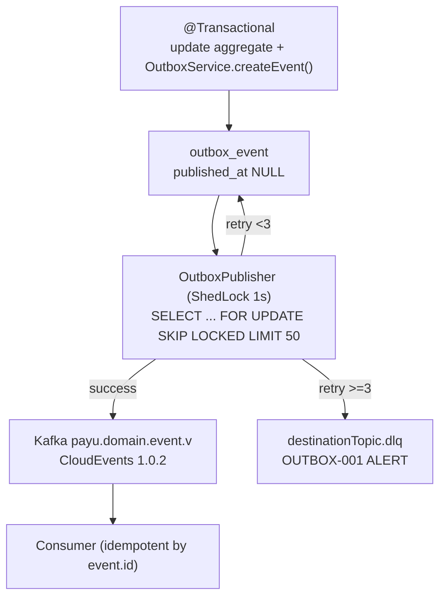

# ADR-0041: Transactional Outbox Pattern with Polling SKIP LOCKED Dispatcher vs Debezium CDC

**Status**: Accepted  
**Date**: 2026-08-19  
**Deciders**: Principal Architect, Integration Architect, Data Architect, Platform Engineer  
**Relates to**: ADR-0026 (Kafka Topic Governance), ADR-0038 (Saga), PARTNER-PROD-005, ARCH-DLQ-001  

---

## Context

PayU must atomically `UPDATE business table + INSERT event` without `2PC` (forces `microservices.io/patterns/data/transactional-outbox.html` checked `2026-08-19`). Existing `outbox-starter` + `kyc-service/src/app/messaging/kyc_outbox.py:37` already implement polling publisher: `OutboxService.createEvent()` (`@Transactional`) writes `outbox_event` (`aggregateType`, `aggregateId`, `eventType`, `payload`, `destinationTopic=payu.<domain>.<event>.v<n>[.dlq]`, `retryCount`) validated by `DESTINATION_TOPIC_PATTERN`; `OutboxPublisher`/`KycOutboxPublisher.publish_pending()` polls `WHERE published_at IS NULL AND retry_count < MAX_RETRIES=3 ORDER BY created_at` batch 50, wraps CloudEvents 1.0.2, commits, retries with backoff, archives permanently failed rows.

Alternatives: Debezium CDC (transaction-log tailing `Outbox Event Router`) offers lower lag but requires Kafka Connect cluster, `WAL` `logical` slot, `REPLICA IDENTITY FULL`, schema registry, and per-service connector ops. Polling with `FOR UPDATE SKIP LOCKED` scales to `~5k TPS` with `~100ms` lag, reuses existing `PostgreSQL + outbox-starter` without extra infra. PayU volume is moderate; operational simplicity outweighs CDC throughput.

**Best practice bank/e-wallet** (BCA/Mandiri, GoPay/OVO/DANA, Midtrans/Xendit, `microservices.io`):

* Polling `SKIP LOCKED` for low/medium throughput; CDC only when `>10k TPS` or strict `p99<10ms` event lag.
* `SKIP LOCKED` with `ShedLock`/`advisory lock` for multi-pod dispatcher; idempotent consumer by `event.id` dedup.

## Decision Drivers

* **Atomicity** — `event` must be sent iff `transaction` commits.
* **Ordering** — `T1→E1` before `T2→E2` per aggregate.
* **Ops cost** — CDC = Connect HA + slot lag monitoring + schema evolution.
* **Existing adoption** — `outbox-starter` already in `billing`, `cms`, `dispute`, `promotion` (139 callers).
* **DLQ** — `ARCH-DLQ-001` requires `*.dlq` wiring per service.

## Considered Options

### Option 1 — Polling `SKIP LOCKED` dispatcher (dipilih)

Pros: no `2PC`, guaranteed `iff commit`, ordering preserved, `no extra infra`, DLQ trivial. Cons: `poll 1-2s` lag, DB read load — mitigasi index + `ShedLock`.

### Option 2 — Debezium CDC log tailing

Pros: `~5ms` lag, no poll. Cons: Connect cluster, `slot` failover, `WAL` retention, `Avro` schema ops — overkill for PayU TPS.

### Option 3 — Direct `kafkaTemplate.send()` after commit

Pros: simple. Cons: crash before send → lost event, no ordering, no retry/DLQ — ditolak.

## Decision

Adopsi **Option 1 — Transactional Outbox with Polling `SKIP LOCKED` Dispatcher** as PayU standard; CDC deferred to `>5k TPS` (ponytail: `poll now, CDC later`).

### 1. Table & Transaction

* `outbox_event` per service DB: `id PK UUID`, `aggregate_type`, `aggregate_id`, `event_type`, `payload JSONB`, `headers JSONB`, `destination_topic`, `created_at`, `published_at`, `retry_count`, `last_error`.
* Index: `(published_at) WHERE published_at IS NULL` + `(aggregate_id, created_at)`.
* Write: `OutboxService.createEvent(aggregateType, aggregateId, eventType, payload, headers, destinationTopic)` within same `@Transactional` as business mutation; `validateDestinationTopic()` enforces `^payu\.[a-z][a-z0-9-]*\.[a-z][a-z0-9-]*\.v[0-9]+(?:\.dlq)?$`.
* Python: `KycOutboxService.create_event(session, aggregate_id, event_type, destination_topic, payload)` with same pattern; `async_session` commit once.

### 2. Dispatcher (Polling `SKIP LOCKED`)

* `OutboxPublisher` (`@SchedulerLock(lockAtMostFor=PT10S) @Scheduled(fixedDelay=1000)`) + Python `KycOutboxPublisher._loop(poll_interval_sec=2.0)`.
* Query: `SELECT * FROM outbox_event WHERE published_at IS NULL AND retry_count < 3 ORDER BY created_at ASC FOR UPDATE SKIP LOCKED LIMIT 50` — `SKIP LOCKED` prevents multi-pod double publish without `SELECT FOR UPDATE` blocking.
* Envelope: CloudEvents `specversion=1.0.2`, `id=event.id`, `source=/<service>`, `type=eventType`, `subject=aggregateId`, `time=now`, `traceparent` from `MDC` (ADR-0034), `datacontenttype=application/json`, `data=payload`.
* Publish: `kafkaTemplate.send(topic, key=aggregateId, value=envelope)`; on success `SET published_at=now()`; on `Exception` `retry_count++`, `last_error`; if `>=3` copy to `destinationTopic.dlq` + `OUTBOX-001 ALERT` log + Prometheus `outbox_failed_total`.

### 3. Ordering & Idempotency

* Ordering: per-`aggregateId` partition key → same Kafka partition; `created_at` order within batch.
* Consumer idempotency: `consumer_idempotency` table (`event_id PK`, `processed_at`) or Redis `SETNX event.id EX 7d`; skip if `event.id` already seen. At-least-once is acceptable (see `microservices.io`).

### 4. DLQ & Replay

* `ARCH-DLQ-001`: 42 `*.dlq` topics declared (`retention 30d`); dispatcher writes permanently failed events to `*.dlq` (best-effort) + `OutboxCleanupScheduler.java:77` `OUTBOX-001` safety net.
* Replay: `scripts/dlq-replay.sh` (`P1`) requeues `dlq` → source `outbox_event` with `retry_count=0`.

### 5. When to use CDC

* Trigger: `sustained >5k outbox TPS` or `p99 publish lag >500ms` with poll `1s` + `SKIP LOCKED` tuning insufficient. Then adopt Debezium `Outbox Event Router` with `REPLICA IDENTITY FULL`, `wal_level=logical`, Connect HA, schema registry — tracked as `ADR-0041-follow` P3.

### 6. When NOT to use Outbox

* Single-DB local tx → `@Transactional` only.
* Fanout without ordering guarantee → direct `Kafka` with outbox still preferred for atomicity; no exception for financial events.

## Rationale

Polling outbox is the `microservices.io` reference for `atomically update DB + send message`; `SKIP LOCKED` gives linearizable multi-pod dispatch without `2PC` or Connect ops. PayU already has `outbox-starter` in 4+ services + Python parity; CDC would add Connect HA + WAL slot ops for unneeded throughput. Ponytail: 1 query + 1 lock vs a cluster.

## Consequences

**Positive**:
* Lossless `iff commit`, ordered per aggregate, DLQ + replay governed.
* No extra infra; reuses `PostgreSQL + outbox-starter`.

**Negative**:
* `1-2s` poll lag — mitigasi `fixedDelay 1s` + `batch 50` (tune to `500ms` if SLO demands).
* DB poll load — mitigasi partial index + `SKIP LOCKED`.

## Implementation Notes

| Step | Target | File |
|---|---|---|
| 1 | Table | `backend/*/src/main/resources/db/migration/Vxx__outbox_event.sql` (per service) |
| 2 | Service | `backend/shared/outbox-starter/.../OutboxService.java` + `OutboxRepository` |
| 3 | Publisher | `backend/shared/outbox-starter/.../OutboxPublisher.java` (`@SchedulerLock`) |
| 4 | Python | `backend/kyc-service/src/app/messaging/kyc_outbox.py` |
| 5 | DLQ topics | `infrastructure/platform/kafka/topics/payu.*.dlq` (42) |
| 6 | Tests | `OutboxServiceIntegrationTest`, `CloudEventsContractTest`, `kyc/tests/unit/test_kyc_outbox.py` |

**Verification**:
* Kill `OutboxPublisher` mid-batch → no double send (SKIP LOCKED) + consumer dedup `event.id`.
* `INSERT` + rollback → no `outbox_event` row; `INSERT` + commit → `published_at` set within `2s`.
* `retry_count=3` → row in `*.dlq` + `OUTBOX-001 ALERT` metric.

---
*Created for ARCH-DLQ-001, PARTNER-PROD-005 — implementasi wajib refer ADR ini.*
