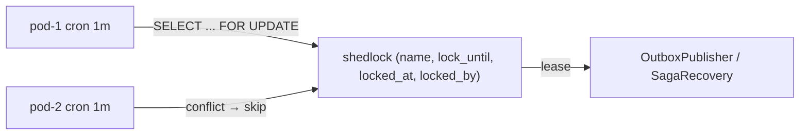

# ADR-0042: Distributed Job Scheduling & Cluster-Wide Concurrency Lock Standard using ShedLock

**Status**: Accepted  
**Date**: 2026-08-19  
**Deciders**: Principal Architect, Platform Engineer, Integration Architect  
**Relates to**: GW-CONCUR-001, ARCH-BESTP-001, ADR-0038 (Saga recovery), ADR-0041 (Outbox)  

---

## Context

PayU runs 3+ pods per service (`HPA≥3` per PARTNER-PROD-007). Scheduled jobs currently duplicate:

* `gateway-service/ApiKeyRotationService.java:119` `@Scheduled(every="1h") checkExpiringKeys()`
* `gateway-service/PersistentAnalyticsService.java:123,162,183`
* `gateway-service/CheckoutService.java:29` `cleanupExpiredSessions()`
* `saga-starter/SagaRecoveryService.java:190` already correct: `@SchedulerLock(lockAtLeastFor=PT1s, lockAtMostFor=PT5M) @Scheduled(fixedDelay=300000)`

Temuan `codegraph 2026-08-19`: gateway Quarkus `@Scheduled` tanpa lock → `GW-CONCUR-001` `🟠 OPEN`. Billing/Account/CMS/Investment already have `ShedLockConfig.java:12` `JdbcTemplateLockProvider(usingDbTime())` for Spring, but gateway (Quarkus) lacks equivalent; Spring services with `ShedLock` are correct but not governed.

Risk bank: `checkExpiringKeys` double-rotate → `API key` inconsistency, `OutboxPublisher` double send → duplicate Kafka event → ledger double-credit if consumer not idempotent, `CheckoutService` double clean → race.

**Best practice bank/e-wallet** (check Context7 `/lukas-krecan/shedlock` 2026-08-19): `ShedLock 4.x` JDBC provider with `usingDbTime()`, `lockAtLeastFor` to prevent thundering herd, `lockAtMostFor` > job duration, Quarkus `quarkus-shedlock` or manual `JdbcTemplate` equivalent.

## Decision Drivers

* **At-most-once** per cluster for `finance-touching` jobs; at-least-once with idempotency for `analytics`.
* **No extra infra** — reuse `Postgres` `shedlock` table, not `Redis`/`Zookeeper`.
* **Polyglot** — Spring `net.javacrumbs.shedlock` + Quarkus `quarkus-shedlock` parity.
* **Observability** — lock acquisition metric + `OUTBOX-001` already exists.

## Considered Options

### Option 1 — ShedLock JDBC `shedlock` table + `@SchedulerLock` (dipilih)

Pros: 1 table, `DB time`, no Redis, proven in 4 services. Cons: DB `SELECT` per run — negligible (`1s` interval).

### Option 2 — Redis `SETNX` lock

Pros: fast. Cons: extra infra, split-brain on Redis failover, CP vs AP — rejected.

### Option 3 — Leader election (K8s lease)

Pros: single leader. Cons: leader failover `30s`, overkill — rejected.

## Decision

Adopsi **Option 1 — ShedLock JDBC as PayU cluster-wide lock standard**.



### 1. Spring Boot (existing pattern, govern)

* Dependency: `net.javacrumbs.shedlock:shedlock-spring:5.x` + `shedlock-provider-jdbc-template`.
* Config (already `ShedLockConfig.java:12`): `LockProvider = JdbcTemplateLockProvider(usingDbTime=true)`.
* Table (Flyway per DB): `CREATE TABLE shedlock(name VARCHAR(64) PRIMARY KEY, lock_until TIMESTAMP, locked_at TIMESTAMP, locked_by VARCHAR(255));`
* Enable: `@EnableSchedulerLock(defaultLockAtMostFor="PT5M")` on `@SpringBootApplication`.
* Usage:
  ```java
  @SchedulerLock(name="OutboxPublisher_publishPending", lockAtLeastFor="PT1S", lockAtMostFor="PT30S")
  @Scheduled(fixedDelay=1000)
  public void publishPending() { ... } // OutboxPublisher (ADR-0041)
  @SchedulerLock(name="SagaRecoveryService_scheduledRecovery", lockAtLeastFor="PT1S", lockAtMostFor="PT5M")
  @Scheduled(fixedDelay=300000)
  public void scheduledRecovery() { ... } // SagaRecoveryService.java:190 already correct
  ```
* Rule: `lockAtMostFor` = `2×` max expected duration; `lockAtLeastFor=PT1S` to avoid second pod immediate re-run after short job.

### 2. Quarkus (gateway) — fix GW-CONCUR-001

* Dependency: `io.quarkiverse.shedlock:quarkus-shedlock-jdbc:1.x` or `net.javacrumbs.shedlock:shedlock-provider-jdbc-template` manual.
* For `CheckoutService.java:29` / `ApiKeyRotationService.java:119`: switch `io.quarkus.scheduler.Scheduled` to `@SchedulerLock(name="CheckoutService_cleanup", lockAtLeastFor="PT5S", lockAtMostFor="PT2M")` + JDBC provider via `Agroal DataSource`.
* If `quarkus-shedlock` unavailable, use `pg_advisory_lock` fallback: `SELECT pg_try_advisory_xact_lock(hashtext('CheckoutService_cleanup'))` early return if false.

### 3. Governance

* Lock `name` = `ClassName_method` unique, kebab not needed.
* All `finance-touching` `@Scheduled` must have `@SchedulerLock`; `ArchUnit` rule `noScheduledWithoutShedLock`.
* Metrics: `shedlock_acquired_total{name}`, `shedlock_held_seconds`; alert `shedlock_lock_until < now() + 30s` stuck.

### 4. When NOT to use

* Request path (HTTP/gRPC) → `SKIP LOCKED` (ADR-0041) or `SELECT FOR UPDATE`, not ShedLock.
* Sub-second jobs → short `PT500M` not reliable — use streaming.

## Rationale

ShedLock already wired in 4 Spring services with `usingDbTime()` (clock drift safe) and proven `SagaRecoveryService:190`. Reusing `Postgres` avoids Redis split-brain; `GW-CONCUR-001` fixed with same table for Quarkus. Context7 ShedLock recommends `lockAtMostFor` > job + `lockAtLeastFor` to prevent duplicate on fast job.

## Consequences

**Positive**:
* `At-most-once` per cluster for `outbox`, `saga`, `api-key` rotation.
* `ARCH-BESTP-001` + `GW-CONCUR-001` closed.

**Negative**:
* DB `SELECT` per tick — mitigasi `fixedDelay 1-300s` tuned.
* Clock `usingDbTime` adds 1 RTT — negligible.

## Implementation Notes

| Step | Target | File |
|---|---|---|
| 1 | Table | `backend/*/src/main/resources/db/migration/Vxx__shedlock.sql` |
| 2 | Spring enable | `@EnableSchedulerLock` on `Application.java` |
| 3 | Outbox | `OutboxPublisher` + `ShedLock` `PT1S/PT30S` |
| 4 | Gateway fix | `backend/gateway-service/.../CheckoutService.java:29`, `ApiKeyRotationService.java:119` |
| 5 | Python | `backend/shared/python-starter: ShedLock` via `SELECT pg_advisory_lock` for APScheduler |
| 6 | ArchUnit | `ShedLockArchTest.java` (`noScheduledWithoutShedLock`) |

**Verification**:
* Scale to 3 pods, trigger `OutboxPublisher` — 1 publish per second, others `skip` (log `locked`).
* Kill pod holding lock → `lock_until` expires → next pod acquires within `lockAtMostFor`.
* `GW-CONCUR-001` replay with 2 gateway replicas → `checkExpiringKeys` runs once/hour.

---
*Created for GW-CONCUR-001, ARCH-BESTP-001 — implementasi wajib refer ADR ini.*
