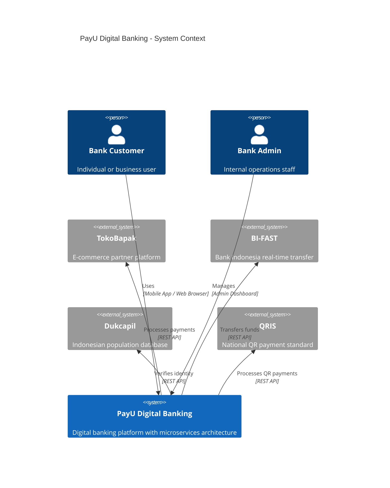
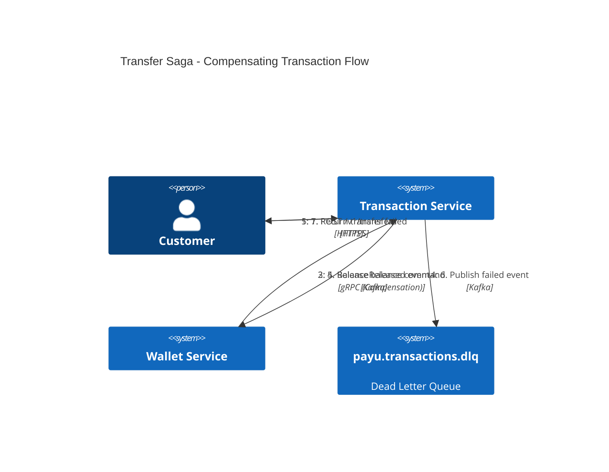
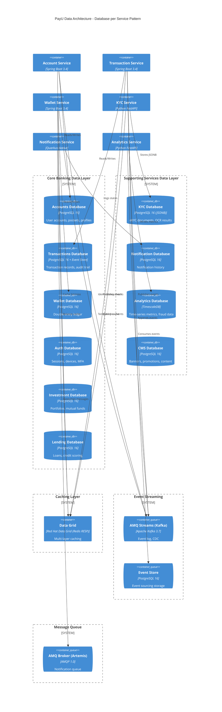
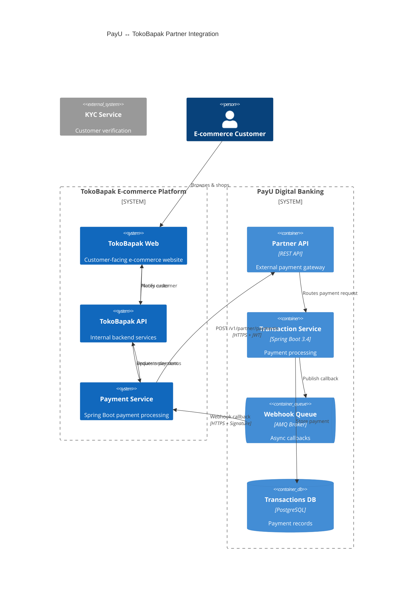
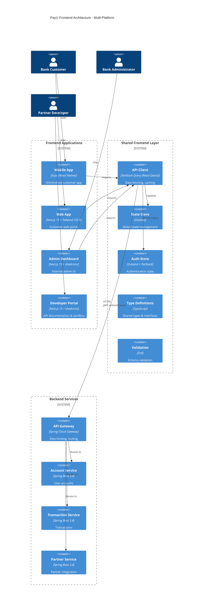

# PayU Digital Banking - Architecture Documentation

> Production-Ready Microservices Architecture for Digital Banking Platform

---

## Table of Contents

1. [Executive Summary](#1-executive-summary)
2. [System Overview](#2-system-overview)
3. [Microservices Architecture](#3-microservices-architecture)
   - 3.4 [Testing Strategy](#34-testing-strategy)
4. [Event-Driven Architecture](#4-event-driven-architecture)
5. [Data Architecture](#5-data-architecture)
6. [Security Architecture](#6-security-architecture)
7. [API Gateway & Service Mesh](#7-api-gateway--service-mesh)
8. [Infrastructure & DevOps](#8-infrastructure--devops)
9. [Monitoring & Observability](#9-monitoring--observability)
10. [TokoBapak Integration](#10-tokobapak-integration)
11. [Frontend Architecture](#11-frontend-architecture)
12. [Disaster Recovery & High Availability](#12-disaster-recovery--high-availability)
13. [External Service Simulators](#13-external-service-simulators)
14. [Lab Configuration & Decisions](#14-lab-configuration--decisions)

---

## Lab Project Context

> **Note**: This is a **lab project** with a realistic production approach.
> External integrations (BI-FAST, Dukcapil, QRIS) will use **simulators** for development and testing.

## 1. Executive Summary

PayU adalah platform digital banking modern yang dibangun dengan arsitektur **microservices** dan **event-driven** untuk mencapai:

- **Scalability**: Horizontal scaling per service
- **Resilience**: Fault isolation dan self-healing
- **Security**: PCI DSS Level 1 & ISO 27001 compliant
- **Performance**: Sub-second transaction processing
- **Availability**: 99.95% uptime SLA

### Technology Stack Overview

| Layer                     | Red Hat Product                      | Portable Alternative       |
| ------------------------- | ------------------------------------ | -------------------------- |
| **Container Platform**    | Red Hat OpenShift 4.20+              | Kubernetes (EKS/GKE/AKS)   |
| **Core Banking Services** | Red Hat Runtimes (Spring Boot 3.4)   | Spring Boot                |
| **Supporting Services**   | Red Hat Build of Quarkus 3.x         | Quarkus                    |
| **ML/Data Services**      | Python 3.12 (UBI-based)              | Python FastAPI             |
| **API Gateway**           | Red Hat Build of Quarkus             | Any API Gateway            |
| **Event Streaming**       | AMQ Streams (Kafka)                  | Apache Kafka, Confluent    |
| **Message Queue**         | AMQ Broker (Artemis)                 | ActiveMQ Artemis, RabbitMQ |
| **Database**              | Crunchy PostgreSQL 16                | Any PostgreSQL             |
| **Caching**               | Red Hat Data Grid (RESP mode)        | Redis, ElastiCache         |
| **Identity & Access**     | Red Hat SSO (Keycloak) 24            | Keycloak, Auth0            |
| **Service Mesh**          | OpenShift Service Mesh               | Istio, Linkerd             |
| **Logging**               | OpenShift Logging (LokiStack)        | Grafana Loki               |
| **Monitoring**            | OpenShift Monitoring                 | Prometheus/Grafana         |
| **Shared Libraries**      | Security, Resilience, Cache Starters | Spring Boot Starters       |

> **Portability Note**: All components use standard APIs (OIDC, RESP, Kafka Protocol, SQL, AMQP).
> Code remains portable - only configuration changes needed to switch providers.

### Polyglot Microservices Strategy

```text
┌─────────────────────────────────────────────────────────────────────────────┐
│                  RED HAT OPENSHIFT 4.20+ ECOSYSTEM                          │
├─────────────────────────────────────────────────────────────────────────────┤
│                                                                              │
│  CORE BANKING (Spring Boot 3.4)        SUPPORTING (Spring Boot 3.4)         │
│  ┌──────────────────────────────┐     ┌─────────────────────────────────┐    │
│  │ account-svc   auth-svc       │     │ backoffice-svc  partner-svc     │    │
│  │ transaction-svc wallet-svc   │     │ promotion-svc   support-svc     │    │
│  │ investment-svc lending-svc   │     │ compliance-svc  cms-svc         │    │
│  │ fx-svc  statement-svc        │     │ ab-testing-svc                  │    │
│  └──────────────────────────────┘     └─────────────────────────────────┘    │
│                                                                              │
│  NATIVE SERVICES (Quarkus 3.x)         ML/DATA (Python 3.12 UBI)            │
│  ┌──────────────────────────────┐     ┌─────────────────────────────────┐    │
│  │ gateway-svc   billing-svc    │     │ kyc-svc (OCR, liveness)         │    │
│  │ notification-svc             │     │ analytics-svc (Fraud ML)        │    │
│  │ api-portal-svc               │     │                                 │    │
│  └──────────────────────────────┘     └─────────────────────────────────┘    │
│                                                                              │
│  SHARED LIBRARIES (Java)               SIMULATORS                           │
│  ┌──────────────────────────────┐     ┌─────────────────────────────────┐    │
│  │ security-starter (PII, Audit)│     │ bi-fast-simulator               │    │
│  │ resilience-starter (Circuit) │     │ dukcapil-simulator              │    │
│  │ cache-starter (L2 Caching)   │     │ qris-simulator                  │    │
│  └──────────────────────────────┘     └─────────────────────────────────┘    │
└─────────────────────────────────────────────────────────────────────────────┘
```

---

## 2. System Overview

### 2.1 High-Level Architecture

#### C4 Level 1: System Context



#### C4 Level 2: Container Architecture

```mermaid
C4Container
  title PayU Digital Banking - Container Architecture

  Person(customer, "Bank Customer")
  Person(admin, "Bank Admin")

  System_Boundary(payu_platform, "PayU Digital Banking Platform") {
    Container(mobile, "Mobile App", "React Native / Expo", "Customer-facing mobile application")
    Container(web_app, "Web App", "Next.js 15", "Customer web portal")
    Container(admin_web, "Admin Dashboard", "Next.js 15", "Internal administration interface")
    Container(gateway, "API Gateway", "Spring Cloud Gateway", "Rate limiting, JWT validation, routing")

    System_Boundary(core_banking, "Core Banking Services") {
      Container(account_svc, "Account Service", "Spring Boot 3.4", "User accounts, multi-pocket, profile")
      Container(auth_svc, "Auth Service", "Spring Boot 3.4", "Authentication, MFA, OAuth2")
      Container(transaction_svc, "Transaction Service", "Spring Boot 3.4", "Transfers, BI-FAST, QRIS")
      Container(wallet_svc, "Wallet Service", "Spring Boot 3.4", "Double-entry ledger, balance management")
      Container(investment_svc, "Investment Service", "Spring Boot 3.4", "Mutual funds, Gold investment")
      Container(lending_svc, "Lending Service", "Spring Boot 3.4", "Loans, PayLater, credit scoring")
      Container(fx_svc, "FX Service", "Spring Boot 3.4", "Currency exchange rates")
      Container(statement_svc, "Statement Service", "Spring Boot 3.4", "PDF E-Statement generation")
    }

    System_Boundary(supporting_services, "Supporting Services") {
      Container(kyc_svc, "KYC Service", "Python FastAPI", "OCR, liveness detection")
      Container(notification_svc, "Notification Service", "Quarkus Native", "Push, SMS, Email")
      Container(billing_svc, "Billing Service", "Quarkus Native", "Bill payments")
      Container(gateway_svc, "Gateway Service", "Quarkus Native", "Internal API gateway")
      Container(api_portal_svc, "API Portal Service", "Quarkus Native", "OpenAPI docs & sandbox")
      Container(analytics_svc, "Analytics Service", "Python FastAPI", "Fraud scoring, insights")
    }

    System_Boundary(admin_services, "Admin & Supporting Services") {
      Container(backoffice_svc, "Backoffice Service", "Spring Boot 3.4", "Internal admin operations")
      Container(partner_svc, "Partner Service", "Spring Boot 3.4", "Partner integration, webhooks")
      Container(promotion_svc, "Promotion Service", "Spring Boot 3.4", "Campaigns, vouchers, rewards")
      Container(support_svc, "Support Service", "Spring Boot 3.4", "Customer support, ticketing")
      Container(compliance_svc, "Compliance Service", "Spring Boot 3.4", "Regulatory compliance, AML")
      Container(cms_svc, "CMS Service", "Spring Boot 3.4", "Banners, promos, dynamic content")
      Container(ab_testing_svc, "AB Testing Service", "Spring Boot 3.4", "Feature flags, experimentation")
    }

    ContainerDb(accounts_db, "Accounts Database", "PostgreSQL 16", "User accounts, pockets")
    ContainerDb(transactions_db, "Transactions Database", "PostgreSQL 16 + Event Store", "Transaction records, events")
    ContainerDb(wallet_db, "Wallet Database", "PostgreSQL 16", "Double-entry ledger")
    ContainerDb(kyc_db, "KYC Database", "PostgreSQL 16", "eKYC data (JSONB)")
    ContainerDb(analytics_db, "Analytics Database", "TimescaleDB", "Time-series analytics")

    ContainerQueue(kafka_streams, "AMQ Streams (Kafka)", "Apache Kafka 3.7", "Event streaming, CDC")
    ContainerQueue(amq_broker, "AMQ Broker (Artemis)", "AMQP 1.0", "Point-to-point messaging")

    Container(cache, "Data Grid", "Redis RESP (Red Hat Data Grid)", "Multi-layer caching, rate limiting")

    Container(sso, "Red Hat SSO (Keycloak)", "Keycloak 24", "Identity & access management")
  }

  System_Ext(bi_fast, "BI-FAST Simulator", "External transfer network")
  System_Ext(dukcapil, "Dukcapil Simulator", "Identity verification")
  System_Ext(qris, "QRIS Simulator", "QR payment standard")
  System_Ext(tokobapak, "TokoBapak", "E-commerce partner")

  Rel(customer, mobile, "Uses")
  Rel(customer, web_app, "Uses")
  Rel(admin, admin_web, "Uses")
  Rel(mobile, gateway, "HTTPS", "JWT")
  Rel(web_app, gateway, "HTTPS", "JWT")
  Rel(admin_web, gateway, "HTTPS", "JWT")
  Rel(gateway, sso, "Validates tokens", "OIDC")
  Rel(gateway, account_svc, "Routes to")
  Rel(gateway, auth_svc, "Routes to")
  Rel(gateway, transaction_svc, "Routes to")
  Rel(gateway, wallet_svc, "Routes to")
  Rel(gateway, kyc_svc, "Routes to")
  Rel(gateway, backoffice_svc, "Routes to")
  Rel(gateway, partner_svc, "Routes to")

  Rel(account_svc, accounts_db, "Connects to")
  Rel(transaction_svc, transactions_db, "Connects to")
  Rel(wallet_svc, wallet_db, "Connects to")
  Rel(kyc_svc, kyc_db, "Connects to")
  Rel(analytics_svc, analytics_db, "Connects to")

  Rel(transaction_svc, kafka_streams, "Publishes events")
  Rel(account_svc, kafka_streams, "Publishes events")
  Rel(wallet_svc, kafka_streams, "Publishes events")
  Rel(analytics_svc, kafka_streams, "Consumes events")

  Rel(notification_svc, amq_broker, "Consumes messages")

  Rel(account_svc, cache, "Reads/Writes")
  Rel(auth_svc, cache, "Reads/Writes")
  Rel(wallet_svc, cache, "Reads/Writes")

  Rel(transaction_svc, bi_fast, "Initiates transfer")
  Rel(kyc_svc, dukcapil, "Verifies identity")
  Rel(transaction_svc, qris, "Processes QR payment")
  Rel(partner_svc, tokobapak, "Payment integration", "Webhooks")
```



### 2.2 Design Principles

| Principle                | Implementation                              |
| ------------------------ | ------------------------------------------- |
| **Domain-Driven Design** | Services aligned with banking domains       |
| **Database per Service** | Each service owns its data store            |
| **Event Sourcing**       | Complete audit trail for all transactions   |
| **CQRS**                 | Separated read/write models for performance |
| **Saga Pattern**         | Distributed transaction management          |
| **Zero Trust**           | mTLS between all services                   |

---

## 3. Microservices Architecture

### 3.1 Service Decomposition

```
                               ┌─────────────────────────────────────┐
                               │           CORE BANKING              │
                               └─────────────────────────────────────┘
                                              │
         ┌───────────────┬───────────────┬────┴────┬───────────────┬───────────────┐
         │               │               │         │               │               │
    ┌────▼────┐    ┌─────▼─────┐   ┌─────▼─────┐ ┌─▼───────────┐ ┌─▼───────────┐ ┌─▼───────────┐
    │ Account │    │   Auth    │   │Transaction│ │   Wallet    │ │ Investment  │ │  Lending    │
    │ Service │    │  Service  │   │  Service  │ │   Service   │ │  Service    │ │  Service    │
    └─────────┘    └───────────┘   └───────────┘ └─────────────┘ └─────────────┘ └─────────────┘

                               ┌─────────────────────────────────────┐
                               │         SUPPORTING SERVICES         │
                               └─────────────────────────────────────┘
                                              │
    ┌───────────────┬───────────────┬─────────┴──────┬───────────────┬───────────────┐
    │               │               │                │               │               │
┌───▼───────┐ ┌─────▼─────┐ ┌───────▼─────┐ ┌────────▼─────┐ ┌───────▼─────┐ ┌───────▼─────┐
│    KYC    │ │Notification│ │  Analytics  │ │   Gateway    │ │   Billing   │ │     CMS     │
│  Service  │ │  Service   │ │   Service   │ │   Service    │ │   Service   │ │   Service   │
└───────────┘ └────────────┘ └─────────────┘ └──────────────┘ └─────────────┘ └─────────────┘

                               ┌─────────────────────────────────────┐
                               │         ADDITIONAL SERVICES         │
                               └─────────────────────────────────────┘
                                              │
    ┌───────────────┬───────────────┬─────────┴──────┬───────────────┬───────────────┐
    │               │               │                │               │               │
┌───▼───────┐ ┌─────▼─────┐ ┌───────▼─────┐ ┌────────▼─────┐ ┌───────▼─────┐ ┌───────▼─────┐
│Backoffice │ │  Partner  │ │  Promotion  │ │   Support    │ │ Compliance  │ │ AB Testing  │
│  Service  │ │  Service  │ │   Service   │ │   Service    │ │   Service   │ │   Service   │
└───────────┘ └───────────┘ └─────────────┘ └──────────────┘ └─────────────┘ └─────────────┘
```

### 3.2 Service Specifications

#### 3.2.1 Account Service

| Attribute            | Value                                           |
| -------------------- | ----------------------------------------------- |
| **Technology**       | Java 21, Spring Boot 3.4.x                      |
| **Database**         | PostgreSQL                                      |
| **Port**             | 8001                                            |
| **Responsibilities** | User accounts, multi-pocket, profile management |

```
account-service/
├── src/main/java/id/payu/account/
│   ├── AccountServiceApplication.java
│   ├── config/                     # Configuration classes
│   ├── domain/
│   │   ├── entity/                 # Account, Pocket, Profile
│   │   ├── event/                  # Domain events
│   │   ├── repository/             # Repository interfaces
│   │   └── service/                # Domain services
│   ├── application/
│   │   ├── command/                # CQRS commands
│   │   ├── query/                  # CQRS queries
│   │   └── saga/                   # Saga participants
│   ├── infrastructure/
│   │   ├── persistence/            # JPA implementations
│   │   ├── messaging/              # Kafka producers/consumers
│   │   └── external/               # External service clients
│   └── api/
│       ├── rest/                   # REST controllers
│       └── grpc/                   # gRPC services (internal)
└── src/main/resources/
    ├── application.yml
    └── db/migration/               # Flyway migrations
```

**Key APIs:**
| Endpoint | Method | Description |
|----------|--------|-------------|
| `/v1/accounts` | POST | Open new account |
| `/v1/accounts/{id}` | GET | Get account details |
| `/v1/accounts/{id}/pockets` | POST | Create savings pocket |
| `/v1/accounts/{id}/pockets` | GET | List all pockets |

---

#### 3.2.2 Auth Service

| Attribute            | Value                                           |
| -------------------- | ----------------------------------------------- |
| **Technology**       | Java 21, Spring Boot 3.4.x, Keycloak            |
| **Database**         | PostgreSQL                                      |
| **Port**             | 8002                                            |
| **Responsibilities** | Authentication, MFA, OAuth2, session management |

**Security Features:**

- Biometric authentication (fingerprint, face ID)
- Device binding & trust management
- Transaction PIN with rate limiting
- Adaptive MFA based on risk score

---

#### 3.2.3 Transaction Service

| Attribute            | Value                                       |
| -------------------- | ------------------------------------------- |
| **Technology**       | Java 21, Spring Boot 3.4.x                  |
| **Database**         | PostgreSQL + Event Store                    |
| **Port**             | 8003                                        |
| **Responsibilities** | Transfer, BI-FAST, QRIS, payment processing |

**Transaction Types:**
| Type | Processing | SLA |
|------|------------|-----|
| Internal Transfer | Synchronous | < 1s |
| BI-FAST | Async (callback) | < 5s |
| QRIS Payment | Synchronous | < 3s |
| Bill Payment | Async (callback) | < 30s |

---

#### 3.2.4 Wallet Service

| Attribute            | Value                             |
| -------------------- | --------------------------------- |
| **Technology**       | Java 21, Spring Boot 3.4.x        |
| **Database**         | PostgreSQL (Double-entry ledger)  |
| **Port**             | 8004                              |
| **Responsibilities** | Balance management, ledger, holds |

**Double-Entry Ledger Design:**

```sql
-- Ledger entries table
CREATE TABLE ledger_entries (
    id UUID PRIMARY KEY,
    transaction_id UUID NOT NULL,
    account_id UUID NOT NULL,
    entry_type VARCHAR(10) NOT NULL, -- DEBIT, CREDIT
    amount DECIMAL(19,4) NOT NULL,
    currency VARCHAR(3) DEFAULT 'IDR',
    balance_after DECIMAL(19,4) NOT NULL,
    created_at TIMESTAMP WITH TIME ZONE DEFAULT NOW(),

    CONSTRAINT positive_amount CHECK (amount > 0)
);

-- Always balance: SUM(CREDIT) = SUM(DEBIT) per transaction
```

---

#### 3.2.5 KYC Service

| Attribute            | Value                                                |
| -------------------- | ---------------------------------------------------- |
| **Technology**       | Python 3.12, FastAPI (UBI-based)                     |
| **Database**         | PostgreSQL (JSONB)                                   |
| **Port**             | 8005                                                 |
| **Responsibilities** | eKYC, OCR, liveness detection, Dukcapil verification |

**ML Pipeline:**

```
┌─────────────┐    ┌─────────────┐    ┌─────────────┐    ┌─────────────┐
│  KTP Image  │───▶│  OCR Model  │───▶│  Liveness   │───▶│  Dukcapil   │
│   Upload    │    │ (PyTorch)   │    │  Detection  │    │    API      │
└─────────────┘    └─────────────┘    └─────────────┘    └─────────────┘
                                                                │
                                                                ▼
                                                         ┌─────────────┐
                                                         │  KYC Score  │
                                                         │  & Decision │
                                                         └─────────────┘
```

---

#### 3.2.6 Notification Service

| Attribute            | Value                                           |
| -------------------- | ----------------------------------------------- |
| **Technology**       | Java 21, Quarkus 3.x (Native)                   |
| **Database**         | PostgreSQL                                      |
| **Cache**            | Red Hat Data Grid (RESP mode)                   |
| **Messaging**        | AMQ Broker (AMQP 1.0)                           |
| **Port**             | 8006                                            |
| **Responsibilities** | Push notifications, SMS, Email, in-app messages |

**Notification Channels:**
| Channel | Provider | Use Case |
|---------|----------|----------|
| Push | Firebase FCM | Real-time alerts |
| SMS | Twilio / Local | OTP, critical alerts |
| Email | SendGrid | Statements, marketing |
| WhatsApp | Meta Business | Customer support |

---

#### 3.2.7 Investment Service

| Attribute            | Value                                               |
| -------------------- | --------------------------------------------------- |
| **Technology**       | Java 21, Spring Boot 3.4.x                          |
| **Database**         | PostgreSQL                                          |
| **Port**             | 8007                                                |
| **Responsibilities** | Mutual funds, Gold investment, Portfolio management |

#### 3.2.8 Lending Service

| Attribute            | Value                                       |
| -------------------- | ------------------------------------------- |
| **Technology**       | Java 21, Spring Boot 3.4.x                  |
| **Database**         | PostgreSQL                                  |
| **Port**             | 8008                                        |
| **Responsibilities** | Loans, PayLater, Credit scoring integration |

#### 3.2.9 FX Service

| Attribute            | Value                                     |
| -------------------- | ----------------------------------------- |
| **Technology**       | Java 21, Spring Boot 3.4.x                |
| **Database**         | PostgreSQL                                |
| **Port**             | 8009                                      |
| **Responsibilities** | Currency exchange rates, conversion logic |

#### 3.2.10 Statement Service

| Attribute            | Value                                |
| -------------------- | ------------------------------------ |
| **Technology**       | Java 21, Spring Boot 3.4.x           |
| **Database**         | PostgreSQL                           |
| **Port**             | 8010                                 |
| **Responsibilities** | PDF E-Statement generation & storage |

#### 3.2.11 CMS Service

| Attribute            | Value                                |
| -------------------- | ------------------------------------ |
| **Technology**       | Java 21, Spring Boot 3.4.x           |
| **Database**         | PostgreSQL                           |
| **Port**             | 8011                                 |
| **Responsibilities** | Banners, Promos, Dynamic App Content |

#### 3.2.12 AB Testing Service

| Attribute            | Value                                             |
| -------------------- | ------------------------------------------------- |
| **Technology**       | Java 21, Spring Boot 3.4.x                        |
| **Database**         | PostgreSQL                                        |
| **Port**             | 8012                                              |
| **Responsibilities** | Feature flags, Experimentation, Variant bucketing |

#### 3.2.13 Backoffice Service

| Attribute            | Value                                         |
| -------------------- | --------------------------------------------- |
| **Technology**       | Java 21, Spring Boot 3.4.x                    |
| **Database**         | PostgreSQL                                    |
| **Port**             | 8013                                          |
| **Responsibilities** | Internal admin dashboard, audit, user management |

#### 3.2.14 Partner Service

| Attribute            | Value                                          |
| -------------------- | ---------------------------------------------- |
| **Technology**       | Java 21, Spring Boot 3.4.x                     |
| **Database**         | PostgreSQL                                     |
| **Port**             | 8014                                           |
| **Responsibilities** | Partner integration, API key management, webhooks |

#### 3.2.15 Promotion Service

| Attribute            | Value                                          |
| -------------------- | ---------------------------------------------- |
| **Technology**       | Java 21, Spring Boot 3.4.x                     |
| **Database**         | PostgreSQL                                     |
| **Port**             | 8015                                           |
| **Responsibilities** | Promo campaigns, vouchers, rewards, cashback   |

#### 3.2.16 Support Service

| Attribute            | Value                                          |
| -------------------- | ---------------------------------------------- |
| **Technology**       | Java 21, Spring Boot 3.4.x                     |
| **Database**         | PostgreSQL                                     |
| **Port**             | 8016                                           |
| **Responsibilities** | Customer support, ticketing, FAQ, chat support |

#### 3.2.17 Compliance Service

| Attribute            | Value                                           |
| -------------------- | ----------------------------------------------- |
| **Technology**       | Java 21, Spring Boot 3.4.x                      |
| **Database**         | PostgreSQL                                      |
| **Port**             | 8017                                            |
| **Responsibilities** | Regulatory compliance, AML/CFT, transaction screening |

### 3.3 Shared Libraries (Common Components)

| Library                | Platform    | Purpose                            |
| ---------------------- | ----------- | ---------------------------------- |
| **security-starter**   | Spring Boot | Encryption, Masking, Audit         |
| **resilience-starter** | Spring Boot | Circuit Breaker, Retry, Bulkhead   |
| **cache-starter**      | Spring Boot | Multi-layer Redis + Caffeine cache |

### 3.4 Service Communication Matrix

| From → To                   | Protocol  | Pattern          |
| --------------------------- | --------- | ---------------- |
| Gateway → Services          | HTTP/REST | Sync             |
| Service → Service (query)   | gRPC      | Sync             |
| Service → Service (command) | Kafka     | Async            |
| Service → External          | HTTP/REST | Async + Callback |

---

### 3.5 Testing Strategy

#### Testing Stack

| Tool                     | Purpose                | Scope                            |
| ------------------------ | ---------------------- | -------------------------------- |
| **JUnit 5**              | Unit testing framework | All Java services                |
| **Mockito**              | Mocking dependencies   | Service layer tests              |
| **Testcontainers**       | Integration testing    | PostgreSQL, Kafka                |
| **ArchUnit**             | Architecture rules     | Layered architecture enforcement |
| **JaCoCo**               | Code coverage          | Coverage reporting               |
| **Spring Security Test** | Security testing       | Auth context mocking             |

#### Test Types

| Type                   | Description                | Tools          |
| ---------------------- | -------------------------- | -------------- |
| **Unit Tests**         | Isolated business logic    | Mockito        |
| **Controller Tests**   | REST API endpoints         | @WebMvcTest    |
| **Architecture Tests** | Enforce layer dependencies | ArchUnit       |
| **Integration Tests**  | Full service with real DB  | Testcontainers |

#### Test Structure (per service)

```
src/test/java/id/payu/<service>/
├── service/           # Unit tests with Mockito
├── controller/        # WebMvcTest for REST endpoints
├── architecture/      # ArchUnit rules enforcement
└── integration/       # Testcontainers-based tests
```

#### Test Commands

```bash
mvn test                # Run all tests
mvn test jacoco:report  # With coverage report
mvn test -Dtest=*Arch*  # Architecture tests only
```

#### Clean Architecture Decision

| Service Type                                | Architecture     | Rationale                               |
| ------------------------------------------- | ---------------- | --------------------------------------- |
| Core Banking (account, transaction, wallet) | Clean/Hexagonal  | Complex domain, high testability needed |
| Supporting (notification, billing)          | Layered          | Simple CRUD, no over-engineering        |
| ML Services (kyc, analytics)                | Simplified Clean | Focus on ML logic isolation             |

---

## 4. Event-Driven Architecture

### 4.1 Kafka Topic Design

```
payu.                              # Namespace prefix
├── accounts.                      # Account domain
│   ├── account-created            # Account lifecycle events
│   ├── account-updated
│   ├── pocket-created
│   └── pocket-balance-changed
├── transactions.                  # Transaction domain
│   ├── transaction-initiated      # Transaction saga events
│   ├── transaction-validated
│   ├── transaction-completed
│   └── transaction-failed
├── wallet.                        # Wallet domain
│   ├── balance-reserved           # Hold/release events
│   ├── balance-committed
│   └── balance-released
├── notifications.                 # Notification domain
│   ├── notification-requested     # Outbound notifications
│   └── notification-delivered
└── dlq.                          # Dead Letter Queues
    ├── transactions-dlq
    └── notifications-dlq
```

### 4.2 Saga Pattern - Transfer Flow (C4 Dynamic)

```mermaid
C4Dynamic
  title Transfer Saga Orchestration - Transaction Flow

  Person(user, "Customer")
  System(transaction_svc, "Transaction Service")
  System(wallet_svc, "Wallet Service")
  System(account_svc, "Account Service")
  System(notification_svc, "Notification Service")
  Queue(events, "payu.transactions", "Kafka Topic")

  Rel(user, transaction_svc, "1. POST /v1/transfers", "HTTPS")
  Rel(transaction_svc, wallet_svc, "2. Reserve balance command", "gRPC")
  Rel(wallet_svc, transaction_svc, "3. BalanceReserved event", "Kafka")
  Rel(transaction_svc, account_svc, "4. Validate recipient query", "gRPC")
  Rel(account_svc, transaction_svc, "5. RecipientValid response", "gRPC")
  Rel(transaction_svc, wallet_svc, "6. Commit transfer command", "gRPC")
  Rel(wallet_svc, transaction_svc, "7. BalanceCommitted event", "Kafka")
  Rel(transaction_svc, events, "8. Publish TransactionCompleted", "Kafka")
  Rel(events, notification_svc, "9. Consume event", "Kafka")
  Rel(notification_svc, user, "10. Send push notification", "FCM")
  Rel(transaction_svc, user, "11. Return transfer success", "HTTPS")
```

### 4.3.1 Compensating Transactions (Failure Flow)



### 4.3 Compensating Transactions

```java
@Saga
public class TransferSaga {

    @StartSaga
    @SagaEventHandler(associationProperty = "transactionId")
    public void handle(TransferInitiatedEvent event) {
        // Step 1: Reserve balance from sender
        commandGateway.send(new ReserveBalanceCommand(
            event.getSenderId(),
            event.getAmount()
        ));
    }

    @SagaEventHandler(associationProperty = "transactionId")
    public void handle(BalanceReservedEvent event) {
        // Step 2: Credit to recipient
        commandGateway.send(new CreditAccountCommand(
            event.getRecipientId(),
            event.getAmount()
        ));
    }

    @SagaEventHandler(associationProperty = "transactionId")
    public void handle(BalanceReservationFailedEvent event) {
        // Compensation: No action needed (nothing committed yet)
        commandGateway.send(new FailTransactionCommand(
            event.getTransactionId(),
            "Insufficient balance"
        ));
        SagaLifecycle.end();
    }

    @SagaEventHandler(associationProperty = "transactionId")
    public void handle(CreditFailedEvent event) {
        // Compensation: Release reserved balance
        commandGateway.send(new ReleaseBalanceCommand(
            event.getSenderId(),
            event.getAmount()
        ));
    }

    @EndSaga
    @SagaEventHandler(associationProperty = "transactionId")
    public void handle(TransferCompletedEvent event) {
        // Success: Commit the reservation
        commandGateway.send(new CommitBalanceCommand(
            event.getSenderId(),
            event.getAmount()
        ));
    }
}
```

---

## 5. Data Architecture

### 5.1 Database Strategy (C4 Container)



> **Portability**: All services use standard Redis clients (`spring-data-redis`, `quarkus-redis-client`).
> Can switch to AWS ElastiCache, Azure Cache, or plain Redis by changing configuration only.

### 5.2 CQRS Implementation (C4 Dynamic)

```mermaid
C4Dynamic
  title CQRS Pattern - Command Query Responsibility Segregation

  Person(user, "User")
  Container(write_api, "Command API", "Spring MVC", "Handles POST/PUT/DELETE")
  Container(read_api, "Query API", "Spring MVC", "Handles GET requests")
  ContainerDb(write_db, "Write Model", "PostgreSQL", "Source of truth")
  ContainerCache(read_cache, "Read Model", "Data Grid (Redis)", "Denormalized view")
  Queue(cdc, "CDC Events", "Kafka Connect (Debezium)", "Change data capture")

  Rel(user, write_api, "1. POST /v1/accounts", "Command")
  Rel(write_api, write_db, "2. Execute command")
  Rel(write_db, cdc, "3. Publish change", "CDC")
  Rel(cdc, read_cache, "4. Update cache", "Projection")
  Rel(read_cache, user, "5. Return cached", "Query")
  Rel(user, read_api, "6. GET /v1/accounts", "Query")
  Rel(read_api, read_cache, "7. Read from cache")
```

### 5.3 Event Store Schema

```sql
-- Event Store for Event Sourcing
CREATE TABLE event_store (
    event_id UUID PRIMARY KEY DEFAULT gen_random_uuid(),
    aggregate_id UUID NOT NULL,
    aggregate_type VARCHAR(100) NOT NULL,
    event_type VARCHAR(100) NOT NULL,
    event_data JSONB NOT NULL,
    metadata JSONB,
    version BIGINT NOT NULL,
    created_at TIMESTAMP WITH TIME ZONE DEFAULT NOW(),

    CONSTRAINT unique_aggregate_version
        UNIQUE (aggregate_id, version)
);

CREATE INDEX idx_event_store_aggregate
    ON event_store(aggregate_id, version);
CREATE INDEX idx_event_store_type
    ON event_store(event_type, created_at);

-- Snapshot store for performance
CREATE TABLE event_snapshots (
    aggregate_id UUID PRIMARY KEY,
    aggregate_type VARCHAR(100) NOT NULL,
    state JSONB NOT NULL,
    version BIGINT NOT NULL,
    created_at TIMESTAMP WITH TIME ZONE DEFAULT NOW()
);
```

### 5.4 Entity Relationship Diagram

```
┌─────────────────────────────────────────────────────────────────────────────┐
│                          CORE BANKING ERD                                    │
└─────────────────────────────────────────────────────────────────────────────┘

┌─────────────────┐         ┌─────────────────┐         ┌─────────────────┐
│     users       │         │    accounts     │         │     pockets     │
├─────────────────┤         ├─────────────────┤         ├─────────────────┤
│ id         (PK) │         │ id         (PK) │◄────────│ id         (PK) │
│ phone_number    │◄────────│ user_id    (FK) │         │ account_id (FK) │
│ email           │         │ account_number  │         │ name            │
│ full_name       │         │ account_type    │         │ target_amount   │
│ nik             │         │ status          │         │ current_balance │
│ kyc_status      │         │ tier            │         │ target_date     │
│ created_at      │         │ created_at      │         │ is_locked       │
│ updated_at      │         │ updated_at      │         │ created_at      │
└─────────────────┘         └────────┬────────┘         └─────────────────┘
                                     │
                    ┌────────────────┼────────────────┐
                    │                │                │
                    ▼                ▼                ▼
         ┌─────────────────┐ ┌─────────────────┐ ┌─────────────────┐
         │   transactions  │ │  ledger_entries │ │  virtual_cards  │
         ├─────────────────┤ ├─────────────────┤ ├─────────────────┤
         │ id         (PK) │ │ id         (PK) │ │ id         (PK) │
         │ account_id (FK) │ │ account_id (FK) │ │ account_id (FK) │
         │ type            │ │ transaction_id  │ │ card_number     │
         │ amount          │ │ entry_type      │ │ cvv_encrypted   │
         │ currency        │ │ amount          │ │ expiry_date     │
         │ reference_id    │ │ balance_after   │ │ spending_limit  │
         │ status          │ │ created_at      │ │ is_active       │
         │ metadata        │ └─────────────────┘ │ created_at      │
         │ created_at      │                     └─────────────────┘
         └─────────────────┘
```

---

## 6. Security Architecture

### 6.1 Security Layers (C4 Deployment)

```mermaid
C4Deployment
  title PayU Security Architecture - Defense in Depth

  Deployment_Node(internet, "Internet", "External Network") {
    Container(client_app, "Client Applications", "Mobile App, Web Browser")
  }

  Deployment_Node(perimeter, "Perimeter Security Layer", "AWS WAF + Shield") {
    Container(waf, "Web Application Firewall", "AWS WAF", "Bot protection, rate limiting")
    Container(ddos, "DDoS Protection", "AWS Shield", "DDoS mitigation")
  }

  Deployment_Node(network, "Network Security Layer", "AWS VPC") {
    Container(lb, "Load Balancer", "AWS ALB", "SSL termination, routing")
    Container(vpn, "VPN Gateway", "AWS VPN", "Internal access")
  }

  Deployment_Node(platform, "Application Platform", "OpenShift 4.20") {
    Deployment_Node(gateway_zone, "DMZ Zone") {
      Container(api_gateway, "API Gateway", "Spring Cloud Gateway", "JWT validation, rate limiting")
      Container(ingress, "Ingress Gateway", "Istio", "mTLS termination")
    }

    Deployment_Node(service_zone, "Service Zone (mTLS)") {
      Container(services, "Microservices", "Spring Boot/Quarkus/Python", "Business logic")
      ContainerDb(databases, "Databases", "PostgreSQL", "Encrypted data at rest")
    }

    Deployment_Node(infra_zone, "Infrastructure Zone") {
      Container(sso, "SSO (Keycloak)", "Keycloak 24", "OAuth2/OIDC provider")
      Container(vault, "HashiCorp Vault", "Vault", "Secret management")
    }
  }

  Deployment_Node(monitoring, "Security Monitoring", "Dedicated") {
    Container(falco, "Falco", "Runtime security", "Container threat detection")
    Container(siem, "Wazuh", "SIEM", "Security monitoring")
  }

  Rel(client_app, waf, "HTTPS", "TLS 1.3")
  Rel(waf, ddos, "Protected traffic")
  Rel(ddos, lb, "HTTPS")
  Rel(lb, ingress, "HTTPS")
  Rel(ingress, api_gateway, "mTLS")
  Rel(api_gateway, sso, "Validate token", "OIDC")
  Rel(api_gateway, services, "mTLS", "Service mesh")
  Rel(services, vault, "Fetch secrets", "AppRole")
  Rel(services, databases, "Encrypted connection")
  Rel(vpn, service_zone, "Internal access")
  Rel(services, falco, "Security events", "Syslog")
  Rel(falco, siem, "Forward logs")
```

### 6.2 Authentication Flow (C4 Dynamic)

```mermaid
C4Dynamic
  title Risk-Based Authentication Flow with MFA

  Person(user, "User")
  Container(mobile, "Mobile App", "React Native")
  Container(auth_svc, "Auth Service", "Spring Boot 3.4")
  Container(sso, "Red Hat SSO (Keycloak)", "Keycloak 24")
  ContainerCache(cache, "Data Grid", "Redis", "Token cache, rate limits")
  ContainerQueue(notification, "Notification Queue", "AMQ Broker", "OTP delivery")
  Container(notification_svc, "Notification Service", "Quarkus")
  ContainerDb(user_db, "User Database", "PostgreSQL", "Credentials, devices")

  Rel(user, mobile, "1. Enter phone + PIN")
  Rel(mobile, auth_svc, "2. POST /v1/auth/login", "HTTPS")
  Rel(auth_svc, cache, "3. Check rate limit")
  Rel(auth_svc, user_db, "4. Validate credentials")
  Rel(auth_svc, sso, "5. Request token", "OIDC")
  Rel(sso, auth_svc, "6. Return access token")
  Rel(auth_svc, notification, "7. Send OTP request")
  Rel(notification, notification_svc, "8. Deliver OTP")
  Rel(notification_svc, user, "9. SMS/Push OTP")
  Rel(user, mobile, "10. Enter OTP")
  Rel(mobile, auth_svc, "11. POST /v1/auth/verify", "HTTPS")
  Rel(auth_svc, cache, "12. Verify OTP")
  Rel(auth_svc, user_db, "13. Update last login")
  Rel(auth_svc, mobile, "14. Return JWT + Refresh token")
```

### 6.3 Transaction Security

| Control               | Implementation                      |
| --------------------- | ----------------------------------- |
| **Transaction PIN**   | 6-digit PIN, 3 attempts before lock |
| **Transaction Limit** | Daily/monthly limits per tier       |
| **Device Binding**    | Max 2 devices per account           |
| **Fraud Detection**   | ML model (velocity, geo, behavior)  |
| **3D Secure**         | For card transactions               |
| **Idempotency**       | UUID-based request deduplication    |

### 6.4 Encryption Standards

```yaml
# Encryption Configuration
encryption:
  at_rest:
    algorithm: AES-256-GCM
    key_management: AWS KMS

  in_transit:
    protocol: TLS 1.3
    cipher_suites:
      - TLS_AES_256_GCM_SHA384
      - TLS_CHACHA20_POLY1305_SHA256

  field_level:
    pii_fields:
      - nik
      - phone_number
      - email
    algorithm: AES-256-GCM
    key_rotation: 90 days
```

---

## 7. API Gateway & Service Mesh

### 7.1 Spring Cloud Gateway Configuration (C4 Component)

```mermaid
C4Component
  title API Gateway Internal Architecture

  Container(gateway, "API Gateway", "Spring Cloud Gateway")

  Component(rate_limiter, "Rate Limiter", "RedisRateLimiter", "Per-IP and per-user limits")
  Component(jwt_filter, "JWT Filter", "GlobalFilter", "Token validation and extraction")
  Component(router, "Route Locator", "RouteLocator", "Request routing to services")
  Component(circuit_breaker, "Circuit Breaker", "Resilience4j", "Failure handling")
  Component(load_balancer, "Load Balancer", "Spring Cloud LoadBalancer", "Service discovery")

  ComponentCache(redis, "Data Grid", "Redis", "Rate limit counters, token cache")

  Rel(gateway, rate_limiter, "Checks")
  Rel(rate_limiter, redis, "Reads/Writes")
  Rel(rate_limiter, jwt_filter, "Passes to")
  Rel(jwt_filter, router, "Passes to")
  Rel(router, load_balancer, "Queries")
  Rel(load_balancer, router, "Returns service URL")
  Rel(router, circuit_breaker, "Passes to")
  Rel(circuit_breaker, gateway, "Returns response or fallback")
```

### 7.2 Istio Service Mesh

```yaml
apiVersion: security.istio.io/v1beta1
kind: PeerAuthentication
metadata:
  name: default
  namespace: payu
spec:
  mtls:
    mode: STRICT
---
apiVersion: networking.istio.io/v1alpha3
kind: DestinationRule
metadata:
  name: circuit-breaker
  namespace: payu
spec:
  host: "*.payu.svc.cluster.local"
  trafficPolicy:
    connectionPool:
      tcp:
        maxConnections: 100
      http:
        h2UpgradePolicy: UPGRADE
        http1MaxPendingRequests: 100
        http2MaxRequests: 1000
    outlierDetection:
      consecutive5xxErrors: 5
      interval: 30s
      baseEjectionTime: 30s
      maxEjectionPercent: 50
```

---

## 8. Infrastructure & DevOps

### 8.1 Kubernetes Architecture (C4 Deployment)

```mermaid
C4Deployment
  title PayU on OpenShift 4.20+ - Production Deployment

  Deployment_Node(aws_region, "AWS Region: ap-southeast-1", "Cloud Region") {

    Deployment_Node(az_a, "Availability Zone A", "AWS AZ") {
      Node(eks_a, "EKS Node Group", "Kubernetes Worker Nodes") {
        Container(account_pod, "Account Service", "Pod: 3 replicas")
        Container(wallet_pod, "Wallet Service", "Pod: 3 replicas")
        ContainerDb(pg_primary, "PostgreSQL Primary", "RDS Multi-AZ")
      }
    }

    Deployment_Node(az_b, "Availability Zone B", "AWS AZ") {
      Node(eks_b, "EKS Node Group", "Kubernetes Worker Nodes") {
        Container(transaction_pod, "Transaction Service", "Pod: 5 replicas")
        Container(auth_pod, "Auth Service", "Pod: 3 replicas")
        ContainerDb(pg_standby, "PostgreSQL Standby", "RDS Multi-AZ (Sync Replication)")
      }
    }

    Deployment_Node(infra_namespace, "Namespace: payu-infrastructure", "OpenShift") {
      ContainerQueue(kafka_cluster, "AMQ Streams", "Kafka 3.7 Cluster")
      ContainerCache(redis_cluster, "Data Grid", "Redis Cluster")
      Container(sso_cluster, "Red Hat SSO", "Keycloak 24")
      Container(monitoring, "Monitoring Stack", "Prometheus + Grafana")
      Container(tracing, "Distributed Tracing", "Jaeger")
    }

    Deployment_Node(ingress_layer, "Ingress Layer", "Istio") {
      Container(istio_ingress, "Istio Ingress Gateway", "Load Balancer + mTLS")
      Container(waf, "WAF + DDoS", "AWS Shield + WAF")
    }
  }

  Rel(az_a, az_b, "DB Replication", "Sync")
  Rel(istio_ingress, account_pod, "mTLS", "Service Mesh")
  Rel(istio_ingress, transaction_pod, "mTLS", "Service Mesh")
  Rel(account_pod, pg_primary, "ReadWrite")
  Rel(transaction_pod, pg_primary, "ReadWrite")
  Rel(account_pod, kafka_cluster, "Events")
  Rel(transaction_pod, kafka_cluster, "Events")
  Rel(auth_pod, redis_cluster, "Sessions")
  Rel(istio_ingress, sso_cluster, "OIDC")
  Rel(waf, istio_ingress, "HTTPS")
```

### 8.2 Helm Chart Structure

```
payu-helm/
├── charts/
│   ├── account-service/
│   │   ├── Chart.yaml
│   │   ├── values.yaml
│   │   └── templates/
│   │       ├── deployment.yaml
│   │       ├── service.yaml
│   │       ├── hpa.yaml
│   │       ├── configmap.yaml
│   │       └── secret.yaml
│   ├── transaction-service/
│   ├── wallet-service/
│   └── ...
├── values/
│   ├── production.yaml
│   ├── staging.yaml
│   └── development.yaml
└── Chart.yaml
```

### 8.3 CI/CD Pipeline

```yaml
# .github/workflows/deploy.yml
name: Deploy to Production

on:
  push:
    branches: [main]

jobs:
  test:
    runs-on: ubuntu-latest
    steps:
      - uses: actions/checkout@v4
      - name: Run Tests
        run: ./mvnw test
      - name: SonarQube Analysis
        run: ./mvnw sonar:sonar

  security-scan:
    runs-on: ubuntu-latest
    steps:
      - name: Trivy Container Scan
        uses: aquasecurity/trivy-action@master
      - name: OWASP Dependency Check
        uses: dependency-check/gh-action@main

  build:
    needs: [test, security-scan]
    runs-on: ubuntu-latest
    steps:
      - name: Build & Push Image
        run: |
          docker build -t payu/${{ matrix.service }}:${{ github.sha }} .
          docker push payu/${{ matrix.service }}:${{ github.sha }}

  deploy:
    needs: build
    runs-on: ubuntu-latest
    steps:
      - name: Deploy to EKS
        run: |
          helm upgrade --install ${{ matrix.service }} \
            ./charts/${{ matrix.service }} \
            -f ./values/production.yaml \
            --set image.tag=${{ github.sha }}
```

---

## 9. Monitoring & Observability

### 9.1 Observability Stack

```
┌─────────────────────────────────────────────────────────────────────────────┐
│                         OBSERVABILITY ARCHITECTURE                           │
└─────────────────────────────────────────────────────────────────────────────┘

                    ┌────────────────────────────────────┐
                    │            Grafana                 │
                    │    (Unified Dashboard)             │
                    └───────────────┬────────────────────┘
                                    │
           ┌────────────────────────┼────────────────────────┐
           │                        │                        │
           ▼                        ▼                        ▼
┌─────────────────────┐  ┌─────────────────────┐  ┌─────────────────────┐
│    Prometheus       │  │    Elasticsearch    │  │      Jaeger         │
│    (Metrics)        │  │    (Logs via ELK)   │  │    (Traces)         │
└──────────┬──────────┘  └──────────┬──────────┘  └──────────┬──────────┘
           │                        │                        │
           │                        │                        │
           └────────────────────────┼────────────────────────┘
                                    │
                    ┌───────────────▼───────────────┐
                    │        Service Mesh           │
                    │     (Istio + Envoy Proxy)     │
                    └───────────────────────────────┘
```

### 9.2 Key Metrics & SLIs

| Metric            | SLI                                  | SLO        |
| ----------------- | ------------------------------------ | ---------- |
| **Availability**  | Successful requests / Total requests | 99.95%     |
| **Latency (p99)** | Request duration at 99th percentile  | < 500ms    |
| **Error Rate**    | 5xx errors / Total requests          | < 0.1%     |
| **Throughput**    | Transactions per second              | > 1000 TPS |

### 9.3 Alerting Rules

```yaml
# Prometheus Alerting Rules
groups:
  - name: payu-critical
    rules:
      - alert: HighErrorRate
        expr: |
          sum(rate(http_requests_total{status=~"5.."}[5m])) /
          sum(rate(http_requests_total[5m])) > 0.01
        for: 2m
        labels:
          severity: critical
        annotations:
          summary: "High error rate detected"

      - alert: TransactionLatencyHigh
        expr: |
          histogram_quantile(0.99, 
            rate(transaction_duration_seconds_bucket[5m])) > 3
        for: 5m
        labels:
          severity: warning
        annotations:
          summary: "Transaction latency p99 > 3s"

      - alert: KafkaConsumerLag
        expr: kafka_consumer_lag > 10000
        for: 5m
        labels:
          severity: warning
        annotations:
          summary: "Kafka consumer lag high"
```

---

## 10. TokoBapak Integration

### 10.1 Integration Architecture (C4 Context)



### 10.2 API Specification

#### Authentication

```http
POST /v1/partner/auth/token
Content-Type: application/json

{
  "client_id": "tokobapak_merchant_id",
  "client_secret": "xxxxx",
  "grant_type": "client_credentials"
}

Response:
{
  "access_token": "eyJhbGciOiJSUzI1NiIs...",
  "token_type": "Bearer",
  "expires_in": 3600
}
```

#### Create Payment

```http
POST /v1/partner/payments
Authorization: Bearer {access_token}
X-Idempotency-Key: {unique_request_id}
Content-Type: application/json

{
  "merchant_reference": "TOKOBAPAK-ORD-12345",
  "amount": {
    "value": 150000,
    "currency": "IDR"
  },
  "customer": {
    "external_id": "user_12345",
    "phone": "+6281234567890",
    "email": "customer@email.com"
  },
  "payment_method": "PAYU_BALANCE",
  "description": "Payment for Order #12345",
  "callback_url": "https://api.tokobapak.id/webhooks/payu",
  "redirect_url": "https://tokobapak.id/orders/12345/status",
  "metadata": {
    "order_id": "12345",
    "items": ["Product A", "Product B"]
  }
}

Response:
{
  "payment_id": "pay_abc123xyz",
  "status": "PENDING",
  "payment_url": "https://pay.payu.id/checkout/pay_abc123xyz",
  "expires_at": "2026-01-18T21:00:00Z"
}
```

#### Payment Callback (Webhook)

```http
POST https://api.tokobapak.id/webhooks/payu
X-Payu-Signature: sha256=xxxxx
Content-Type: application/json

{
  "event_type": "payment.completed",
  "payment_id": "pay_abc123xyz",
  "merchant_reference": "TOKOBAPAK-ORD-12345",
  "status": "COMPLETED",
  "amount": {
    "value": 150000,
    "currency": "IDR"
  },
  "paid_at": "2026-01-18T20:15:30Z",
  "transaction_id": "txn_xyz789"
}
```

### 10.3 Integration with payment-service

Update TokoBapak's `payment-service` to integrate with PayU:

```java
// PayU Client Configuration
@Configuration
public class PayuClientConfig {

    @Bean
    public PayuClient payuClient(
        @Value("${payu.base-url}") String baseUrl,
        @Value("${payu.client-id}") String clientId,
        @Value("${payu.client-secret}") String clientSecret
    ) {
        return PayuClient.builder()
            .baseUrl(baseUrl)
            .clientId(clientId)
            .clientSecret(clientSecret)
            .connectTimeout(Duration.ofSeconds(5))
            .readTimeout(Duration.ofSeconds(30))
            .build();
    }
}

// PayU Payment Provider Implementation
@Service
@RequiredArgsConstructor
public class PayuPaymentProvider implements PaymentProvider {

    private final PayuClient payuClient;
    private final StreamBridge streamBridge;

    @Override
    public PaymentResult processPayment(ProcessPaymentRequest request) {
        // Create payment request to PayU
        PayuPaymentRequest payuRequest = PayuPaymentRequest.builder()
            .merchantReference(request.getOrderId())
            .amount(new Amount(request.getAmount(), "IDR"))
            .customer(mapCustomer(request))
            .paymentMethod("PAYU_BALANCE")
            .callbackUrl(webhookUrl)
            .build();

        PayuPaymentResponse response = payuClient.createPayment(payuRequest);

        return PaymentResult.builder()
            .paymentId(response.getPaymentId())
            .status(PaymentStatus.PENDING)
            .paymentUrl(response.getPaymentUrl())
            .build();
    }

    // Webhook handler for PayU callbacks
    @PostMapping("/webhooks/payu")
    public ResponseEntity<Void> handlePayuWebhook(
        @RequestHeader("X-Payu-Signature") String signature,
        @RequestBody PayuWebhookEvent event
    ) {
        // Verify signature
        if (!payuClient.verifySignature(signature, event)) {
            return ResponseEntity.status(401).build();
        }

        // Publish event to Kafka
        PaymentProcessedEvent processedEvent = PaymentProcessedEvent.builder()
            .paymentId(event.getPaymentId())
            .orderId(event.getMerchantReference())
            .status(mapStatus(event.getStatus()))
            .transactionId(event.getTransactionId())
            .amount(event.getAmount().getValue())
            .build();

        streamBridge.send("paymentEvents-out-0", processedEvent);

        return ResponseEntity.ok().build();
    }
}
```

### 10.4 SDK Design (Optional)

```xml
<!-- Maven Dependency -->
<dependency>
    <groupId>id.payu</groupId>
    <artifactId>payu-java-sdk</artifactId>
    <version>1.0.0</version>
</dependency>
```

```java
// Usage Example
PayuClient payu = PayuClient.builder()
    .apiKey("pk_live_xxxxx")
    .secretKey("sk_live_xxxxx")
    .build();

// Create payment
Payment payment = payu.payments().create(
    CreatePaymentRequest.builder()
        .merchantReference("ORDER-123")
        .amount(150000L)
        .currency("IDR")
        .customerPhone("+6281234567890")
        .build()
);

// Check status
Payment status = payu.payments().get(payment.getId());
```

---

## 11. Frontend Architecture

### 11.1 Frontend Architecture (C4 Container)



---

## 12. Disaster Recovery & High Availability

### 12.1 Multi-AZ Deployment

### 12.2 Recovery Objectives

| Metric                             | Target                           |
| ---------------------------------- | -------------------------------- |
| **RTO** (Recovery Time Objective)  | < 15 minutes                     |
| **RPO** (Recovery Point Objective) | < 1 minute                       |
| **Backup Frequency**               | Continuous + Daily snapshots     |
| **Backup Retention**               | 30 days (7 years for compliance) |

### 12.3 Backup Strategy

| Data Type      | Backup Method            | Frequency  | Retention        |
| -------------- | ------------------------ | ---------- | ---------------- |
| PostgreSQL     | RDS Automated            | Continuous | 7 days           |
| PostgreSQL     | Manual Snapshots         | Weekly     | 1 year           |
| Data Grid      | Cluster backup           | Daily      | 7 days           |
| Kafka          | Log retention            | Continuous | 7 days           |
| S3 (Documents) | Cross-region replication | Real-time  | Compliance-based |

---

## 13. External Service Simulators

> For lab/development environment, external banking integrations use simulators.

### 13.1 BI-FAST Simulator

```text
bi-fast-simulator (Quarkus Native)
├── POST /api/v1/inquiry          → Account inquiry (name, bank)
├── POST /api/v1/transfer         → Initiate transfer
├── GET  /api/v1/status/{ref}     → Check transfer status
└── POST /webhook/callback        → Async notification

Features:
• Configurable network latency (50-500ms)
• Random failure simulation (5% default)
• Test bank accounts database
• Webhook callback simulation
```

**Test Bank Accounts:**

| Bank Code | Account Number | Name         | Status  |
| --------- | -------------- | ------------ | ------- |
| BCA       | 1234567890     | John Doe     | Active  |
| BRI       | 0987654321     | Jane Doe     | Active  |
| MANDIRI   | 1111222233     | Test Blocked | Blocked |
| BNI       | 9999888877     | Test Timeout | Timeout |

### 13.2 Dukcapil Simulator

```text
dukcapil-simulator (Quarkus Native)
├── POST /api/v1/verify           → NIK verification
├── POST /api/v1/match-photo      → Face matching (KTP vs Selfie)
└── GET  /api/v1/nik/{nik}        → Get citizen data

Features:
• Test NIK database (valid/invalid)
• Configurable match scores (0-100%)
• Various error scenarios
• Photo similarity simulation
```

**Test NIK Database:**

| NIK              | Name         | Status  | Match Score |
| ---------------- | ------------ | ------- | ----------- |
| 3201234567890001 | JOHN DOE     | Valid   | 95%         |
| 3201234567890002 | JANE DOE     | Valid   | 88%         |
| 3201234567890003 | BLOCKED USER | Blocked | N/A         |
| 3299999999999999 | INVALID NIK  | Invalid | N/A         |

### 13.3 QRIS Simulator

```text
qris-simulator (Quarkus Native)
├── POST /api/v1/generate         → Generate QR code
├── POST /api/v1/pay              → Simulate payment
├── GET  /api/v1/status/{id}      → Check payment status
└── POST /webhook/callback        → Payment notification

Features:
• QR code generation (PNG/Base64)
• Payment simulation with configurable delay
• Expiry handling (5 min default)
• Multiple merchant simulation
```

### 11.2 Technology Stack

| Platform             | Technology                          | Purpose           | Directory               |
| -------------------- | ----------------------------------- | ----------------- | ----------------------- |
| **Web App**          | Next.js 15 + Tailwind CSS 4         | Customer portal   | `frontend/web-app/`     |
| **Developer Portal** | Next.js 15 + shadcn/ui              | Partner API docs  | `frontend/developer-docs/` |
| **Mobile App**       | Expo (React Native)                 | iOS/Android/Web   | `frontend/mobile/`      |
| **Shared**           | TypeScript, Zustand, TanStack Query | Cross-platform    | -                       |

> **Note:** Admin Dashboard functionality is provided by `backoffice-service` backend with a separate admin UI.

### 11.3 Mobile Development Workflow

```text
Directory: frontend/mobile/ (React Native Expo)

Daily Development (95% of time):
┌─────────────────────────────────────────┐
│ 1. Expo Web (Browser)                   │
│    $ cd frontend/mobile && bun run web  │
│    → Opens http://localhost:8081        │
│    → Instant preview, hot reload        │
│                                         │
│ 2. Expo Go (Real Android Phone)         │
│    $ cd frontend/mobile && bun run start│
│    → Scan QR code with Expo Go app      │
│    → Test on real device                │
└─────────────────────────────────────────┘

Testing Native Features (5% of time):
┌─────────────────────────────────────────┐
│ 3. Android Studio Emulator              │
│    $ cd frontend/mobile && bun run android│
│    → Camera, biometrics, etc.           │
│                                         │
│ 4. EAS Build (Production-like)          │
│    $ eas build --platform android       │
│    → Download APK, install on device    │
└─────────────────────────────────────────┘
```

---

## 14. Lab Configuration & Decisions

### 14.1 Environment Strategy

```text
┌─────────────────────────────────────────────────────────────────────────────┐
│                    5 ENVIRONMENT STRATEGY (Banking Standard)                 │
├─────────────────────────────────────────────────────────────────────────────┤
│                                                                              │
│   DEV ────► SIT ────► UAT ────► PREPROD ────► PROD                          │
│                                                                              │
│   ┌─────┐   ┌─────┐   ┌─────┐   ┌─────────┐   ┌─────────┐                  │
│   │ DEV │   │ SIT │   │ UAT │   │ PREPROD │   │  PROD   │                  │
│   └──┬──┘   └──┬──┘   └──┬──┘   └────┬────┘   └────┬────┘                  │
│      │         │         │           │             │                        │
│      ▼         ▼         ▼           ▼             ▼                        │
│   Fake      Synthetic  Anonymized  Prod-like    Real                        │
│   Data      Data       Real-like   Volume       Data                        │
│                                                                              │
│   Smallest   Small     Medium     SAME AS      Full                         │
│   Infra      Infra     Infra      PROD         Scale                        │
└─────────────────────────────────────────────────────────────────────────────┘
```

| Environment | Purpose              | Data         | OpenShift Namespace |
| ----------- | -------------------- | ------------ | ------------------- |
| **DEV**     | Daily development    | Fake/minimal | `payu-dev`          |
| **SIT**     | Integration testing  | Synthetic    | `payu-sit`          |
| **UAT**     | Business validation  | Anonymized   | `payu-uat`          |
| **PREPROD** | Production rehearsal | Prod copy    | `payu-preprod`      |
| **PROD**    | Live production      | Real         | `payu-prod`         |

### 14.2 Infrastructure Decisions

| Component            | Decision                       | Notes                           |
| -------------------- | ------------------------------ | ------------------------------- |
| **Cloud Provider**   | AWS                            | Region: ap-southeast-1          |
| **Cluster**          | Single cluster, Multi-AZ       | Cost-effective for lab          |
| **Platform**         | Red Hat OpenShift 4.20+        | Full ecosystem                  |
| **PostgreSQL**       | AWS RDS (primary)              | + Crunchy Operator for learning |
| **Object Storage**   | OpenShift Data Foundation + S3 | ODF for persistence             |
| **Backup Retention** | 7 days (lab)                   | Extend for production           |

### 14.3 Security Tools

| Category               | Tool                  | Purpose                          |
| ---------------------- | --------------------- | -------------------------------- |
| **Key Management**     | HashiCorp Vault       | Secrets, PKI, transit encryption |
| **Container Security** | RHACS (OpenShift ACS) | Image scanning, runtime          |
| **Runtime Security**   | Falco                 | Container runtime threats        |
| **SIEM**               | Wazuh                 | Security monitoring, compliance  |
| **Alerting**           | AlertManager → Gmail  | Email notifications              |

### 14.4 External Service Strategy

| Service               | Strategy            | Provider            |
| --------------------- | ------------------- | ------------------- |
| **BI-FAST**           | Simulator (Quarkus) | Self-built          |
| **Dukcapil**          | Simulator (Quarkus) | Self-built          |
| **QRIS**              | Simulator + Sandbox | Self-built + Xendit |
| **SMS OTP**           | Telesign (500 free) | telesign.com        |
| **Push Notification** | Firebase FCM        | Free unlimited      |

### 14.5 Rate Limiting Configuration

| Endpoint Category   | RPS/User   | Burst | Purpose                |
| ------------------- | ---------- | ----- | ---------------------- |
| **Authentication**  | 5/min      | 10    | Brute force protection |
| **OTP Request**     | 3/min      | 5     | SMS cost control       |
| **Transfer**        | 10/min     | 20    | Transaction protection |
| **Balance Inquiry** | 30/min     | 50    | High-frequency reads   |
| **Public API**      | 100/IP/min | 200   | General protection     |
| **Partner API**     | 1000/min   | 2000  | B2B high volume        |

### 14.6 User Onboarding Flow (Target: 2-3 minutes)

| Step      | Action                             | Target Time    |
| --------- | ---------------------------------- | -------------- |
| 1         | Phone number input                 | 5 sec          |
| 2         | OTP verification (4-digit)         | 15 sec         |
| 3         | KTP photo capture (AI-guided)      | 20 sec         |
| 4         | Selfie with liveness               | 15 sec         |
| 5         | Data confirmation (OCR pre-filled) | 30 sec         |
| 6         | PIN setup (6-digit)                | 15 sec         |
| 7         | Biometric setup (optional)         | 5 sec          |
| **Total** |                                    | **~2 minutes** |

### 14.7 Implementation Phases

```text
Phase 1: Foundation (Infrastructure)
├── 1. OpenShift cluster setup + namespaces (5 envs)
├── 2. PostgreSQL (RDS) + Data Grid deployment
├── 3. AMQ Streams (Kafka) deployment
├── 4. Red Hat SSO (Keycloak) setup
├── 5. HashiCorp Vault deployment
├── 6. Wazuh + Falco setup
└── 7. CI/CD pipeline (OpenShift Pipelines + GitOps)

Phase 2: Simulators & Gateway
├── 1. bi-fast-simulator
├── 2. dukcapil-simulator
├── 3. qris-simulator
└── 4. gateway-service (API Gateway)

Phase 3: Core Banking Services
├── 1. account-service (user registration, profile)
├── 2. auth-service (login, MFA, session)
├── 3. wallet-service (balance, ledger)
└── 4. transaction-service (transfer, payment)

Phase 4: Supporting Services
├── 1. kyc-service (eKYC flow, ML)
├── 2. notification-service (OTP, alerts)
├── 3. billing-service (bills, top-up)
└── 4. analytics-service (insights)

Phase 5: Frontend Applications
├── 1. Web App (Next.js 15) - frontend/web-app/
├── 2. Mobile App (Expo) - frontend/mobile/
└── 3. Developer Portal (Next.js 15) - frontend/developer-docs/

Phase 6: Additional Services
├── 1. backoffice-service (admin dashboard)
├── 2. partner-service (partner integration)
├── 3. promotion-service (campaigns, vouchers)
├── 4. support-service (customer support)
└── 5. compliance-service (regulatory, AML)

Phase 7: Integration (Later)
├── 1. TokoBapak Partner API
├── 2. Real BI-FAST integration
└── 3. Real QRIS integration
```

---

## Appendix

### A. Technology Versions

| Component       | Version   |
| --------------- | --------- |
| Java            | 21 LTS    |
| Spring Boot     | 3.4.x     |
| Quarkus         | 3.17.x    |
| Python          | 3.12      |
| FastAPI         | 0.115.x   |
| Next.js         | 15.x      |
| Expo            | 52.x      |
| Kafka           | 3.7.x     |
| PostgreSQL      | 16.x      |
| Redis/Data Grid | 7.x / 8.x |
| OpenShift       | 4.20+     |
| Istio           | 1.23.x    |

### B. Compliance Checklist

- [ ] PCI DSS Level 1 Certification
- [ ] ISO 27001 Certification
- [ ] SOC 2 Type II Report
- [ ] OJK Digital Banking License
- [ ] BI-FAST Participation
- [ ] QRIS Certification
- [ ] Penetration Test (Annual)
- [ ] Security Audit (Quarterly)

### C. References

- [Spring Boot Documentation](https://docs.spring.io/spring-boot/docs/current/reference/html/)
- [Quarkus Documentation](https://quarkus.io/guides/)
- [Apache Kafka Documentation](https://kafka.apache.org/documentation/)
- [Red Hat OpenShift Documentation](https://docs.openshift.com/)
- [Expo Documentation](https://docs.expo.dev/)
- [Bank Indonesia BI-FAST](https://www.bi.go.id/id/fungsi-utama/sistem-pembayaran/bi-fast/default.aspx)
- [OJK Digital Banking Guidelines](https://www.ojk.go.id/)

---

**Document Version**: 2.0  
**Last Updated**: January 2026  
**Owner**: Engineering Team PayU  
**Status**: Lab Configuration Ready
