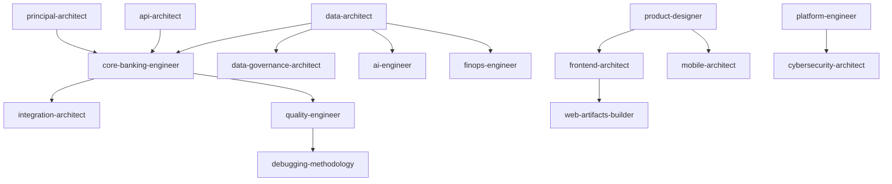

# PayU Agent Skills Guide: Multi-Engineer AI Ecosystem

Selamat datang di ekosistem pengembangan **PayU Digital Banking Platform**. Dokumentasi ini menjelaskan cara kerja, alur penggunaan, dan pembagian peran dari AI Skills dan Specialized Agents.

> **Version**: 3.0.0 (January 2026) - Consolidated to **17 Skills**

---

## 🏛️ Arsitektur AI Ecosystem

Ekosistem AI PayU dibagi menjadi tiga komponen utama:

1. **Skills (The Brains)**: Pengetahuan mendalam dan best practices domain.
2. **Agents (The Workers)**: Unit eksekusi spesialis untuk automasi teknis.
3. **Commands (The Shortcuts)**: Slash commands untuk eksekusi cepat.

### 🧩 Peta Komponen (Source of Truth)

Semua konfigurasi AI dipusatkan di direktori `.agent/` dan diakses oleh Claude Code melalui symbolic links di `.claude/`.

```
payu/
├── .agent/               # Master Configuration (Source of Truth)
│   ├── skills/           # 17 High-level AI Skills (Consolidated)
│   ├── agents/           # 12 Specialized Execution Agents
│   ├── workflows/        # SDLC & Coordination Workflows
│   ├── commands/         # Custom Slash Commands
│   ├── resources/        # Shared assets (shadcn components)
│   └── settings.json     # Global AI Access
└── .claude/              # Entry Point (Symlinks to .agent/)
    ├── skills -> ../.agent/skills
    ├── agents -> ../.agent/agents
    ├── workflows -> ../.agent/workflows
    ├── commands -> ../.agent/commands
    └── settings.json -> ../.agent/settings.json
```

### 🧠 Semantic Skill Registry (v3.0.0)

PayU uses a **Self-Aware Skill System** defined in `.agent/skills/REGISTRY.yaml`.
Each skill now declares its dependencies and maturity level:

```yaml
# .agent/skills/REGISTRY.yaml
version: 2.0.0
consolidation_notes: |
  Reduced from 21 to 17 skills.
  - information-architect merged into principal-architect
  - release-engineer merged into platform-engineer
  - sre merged into platform-engineer
  - bff-architect removed (PayU is pure Java backend)
```

This enables **Dependency Injection**: When you call a skill, the system automatically loads architectural context from required dependencies.

### 🕸️ Skill Dependency Graph



---

## 🧩 Ecosystem Mapping (17 Skills)

The PayU platform is powered by specialized skill clusters:

### 🏗️ Core & Architecture
| Spec | Skill | Description |
| :--- | :--- | :--- |
| **Strategy** | `principal-architect` | **Master Skill**: High-level Architecture, DORA, Strategy, C4, ADRs, Documentation. *(Merged from information-architect)* |

### ☕ Backend & Logic
| Spec | Skill | Description |
| :--- | :--- | :--- |
| **Core** | `core-banking-engineer` | **Master Skill**: Spring Boot 3.4, Hexagonal Architecture, & Resilience. |
| **API** | `api-architect` | **Master Skill**: REST, OpenAPI, Versioning, & 3rd-party Integrations. |
| **DB** | `data-architect` | **Master Skill**: PostgreSQL Design, Performance, Query Optimization, & Flyway. |
| **Events** | `integration-architect` | **Master Skill**: Sagas, Event Sourcing, Kafka, Message Queues (CDC). |
| **AI** | `ai-engineer` | **Master Skill**: Intelligent Systems, FastAPI, Prompt Engineering, & GenAI. |

### 📱 Frontend & Mobile
| Spec | Skill | Description |
| :--- | :--- | :--- |
| **Web** | `frontend-architect` | **Master Skill**: Next.js 15+, React, Web Performance, Component Refactoring. |
| **Mobile** | `mobile-architect` | **Master Skill**: React Native, Expo, Native UI, SF Symbols, Mobile Security. |
| **Design** | `product-designer` | **Master Skill**: Premium Aesthetics, Atomic Design, & A11y. |
| **Artifacts** | `web-artifacts-builder` | **Master Skill**: Scaffolding single-file HTML/React artifacts for docs/demos. |

### 🛡️ Security & Compliance
| Spec | Skill | Description |
| :--- | :--- | :--- |
| **Security** | `cybersecurity-architect` | **Master Skill**: Zero Trust, Vault, mTLS, Auth Patterns, PCI-DSS/OJK Compliance. |
| **Data** | `data-governance-architect` | **Master Skill**: Data Lineage, PII Classification, Retention, & UU PDP. |

### ⚙️ DevOps, Reliability & Quality
| Spec | Skill | Description |
| :--- | :--- | :--- |
| **Platform** | `platform-engineer` | **UNIFIED**: DevOps + SRE + Release Engineering. Tekton/ArgoCD, OpenShift, Feature Flags, Observability, Chaos, DR. *(v3.0.0)* |
| **Quality** | `quality-engineer` | **UNIFIED**: Testing + Performance + Contracts. TDD, Gatling/k6, Pact, Browser Testing. |
| **Debugging** | `debugging-methodology` | **NEW**: Systematic debugging, Root Cause Analysis, Pattern Recognition. |
| **FinOps** | `finops-engineer` | **UNIFIED**: Financial Ops + Cloud FinOps. Recon, GL, Cost Management, Tagging. |
| **DX** | `dx-engineer` | **UNIFIED**: Git Workflows + Developer Onboarding + Slidev + Release Notes. |

---

## 🤖 Specialized AI Agents (The Workers)

Agen dirancang untuk eksekusi tugas yang terisolasi.

| Agent                     | Deskripsi Peran                    | Target Output                               |
| :------------------------ | :--------------------------------- | :------------------------------------------ |
| **`@scaffolder`**         | Spesialis boilerplate & struktur.  | Hexagonal structure, pom.xml, Dockerfile.   |
| **`@logic-builder`**      | Spesialis DDD & Business Logic.    | Rich Domain Models, Ports, Use Cases.       |
| **`@tester`**             | Gatekeeper kualitas & testing.     | JUnit 5, Mockito, Maestro (Mobile E2E).     |
| **`@auditor`**            | Penjaga kepatuhan & kualitas.      | Security Audit Reports, Complexity scans.   |
| **`@migrator`**           | Administrasi Database & Flyway.    | Optimized SQL migrations, JSONB indexing.  |
| **`@builder`**            | Build & Packaging Specialist.      | Native Images (Quarkus), Web Artifacts.     |
| **`@styler`**             | Spesialis UI/UX Emerald Design.    | Premium CSS, Glassmorphism, Animations.     |
| **`@orchestrator`**       | Automasi Git & CI/CD Pipelines.    | Conventional Commits, Tekton/ArgoCD config. |
| **`@lifecycle-manager`**  | Pengelola siklus SDLC Antigravity. | Step-by-step feature implementation plan.   |
| **`@scaffolding-expert`** | Setup service E2E terintegrasi.    | Fully functional microservice scaffold.     |
| **`@compliance-auditor`** | Audit standar OJK/PCI-DSS.         | Compliance Checklists, Risk Matrix (ALE).   |

---

## 🔄 Alur Kerja SDLC Terintegrasi

Gunakan alur berikut untuk mengorkestrasi ekosistem AI secara efektif:

### Fase 1: Discovery & Planning

1. Gunakan skill **`@principal-architect`** untuk memahami konteks arsitektur global.
2. Gunakan `@lifecycle-manager` untuk merancang dokumen rencana implementasi.

### Fase 2: Scaffolding & Setup

1. Jalankan `@scaffolder` atau `/project:scaffold` untuk membuat service.
2. Gunakan `@migrator` untuk membuat skema database awal.

### Fase 3: Core Implementation

1. Gunakan `@logic-builder` untuk menulis logika domain fungsional.
2. Gunakan `@tester` secara paralel untuk menulis unit tests (TDD).

### Fase 4: Optimization & Verification

1. Gunakan `@styler` untuk memoles tampilan frontend.
2. Gunakan `@auditor` untuk security dan performance check.
3. Gunakan `@tester` untuk memvalidasi coverage dan integrasi.
4. Gunakan `@debugging-methodology` jika ada issue yang perlu root cause analysis.

### Fase 5: Delivery

1. Gunakan `@builder` untuk memastikan build dan container sukses.
2. Gunakan `@orchestrator` untuk merapikan branch dan push ke remote.

## ⚡ Hyper-Parallelism (Native Claude Code Capability)

Platform PayU memanfaatkan kapabilitas native dari **Claude Code** untuk menjalankan hingga **12 Agen Paralel** secara bersamaan. Kapabilitas ini memungkinkan:
- **Massive Refactoring**: Merombak multiple microservices sekaligus menggunakan subagents spesialis.
- **Full-Scale Audit**: Menjalankan security audit, test suite, dan performance validation secara serentak melalui delegasi pararel.
- **Cross-Platform Sync**: Sinkronisasi perubahan di Backend, Web, dan Mobile dalam satu siklus dispatch.

> **Cara Menggunakan**: Gunakan workflow `/multi-agent-coordination` dalam mode **Swarm** untuk mendistribusikan beban tugas berat ke agen-agen Anda menggunakan fitur subagent orkestrasi dari Claude Code.

---

## 📊 Enterprise Readiness

| Metric | Value |
|--------|-------|
| **Skills** | 17 (consolidated from 21) |
| **Reference Files** | 147+ |
| **Total Knowledge Base** | ~2.1MB |
| **Enterprise Score** | 9.5/10 ✅ |

---

## 📜 Golden Rules

1. **Source of Truth**: Selalu edit konfigurasi di folder `.agent/`.
2. **Agent Focus**: Gunakan agen spesifik untuk tugas yang sesuai (lihat [AGENTS-MAP.md](../../.agent/agents/AGENTS-MAP.md)).
3. **Audit Before Release**: Jangan pernah merge kode tanpa laporan sukses dari `@auditor` dan `@tester`.
4. **Use Debugging Skill**: Sebelum fix bug, jalankan `@debugging-methodology` untuk root cause analysis.

---

_Last Updated: January 2026 (v3.0.0)_
