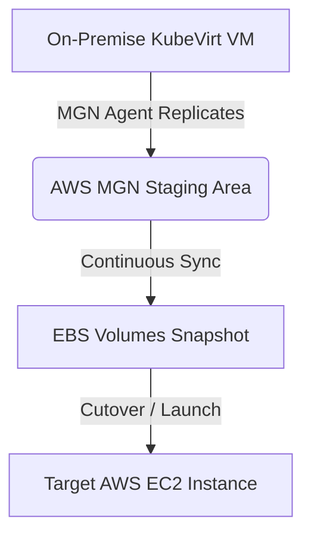
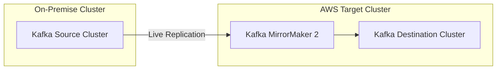

# Method of Procedure (MOP) — PayU On-Premise to AWS Cloud Migration

This document serves as the official operational guide (MOP) for migrating the PayU platform middleware and streaming infrastructure from **payu-onprem** (OpenShift v4.18.43 in us-east-1a) to **payu-prod** (OpenShift v4.20.24 & AWS EC2 in us-east-1b).

---

## 1. Migration Scope & Architecture Map

The migration covers 6 primary middleware and streaming workloads categorized by infrastructure type:

| Workload | Source Type | Target Type | Migration Strategy |
| :--- | :--- | :--- | :--- |
| **Red Hat 3scale** | OpenShift Operator | OpenShift Operator | Fresh Deploy (Operator) + DB Backup/Restore |
| **RH Streams (Kafka)** | OpenShift Operator | OpenShift Operator | Fresh Deploy (Operator) + MirrorMaker 2 Sync |
| **RH AMQ Broker** | KubeVirt VM | AWS EC2 | AWS MGN (Lift-and-Shift) OR Fresh Install + Sync |
| **RH Process Automation** | KubeVirt VM | AWS EC2 | Git Repository Sync + DB Backup/Restore |
| **RH Data Grid** | KubeVirt VM | AWS EC2 | Fresh Deploy (EC2) + Infinispan CLI Sync |
| **Red Hat SSO (Keycloak)**| KubeVirt VM | AWS EC2 | Fresh Deploy (EC2) + Postgres DB Replication |

---

## 2. Pre-Requisites & IAM Preparation

Before executing any migration steps, the following environment setups must be validated:

### 2.1 Networking & Firewall Rules
Ensure the guest VMs on `payu-onprem` and worker nodes have outbound internet access via NAT Gateways:
* **AWS MGN Endpoint**: Outbound TCP `443` to `mgn.us-east-1.amazonaws.com`.
* **S3 Backup Bucket**: Outbound TCP `443` to `s3.us-east-1.amazonaws.com`.
* **Inter-Cluster Traffic**: Outbound/Ingress open for Kafka MirrorMaker 2 replication between source and target networks on Kafka port `9092` / `443` (via routes).

### 2.2 AWS IAM Setup (AWS VM Import/Export & MGN)
To enable block-level replication, ensure the following role exists in your AWS Account:
* **`vmimport` Role**: Required by AWS VM Import/Export to register S3 disk images as AMIs.
  * Trust Policy: `vmimport.amazonaws.com`.
  * Managed Policy: `AmazonEC2FullAccess`, `AmazonS3FullAccess`.
* **AWS MGN IAM Credentials**: An IAM user/role with `AWSApplicationMigrationAgentPolicy` attached, used to authenticate the local replication agent.

---

## 3. Skenario A — Lift-and-Shift VM Migration (AWS MGN)
*Applicable to VM workloads: **RH AMQ Broker**, **RHPAM**, **RH Data Grid**, and **RH SSO**.*



### 3.1 Source Server Preparation
Login to the source Linux VM (e.g., Keycloak or Data Grid VM on KubeVirt) and verify disk space and kernel components:
```bash
# Verify disk space (MGN agent requires at least 2GB free on /tmp)
df -h /tmp

# Verify Python 3 is installed
python3 --version
```

### 3.2 Install AWS MGN Replication Agent
Run the installer script inside the guest VM:
1. Download the agent installer:
   ```bash
   wget -O aws-replication-agent-installer.py https://aws-application-migration-service-us-east-1.s3.amazonaws.com/latest/linux/aws-replication-agent-installer.py
   ```
2. Execute the installer using your AWS credentials:
   ```bash
   sudo python3 aws-replication-agent-installer.py \
     --region us-east-1 \
     --aws-access-key-id <ACCESS_KEY_ID> \
     --aws-secret-access-key <SECRET_ACCESS_KEY>
   ```
3. The agent will discover local disks (e.g. `/dev/xvda` or `/dev/vda`) and start replicating data blocks to the AWS staging area.

### 3.3 Replication Monitoring & Cutover
1. Monitor replication progress in the AWS MGN Console. Wait until the replication status reaches **Healthy** and the lifecycle shows **Ready for Testing**.
2. **Launch Test Instance**:
   * Initiate a "Launch Test Instance" from the console.
   * Verify the instance boots, AWS ENA/NVMe drivers load, and SSH connectivity is established.
3. **Cutover Window**:
   * Stop application services on the on-premise source VM (to avoid write drifts).
   * Wait for replication data to catch up (status: *Data replication is up to date*).
   * Initiate "Launch Cutover Instances".
   * Stop the source VM in OpenShift Virtualization.

---

## 4. Skenario B — Logical Backup-Restore

### 4.1 Red Hat SSO (RH-SSO v7.6.8 GA Migration MOP)
*This section provides the step-by-step procedure for logical redeployment of Red Hat SSO 7.6.8 GA from 2 virtual machines in the KubeVirt environment to 2 new RHEL 8 EC2 instances forming a clustered setup.*

#### System Configuration Overview:
* **RH-SSO Version**: `7.6.8 GA` (running in Standalone-HA mode).
* **Source/Target Deployment**: VM-based (2 active-active instances forming a cluster).
* **Automation Level**: Manual deployment (no automation tools).
* **Access Mode**: Routed via Domain Name (DNS/ALB).
* **Traffic Pattern Warning**: Traffic spikes heavily in the morning. Cutover window MUST be scheduled between **23:00 - 03:00 WIB** (local time) to avoid disruption.
* **Custom SPI Plugins**: 3 custom plugins must be migrated:
  1. **Profile Enrichment SPI**: `prospek-role-enrichment-spi.jar`
  2. **Third Party & Warung App SPI**: `warung-3rdparty-auth-spi.jar`
  3. **Eventing SPI (Kafka Integration)**: `sso-kafka-event-listener.jar`

#### 4.1.1 Phase 1 — Pre-migration Preparation on AWS EC2
1. **Provision EC2 instances**:
   * Deploy two RHEL 8 EC2 instances (e.g., `m5.large`) in private subnets across different Availability Zones (us-east-1a, us-east-1b).
2. **Install Prerequisite Java Platform**:
   * SSH to each target EC2 instance and install OpenJDK 11:
     ```bash
     sudo dnf install java-11-openjdk-devel -y
     ```
3. **Manual Extraction & Installation of RH-SSO 7.6.8 GA**:
   * Download or transfer the RH-SSO 7.6.8 GA installation zip:
     ```bash
     sudo unzip rh-sso-7.6.8.GA.zip -d /opt/
     sudo ln -s /opt/rh-sso-7.6.8 /opt/rh-sso
     sudo chown -R cloud-user:cloud-user /opt/rh-sso
     ```

#### 4.1.2 Phase 2 — Custom Plugins & Configurations Transfer
1. **Locate SPI JARs in Source KubeVirt VMs**:
   * Navigate to the deployments folder inside the source VMs: `/opt/rh-sso/standalone/deployments/`
2. **Transfer SPI files to Bastion/S3**:
   * Copy the three custom JAR files from the source VM nodes to AWS S3:
     ```bash
     aws s3 cp /opt/rh-sso/standalone/deployments/prospek-role-enrichment-spi.jar s3://payu-migration-backup-787842753050/sso-plugins/
     aws s3 cp /opt/rh-sso/standalone/deployments/warung-3rdparty-auth-spi.jar s3://payu-migration-backup-787842753050/sso-plugins/
     aws s3 cp /opt/rh-sso/standalone/deployments/sso-kafka-event-listener.jar s3://payu-migration-backup-787842753050/sso-plugins/
     ```
3. **Deploy SPI JARs on target EC2 instances**:
   * Download the JARs on both EC2 nodes to their deployment directories:
     ```bash
     sudo aws s3 cp s3://payu-migration-backup-787842753050/sso-plugins/ /opt/rh-sso/standalone/deployments/ --recursive
     sudo chown cloud-user:cloud-user /opt/rh-sso/standalone/deployments/*.jar
     ```
4. **Migrate configuration XML files**:
   * Copy the configuration files (like `standalone-ha.xml` or custom configuration profiles) from the source KubeVirt VMs to the target EC2 nodes.

#### 4.1.3 Phase 3 — JGroups & Networking Configuration (Multicast to TCP/JDBC Ping)
> [!IMPORTANT]
> **AWS Networking Constraints**: AWS VPCs do not support UDP Multicast. The existing JGroups configuration on-premise (which uses `PING` or `MPING` via multicast) will not work. We must change the JGroups protocol in `standalone-ha.xml` to use `JDBC_PING` (using the shared Keycloak database) or `aws.AWS_PING`.

1. Open `/opt/rh-sso/standalone/configuration/standalone-ha.xml` on both target nodes.
2. Replace the default JGroups subsystem protocol with `JDBC_PING` configuration using the shared Keycloak database:
   ```xml
   <subsystem xmlns="urn:jboss:domain:jgroups:4.0">
       <channels default="ee">
           <channel name="ee" stack="tcp"/>
       </channels>
       <stacks>
           <stack name="tcp">
               <transport type="TCP" socket-binding="jgroups-tcp"/>
               <protocol type="JDBC_PING">
                   <property name="datasource_jndi_name">java:jboss/datasources/KeycloakDS</property>
                   <property name="initialize_sql">CREATE TABLE IF NOT EXISTS JGROUPSPING (own_addr VARCHAR(200) NOT NULL, cluster_name VARCHAR(200) NOT NULL, ping_data BYTEA, CONSTRAINT PK_JGROUPSPING PRIMARY KEY (own_addr, cluster_name))</property>
               </protocol>
               <protocol type="MERGE3"/>
               <protocol type="FD_SOCK" socket-binding="jgroups-tcp-fd"/>
               <protocol type="FD_ALL"/>
               <protocol type="VERIFY_SUSPECT"/>
               <protocol type="pbcast.NAKACK2"/>
               <protocol type="UNICAST3"/>
               <protocol type="pbcast.STABLE"/>
               <protocol type="pbcast.GMS"/>
               <protocol type="MFC"/>
               <protocol type="FRAG2"/>
           </stack>
       </stacks>
   </subsystem>
   ```

#### 4.1.4 Phase 4 — PostgreSQL Database Replication
1. **Stop Traffic to Source RH-SSO instances**:
   * Temporarily change DNS routing or place a maintenance page on the domain to stop new logins.
2. **Perform pg_dump on On-Prem Database**:
   ```bash
   pg_dump -h <onprem-db-host> -U keycloak -d keycloak_db -F c -b -v -f /tmp/keycloak_backup.dump
   ```
3. **Upload dump to S3**:
   ```bash
   aws s3 cp /tmp/keycloak_backup.dump s3://payu-migration-backup-787842753050/database/
   ```
4. **Restore Database on RDS PostgreSQL Target**:
   * Download dump on target environment and restore it:
     ```bash
     pg_restore -h <target-rds-endpoint> -U keycloak -d keycloak_db -v /tmp/keycloak_backup.dump
     ```

#### 4.1.5 Phase 5 — Starting services and load balancer routing
1. **Start SSO server standalone-ha on both instances**:
   * Start RH-SSO specifying the node IP and custom configuration parameters:
     ```bash
     /opt/rh-sso/bin/standalone.sh -c standalone-ha.xml -b <EC2_PRIVATE_IP> -bprivate <EC2_PRIVATE_IP>
     ```
2. **AWS Application Load Balancer configuration**:
   * Register the two EC2 instances into a Target Group (port `8080` or `8443` HTTPS).
   * Configure stickiness (sticky sessions) using cookies (required by Keycloak cluster).
   * Configure health check path: `/auth/realms/master/.well-known/openid-configuration` (or similar status check).
3. **Update Domain DNS Route**:
   * Point the DNS record of the official domain name in Route 53 or your DNS provider to the AWS ALB.

#### 4.1.6 Phase 6 — Post-Migration Verification
1. **Check cluster formation**:
   * Verify `/opt/rh-sso/standalone/log/server.log` to confirm JGroups successfully formed a cluster of 2 nodes:
     ```text
     [org.infinispan.CLUSTER] (jgroups-1,node1-host) ISPN000093: Received new cluster view: [node1-host|1] (2) [node1-host, node2-host]
     ```
2. **Verify custom SPIs loading**:
   * Ensure that the server logs indicate successful loading of the custom SPIs (Prospek role, Warung App, and Kafka Eventing).
3. **Load Balancer Test**:
   * Perform multiple authentication requests using the domain name, verifying traffic distributes across both instances and login states persist.

### 4.2 Red Hat 3scale (Operator API Manager)

The detailed Method of Procedure (MOP) step-by-step checklist for migrating Red Hat 3scale API Management (v2.15) can be found in the service-specific MOP file:
* **[MOP_3SCALE.md](file:///home/ubuntu/payu/docs/operations/MOP_3SCALE.md)**: Manual pre-requisite, migration, and post-migration checklists in standard spreadsheet format.

### 4.3 RHPAM (Git Repositories & Engine State)
RHPAM stores project git trees in Business Central and transaction states in KIE databases.

1. **Clone Business Central Git Repositories**:
   * For each repository inside Business Central:
     ```bash
     git clone --mirror ssh://admin@rhpam-onprem:8001/system/git/MyProcessProject.git
     ```
2. **Push to Target Business Central (AWS EC2)**:
   ```bash
   git push --mirror ssh://admin@rhpam-aws:8001/system/git/MyProcessProject.git
   ```
3. **Migrate Runtime KIE Execution Database**:
   * Perform database backup-restore (`pg_dump` and `pg_restore`) of the KIE database schema, which preserves running process instance states.

### 4.4 Red Hat Data Grid (Cache Dump / Infinispan CLI)
For Infinispan cache migration without cross-site networking replication:

1. **Perform Backup via Infinispan CLI (Source VM)**:
   ```bash
   bin/cli.sh -c http://localhost:11222 --user admin --password admin backup create -n my-cache-backup
   ```
2. **Download Backup**:
   The backup file `.zip` will be generated under the server backups folder. Copy it locally:
   ```bash
   scp admin@datagrid-onprem:/opt/infinispan/server/data/backups/my-cache-backup.zip .
   ```
3. **Upload to S3 & Restore on EC2 Target**:
   * Move it to S3, download it on the target EC2 Data Grid VM, and execute the restore:
   ```bash
   bin/cli.sh -c http://localhost:11222 --user admin --password admin backup restore /tmp/my-cache-backup.zip
   ```

---

## 5. Skenario C — Event Streaming Mirroring (MirrorMaker 2)
*Applicable to **Red Hat Streams for Apache Kafka**.*

Instead of cold backing up disk sectors, we configure a live replication loop using Kafka MirrorMaker 2 (Strimzi).



### 5.1 Deploy MirrorMaker 2 on target Cluster (`payu-prod`)
Apply the `KafkaMirrorMaker2` custom resource linking the on-premise Kafka cluster (acting as source) to the new cloud cluster (acting as target):

```yaml
apiVersion: kafka.strimzi.io/v1beta2
kind: KafkaMirrorMaker2
metadata:
  name: payu-kafka-mirror
  namespace: openshift-storage
spec:
  version: 3.7.0
  replicas: 1
  connectCluster: "payu-prod-target"
  clusters:
  - alias: "payu-onprem-source"
    bootstrapServers: "kafka-onprem-route-openshift-storage.apps.payu-onprem.payu.ocp.fajjjar.my.id:443"
    tls:
      trustedCertificates:
      - secretName: onprem-kafka-cert
        certificate: ca.crt
  - alias: "payu-prod-target"
    bootstrapServers: "payu-prod-kafka-bootstrap.openshift-storage.svc:9092"
  mirrors:
  - sourceCluster: "payu-onprem-source"
    targetCluster: "payu-prod-target"
    sourceConnector:
      config:
        topics.pattern: "payu.*"
        sync.topic.acls: "true"
    checkpointConnector:
      config:
        checkpoints.internal.topic.replication.factor: 1
```

### 5.2 Consumer Offset Migration & Switch
1. MirrorMaker 2 will actively duplicate messages sent to topics matching `payu.*` and replicate consumer group offsets.
2. Monitor replicated topics status:
   ```bash
   oc exec -it deploy/payu-prod-kafka -- bin/kafka-topics.sh --bootstrap-server localhost:9092 --list
   ```
3. **Cutover Window**:
   * Stop source producers.
   * Allow MM2 to replicate all remaining messages and offsets (verify lag = 0).
   * Reconfigure consumer groups to point to the new cluster.
   * Reconfigure producers to target the new cluster.

---

## 6. Post-Migration Verification

Verify all services run healthily in their target AWS instances:
* **RH SSO**: Check login console, access keys, and token decoding validation.
* **Data Grid**: Check that caches are populated and response latency is $< 5\text{ms}$.
* **ActiveMQ**: Check queue statistics, verify message counts are at expected levels, and confirm producers can push new messages.
* **3scale**: Run APICast checks and gateway checks to verify API routes return expected headers.

---

## 7. Rollback Plan

If critical verification failures occur during the migration window, follow these backout steps:

1. **Stop Cloud Instances**: Turn off EC2 VMs and scale down target deployments on `payu-prod`.
2. **Restore On-Premise Services**: Start the original VMs on OpenShift Virtualization.
3. **Re-route Network Traffic**: Revert DNS/NLB routes to point to the `payu-onprem` entry endpoints.
4. **Log Data Drift**: Extract any transactions written to the target cluster during the test/run window to be manually re-applied in the source cluster.
