# PayU Feature Flows

> Diagram flow per fitur berdasarkan **code aktual** (2026-08-11, release 1.10.51).
> Tujuan: referensi audit implementasi — bandingkan diagram vs code untuk deteksi gap/bug flow.
> Format: mermaid `sequenceDiagram` + tabel side-effect (DB/event). Detail endpoint: [`FEATURES.md`](./FEATURES.md).
> Section **Flow Improvements** di bawah berisi diagram **TARGET (belum diimplementasi)** — behavior bank-like yang akan diterapkan; jangan dianggap code aktual.

## 1. Register (Onboarding + eKYC)

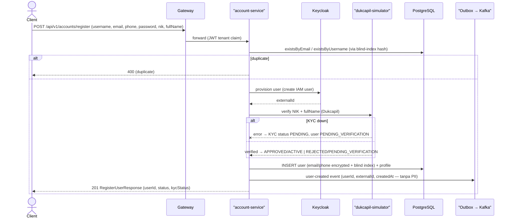

| Step | Side-effect |
|:---|:---|
| 1 | Query `users` by hash (V105 unique `(tenant_id, email_hash)` / phone) |
| 2 | Keycloak IAM user dibuat (externalId = IAM id) |
| 3 | Dukcapil verify (fail-soft: PENDING) |
| 4 | INSERT `users` + `profiles` (tenant dari JWT claim) |
| 5 | Outbox `payu.account.user-created.v1` — non-PII |

## 2. Login (Web, password grant saat ini)

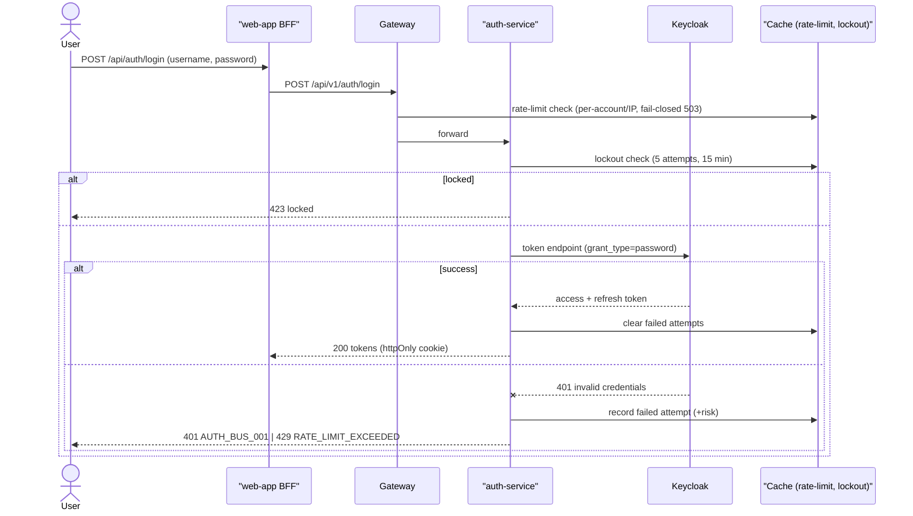

| Step | Side-effect |
|:---|:---|
| 1 | Rate-limit count increment (Hot Rod, fail-closed) |
| 2 | Lockout state read (cache) |
| 3 | Keycloak Direct Access Grant (`grant_type=password`) |
| 4 | Failed attempt + risk recorded; sukses → clear |
| 5 | Session cookie httpOnly di BFF |

## 3. Transfer Internal

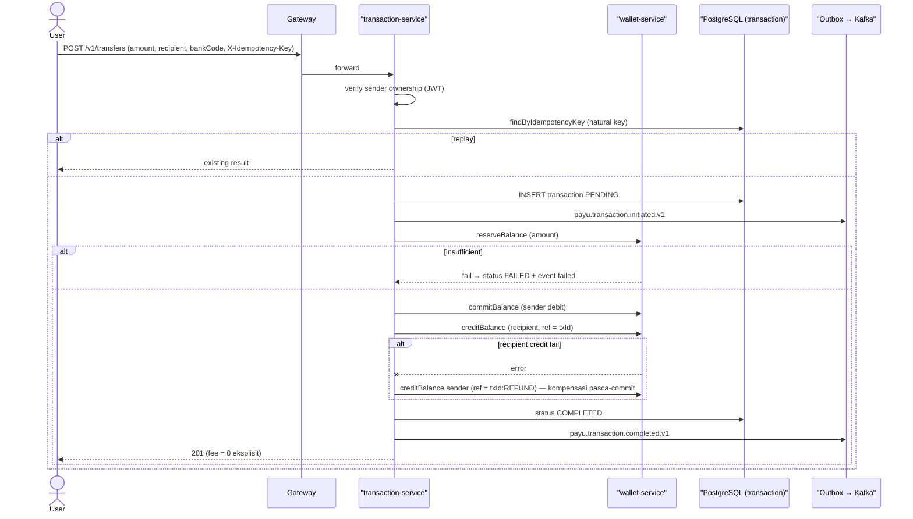

| Step | Side-effect |
|:---|:---|
| 1 | Idempotency lookup `transactions.idempotency_key` |
| 2 | INSERT transaction PENDING + outbox initiated (satu tx) |
| 3 | Wallet reserve (idempotent by reference, pessimistic lock) |
| 4 | Wallet commit (DEBIT sender) + credit (CREDIT recipient, ref txId) |
| 5 | Kompensasi pasca-commit: credit sender ref `txId:REFUND` |
| 6 | Completed event + ledger entries balance_after scale 4 |

## 4. SNAP-BI Payment (Partner / TokoBapak)

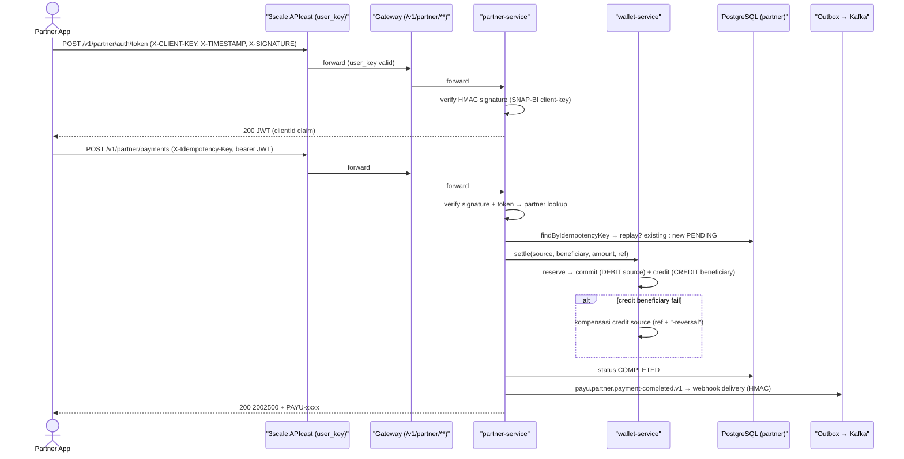

| Step | Side-effect |
|:---|:---|
| 1 | Token: HMAC verify → JWT (clientId) |
| 2 | Payment: idempotency natural key (`uq`), PENDING |
| 3 | Wallet settle 3-hop (reserve/commit/credit) — idempotent per ref (`snap-reserve-<ref>` dst) |
| 4 | Ledger: RESERVATION DEBIT + CREDIT beneficiary, exact |
| 5 | Outbox event → webhook delivery signed + reconciliation check (0 unmatched) |

## 5. SNAP-BI Refund

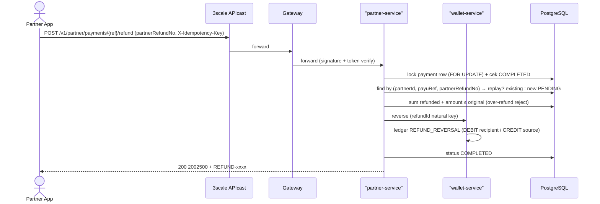

| Step | Side-effect |
|:---|:---|
| 1 | Pessimistic lock payment row (serialisasi cumulative refund) |
| 2 | Natural key idempotency `uq_snap_refund_partner_ref` |
| 3 | Over-refund check (sum active refunds) |
| 4 | Wallet reverse idempotent by refundId → ledger reversal |
| 5 | Completed + reconciliation case close |

## 6. Bill Payment

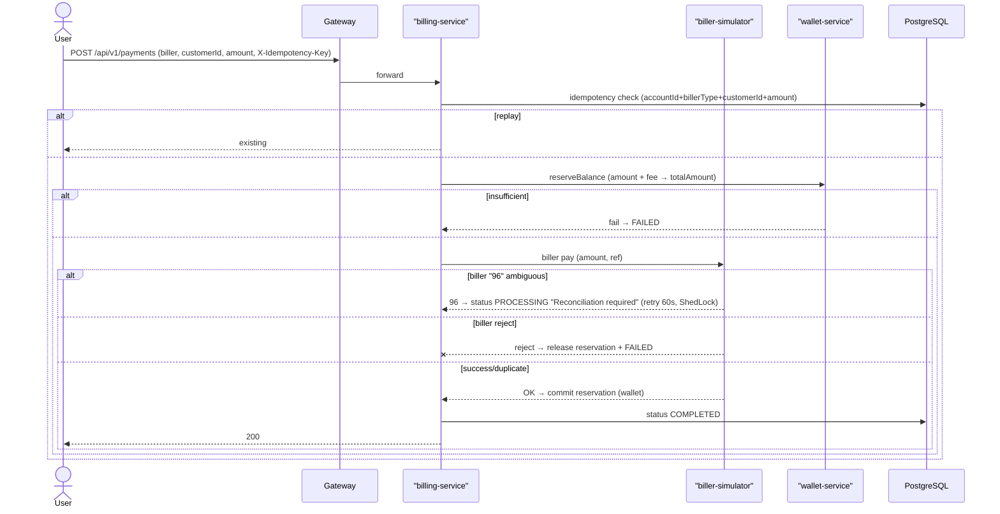

| Step | Side-effect |
|:---|:---|
| 1 | Idempotency validate (accountId + billerType + customerId + amount) |
| 2 | Wallet reserve `totalAmount` = amount + fee (fee dipungut) |
| 3 | Biller call; ambiguous 96 → PROCESSING + reconcile scheduler (60s, ShedLock) |
| 4 | Commit → COMPLETED; reject → release + FAILED |
| 5 | Checkpoint state machine: resume-safe per step |

---

## 7. Transfer Interbank (BI-FAST / SKN / RTGS)

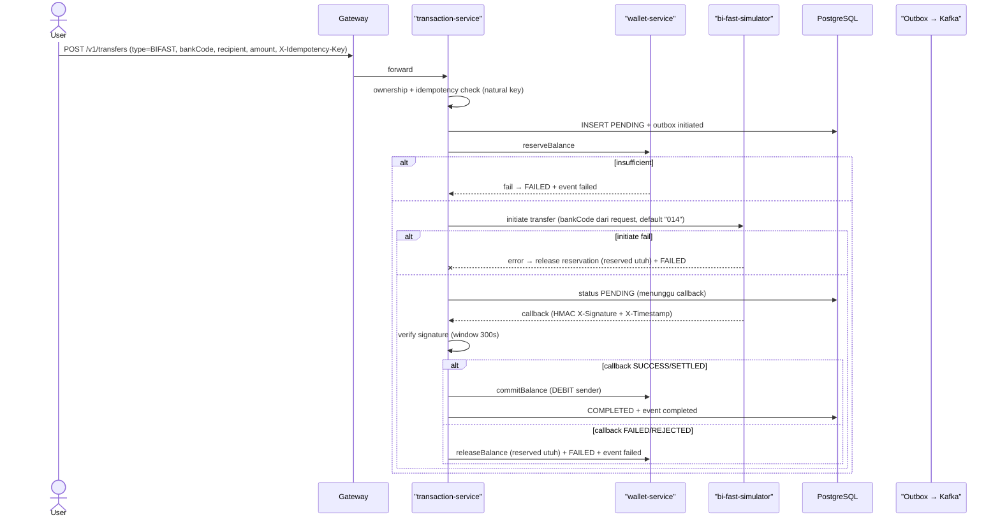

| Step | Side-effect |
|:---|:---|
| 1 | Idempotency natural key + PENDING insert + outbox initiated (satu tx) |
| 2 | Wallet reserve (pessimistic lock, idempotent by reference) |
| 3 | BI-FAST initiate; gagal → release (reservation belum commit — valid) |
| 4 | Callback HMAC verified; SUCCESS → commit; FAILED → release |
| 5 | Completed/failed event via outbox |

## 8. QRIS Payment

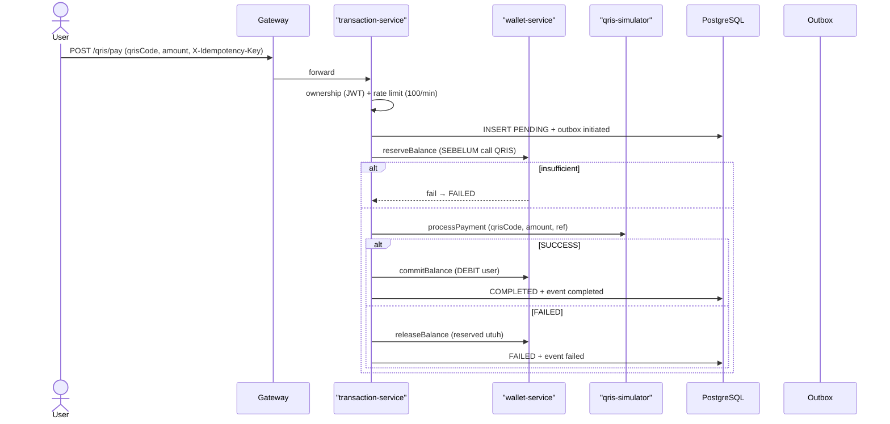

| Step | Side-effect |
|:---|:---|
| 1 | Reserve sebelum call QRIS (pola terbaik) |
| 2 | SUCCESS → commit; FAILED/exception → release (reservation utuh) |
| 3 | Idempotency via gateway annotation (cache-based) |
| 4 | Completed/failed event via outbox |

## 9. Virtual Account Payment

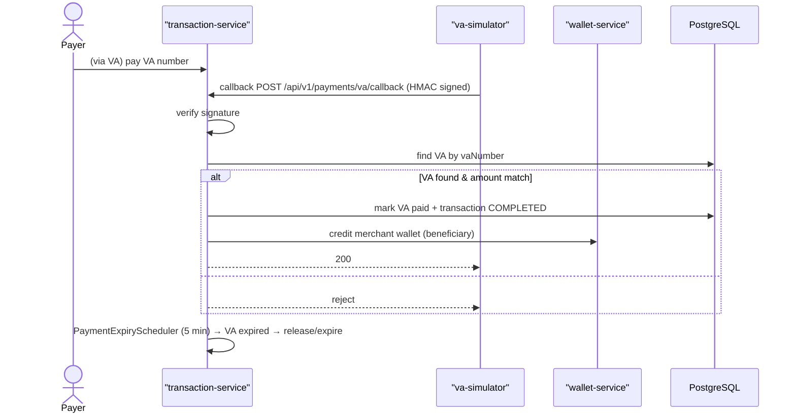

| Step | Side-effect |
|:---|:---|
| 1 | Callback HMAC verified (CallbackSignatureFilter) |
| 2 | VA status paid + transaction completed |
| 3 | Merchant credit (wallet) |
| 4 | Scheduler expire pending VA (ShedLock, 5 min) |

## 10. Disbursement

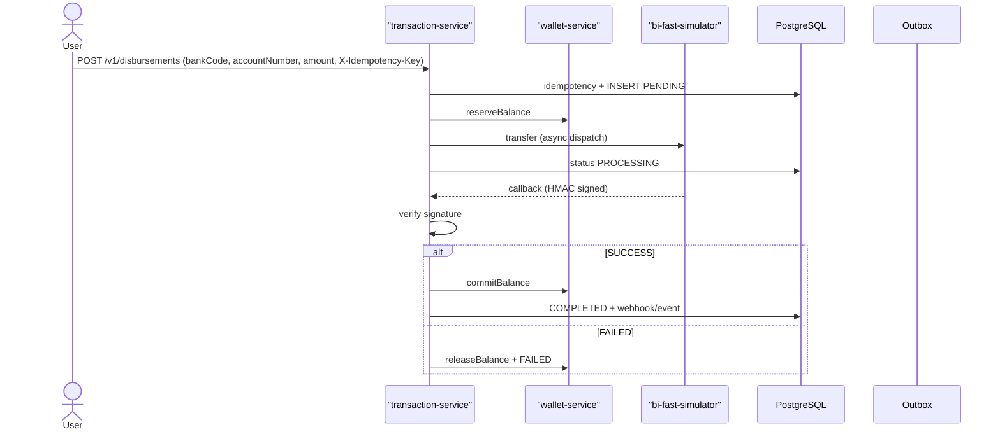

| Step | Side-effect |
|:---|:---|
| 1 | Idempotency by key (`/by-idempotency-key/{key}`) |
| 2 | Reserve → dispatch async → PROCESSING |
| 3 | Callback HMAC → commit/release |
| 4 | Batch variant: `disbursement-batch` Kafka consumer → per-item process/progress |

## 11. Split Bill

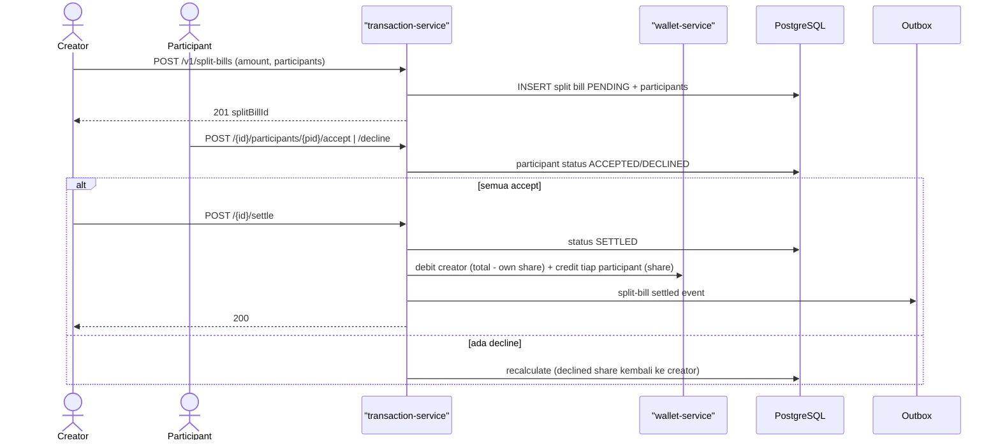

| Step | Side-effect |
|:---|:---|
| 1 | Split bill + participant rows PENDING |
| 2 | Accept/decline per participant (state machine) |
| 3 | Settle → wallet debit/credit per share |
| 4 | Event via outbox (topic split-bills) |

## 12. Top-up (Billing)

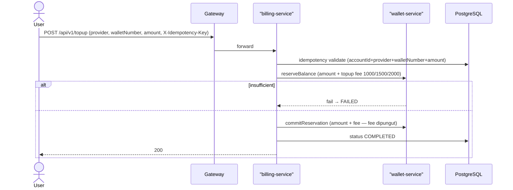

| Step | Side-effect |
|:---|:---|
| 1 | Idempotency validate (sama pola bill payment) |
| 2 | Reserve `totalAmount` = amount + fee (fee tiered by amount) |
| 3 | Commit → COMPLETED; reject → release + FAILED |

---

## 13. Investment — Beli (Deposito / Reksadana / Emas)

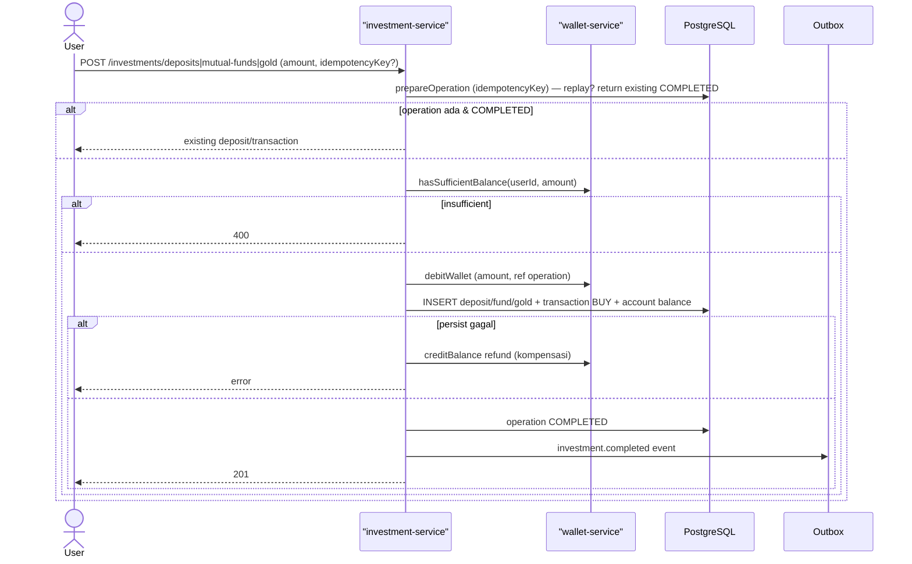

| Step | Side-effect |
|:---|:---|
| 1 | DB idempotency operation (prepare → DEBIT_REQUESTED → COMPLETED) |
| 2 | Wallet debit (ref = operation) — idempotent |
| 3 | Persist + account balance update; gagal → refund credit |
| 4 | Completed event via outbox |

## 14. Investment — Jual (Redeem)

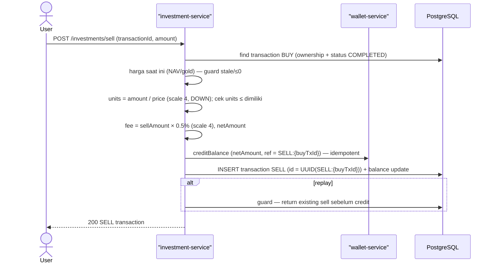

| Step | Side-effect |
|:---|:---|
| 1 | Ownership + status guard; harga fresh guard |
| 2 | Wallet credit reference deterministik `SELL:{buyTransactionId}` — replay-safe |
| 3 | Sell id derived `UUID.nameUUIDFromBytes("SELL:"+id)` — double-sell diblok |
| 4 | Fee/net rounded scale 4 HALF_EVEN |

## 15. Lending — Repayment

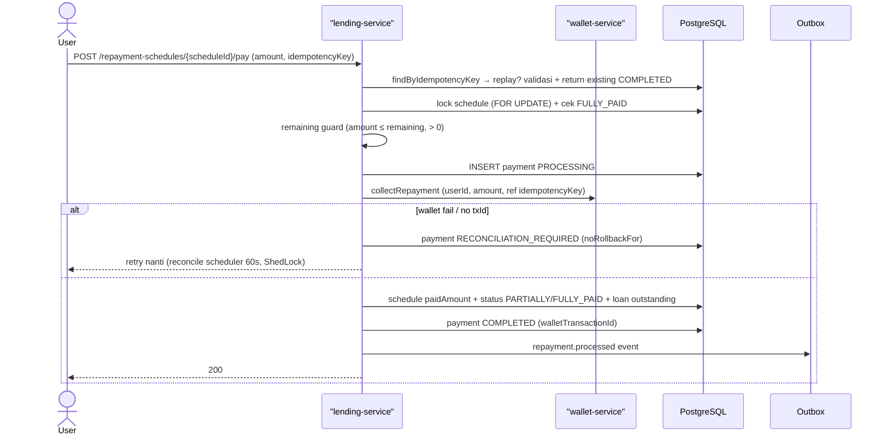

| Step | Side-effect |
|:---|:---|
| 1 | Idempotency DB + pessimistic lock schedule |
| 2 | Ambiguous wallet result → RECONCILIATION_REQUIRED (bukan commit parsial) |
| 3 | Scheduler reconcile 60s ShedLock — resume |
| 4 | Completed + event outbox |

## 16. Escrow (Marketplace)

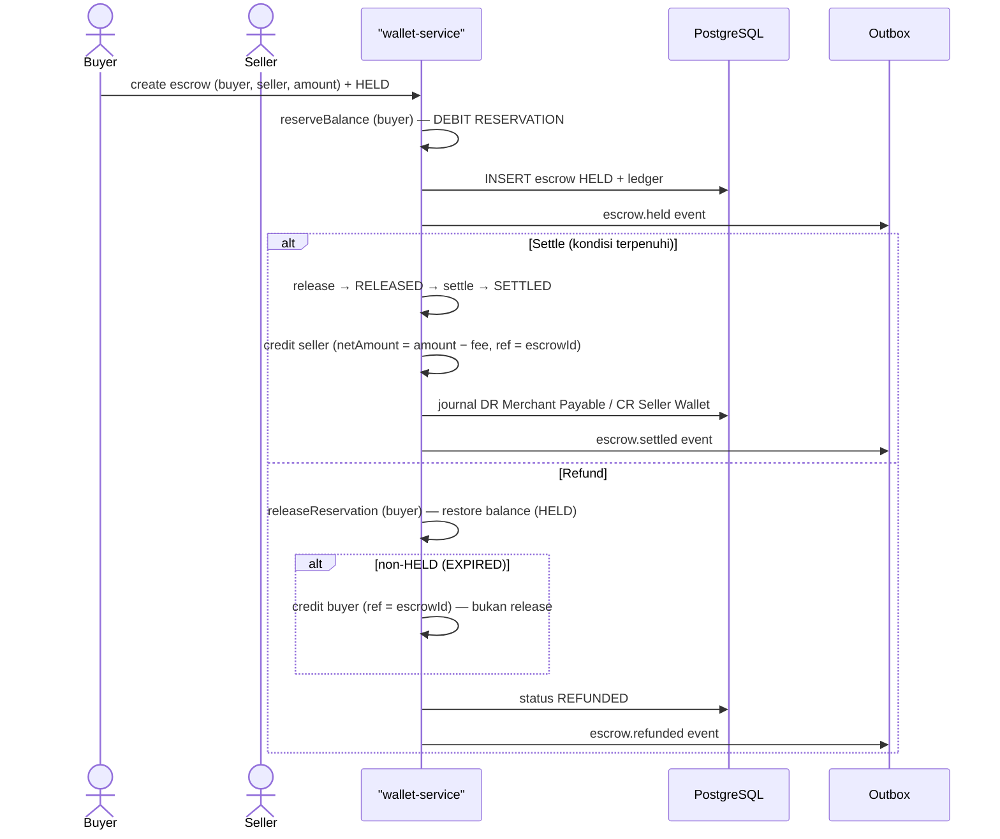

| Step | Side-effect |
|:---|:---|
| 1 | State machine ketat: HELD→RELEASED→SETTLED; HELD/EXPIRED→REFUNDED |
| 2 | Credit idempotent by `escrowId` (anti double-credit) |
| 3 | Refund HELD = release saja; non-HELD = credit |
| 4 | Journal + event per transisi |

## 17. Cashback (Event-driven)

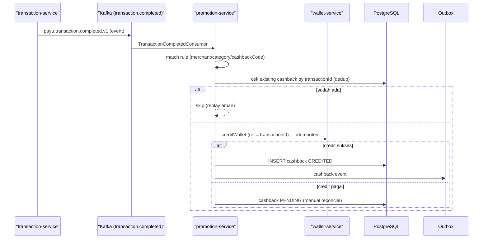

| Step | Side-effect |
|:---|:---|
| 1 | Konsumen event → rule match |
| 2 | Wallet credit idempotent by transactionId |
| 3 | Record CREDITED hanya setelah credit sukses; gagal → PENDING |
| 4 | Saga compensation path (CashbackSagaOrchestrator) |

## 18. Referral — Complete & Reward

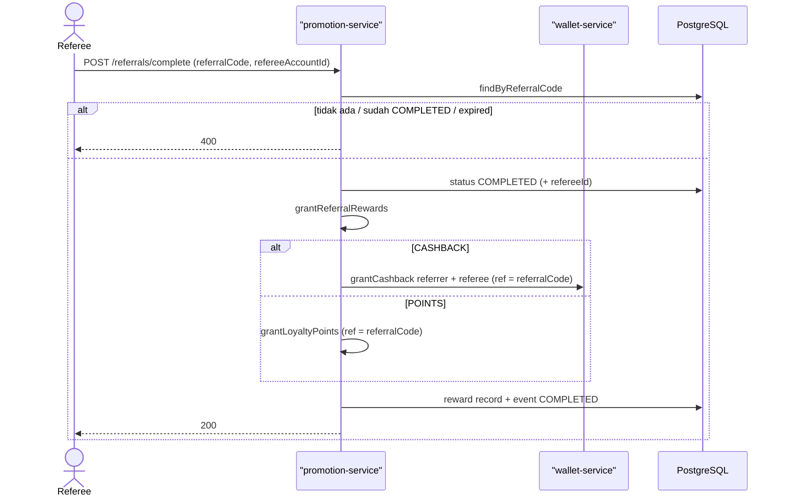

| Step | Side-effect |
|:---|:---|
| 1 | Referral lookup + status/expiry guard |
| 2 | Reward grant idempotent by referralCode |
| 3 | Completed event |

## 19. Payment Link (Partner)

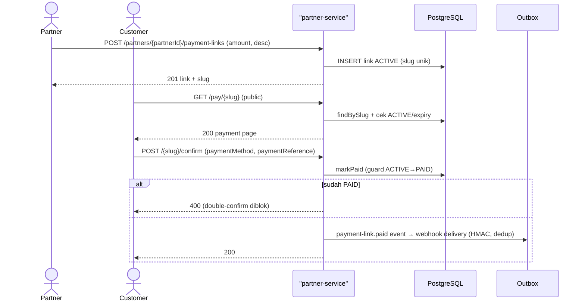

| Step | Side-effect |
|:---|:---|
| 1 | Slug unik + status ACTIVE |
| 2 | Public lookup (expiry check) |
| 3 | `markPaid` guard ACTIVE→PAID — double-confirm IllegalStateException |
| 4 | Webhook dedup `uq_webhook_delivery_event` |

## 20. Scheduled Transfer

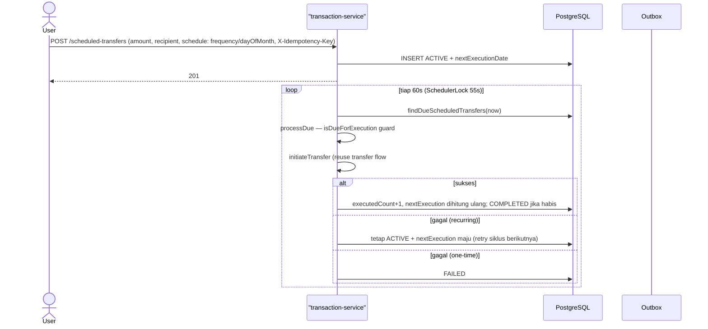

| Step | Side-effect |
|:---|:---|
| 1 | Insert ACTIVE + jadwal |
| 2 | Scheduler ShedLock (anti double-run multi-replica) |
| 3 | Recurring gagal → retry next cycle; one-time gagal → FAILED |
| 4 | Pause/resume/cancel ubah status — due check skip |

## 21. Statement Generate

```mermaid
sequenceDiagram
    actor U as User
    participant ST as "statement-service"
    participant WL as "wallet-service"
    participant TX as "transaction-service"
    participant S3 as "RustFS (S3)"
    participant DB as PostgreSQL
    participant OB as Outbox

    U->>ST: POST /statements/generate (period)
    ST->>ST: customerId = JWT subject (anti-IDOR)
    ST->>DB: INSERT statement GENERATING
    ST->>WL: get current balance
    ST->>TX: get transactions periode (post-period dibalik → closing balance)
    ST->>ST: generatePdf (PDF)
    ST->>S3: store PDF (bucket payu-statements)
    ST->>DB: markCompleted (filePath, balances, totals)
    ST->>OB: statement.generated event
    ST-->>U: 202 (async)
    alt gagal
        ST->>DB: markFailed
    end
```

| Step | Side-effect |
|:---|:---|
| 1 | JWT-scoped (customerId bukan dari request) |
| 2 | Async generate → PDF → S3 → completed |
| 3 | Closing balance derived (balik transaksi pasca-periode) |
| 4 | Gagal → markFailed |

## 22. Settlement Batch (Daily)

```mermaid
sequenceDiagram
    actor OP as Ops
    participant WL as "wallet-service"
    participant DB as PostgreSQL
    participant OB as Outbox

    OP->>WL: create settlement batch (partnerId, date, currency)
    WL->>DB: INSERT batch (status)
    OP->>WL: POST /batches/{id}/process
    WL->>DB: collect transaksi settlement window
    WL->>WL: per item: credit merchant (ref = item ref) + journal
    WL->>DB: batch COMPLETED / discrepancies detect
    alt mismatch
        WL->>DB: discrepancy rows + report
    else sukses
        WL->>DB: batch COMPLETED + report
        WL->>OB: settlement.completed event
    end
    OP->>WL: POST /batches/{id}/override (hanya mismatch terverifikasi)
```

| Step | Side-effect |
|:---|:---|
| 1 | Batch state machine (PROCESSING→COMPLETED/FAILED) |
| 2 | Credit merchant per item (idempotent by reference) |
| 3 | Discrepancy detect → override flow admin |
| 4 | Revenue split terpisah (rules + stakeholders + royalty statement) |

## 23. Subscription Charge (Recurring)

```mermaid
sequenceDiagram
    participant BS as "billing-service"
    participant DB as PostgreSQL
    participant OB as Outbox
    participant AM as "Artemis (delayed)"

    loop scheduler (ShedLock, 5 min)
        BS->>DB: find due subscriptions
        BS->>DB: idempotency key `sub-{id}-{nextBillingAt}`
        alt charge sudah ada
            BS-->>BS: skip
        else
            BS->>DB: INSERT charge PENDING
            BS->>BS: processCharge → debit wallet (checkpoint)
            alt sukses
                BS->>DB: charge SUCCEEDED + advance billing cycle
                BS->>AM: schedule next charge (delayed delivery)
                BS->>OB: charge.succeeded event
            else gagal
                BS->>DB: charge FAILED + dunning attempt
                alt dunning habis (3×)
                    BS->>DB: suspend subscription
                else
                    BS->>AM: schedule dunning retry (5 min delay)
                end
            end
        end
    end
```

| Step | Side-effect |
|:---|:---|
| 1 | Idempotency per billing cycle |
| 2 | Checkpoint: charge → wallet debit → advance cycle |
| 3 | Dunning 3× → suspend; retry via Artemis delayed delivery |
| 4 | ShedLock scheduler (anti double-run) |

## 24. Split Payment (Revenue Split)

```mermaid
sequenceDiagram
    participant P as Partner
    participant WL as "wallet-service"
    participant DB as PostgreSQL

    P->>WL: create rule (recipients + split type)
    WL->>DB: INSERT rule ACTIVE
    P->>WL: POST /execute (ruleId, payer, total, idempotencyKey)
    WL->>DB: idempotency check → replay? existing
    WL->>DB: INSERT execution PROCESSING + legs PENDING
    WL->>WL: debit payer total (reserve → commit)
    WL->>WL: credit tiap leg (share, ref = executionId)
    WL->>DB: execution COMPLETED
    alt reverse
        WL->>WL: debit tiap leg CREDITED (ref executionId) + credit payer total
        WL->>DB: status REVERSED (hanya dari COMPLETED)
    end
```

| Step | Side-effect |
|:---|:---|
| 1 | Rule + execution idempotency |
| 2 | Debit payer + credit legs (idempotent by executionId) |
| 3 | Reverse hanya dari COMPLETED (state machine) |
| 4 | Ad-hoc split (tanpa rule) didukung |

## 25. Loyalty Redeem

```mermaid
sequenceDiagram
    actor U as User
    participant PR as "promotion-service"
    participant DB as PostgreSQL

    U->>PR: POST /loyalty-points/redeem (accountId, points, transactionId)
    PR->>DB: calculateCurrentBalanceWithLock (pessimistic)
    alt balance < points
        PR-->>U: 400
    else
        PR->>DB: INSERT REDEEMED (balanceAfter = current − points)
        PR->>OB: loyalty event
        PR-->>U: 200
    end
```

| Step | Side-effect |
|:---|:---|
| 1 | Pessimistic lock balance (anti race) |
| 2 | Insert REDEEMED + balanceAfter |
| 3 | (Catatan audit: dedup by transactionId belum — lihat TODOS CB-027) |

## 26. Virtual Account — Register & Pay

```mermaid
sequenceDiagram
    actor M as Merchant
    participant TX as "transaction-service"
    participant DB as PostgreSQL
    participant VA as "va-simulator"

    M->>TX: create VA (bank, amount?, expiry)
    TX->>DB: INSERT VA (vaNumber generated, status ACTIVE)
    TX-->>M: 201 vaNumber

    Payer->>VA: pay vaNumber (simulasi transfer)
    VA->>TX: callback POST /payments/va/callback (HMAC)
    TX->>TX: verify signature + cek VA ACTIVE/amount
    TX->>DB: mark VA PAID + transaction COMPLETED
    TX->>WL: credit merchant (beneficiary)
    TX-->>VA: 200
    alt expiry (scheduler 5 min)
        TX->>DB: VA EXPIRED + release/expire transaction
    end
```

| Step | Side-effect |
|:---|:---|
| 1 | VA number unik per bank |
| 2 | Callback HMAC + status/amount guard |
| 3 | Merchant credit + completed |
| 4 | Expiry scheduler (ShedLock) |

---

## Fitur CRUD (tanpa diagram — lihat FEATURES.md)

Pocket (create/close/freeze/debit/credit), Virtual Card (create/freeze/unfreeze), Savings Goal (create/pause/resume), Biller Catalog, Content CMS, Support Training, Product Catalog, Compliance Audit/GDPR, Backoffice Cases, API Portal/Sandbox, Integration Messages, Payment Methods, Deeplink — semua pola CRUD + status guard; endpoint di [`FEATURES.md`](./FEATURES.md).

---

## 27. Refresh & Logout (Session)

```mermaid
sequenceDiagram
    actor U as User
    participant B as "web-app BFF"
    participant G as Gateway
    participant A as "auth-service"
    participant KC as Keycloak

    U->>B: (auto) refresh token
    B->>G: POST /api/v1/auth/refresh (refreshToken)
    G->>A: forward (rate-limit 20/min)
    A->>KC: token endpoint (grant_type=refresh_token)
    alt sukses
        KC-->>A: new tokens
        A-->>B: 200 (cookie rotate)
    else revoked/expired
        KC--xA: 400 → A-->>U: 400 AUTH_BUS_006 (deterministik)
    end

    U->>B: POST /api/auth/logout
    B->>G: POST /api/v1/auth/logout (refreshToken di body)
    G->>A: forward (path whitelist — token expired tetap boleh)
    A->>KC: end_session (client_id + client_secret + refresh_token)
    KC-->>A: 200 revoked
    A-->>B: 200 → hapus cookie
    B-->>U: logged out
    Note over U,KC: replay refresh lama → 400 (sesi sudah revoked)
```

| Step | Side-effect |
|:---|:---|
| 1 | Refresh: rotate token via Keycloak; revoked → 400 AUTH_BUS_006 |
| 2 | Logout: OIDC `end_session` revoke server-side (bukan hapus cookie saja) |
| 3 | Whitelist logout path — expired access token tidak memblokir logout |

## 28. KYC Verification Flow

```mermaid
sequenceDiagram
    actor U as User
    participant KY as "kyc-service (Python)"
    participant DK as "dukcapil-simulator"
    participant DB as PostgreSQL
    participant KF as Kafka

    U->>KY: POST /kyc/verify/start (JWT)
    KY->>DB: INSERT verification PENDING (user-scoped — JWT)
    KY-->>U: 201 verificationId

    U->>KY: POST /kyc/verify/ktp (verificationId, image)
    KY->>KY: OCR (PaddleOCR) → data KTP
    alt OCR gagal
        KY-->>U: 400
    else
        KY->>DK: verify NIK + data
        DK-->>KY: verified/rejected
        KY->>DB: update verification (KTP step)
    end

    U->>KY: POST /kyc/verify/selfie (verificationId, image)
    KY->>KY: liveness + face match (cosine similarity, threshold 75%)
    alt liveness/face gagal
        KY-->>U: 400
    else
        KY->>DB: update verification COMPLETED
        KY->>KF: payu.kyc.verified event (direct producer — tanpa outbox)
        KY-->>U: 200 status
    end
```

| Step | Side-effect |
|:---|:---|
| 1 | Verification row per user (JWT-scoped, anti-akses user lain) |
| 2 | OCR → Dukcapil verify |
| 3 | Liveness + face match → COMPLETED |
| 4 | Event `payu.kyc.verified` (⚠️ direct producer, bukan outbox — lihat ASYNC_COMPONENTS.md) |

## 29. Dispute Lifecycle & Refund

```mermaid
sequenceDiagram
    actor C as Customer
    participant DS as "dispute-service"
    participant TX as "transaction-service"
    participant WL as "wallet-service"
    participant KF as Kafka
    participant DB as PostgreSQL

    C->>DS: POST /disputes (transactionId, reason)
    DS->>TX: get refund-details (token propagate)
    DS->>DB: INSERT dispute OPEN
    DS-->>C: 201 disputeId

    C->>DS: POST /disputes/{id}/investigate (evidence)
    DS->>DB: status INVESTIGATING (+ evidence)
    alt resolve
        DS->>DB: RESOLVED (resolutionType)
    else reject
        DS->>DB: REJECTED (reason)
    else escalate
        DS->>DB: ESCALATED
    end

    C->>DS: POST /refunds/partial|full (transactionId, amount)
    DS->>DB: assertRefundable (sum active ≤ amount, transaction lock)
    DS->>DB: INSERT refund PENDING
    DS->>KF: payu.dispute.refund-requested.v1
    WL->>KF: consume → RefundReversalExecutor (idempotent by refundId)
    WL->>WL: ledger REFUND_REVERSAL (DEBIT recipient / CREDIT source)
    DS->>DB: refund COMPLETED (via callback/status)
```

| Step | Side-effect |
|:---|:---|
| 1 | Dispute state machine: OPEN→INVESTIGATING→RESOLVED/REJECTED/ESCALATED |
| 2 | Refund: over-refund guard (lock transaction row) |
| 3 | Event → wallet reversal idempotent by refundId |
| 4 | Refund status COMPLETED |

## 30. Merchant QR Payment

```mermaid
sequenceDiagram
    actor C as Customer
    actor M as Merchant
    participant PS as "partner-service"
    participant DB as PostgreSQL

    M->>PS: POST /merchants (partner-scoped) + generate QR
    PS->>DB: INSERT merchant + QR (referenceId)
    PS-->>M: 200 QR

    C->>PS: GET /qr/{referenceId} (public)
    PS->>DB: lookup QR ACTIVE
    PS-->>C: 200 payment info

    C->>PS: POST /qr/{referenceId}/pay (amount, paymentMethod, ref)
    PS->>DB: markPaid (guard ACTIVE→PAID, `MerchantQrPaymentEntity`)
    alt sudah PAID
        PS-->>C: 400
    else
        PS->>DB: payment COMPLETED
        PS-->>C: 200
    end
```

| Step | Side-effect |
|:---|:---|
| 1 | Merchant + QR partner-scoped (isolation matrix) |
| 2 | Public lookup + markPaid guard (double-pay diblok) |
| 3 | Scheduler expire QR (2 min, ShedLock) |

## 31. Lending — Pengajuan Pinjaman & Pre-approval

```mermaid
sequenceDiagram
    actor U as User
    participant LN as "lending-service"
    participant LR as "lending-rules"
    participant DB as PostgreSQL

    U->>LN: GET /pre-approval/check (userId)
    LN->>LR: credit-score calculate (rules engine)
    LR-->>LN: score + limit
    LN->>DB: INSERT pre-approval (ACTIVE, expiry)
    LN-->>U: 200 limit

    U->>LN: POST /loans (amount, tenure)
    LN->>LN: validasi limit/tenor
    LN->>DB: INSERT loan (status) + repayment schedule
    LN-->>U: 201 loanId
%%(repayment mengikuti flow #15)
```

| Step | Side-effect |
|:---|:---|
| 1 | Credit score via rules engine (lending-rules service) |
| 2 | Pre-approval dengan expiry |
| 3 | Loan + repayment schedule; repayment = flow #15 |

## 32. FX Konversi & Reverse

```mermaid
sequenceDiagram
    actor U as User
    participant FX as "fx-service"
    participant WL as "wallet-service"
    participant DB as PostgreSQL

    U->>FX: POST /conversions (from, to, amount)
    FX->>DB: get rate (freshness guard)
    FX->>DB: INSERT conversion PENDING (toAmount = amount × rate, scale 4)
    FX->>WL: debit source (ref = conversionId)
    alt debit gagal
        FX->>DB: FAILED
        FX-->>U: 400
    else
        FX->>WL: credit target (ref = conversionId)
        alt credit gagal
            FX->>WL: reverseDebit (kompensasi) + FAILED
        else
            FX->>DB: COMPLETED
            FX-->>U: 200
        end
    end

    U->>FX: POST /conversions/{id}/reverse
    FX->>DB: cek COMPLETED
    FX->>WL: debit target (ref = txId-REV) + credit source (ref = txId-REV)
    FX->>DB: reversed (status guard)
    FX-->>U: 200
```

| Step | Side-effect |
|:---|:---|
| 1 | Debit/credit idempotent by conversionId |
| 2 | Credit gagal → reverseDebit kompensasi |
| 3 | Reverse dengan reference `txId-REV` + status guard |

## 33. Gateway Checkout (Partner Token)

```mermaid
sequenceDiagram
    actor P as Partner
    actor C as Customer
    participant G as "gateway-service"
    participant DB as PostgreSQL

    P->>G: POST /api/v1/checkout (amount, desc, paymentMethods)
    G->>DB: INSERT checkout token (ACTIVE, expiry 10 min)
    G-->>P: 201 token + page URL

    C->>G: GET /api/v1/checkout/page/{token} (public)
    G->>DB: lookup token ACTIVE
    G-->>C: 200 payment page

    C->>G: POST /api/v1/checkout/tokens/{token}/pay (method, ref)
    G->>DB: mark token PAID (guard)
    G-->>C: 200
    alt expire (scheduler 10 min)
        G->>DB: token EXPIRED
    end
```

| Step | Side-effect |
|:---|:---|
| 1 | Checkout token (ACTIVE, expiry) |
| 2 | Public page + pay dengan guard |
| 3 | Scheduler expire token (10 min) |

## 34. Promo Claim & Redemption

```mermaid
sequenceDiagram
    actor U as User
    participant PR as "promotion-service"
    participant DB as PostgreSQL

    U->>PR: POST /promotions/{code}/claim (accountId)
    PR->>DB: findByCode + cek ACTIVE + window start/end
    alt invalid/expired
        PR-->>U: 400
    else
        PR->>DB: INSERT claim (reward) + grantReward
        PR-->>U: 200 reward
    end

    U->>PR: POST /promotions/apply (promoCode, amount)
    PR->>DB: validate (ACTIVE, window, user eligibility)
    PR->>PR: compute discount
    alt valid
        PR-->>U: 200 discount (dipakai transaksi selanjutnya)
    else
        PR-->>U: 400
    end
```

| Step | Side-effect |
|:---|:---|
| 1 | Claim: guard ACTIVE + window |
| 2 | Apply: validate + compute discount |
| 3 | (Reward grant mengikuti pola cashback #17) |

## 35. Integration Message (Retry/Cancel)

```mermaid
sequenceDiagram
    participant APP as "Service (billing/partner)"
    participant IS as "integration-service"
    participant AM as Artemis
    participant DB as PostgreSQL

    APP->>IS: POST /integration/http/send | /soap/send
    IS->>AM: queue message (payu.integration.commands)
    IS->>DB: INSERT message (PENDING)
    IS-->>APP: 202 messageId

    IS->>AM: consume → deliver external
    alt sukses
        IS->>DB: message SUCCESS
    else gagal
        IS->>DB: message FAILED (max attempts)
        OP->>IS: POST /messages/{id}/retry
        IS->>AM: re-queue → deliver
        OP->>IS: POST /messages/{id}/cancel (batalkan)
        IS->>DB: CANCELLED
    end
```

| Step | Side-effect |
|:---|:---|
| 1 | Queue + message row (PENDING) |
| 2 | Delivery → SUCCESS/FAILED |
| 3 | Retry re-queue; cancel terminal |

## 36. Loan Origination Process

```mermaid
sequenceDiagram
    participant LO as "loan-origination-process"
    participant LR as "lending-rules"
    participant DB as PostgreSQL

    LO->>DB: create origination case (applicant data)
    LO->>LR: credit scoring
    LR-->>LO: score
    LO->>DB: approve/reject (status transition)
    alt approve
        LO->>DB: case APPROVED (lanjut ke lending-service pengajuan #31)
    else reject
        LO->>DB: case REJECTED
    end
```

| Step | Side-effect |
|:---|:---|
| 1 | Origination case + scoring |
| 2 | Approve → handoff ke lending; reject terminal |

## 37. API Key Lifecycle (Partner)

```mermaid
sequenceDiagram
    actor OP as Admin
    participant PS as "partner-service"
    participant DB as PostgreSQL

    OP->>PS: POST /partners/{partnerId}/api-keys
    PS->>DB: INSERT key (ACTIVE, hashed) — partner-scoped
    PS-->>OP: 201 key (sekali tampil)

    OP->>PS: POST /api-keys/{keyId}/rotate
    PS->>DB: rotate (key baru, lama grace) + audit
    PS-->>OP: 200 new key

    OP->>PS: POST /api-keys/{keyId}/revoke
    PS->>DB: status REVOKED (fail-closed di SandboxFilter)
    PS-->>OP: 200
    Note over PS: key invalid/revoked → 401 di request boundary (PARTNER-005)
```

| Step | Side-effect |
|:---|:---|
| 1 | Partner-scoped (isolation matrix) + audit `@Audited` |
| 2 | Rotate dengan grace period; revoke fail-closed |
| 3 | Secret hanya sekali di create/rotate |

---

## 38. Transfer Reverse (Wallet)

```mermaid
sequenceDiagram
    participant DS as "dispute-service / partner-service"
    participant WL as "wallet-service"
    participant DB as PostgreSQL

    DS->>WL: POST /api/v1/wallets/transfer/reverse (sender, recipient, amount, refundId)
    WL->>WL: validasi (sender ≠ recipient, amount > 0, currency match)
    WL->>DB: lock kedua wallet (FOR UPDATE, urut lexicographic — anti deadlock)
    WL->>DB: cek REFUND_REVERSAL sudah ada by refundId?
    alt sudah ada
        WL-->>DS: return (replay aman)
    else
        WL->>WL: recipient.debit(amount) + sender.credit(amount)
        WL->>DB: save kedua wallet + ledger REFUND_REVERSAL (DEBIT recipient / CREDIT sender)
        WL-->>DS: 200
    end
```

| Step | Side-effect |
|:---|:---|
| 1 | Lock dua wallet terurut (anti deadlock) |
| 2 | Idempotent by refundId (REFUND_REVERSAL entry check) |
| 3 | Ledger reversal DEBIT/CREDIT (immutable — bukan UPDATE) |

## 39. Webhook Delivery Lifecycle

```mermaid
sequenceDiagram
    participant OB as "Outbox → Kafka"
    participant PS as "partner-service"
    participant DB as PostgreSQL
    participant WH as "Webhook Endpoint (partner)"

    OB->>PS: FinancialEventConsumer (payu.transaction.completed.v1)
    PS->>DB: cek delivery exists (eventId + subscriptionId)? — dedup
    alt sudah ada
        PS-->>PS: skip (at-least-once replay aman)
    else
        PS->>DB: INSERT delivery PENDING
        PS->>PS: validate webhook URL (HTTPS + resolved IP publik — SSRF guard)
        alt URL blok
            PS->>DB: delivery FAILED "Webhook URL blocked" (no HTTP call)
        else
            PS->>WH: POST payload (HMAC signature, redirect NEVER, body ≤ 64KiB)
            alt 2xx
                PS->>DB: delivery DELIVERED
            else gagal
                PS->>DB: delivery FAILED
                loop retry scheduler (30s, backoff 4^n×30s, max 10)
                    PS->>WH: re-deliver (re-validate URL tiap attempt)
                    PS->>DB: DELIVERED jika sukses
                end
                alt retry habis
                    PS->>DB: tetap FAILED (manual replay via runbook)
                end
            end
        end
    end
    Note over OB,PS: poison/malformed event → rethrow → retry 3× → <topic>.dlq
```

| Step | Side-effect |
|:---|:---|
| 1 | Dedup `uq_webhook_delivery_event` (eventId + subscription) |
| 2 | URL re-validasi sebelum tiap attempt (DNS-rebind guard) |
| 3 | Retry exponential + ShedLock; terminal state persistState() reload |
| 4 | Poison → DLQ (`commitRecovered=true`) |

## 40. Reconciliation (SNAP vs Ledger)

```mermaid
sequenceDiagram
    participant DB as "PostgreSQL (partner + wallet)"
    participant RC as SnapBiReconciliationService
    participant WL as "wallet-service (ledger-movements)"

    loop scheduler (ShedLock, interval configurable, window 24h)
        RC->>DB: ambil COMPLETED payments + refunds (window)
        RC->>WL: ledger-movements by reference IDs (trusted azp)
        WL-->>RC: movements + referenceType (RESERVATION/COMMIT/CREDIT/REFUND_REVERSAL)
        RC->>RC: match tiap reference
        alt payment tanpa kedua leg (DEBIT + CREDIT)
            RC->>DB: case OPEN (type=PAYMENT, missing ledger legs) + WARN
        else refund tanpa REFUND_REVERSAL
            RC->>DB: case OPEN (type=REFUND) + WARN
        else movement tanpa record COMPLETED (orphan)
            RC->>DB: case OPEN (orphan — crash-after-commit detection) + WARN
        else match
            RC-->>RC: clean
        end
    end
```

| Step | Side-effect |
|:---|:---|
| 1 | Case unique `(reference_type, reference_id)` — dedupe replay-safe |
| 2 | 0 unmatched = clean; unmatched → OPEN + WARN alert |
| 3 | Auto-resolve workflow belum (manual review) — lihat TODOS |

## 41. Notification Send

```mermaid
sequenceDiagram
    actor U as User
    participant APP as "Service (auth/billing)"
    participant NS as "notification-service"
    participant AM as Artemis
    participant DB as PostgreSQL

    U->>APP: trigger (login OTP / transaksi)
    APP->>NS: POST /api/v1/notifications (channel, recipient, title, body)
    NS->>DB: idempotency key? replay? existing : INSERT PENDING
    NS->>NS: pilih sender by channel
    alt SMS
        NS->>NS: SMS sender (provider config) — sukses → SENT
    else email
        NS->>NS: mailer (SMTP) — sukses → SENT
    else push
        NS->>NS: push sender — sukses → SENT
    end
    NS->>DB: status SENT + delivery info
    NS-->>U: 200

    Note over AM,NS: jalur async: service publish ke AMQ → ArtemisCommandConsumer → send (queue payu.notification.commands)
```

| Step | Side-effect |
|:---|:---|
| 1 | Idempotency + status PENDING→SENT |
| 2 | Channel sender; gagal → retry |
| 3 | Async command via Artemis queue (payu.notification.commands) |
| 4 | ⚠️ Provider nyata belum — LOG-mode (PROD-044, CB-029) |

## 42. Auth Register (auth-service)

```mermaid
sequenceDiagram
    actor U as User
    participant A as "auth-service"
    participant KC as Keycloak
    participant DB as PostgreSQL

    U->>A: POST /api/v1/auth/register (username, email, password)
    A->>A: validasi password policy (min length, uppercase)
    A->>KC: create Keycloak user
    KC-->>A: userId (externalId)
    alt gagal
        A-->>U: 400 (validasi) / error
    else
        A->>DB: simpan user auth (externalId, username, email)
        A-->>U: 201
    end
```

| Step | Side-effect |
|:---|:---|
| 1 | Password policy enforced |
| 2 | Keycloak user created (externalId = Keycloak id) |
| 3 | Auth user row tersimpan |

## 43. Installment Checkout (Lending)

```mermaid
sequenceDiagram
    actor U as User
    participant LN as "lending-service"
    participant DB as PostgreSQL

    U->>LN: GET /installments/tenor-options (amount)
    LN-->>U: 200 tenor 3x/6x/12x + simulasi monthly

    U->>LN: POST /installments/checkout (amount, tenor)
    LN->>LN: validasi PayLater credit limit
    LN->>DB: INSERT checkout + INSTALMENT_LOAN + repayment schedule
    alt limit cukup
        LN-->>U: 201 checkoutId
    else
        LN-->>U: 400
    end
```

| Step | Side-effect |
|:---|:---|
| 1 | Tenor options (simulasi monthly) |
| 2 | Checkout → INSTALMENT_LOAN + schedule |
| 3 | Repayment mengikuti flow #15 |

## 44. Integration — Swift / OJK

```mermaid
sequenceDiagram
    participant APP as Service
    participant IS as "integration-service"
    participant AM as Artemis
    participant DB as PostgreSQL

    APP->>IS: POST /integration/swift/process (ISO20022 message)
    IS->>DB: INSERT message PENDING (type=SWIFT)
    IS->>IS: map/validate ISO20022
    alt valid
        IS->>AM: queue delivery (payu.integration.commands)
        IS-->>APP: 202 messageId
    else
        IS-->>APP: 400
    end

    APP->>IS: POST /integration/ojk/generate-report (period)
    IS->>DB: generate report (data transaksi)
    IS-->>APP: 200 report
%%(retry/cancel mengikuti flow #35)
```

| Step | Side-effect |
|:---|:---|
| 1 | Swift: map + validasi ISO20022 → queue |
| 2 | OJK: generate report (daily/monthly scheduler) |
| 3 | Retry/cancel = flow #35 |

## 45. Backoffice — Task Workflow

```mermaid
sequenceDiagram
    actor AG as Agent
    participant BO as "backoffice-service"
    participant DB as PostgreSQL

    AG->>BO: GET /backoffice/tasks/pending (role-scoped)
    BO->>DB: query tasks PENDING
    BO-->>AG: 200 list

    AG->>BO: POST /backoffice/tasks/{taskId}/transition (action)
    BO->>DB: cek role/ownership task
    alt valid
        BO->>DB: status transition (next state)
        BO-->>AG: 200
    else
        BO-->>AG: 403/400
    end

    AG->>BO: POST /backoffice/customer-cases/{id}/assign (agentId)
    BO->>DB: assign case + audit
    BO-->>AG: 200
```

| Step | Side-effect |
|:---|:---|
| 1 | Role-scoped task inbox |
| 2 | Transition dengan guard role |
| 3 | Assign + audit `@Audited` |

---

# 🌐 Web-App Boundary (BFF & Money Contract)

> Flow sisi frontend yang punya logika nyata (bukan render UI). Backend hop tetap di flow utama (#1-45).

## 46. Web Session (BFF — login/refresh/logout dari browser)

```mermaid
sequenceDiagram
    actor Br as Browser
    participant B as "web-app BFF (Next.js)"
    participant G as Gateway
    participant A as "auth-service"
    participant KC as Keycloak

    Br->>B: POST /api/auth/login (username, password)
    B->>G: POST /api/v1/auth/login (proxy)
    G->>A: forward
    A->>KC: password grant (aktual) / PKCE (target IMP)
    KC-->>A: access + refresh
    A-->>B: 200 tokens
    B->>B: set httpOnly cookie (access + refresh) — secure prod, sameSite strict
    B-->>Br: 200 (cookie, bukan token di JS)

    Br->>B: GET /dashboard (cookie)
    B->>B: cookie → bearer (BFF decrypt/attach)
    B->>G: forward dengan Authorization

    Br->>B: (auto) refresh token sebelum expiry
    B->>G: POST /api/v1/auth/refresh (refreshToken dari cookie)
    G->>A: forward
    A->>KC: refresh_token grant
    KC-->>A: new tokens
    B->>B: rotate cookie
    alt refresh revoked/expired
        B-->>Br: redirect /login (clear cookie)
    end

    Br->>B: POST /api/auth/logout
    B->>G: POST /api/v1/auth/logout (refreshToken di body)
    G->>A: forward (whitelist — token expired tetap boleh)
    A->>KC: end_session revoke
    KC-->>A: revoked
    B->>B: hapus cookie
    B-->>Br: logged out
```

| Step | Side-effect |
|:---|:---|
| 1 | Tokens di httpOnly cookie (`secure` prod, `sameSite=strict` — BUG-AUTH-027) — JS tidak bisa baca (anti XSS theft) |
| 2 | BFF proxy: cookie → bearer; browser tidak pernah pegang token |
| 3 | Refresh rotation otomatis; revoked → redirect login |
| 4 | Logout = revoke Keycloak + hapus cookie (server-side, bukan hanya cookie) |

## 47. Web Money Contract (decimal string)

```mermaid
sequenceDiagram
    actor Br as Browser
    participant UI as "Halaman (form/display)"
    participant M as "currency.ts (Money = string)"
    participant API as "BFF / API (fetch)"

    Note over Br,API: Prinsip: uang SELALU decimal string — tidak pernah JS number untuk amount/balance

    Br->>UI: input nominal (misal 100.1234)
    UI->>M: parse/validasi decimal string (bukan parseFloat)
    alt input invalid (> 4 desimal / bukan angka)
        M-->>UI: tolak (tidak pernah round diam-diam)
    else valid
        M-->>API: kirim amount sebagai string (mutation payload)
        API->>API: serialize ke body JSON (string, bukan number)
        API->>Backend: POST (amount: "100.1234")
        Backend-->>API: response (balance decimal string)
        API-->>UI: tampil via formatExact (rupiah formatting)
    end
    Note over UI,API: roundDecimal hanya untuk DISPLAY (2 digit), bukan untuk payload
```

| Step | Side-effect |
|:---|:---|
| 1 | `Money = string` (currency.ts:6) — boundary type |
| 2 | Input divalidasi, bukan di-coerce ke number |
| 3 | Payload mutation = decimal string (PROD-043: hapus `number`/`parseFloat` di FxService, Investment, split-bill, pocket, promotion, wallet store) |
| 4 | Format untuk display via `formatExact`/`roundDecimal` — bukan untuk request |

---

# 🔧 Flow Improvements (TARGET — belum diimplementasi)

> Diagram target agar perilaku mirip bank/e-wallet produksi. Verifikasi implementasi = bandingkan diagram ini vs code (gap = pekerjaan). Referensi ADR-0022/0023.

## IMP-1. Transfer Internal & SNAP Settle — Atomic 1-hop (menggantikan flow #3, #4)

```mermaid
sequenceDiagram
    participant TX as "transaction-service / partner-service"
    participant WL as "wallet-service"
    participant DB as "PostgreSQL (wallet)"

    TX->>WL: transfer(source, beneficiary, amount, ref) — SATU call atomik
    WL->>DB: lock kedua wallet (FOR UPDATE, urut lexicographic)
    WL->>DB: cek idempotency by ref (entry REFERENCE sudah ada?)
    alt replay
        WL-->>TX: return existing (tanpa mutasi)
    else
        WL->>WL: source.debit(amount) + beneficiary.credit(amount) — satu transaksi DB
        WL->>DB: ledger DEBIT source + CREDIT beneficiary (balance_after scale 4)
        WL-->>TX: sukses atomik
    end
```

| Perubahan vs aktual | Efek |
|:---|:---|
| `reserve→commit→credit` (3 call, window crash) → **satu atomic transfer** (primitive `WalletUseCase.transfer` sudah ada, belum dipakai) | Window kompensasi `:REFUND` & orphan detection jadi safety net, bukan kebutuhan; perilaku = transfer bank satu transaksi |
| Berlaku untuk: internal transfer (flow #3), SNAP settle (flow #4), disbursement commit | Reduce hop antar service |

## IMP-2. Callback & Expiry — Atomic Status Transition (flow #9, #19, #30, #33)

```mermaid
sequenceDiagram
    participant CB as "Callback / Payer / Scheduler"
    participant TX as "service (VA / payment link / QR / checkout)"
    participant DB as PostgreSQL

    CB->>TX: process (callback pay / confirm / expire)
    TX->>DB: UPDATE ... SET status=PAID WHERE id=? AND status=ACTIVE
    alt rowCount = 1 (transisi menang)
        TX->>DB: lanjutkan side-effect (credit merchant, event) — sekali saja
        TX-->>CB: 200
    else rowCount = 0 (sudah PAID/EXPIRED)
        TX-->>CB: no-op deterministik (double-callback/expire aman)
    end
```

| Perubahan vs aktual | Efek |
|:---|:---|
| `find → cek status → save` (check-then-act, race) → **conditional UPDATE `WHERE status=ACTIVE`** (atomik) | Dua callback/expire bersamaan → tepat satu menang; sisanya no-op. Idempotency settlement = pola bank |

## IMP-3. Statement — Closing Balance dari Ledger `balance_after` (flow #21)

```mermaid
sequenceDiagram
    participant ST as "statement-service"
    participant WL as "wallet-service"
    participant DB as PostgreSQL

    ST->>WL: get ledger entries periode (balance_after per entry, scale 4)
    WL-->>ST: opening = balance_after entry pertama (sebelum periode), closing = balance_after entry terakhir
    ST->>ST: generatePdf (snapshot running balance — bukan derive)
    ST->>DB: markCompleted (opening/closing dari ledger)
```

| Perubahan vs aktual | Efek |
|:---|:---|
| Closing di-derive dengan membalik transaksi pasca-periode (rawan drift) → **langsung dari `balance_after` ledger** | Statement = snapshot akurat; tidak bergantung transaksi pasca-periode |

## IMP-4. Notification — Retry + Fallback Channel (flow #41)

```mermaid
sequenceDiagram
    participant NS as "notification-service"
    participant DB as PostgreSQL
    participant CH as "Channels (push/email/SMS)"

    NS->>DB: INSERT PENDING (attempt 0)
    NS->>CH: kirim channel utama (misal push)
    alt gagal (attempt < max)
        NS->>DB: attempt+1, retry backoff (scheduler)
        NS->>CH: kirim ulang
    else gagal (attempt habis)
        NS->>CH: FALLBACK channel (misal SMS) — urutan push→email→SMS
        alt fallback sukses
            NS->>DB: SENT (delivery info: channel final)
        else
            NS->>DB: FAILED (manual review)
        end
    else sukses
        NS->>DB: SENT (delivery ID provider)
    end
```

| Perubahan vs aktual | Efek |
|:---|:---|
| Satu channel, sekali coba → **retry backoff + fallback channel** | Notifikasi tidak hilang saat satu channel down — perilaku e-wallet nyata |

## IMP-5. Callback Idempotency Seragam (flow #7, #9, #10, #26)

```mermaid
sequenceDiagram
    participant BF as "External (BI-FAST / VA / biller)"
    participant TX as "transaction-service"
    participant DB as PostgreSQL

    BF->>TX: callback (HMAC signed)
    TX->>TX: verify signature + timestamp window
    TX->>DB: lock transaction row (FOR UPDATE)
    TX->>DB: cek status terminal (COMPLETED/FAILED/EXPIRED)?
    alt terminal
        TX-->>BF: 200 no-op (deterministik, tanpa mutasi ulang)
    else non-terminal
        TX->>DB: transisi status + side-effect (commit/release/credit)
        TX-->>BF: 200
    end
```

| Perubahan vs aktual | Efek |
|:---|:---|
| Guard COMMIT/RELEASE entry ada sebagian (wallet) tapi tidak seragam di semua callback → **lock row + terminal check di semua callback** (VA, BI-FAST, disbursement, biller) | Double-callback tidak pernah double-mutate — konsisten lintas flow |

## IMP-6. QRIS — Idempotency DB Natural Key (flow #8)

```mermaid
sequenceDiagram
    participant U as User
    participant TX as "transaction-service"
    participant DB as PostgreSQL

    U->>TX: POST /qris/pay (X-Idempotency-Key)
    TX->>DB: findByIdempotencyKey (natural key di TransactionEntity)
    alt replay
        TX-->>U: existing result (tanpa call QRIS/wallet)
    else
        TX->>DB: INSERT PENDING + reserve → call QRIS → commit/release (seperti aktual)
    end
```

| Perubahan vs aktual | Efek |
|:---|:---|
| Idempotency cache-only (TTL 24h, fail-open) → **DB natural key + replay check di handler** (pola transfer, CB-017) | Replay pasca-TTL/down tidak double-charge; fail-closed (ADR-0022) |

---

*Last updated: 2026-08-11. Verifikasi code: release 1.10.51 (flow 1-45 = aktual; IMP-1..6 = TARGET belum diimplementasi). Catatan: login masih password grant (LOGIN-003 PKCE open — diagram akan berubah saat OIDC flow diimplementasikan; MFA di-defer per keputusan 2026-08-11).*
