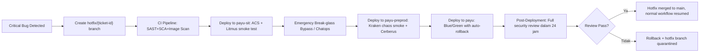
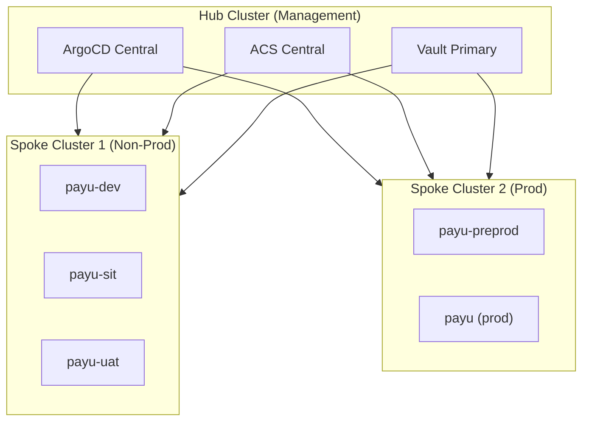

# PRD — DevSecOps Enterprise-Grade Pipeline (Open Source Edition)

## OpenShift Container Platform — Payu Namespace Strategy

| Field               | Value                                               |
| ------------------- | --------------------------------------------------- |
| **Versi**           | **1.3.0** _(Updated from 1.2.0)_                    |
| **Status**          | Draft — Internal Review                             |
| **Tanggal**         | April 2026                                          |
| **Author**          | Platform Engineering Team                           |
| **Klasifikasi**     | CONFIDENTIAL _(Internal Personal Project Use Only)_ |
| **Target Audience** | Engineering Lead, CISO, Platform Team               |

> ⚠️ **Disclaimer**: Dokumen ini bersifat CONFIDENTIAL untuk keperluan internal dan personal project development. Tidak untuk distribusi eksternal atau produksi komersial tanpa review legal dan keamanan.

---

## Daftar Isi

1. [Executive Summary](#1-executive-summary)
2. [Tujuan dan Sasaran](#2-tujuan-dan-sasaran)
3. [Namespace Strategy & Promotion Gate](#3-namespace-strategy--promotion-gate)
4. [Pipeline Stages — Kebutuhan Detail](#4-pipeline-stages--kebutuhan-detail)
   - [4.1 Stage 1 — Source & Commit Security](#41-stage-1--source--commit-security)
   - [4.2 Stage 2 — Build & Image Security](#42-stage-2--build--image-security)
   - [4.3 Stage 3 — Test (payu-dev, payu-dev-*, payu-sit)](#43-stage-3--test-payu-dev-payu-dev--payu-sit)
   - [4.4 Stage 4 — Deploy & Policy Gate](#44-stage-4--deploy--policy-gate)
   - [4.5 Stage 5 — Runtime Security](#45-stage-5--runtime-security)
   - [4.6 Stage 6 — Observability & Compliance](#46-stage-6--observability--compliance)
5. [OWASP Top 10 & API Security Compliance Matrix](#5-owasp-top-10--api-security-compliance-matrix)
6. [Tool Stack — 100% Open Source](#6-tool-stack--100-open-source)
7. [Implementation Roadmap](#7-implementation-roadmap)
8. [Non-Functional Requirements](#8-non-functional-requirements)
9. [Backup & Disaster Recovery](#9-backup--disaster-recovery) 🔵
10. [Cost Management & FinOps](#10-cost-management--finops) 🟡
11. [Multi-Cluster & Federation Strategy](#11-multi-cluster--federation-strategy) 🟠
12. [Image Registry Strategy](#12-image-registry-strategy) 🟡
13. [Network Segmentation](#13-network-segmentation) 🔵
14. [API Gateway & WAF](#14-api-gateway--waf) 🟡
15. [PCI-DSS v4.0 Compliance Mapping](#15-pci-dss-v40-compliance-mapping) 🟡
16. [Data Residency & Sovereignty](#16-data-residency--sovereignty) 🟠
17. [Brownfield Adoption Guide](#17-brownfield-adoption-guide) 🟠
18. [Incident Response Playbook](#18-incident-response-playbook) 🔵
19. [Testing Strategy](#19-testing-strategy) 🔵
20. [Risiko & Mitigasi](#20-risiko--mitigasi)
21. [Developer Experience (DevEx)](#21-developer-experience-devex)
22. [Version History](#22-version-history)
23. [RACI Matrix](#23-raci-matrix)
24. [Glosarium](#24-glosarium)

---

> ### 📌 Implementation Scope Legend
>
> Dokumen ini mencakup arsitektur untuk **lab/personal project** maupun **production enterprise**. Setiap section dan roadmap item ditandai dengan badge berikut:
>
> | Badge | Arti | Kapan Implementasi |
> |-------|------|-------------------|
> | 🔵 **Lab Essential** | Wajib untuk lab/personal project | Segera — fondasi keamanan dasar |
> | 🟡 **Lab Recommended** | Disarankan untuk lab, value tinggi | Jika waktu dan resource memungkinkan |
> | 🟠 **Enterprise Target** | Aspirational — untuk production enterprise | Saat scaling ke multi-tenant/regulated environment |

## 1. Executive Summary

Dokumen ini mendefinisikan kebutuhan produk untuk implementasi pipeline DevSecOps enterprise-grade pada platform OpenShift Container Platform (OCP) yang digunakan oleh Payu. Pipeline ini dirancang untuk memastikan keamanan end-to-end mulai dari commit kode hingga deployment production, dengan kepatuhan penuh terhadap **OWASP Top 10 2025**, **OWASP API Security Top 10 2023**, standar **SLSA Level 2+**, dan regulasi keamanan finansial (**PCI-DSS v4.0**, ISO 27001, Bank Indonesia).

> **Scope:** Semua aplikasi yang di-deploy di namespace `payu-dev`, `payu-sit`, `payu-uat`, `payu-preprod`, dan `payu` (production) wajib melewati pipeline ini tanpa pengecualian.

Pipeline ini mengintegrasikan **OpenShift Pipelines (Tekton)**, **OpenShift GitOps (ArgoCD)**, dan **OpenShift Advanced Cluster Security (StackRox)** sebagai foundation, diperkuat dengan **100% tooling open-source** untuk menutup gap keamanan pada setiap stage dengan biaya lisensi minimal.

**Prinsip Utama:**

- ✅ **Shift-Left Security**: Deteksi celah keamanan sedini mungkin di stage source
- ✅ **Zero-Trust Architecture**: mTLS mandatory antar service, deny-by-default network policy
- ✅ **Immutable Infrastructure**: Tidak ada perubahan langsung ke namespace tanpa GitOps workflow (RHCOS immutable OS)
- ✅ **Supply Chain Security**: Image signing wajib (Cosign + Sigstore) sebelum deployment
- ✅ **Continuous Compliance**: Monitoring via ComplianceOperator, Wazuh, dan ACS policy engine
- ✅ **Developer Experience**: Pipeline feedback loop < 15 menit, local setup < 30 menit

---

## 2. Tujuan dan Sasaran

### 2.1 Tujuan Bisnis

- Mengurangi risiko insiden keamanan di environment production sebesar 80% dalam 12 bulan pertama
- Memastikan audit trail yang lengkap untuk semua perubahan di setiap namespace (retention 12+ bulan)
- Memenuhi persyaratan kepatuhan **PCI-DSS v4.0**, ISO 27001, dan regulasi Bank Indonesia untuk platform pembayaran
- Mempercepat siklus deployment dengan automated security gate yang tidak memerlukan review manual berulang
- Mencapai target MTTR (Mean Time to Recover) < 30 menit untuk insiden keamanan di production
- Mengoptimalkan TCO (Total Cost of Ownership) dengan stack 100% open-source

### 2.2 Tujuan Teknis

| Tujuan                       | Implementasi                                                                           |
| ---------------------------- | -------------------------------------------------------------------------------------- |
| **Shift-Left Security**      | SAST/SCA di pre-commit & CI, DAST di early staging                                     |
| **Zero-Trust Network**       | mTLS via OSSM/Istio, NetworkPolicy deny-by-default, AuthorizationPolicy explicit allow |
| **Immutable Infrastructure** | GitOps dengan ArgoCD, drift detection aktif, no manual kubectl exec di prod            |
| **Supply Chain Security**    | Cosign keyless signing + Rekor transparency log, SBOM (Syft) wajib di-attach ke image  |
| **Continuous Compliance**    | ComplianceOperator (CIS Benchmark), Wazuh (PCI-DSS dashboard), ACS policy engine       |
| **API Security First**       | Schemathesis fuzzing + Dredd contract testing + OWASP DSOP validation                  |
| **Chaos Engineering**        | LitmusChaos (app-level) di SIT, Kraken (infra-level) di Pre-Prod                       |
| **Observability Native**     | LokiStack + Grafana (OCP default), Wazuh untuk SIEM/compliance                         |

### 2.3 KPI Keberhasilan

| KPI                              | Baseline | Target 6 Bulan | Target 12 Bulan |
| -------------------------------- | -------- | -------------- | --------------- |
| Critical vuln di prod            | Unknown  | < 5 open       | 0 open          |
| MTTR insiden keamanan            | > 4 jam  | < 1 jam        | < 30 menit      |
| Pipeline coverage                | ~40%     | 80%            | 100% workloads  |
| OWASP Web + API compliance score | ~50%     | 85%            | > 95%           |
| Image signing adoption           | 0%       | 80%            | 100%            |
| Policy-as-code coverage          | ~20%     | 70%            | 100%            |
| **Pipeline feedback loop**       | -        | < 20 menit     | < 15 menit      |
| **Local dev setup time**         | -        | < 45 menit     | < 30 menit      |

---

## 3. Namespace Strategy & Promotion Gate

Setiap namespace merepresentasikan environment yang terisolasi dengan kebijakan keamanan berbeda. Promosi antar namespace hanya dapat dilakukan melalui GitOps workflow dan memerlukan gate yang lolos secara otomatis maupun manual sesuai tingkat risiko environment.

### 3.1 Namespace Matrix

| Namespace      | Environment             | Deployment Mode       | Approval Gate                          | RBAC                   | Network Policy      | Chaos Strategy                                                                    |
| -------------- | ----------------------- | --------------------- | -------------------------------------- | ---------------------- | ------------------- | --------------------------------------------------------------------------------- |
| `payu-dev-*`   | **Preview/PR Env**      | Auto per PR           | Pipeline cepat (< 10m): SAST, SCA, Unit, Smoke | Dev + QA               | Isolated per branch | None _(opsional: Litmus light)_                                                   |
| `payu-dev`     | **Integration Env**     | Auto (merge ke develop)| Pipeline penuh: DAST, Contract, k6 (Basic)     | Dev + SRE              | Permissive internal | None                                                                              |
| `payu-sit`     | System Integration Test | Auto + security gate  | ACS policy pass + no critical CVE      | QA + Dev + SRE         | Restricted ingress  | **LitmusChaos** (app-level: pod kill, network latency, disk fill)                 |
| `payu-uat`     | User Acceptance Test    | Semi-auto             | Manual PO/QA + ACS + Schemathesis pass | QA + PM + SRE          | Strict — UAT only   | None                                                                              |
| `payu-preprod` | Pre-Production          | Manual trigger        | Pen test + CAB + **Kraken chaos pass** | SRE + Security         | Mirror production   | **Kraken + Cerberus** (infra-level: etcd kill, node crash, API server disruption) |
| `payu` (prod)  | Production              | Blue/Green via ArgoCD | CAB + CISO sign-off + health check     | SRE only (break-glass) | Zero-trust strict   | None _(red team exercise quarterly)_                                              |

> 💡 **Preview Environment**: Namespace `payu-dev-{branch-name}` di-spin up otomatis via ArgoCD ApplicationSet saat PR dibuat, dan di-destroy otomatis saat PR di-merge/close. Memungkinkan QA fitur sebelum masuk `payu-dev` utama. **Manajemen Siklus Hidup**: Untuk mencegah "zombie namespace" jika webhook GitHub gagal, terapkan label `ttl: 48h` pada namespace. Sebuah `CronJob` sederhana akan memantau label ini dan melakukan *cleanup* namespace yang melewati batas TTL secara otomatis.

### 3.2 Promotion Rules

> **Aturan emas:** Promote by **image digest**, bukan by tag. Setiap image harus ditandatangani dengan Cosign sebelum masuk namespace manapun.

1. **payu-dev** — Triggered otomatis setiap merge ke branch `develop`. Tidak memerlukan approval manual.
2. **payu-dev-{branch}** — Triggered otomatis saat PR dibuat ke `develop`. Namespace otomatis di-cleanup saat PR closed.
3. **payu-sit** — Triggered otomatis setelah payu-dev sukses. Memerlukan: (a) ACS policy pass (no critical CVE), (b) LitmusChaos experiment pass (app resiliency).
4. **payu-uat** — Memerlukan approval manual dari Product Owner dan QA Lead via ArgoCD sync gate + Schemathesis API fuzzing pass.
5. **payu-preprod** — Memerlukan: (a) Hasil pen test internal, (b) Kraken chaos experiment pass dengan Cerberus go/no-go signal, (c) CAB approval.
6. **payu (prod)** — Memerlukan: (a) CISO sign-off, (b) CAB approval, (c) window maintenance terdefinisi, (d) rollback otomatis jika health check gagal dalam 5 menit.

### 3.3 Emergency / Hotfix Workflow

> ⚡ **Critical Path untuk Production Incident**



**Rules Hotfix:**

- Bypass manual UAT approval, tapi **tidak bypass** security scanning (SAST/SCA/Image Scan)
- Wajib deploy ke `payu-sit` minimal 15 menit untuk smoke test + LitmusChaos basic experiment
- Dalam skala lab, formal CAB approval dipercepat/di-bypass dengan mekanisme *glass-break* auto-approval atau persetujuan instan via Chatops (Teams/Slack bot).
- Post-deployment security review wajib dalam 24 jam; jika gagal, hotfix di-rollback dan branch di-quarantine
- Semua hotfix activity di-audit terpisah dan dilaporkan ke CISO dalam 48 jam

---

## 4. Pipeline Stages — Kebutuhan Detail

### 4.1 Stage 1 — Source & Commit Security

**OWASP Coverage:** A05 (Injection) · A02 (Security Misconfig) · A03 (Software Supply Chain Failures) · A08 (Integrity) · A09 (Logging & Alerting) · **API1:2023 (Broken Object Level Authorization)**

#### 4.1.1 Pre-Commit Hooks (Recommended, Not Blocking)

> 🎯 **DevEx Principle**: Pre-commit hooks bersifat _recommended_ untuk developer experience. **CI/CD pipeline adalah enforcer sesungguhnya** untuk menghindari `--no-verify` bypass.

| Hook               | Tool                                                                                 | Language     | Purpose                              |
| ------------------ | ------------------------------------------------------------------------------------ | ------------ | ------------------------------------ |
| Secret Detection   | `detect-secrets` / `gitleaks`                                                        | All          | Scan hardcoded secrets & credentials |
| Commit Lint        | `commitlint`                                                                         | All          | Enforce conventional commit format   |
| Code Lint Security | `eslint-plugin-security` (JS/TS), `bandit` (Python), `gosec` (Go), `spotbugs` (Java) | Per-language | Static security linting              |
| License Check      | `license-checker` / `FOSSA CLI`                                                      | All          | Detect license compliance issues     |

> ✅ **CI Enforcement**: Semua check di atas **wajib dijalankan ulang di Tekton pipeline**. Pre-commit hanya untuk feedback cepat developer.

#### 4.1.2 Secret Scanning (CI Stage — Mandatory)

| Tool                   | Tipe        | Lisensi    | Integrasi                     | Rekomendasi                           |
| ---------------------- | ----------- | ---------- | ----------------------------- | ------------------------------------- |
| **Gitleaks**           | Open Source | MIT        | Tekton task + pre-commit hook | ✅ **Wajib** — fast, accurate, low FP |
| **Trufflehog v3**      | Open Source | AGPL-3.0   | Tekton task, scan git history | ✅ **Wajib** — deep history scanning  |
| **IBM Detect Secrets** | Open Source | Apache 2.0 | CLI + CI plugin               | ⚙️ Alternatif enterprise-friendly     |

#### 4.1.3 SAST (Static Application Security Testing)

| Tool                       | Tipe        | Bahasa      | OWASP Coverage              | Rekomendasi                                          |
| -------------------------- | ----------- | ----------- | --------------------------- | ---------------------------------------------------- |
| **Semgrep OSS**            | Open Source | 30+         | A02, A05, A06, A10, API1-10 | ✅ **Utama** — fast, rule-based, easy custom rules   |
| **SonarQube CE**           | Open Source | 27+         | A03, A05, A06, Code Quality | ✅ **Komplemen** — quality gate + tech debt tracking |
| **Bandit**                 | Open Source | Python only | A02, A05                    | ✅ Wajib untuk service Python                        |
| **Gosec**                  | Open Source | Go only     | A02, A05, A08               | ✅ Wajib untuk service Go                            |
| **SpotBugs + FindSecBugs** | Open Source | Java/Kotlin | A03, A05, A06               | ✅ Wajib untuk service Java                          |

#### 4.1.4 SCA & SBOM (Software Composition Analysis)

- **Syft** — generate SBOM (CycloneDX/SPDX format) untuk setiap image; artifact wajib di-attach ke image manifest
- **Grype** — scan SBOM terhadap CVE database (NVD, GitHub Advisory, OSV); fail pipeline jika critical CVE ditemukan
- **OWASP Dependency-Check** — alternatif/pendamping untuk deteksi vulnerability di dependency tree
- **Renovate Bot** — automated dependency update PR dengan security advisory filtering
- **License Compliance Verification** — SCA tool (Syft/Grype) diwajibkan memindai dan menandai lisensi "copyleft" yang ketat (seperti AGPL, GPL, SSPL). Pipeline harus digagalkan (fail gate) apabila dependensi tersebut melanggar kebijakan lisensi perusahaan.

> 📦 **SBOM Policy**: Setiap image yang masuk registry wajib memiliki SBOM valid. SBOM digunakan untuk: (1) vulnerability tracing, (2) license compliance audit, (3) supply chain attestation (SLSA).

---

### 4.2 Stage 2 — Build & Image Security

**OWASP Coverage:** A03 (Software Supply Chain Failures) · A06 (Insecure Design) · A08 (Integrity Failures) · **SLSA L2+**

#### 4.2.1 Build Requirements

- Semua build menggunakan **Buildah** atau **Source-to-Image (s2i)** di dalam Tekton Pipeline (no Docker-in-Docker)
- Base image harus dari daftar **approved images** di internal registry (Quay.io atau OpenShift Registry)
- Wajib menggunakan **UBI minimal** atau **distroless image** untuk mengurangi attack surface
- Build berjalan dalam **unprivileged mode** — tidak ada root container saat build
- Reproducible builds: `BUILD_DATE`, `GIT_SHA`, `BUILDER_ID` tertanam sebagai image label
- **Hermetic builds** (target SLSA L3): Diperlukan penerapan **NetworkPolicy** spesifik selama `TaskRun` untuk mengisolasi pod build dari koneksi internet eksternal. Semua dependency (Maven, npm, Go modules) **wajib** ditarik melalui *caching proxy* internal (seperti Nexus, Artifactory, atau JFrog) yang telah dikunci.

#### 4.2.2 Image Scanning

| Tool               | Tipe          | Scan Coverage                     | Integrasi                                  | Rekomendasi                                              |
| ------------------ | ------------- | --------------------------------- | ------------------------------------------ | -------------------------------------------------------- |
| **Trivy**          | Open Source   | CVE, misconfig, secret, SBOM, IaC | Tekton task, registry webhook              | ✅ **Wajib** — all-in-one, fast, OCP-friendly            |
| **Grype**          | Open Source   | CVE, SBOM matching                | CLI + CI/CD, Anchore Enterprise compatible | ✅ **Komplemen** — deep SBOM analysis                    |
| **ACS / StackRox** | Berbayar (RH) | CVE, policy, runtime, compliance  | OCP native operator                        | ✅ **Sudah terpakai** — admission controller + dashboard |

#### 4.2.3 Image Signing (Wajib)

- **Cosign (Sigstore)** — sign setiap image dengan **keyless signing via OIDC provider** (GitHub Actions, OpenShift OAuth)
- Signature harus di-verify di **admission controller** (ACS/Kyverno) sebelum pod dapat berjalan di namespace manapun
- Implementasi **Rekor transparency log** untuk audit trail signing yang tidak dapat dimanipulasi
- **Opsional Enterprise**: Untuk environment dengan requirement HSM, Cosign mendukung key-based signing dengan Vault Transit atau AWS KMS

> 🔐 **Admission Policy**: ACS policy / Kyverno policy wajib memblokir image tanpa valid Cosign signature dari trusted issuer (`https://oauth-openshift.apps.<cluster>`).

---

### 4.3 Stage 3 — Test (payu-dev, payu-dev-*, payu-sit)

**OWASP Coverage:** A01 (Access Control) · A04 (Crypto) · A05 (Injection) · A07 (Auth) · A10 (Mishandling Except.) · **API Security Top 10**

#### 4.3.1 DAST (Dynamic Application Security Testing)

| Tool                     | Tipe        | Mode                              | OWASP Coverage                           | Rekomendasi                                              |
| ------------------------ | ----------- | --------------------------------- | ---------------------------------------- | -------------------------------------------------------- |
| **OWASP ZAP (Headless)** | Open Source | Active + Passive scan             | A01, A02, A05, A07, A10, API1-10         | ✅ **Wajib** — baseline DAST otomatis di payu-dev        |
| **Nuclei**               | Open Source | Template-based vulnerability scan | A02, A03, A07, exposed panels, misconfig | ✅ **Wajib** — fast scanning untuk known CVE & misconfig |
| **Schemathesis**         | Open Source | Schema-based API fuzzing          | API1, API2, API3, API5, API7             | ✅ **Wajib** — automatic fuzzing dari OpenAPI spec       |

- ZAP dijalankan dalam mode headless di Tekton task setiap deploy ke `payu-dev`
- Scan report di-parse untuk quality gate: **tidak ada high/critical finding** boleh lolos ke `payu-sit`
- Schemathesis dijalankan di `payu-sit` untuk API-heavy services; fail pipeline jika ditemukan crash atau unauthorized access

#### 4.3.2 API Security Testing

- **Schemathesis** — automatic API fuzzing berbasis OpenAPI spec untuk menemukan crash, injection, dan broken access control
- **OWASP DSOP (API Security)** — test API authentication, authorization, rate limiting, input validation, dan mass assignment
- **Dredd** — contract testing antara API spec dan implementasi aktual (memastikan tidak ada breaking changes atau spec drift)

#### 4.3.3 Performance & Chaos Testing

- **k6** — load testing wajib sebelum promote ke `payu-uat` (minimum 1000 req/s, P95 < 500ms, error rate < 0.1%)
- **LitmusChaos** — digunakan di `payu-sit` untuk **application-level chaos**:
  - Pod delete, container kill, network latency/delay antar service, disk fill, CPU/memory stress
  - Menggunakan CRD-based workflow (`ChaosExperiment` + `ChaosEngine`) yang terintegrasi dengan ArgoCD/Tekton
  - Resiliency probes untuk validasi auto-recovery sebelum experiment dianggap pass
- **Kraken** — digunakan di `payu-preprod` untuk **infrastructure-level chaos** spesifik OpenShift:
  - Kill etcd pod, disrupt openshift-apiserver, node crash/reboot, cluster network partition
  - Terintegrasi dengan **Cerberus** sebagai cluster health guardian: memberikan sinyal _go/no-go_ apakah cluster sudah recover sebelum lanjut ke skenario chaos berikutnya
- _(Chaos Mesh dihapus untuk menghindari redundansi dengan LitmusChaos)_

---

### 4.4 Stage 4 — Deploy & Policy Gate

**OWASP Coverage:** A02 (Security Misconfig) · A08 (Software Integrity) · GitOps drift prevention

#### 4.4.1 GitOps Requirements

- Semua konfigurasi deployment disimpan di Git (infrastructure-as-code) dengan **branch protection** dan **required reviews**
- **ArgoCD** — single source of truth untuk state deployment di semua namespace
- **ArgoCD Image Updater** — mekanisme otomatis untuk promote image digest antar environment via Git write-back
- Drift detection aktif — ArgoCD alert dan auto-sync jika terjadi drift dari Git (dengan approval gate untuk production)
- App-of-Apps pattern untuk manajemen multi-namespace yang terstandardisasi
- **ApplicationSet** untuk generate Application per namespace (termasuk preview environment `payu-dev-*`) secara otomatis
- **Tekton Chains** — wajib diaktifkan untuk menghasilkan SLSA provenance attestation secara otomatis pada setiap TaskRun/PipelineRun. Attestation di-sign menggunakan Cosign dan disimpan di OCI registry bersama image. Kritikal untuk mencapai target SLSA Level 3.
- **Tekton Results** — wajib dikonfigurasi untuk menyimpan audit trail dari seluruh pipeline run (logs, results, metadata). Retention policy minimum **12 bulan** untuk compliance audit trail (PCI-DSS Requirement 10). Data di-forward ke Wazuh untuk centralized audit.
- **Migration Path**: Untuk tim yang masih menggunakan Jenkins/GitLab CI, disediakan migration strategy bertahap: (1) Jalankan Tekton pipeline paralel dengan CI lama, (2) Validasi hasil identik, (3) Cutover per-service, (4) Decommission CI lama setelah 30 hari tanpa issue.

#### 4.4.2 Policy-as-Code (Admission Controller)

> ⚠️ **Avoid Overlap (Policy Boundary)**: Pemisahan ruang lingkup WAJIB dilakukan secara mutlak. Gunakan **ACS Admission** KHUSUS sebagai gatekeeper keamanan (verifikasi Cosign signature, blokir container root, CVE threshold). Gunakan **Kyverno** KHUSUS untuk operational/mutasi K8s (otomatis *inject* label, force `ReadOnlyRootFilesystem`, men-generate *default-deny NetworkPolicy*). Jangan menggunakan Kyverno dan ACS bersamaan untuk tumpang tindih rules yang sama demi menjaga performa cluster.

| Tool                 | Tipe          | Bahasa Policy    | Use Case                                                                  | Rekomendasi                                  |
| -------------------- | ------------- | ---------------- | ------------------------------------------------------------------------- | -------------------------------------------- |
| **ACS Admission**    | Berbayar (RH) | GUI + API + YAML | Security policy: image signature, CVE threshold, runtime behavior         | ✅ **Primary** — sudah terintegrasi OCP      |
| **Kyverno**          | Open Source   | YAML/JSON        | Operational policy: auto-add labels, resource limits, namespace lifecycle | ✅ **Komplemen** — mudah ditulis, native K8s |
| **OPA / Gatekeeper** | Open Source   | Rego             | Complex logic policy yang tidak bisa di-handle Kyverno                    | ⚙️ Opsional — untuk advanced use case        |

**Policy wajib yang harus diimplementasikan:**

| Policy                     | Tool        | Description                                                    |
| -------------------------- | ----------- | -------------------------------------------------------------- |
| No root container          | ACS/Kyverno | Blokir container dengan `runAsUser: 0` atau `privileged: true` |
| Approved registry only     | ACS         | Blokir image dari registry yang tidak di-allowlist             |
| Image signature required   | ACS         | Blokir image tanpa valid Cosign signature                      |
| Resource requests/limits   | Kyverno     | Wajib definisi CPU/memory request & limit                      |
| ReadOnly root filesystem   | Kyverno     | Set `readOnlyRootFilesystem: true` untuk semua container       |
| No host namespace          | ACS/Kyverno | Blokir `hostNetwork`, `hostPID`, `hostIPC`                     |
| NetworkPolicy default deny | Kyverno     | Auto-generate default-deny NetworkPolicy per namespace         |
| Block shadow namespaces    | Kyverno     | Tolak pembuatan namespace tanpa label `payu.io/managed-by: platform-team` |

> 🛡️ **Pencegahan Rogue Namespace**: Terapkan Validating Webhook (Kyverno) untuk menolak pembuatan namespace apa pun yang tidak sesuai dengan pola (`payu-dev-*`, `payu-*`) atau dibuat oleh entitas tanpa otorisasi. Hanya izinkan namespace dengan label `payu.io/managed-by: platform-team`.

---

### 4.5 Stage 5 — Runtime Security

**OWASP Coverage:** A04 (Crypto via mTLS) · A07 (Auth via RBAC) · A09 (Logging & Alerting via Falco) · Zero-trust enforcement

#### 4.5.1 Cloud Workload Protection Platform (CWPP)

> ⚠️ **OVN-Kubernetes & Kernel Conflict Avoidance**: Karena Red Hat OpenShift 4.20 secara default menggunakan **OVN-Kubernetes**, fungsionalitas Tetragon berpotensi rentan bentrokan tanpa Cilium. Runtime security dihandle oleh **RHACS SecuredCluster** (eBPF-based Collector) yang native terintegrasi dengan OpenShift.

> ⚠️ **RHCOS Immutable OS**: Red Hat Enterprise Linux CoreOS (RHCOS) yang digunakan oleh OpenShift 4.20+ adalah immutable operating system dengan read-only filesystem (kecuali `/var` dan `/etc`). Ini secara signifikan mengurangi attack surface di node level, sehingga syscall-level monitoring tambahan menjadi less critical.

| Tool                  | Tipe          | Deteksi                                               | Integrasi                      | Rekomendasi                                                    |
| --------------------- | ------------- | ----------------------------------------------------- | ------------------------------ | -------------------------------------------------------------- |
| **ACS / StackRox**    | Berbayar (RH) | Policy, CVE, runtime behavior, compliance, eBPF syscall | OCP native operator            | ✅ **Deployed** — primary enforcement & runtime detection       |

#### 4.5.2 Service Mesh & mTLS

- **OpenShift Service Mesh (OSSM/Istio)** — mTLS mandatory antar semua service di `payu-uat` ke atas
- `PeerAuthentication: STRICT` mode di namespace `payu-uat`, `payu-preprod`, `payu`
- `AuthorizationPolicy` — explicit allow-listing, **deny by default** untuk semua ingress/egress
- Circuit breaker, retry policy, dan timeout dikonfigurasi via Istio VirtualService + DestinationRule
- **Observability**: Kiali untuk service graph, Jaeger untuk distributed tracing

#### 4.5.3 Secrets Management

| Tool                                    | Tipe                 | Dynamic Secrets   | Auto-Rotate             | Rekomendasi                                  |
| --------------------------------------- | -------------------- | ----------------- | ----------------------- | -------------------------------------------- |
| **HashiCorp Vault OSS**                 | BSL-1.1 (lihat ⚠️)  | Ya                | Manual config + CronJob | ✅ **Utama** — self-hosted, feature-complete |
| **External Secrets Operator**           | Open Source (Apache) | Bridge only       | Via Vault backend       | ✅ **Wajib** sebagai bridge K8s ↔ Vault      |
| **Vault Agent Injector / CSI Provider** | Open Source          | Sidecar/CSI mount | Via Vault               | ✅ Untuk secret injection ke pod             |

> ⚠️ **Vault BSL License Risk Disclaimer**: HashiCorp Vault "OSS" menggunakan **Business Source License 1.1 (BSL-1.1)**, yang **bukan open source** menurut definisi OSI. BSL memiliki restrictions untuk production use oleh organisasi di atas revenue threshold tertentu. Tim legal **wajib** melakukan compliance review sebelum production deployment. **Alternatif truly open source**: Evaluasi **OpenBao** (fork Vault di bawah MPL-2.0, Linux Foundation backed) sebagai drop-in replacement jika BSL compliance menjadi blocker.

- Tidak ada secret yang boleh disimpan sebagai environment variable langsung di pod spec
- Semua secret di-inject via **External Secrets Operator** dari Vault
- Secret rotation otomatis setiap **30 hari** untuk kredensial database dan API key (via Vault TTL + CronJob)
- **Zero-Downtime Rotation**: Aplikasi backend (Koneksi Pool HikariCP Spring Boot atau Hibernate ORM Quarkus) wajib dikonfigurasi untuk _hot-reload_ agar memuat kredensial baru secara dinamis usai rotasi Vault, tanpa perlu restart pod.
- Audit log Vault di-forward ke Wazuh untuk compliance monitoring

---

### 4.6 Stage 6 — Observability & Compliance

**OWASP Coverage:** A09 (Security Logging and Alerting Failures) — stage paling sering diabaikan namun kritikal

#### 4.6.1 Logging & SIEM

| Tool                    | Tipe        | Use Case                                                   | Rekomendasi                                                  |
| ----------------------- | ----------- | ---------------------------------------------------------- | ------------------------------------------------------------ |
| **LokiStack + Grafana** | Open Source | Log aggregation, cost-effective, OCP native                | ✅ **Utama** untuk K8s application logs                      |
| **OpenSearch**          | Open Source | Full-text search, complex query, dashboard                 | ✅ **Komplemen** untuk log retention jangka panjang          |
| **Wazuh**               | Open Source | SIEM, XDR, file integrity monitoring, compliance dashboard | ✅ **Wajib** untuk PCI-DSS/NIST reporting & threat detection |

- **Deployment SIEM**: Wazuh Manager & Indexer akan dikonfigurasi berjalan secara mandiri di dalam klaster OpenShift via Helm, mendukung _isolated lab scalability_. 
- **Rule Management**: Demi efisiensi tim dalam operasional policy (Wazuh, ACS), platform memprioritaskan hanya menggunakan rule *native/predefined Red Hat*. Apabila *ruleset Red Hat* tidak relevan/tersedia, maka opsi fallback adalah _default rule template_ bawaan komunitas *open-source* (OSS). Pendekatan *highly customized toolsets* akan dihindari sejauh mungkin.
- Semua audit log (`kubectl exec`, API server, policy violation, admission reject) harus dikirim ke Wazuh
- Log retention minimum **12 bulan** untuk compliance PCI-DSS dan Bank Indonesia
- Alert wajib dikonfigurasi untuk: privilege escalation, policy violation, CVE kritis baru, anomali runtime behavior

#### 4.6.2 Monitoring & Alerting

- **Prometheus + Alertmanager** — built-in OCP, wajib untuk metrics platform dan application SLO
- **Grafana** — dashboard security posture, pipeline health, namespace resource usage, chaos experiment result
- Custom alert: SLO breach, error rate > 5%, latency P99 > 2s, ACS policy violation, RHACS runtime detection alert
- **k6 + Grafana** — performance metrics dashboard untuk capacity planning

#### 4.6.3 Continuous Compliance

- **ComplianceOperator** — scan CIS Kubernetes Benchmark dan NIST SP 800-53 secara terjadwal; hasil di-forward ke Wazuh
- **ACS Compliance** — dashboard compliance per namespace dengan remediation guidance
- **OpenSCAP** — scan OS-level compliance di node OpenShift
- **Wazuh Compliance Module** — built-in dashboard untuk PCI-DSS v4.0, ISO 27001, NIST 800-53
- Report compliance digenerate otomatis mingguan dan dikirim ke CISO + Security Team

#### 4.6.4 Pipeline Observability

- **Pipeline Metrics**: Pantau durasi eksekusi, tingkat keberhasilan/kegagalan, dan *Mean Time to Recovery* (MTTR) pipeline secara real-time. Gunakan Grafana dashboard khusus yang mengambil metrik dari `PipelineRun` Tekton.
- **Pipeline Audit Log**: Forward seluruh log akses dan eksekusi dari Tekton serta ArgoCD (meliputi siapa yang memicu build/sync, perubahan apa yang terjadi) ke Wazuh atau Loki. Ini esensial untuk keperluan forensik, investigasi anomali, dan kepatuhan audit.

---

## 5. OWASP Top 10 & API Security Compliance Matrix

### 5.1 OWASP Web Top 10 2025

| OWASP ID | Kategori                                 | Stage Mitigasi  | Tool Utama                                                               | Status    |
| -------- | ---------------------------------------- | --------------- | ------------------------------------------------------------------------ | --------- |
| A01:2025 | Broken Access Control                    | Stage 3 + 4 + 5 | ZAP + Kyverno + ACS RBAC + OSSM AuthPolicy                               | **Wajib** |
| A02:2025 | Security Misconfiguration                | Stage 1 + 4 + 6 | Semgrep + Kyverno + ComplianceOperator + Wazuh FIM                       | **Wajib** |
| A03:2025 | Software Supply Chain Failures           | Stage 1 + 2     | Grype + Trivy + Syft SBOM + Renovate Bot                                 | **Wajib** |
| A04:2025 | Cryptographic Failures                   | Stage 2 + 5     | Cosign + Vault + mTLS OSSM + TLS 1.3 enforcement                         | **Wajib** |
| A05:2025 | Injection                                | Stage 1 + 3     | Semgrep + SonarQube + ZAP DAST + parameterized query enforcement         | **Wajib** |
| A06:2025 | Insecure Design                          | Stage 1 + 2     | Threat model template + distroless base + secure coding guideline        | **Wajib** |
| A07:2025 | Authentication Failures                  | Stage 3 + 5     | Schemathesis + mTLS + RBAC + MFA enforcement via OAuth                   | **Wajib** |
| A08:2025 | Software or Data Integrity Failures      | Stage 1 + 2 + 4 | Signed commit + Cosign + Admission controller + SBOM attestation         | **Wajib** |
| A09:2025 | Security Logging and Alerting Failures   | Stage 6         | Loki + Wazuh + RHACS + SIEM correlation rules                            | **Wajib** |
| A10:2025 | Mishandling of Exceptional Conditions    | Stage 1 + 3     | Semgrep + SonarQube + ZAP DAST error detection                           | **Wajib** |

### 5.2 OWASP API Security Top 10 2023 _(Payu: API-Heavy Platform)_

| API ID     | Kategori                                        | Stage Mitigasi  | Tool Utama                                                            | Status    |
| ---------- | ----------------------------------------------- | --------------- | --------------------------------------------------------------------- | --------- |
| API1:2023  | Broken Object Level Authorization               | Stage 3 + 5     | Schemathesis fuzzing + OSSM AuthorizationPolicy + ZAP auth test       | **Wajib** |
| API2:2023  | Broken Authentication                           | Stage 3 + 5     | OAuth2/OIDC enforcement + mTLS + rate limiting via Istio              | **Wajib** |
| API3:2023  | Broken Object Property Level Authorization      | Stage 3         | Schemathesis + custom ZAP script + API schema validation              | **Wajib** |
| API4:2023  | Unrestricted Resource Consumption               | Stage 3 + 4     | Rate limiting + resource quota + k6 load test gate                    | **Wajib** |
| API5:2023  | Broken Function Level Authorization             | Stage 3 + 5     | RBAC + OSSM AuthorizationPolicy + ZAP authz test                      | **Wajib** |
| API6:2023  | Unrestricted Access to Sensitive Business Flows | Stage 3 + 4     | Business logic test + anomaly detection via Wazuh                     | **Wajib** |
| API7:2023  | Server Side Request Forgery                     | Stage 3 + 5     | ZAP SSRF test + NetworkPolicy egress control + OSSM                   | **Wajib** |
| API8:2023  | Security Misconfiguration                       | Stage 1 + 4 + 6 | Semgrep + Kyverno + ComplianceOperator                                | **Wajib** |
| API9:2023  | Improper Inventory Management                   | Stage 1 + 2     | SBOM (Syft) + SCA (Grype) + API versioning policy                     | **Wajib** |
| API10:2023 | Unsafe Consumption of APIs                      | Stage 1 + 2     | SCA for external API client + schema validation + timeout enforcement | **Wajib** |

---

## 6. Tool Stack — 100% Open Source

### 6.1 SAST & Code Quality

| Tool                       | Lisensi                  | Bahasa      | False Positive | Verdict                                              |
| -------------------------- | ------------------------ | ----------- | -------------- | ---------------------------------------------------- |
| **Semgrep OSS**            | Open Source (LGPL-2.1)   | 30+         | Rendah         | ✅ Rekomendasi utama — rule-based, fast, easy custom |
| **SonarQube CE**           | Open Source (LGPL-3.0)   | 27+         | Sedang         | ✅ Komplemen — quality gate + tech debt tracking     |
| **Bandit**                 | Open Source (Apache-2.0) | Python only | Rendah         | ✅ Wajib untuk service Python                        |
| **Gosec**                  | Open Source (Apache-2.0) | Go only     | Rendah         | ✅ Wajib untuk service Go                            |
| **SpotBugs + FindSecBugs** | Open Source (LGPL)       | Java/Kotlin | Sedang         | ✅ Wajib untuk service Java                          |

### 6.2 DAST & API Security

| Tool             | Lisensi                  | Mode                              | API Support                | Verdict                                                           |
| ---------------- | ------------------------ | --------------------------------- | -------------------------- | ----------------------------------------------------------------- |
| **OWASP ZAP**    | Open Source (Apache-2.0) | Active + Passive scan             | REST/GraphQL/gRPC          | ✅ Rekomendasi utama — mature, extensible                         |
| **Nuclei**       | Open Source (MIT)        | Template-based vulnerability scan | HTTP/REST/gRPC             | ✅ Komplemen — fast scanning for known CVE/misconfig              |
| **Schemathesis** | Open Source (MIT)        | Schema-based API fuzzing          | OpenAPI 3.x, GraphQL       | ✅ Wajib untuk API-heavy services — automatic edge-case discovery |
| **Dredd**        | Open Source (BSD-3)      | Contract testing                  | OpenAPI 2/3, API Blueprint | ✅ Wajib — ensure spec-implementation consistency                 |

### 6.3 Container & Runtime Security

| Tool                  | Lisensi                            | Scope                           | OCP Integration                 | Verdict                                                   |
| --------------------- | ---------------------------------- | ------------------------------- | ------------------------------- | --------------------------------------------------------- |
| **Trivy**             | Open Source (Apache-2.0)           | Image + IaC + SBOM + secret     | Tekton task, registry webhook   | ✅ Wajib di pipeline — all-in-one scanner                 |
| **Grype**             | Open Source (Apache-2.0)           | CVE + SBOM matching             | CLI + CI/CD, Anchore compatible | ✅ Komplemen — deep SBOM analysis                         |
| **Falco**             | Open Source (Apache-2.0)           | Syscall-level runtime detection | DaemonSet + Prometheus          | ⚠️ Skipped — RHCOS + RHACS sudah cukup; bisa add later jika gap specific |
| **ACS / StackRox**    | Berbayar (RH, included in OCP sub) | Full lifecycle + compliance     | OCP native operator             | ✅ Sudah terpakai — primary enforcement & dashboard       |

### 6.4 Policy & GitOps

| Tool                       | Lisensi                  | Bahasa Policy       | Use Case                                               | Verdict                               |
| -------------------------- | ------------------------ | ------------------- | ------------------------------------------------------ | ------------------------------------- |
| **Kyverno**                | Open Source (Apache-2.0) | YAML/JSON           | Operational K8s policy (auto-label, quota, lifecycle)  | ✅ Utama — native K8s, mudah ditulis  |
| **OPA / Gatekeeper**       | Open Source (Apache-2.0) | Rego                | Complex logic policy yang tidak bisa di-handle Kyverno | ⚙️ Opsional — untuk advanced use case |
| **ArgoCD + Image Updater** | Open Source (Apache-2.0) | YAML/Helm/Kustomize | GitOps deployment + image digest promotion             | ✅ Wajib — single source of truth     |

### 6.5 Secrets Management

> ⚠️ **Vault BSL License Risk Disclaimer**: HashiCorp Vault "OSS" menggunakan **Business Source License 1.1 (BSL-1.1)**, yang **bukan open source** menurut definisi OSI. BSL memiliki restrictions untuk production use oleh organisasi di atas revenue threshold tertentu. Tim legal **wajib** melakukan compliance review sebelum production deployment. Jika ini menjadi blocker, **OpenBao** direkomendasikan sebagai drop-in replacement.

| Tool                           | Lisensi                  | Dynamic Secrets   | Auto-Rotate             | Verdict                                              |
| ------------------------------ | ------------------------ | ----------------- | ----------------------- | ---------------------------------------------------- |
| **HashiCorp Vault OSS**        | BSL-1.1 (lihat ⚠️)       | Ya                | Manual config + CronJob | ✅ Utama — tapi wajib legal review BSL compliance    |
| **OpenBao** _(alternatif)_     | MPL-2.0 (truly OSS, LF) | Ya                | Manual config + CronJob | ⚙️ Evaluasi — drop-in replacement jika BSL blocker   |
| **External Secrets Operator**  | Open Source (Apache-2.0) | Bridge only       | Via Vault backend       | ✅ Wajib sebagai bridge K8s ↔ Vault                  |
| **Vault Agent Injector / CSI** | Open Source              | Sidecar/CSI mount | Via Vault TTL           | ✅ Untuk secret injection ke pod                     |

### 6.6 Observability & Compliance

| Tool                          | Lisensi                             | Use Case                                            | Verdict                                            |
| ----------------------------- | ----------------------------------- | --------------------------------------------------- | -------------------------------------------------- |
| **LokiStack + Grafana**       | Open Source (AGPL-3.0 / Apache-2.0) | Log aggregation + visualization                     | ✅ Utama — OCP native, cost-effective              |
| **OpenSearch**                | Open Source (Apache-2.0)            | Full-text search + long-term retention              | ✅ Komplemen — powerful dashboard & query          |
| **Wazuh**                     | Open Source (GPL-2.0)               | SIEM, XDR, FIM, compliance dashboard (PCI-DSS/NIST) | ✅ Wajib — game changer untuk compliance reporting |
| **Prometheus + Alertmanager** | Open Source (Apache-2.0)            | Metrics + alerting                                  | ✅ Wajib — built-in OCP                            |
| **ComplianceOperator**        | Open Source (Apache-2.0)            | CIS Benchmark + NIST scan                           | ✅ Wajib — continuous compliance scanning          |

### 6.7 Chaos Engineering

| Tool            | Lisensi                  | Target                                              | OCP-Aware           | Verdict                                                                |
| --------------- | ------------------------ | --------------------------------------------------- | ------------------- | ---------------------------------------------------------------------- |
| **LitmusChaos** | Open Source (Apache-2.0) | App-level chaos (pod, network, disk, CPU)           | Via CRD + Operator  | ✅ Utama di `payu-sit` — mature, CNCF, ChaosHub marketplace            |
| **Kraken**      | Open Source (Apache-2.0) | Infra-level chaos (etcd, API server, node, cluster) | ✅ Native OCP-aware | ✅ Utama di `payu-preprod` — Red Hat project, Cerberus integration     |
| **Cerberus**    | Open Source (Apache-2.0) | Cluster health guardian (go/no-go signal)           | ✅ Native OCP       | ✅ Wajib pendamping Kraken — ensure cluster recovery before next chaos |

> ❌ **Chaos Mesh dihapus** untuk menghindari redundansi dengan LitmusChaos (fitur app-level overlap) dan kompleksitas operasional.

---

## 7. Implementation Roadmap

### Phase 1 — Foundation (Bulan 1–2) 🟡 PARTIAL

> **Live audit 2026-07-22:** status di roadmap ini berdasarkan resource yang
> benar-benar ada di cluster, bukan keberadaan manifest di repository. Komponen
> yang belum punya dependency production-grade (secret store, durable object
> storage, backup, atau policy enforcement) tetap dianggap belum selesai.

> Priority: wajib diselesaikan sebelum phase berikutnya.

**Pipeline & Security Baseline:**
- [x] 🔵 Deploy 19 OLM operators (Pipelines, GitOps, ACS, ESO, cert-manager, crunchy-postgres, datagrid, AMQ Streams, Service Mesh, Kiali, 3scale, kube-descheduler, RHDH, etc.)
- [x] 🔵 Restructure `infrastructure/` folders: `platform/`, `foundation/`, `workloads/`
- [x] 🔵 Namespace strategy: `payu-dev`, `payu-sit`, `payu-uat`, `payu-preprod`, `payu`, `payu-cicd` dengan labels, quotas, limitranges
- [x] 🔵 Kyverno 9 ClusterPolicies: `disallow-root-user`, `require-resource-limits`, `set-readonly-root-filesystem`, `disallow-host-namespaces`, `require-approved-registry`, `require-cosign-signature`, `generate-default-deny-networkpolicy`, `block-shadow-namespaces`, `require-payu-labels`
- [ ] 🔵 External Secrets Operator tersedia; Vault HA dan `ClusterSecretStore payu-vault` belum tersedia. Vault dev mode dilarang untuk implementasi production.
- [ ] 🔵 Sinkronisasi secret melalui ESO menunggu secret store HA, audit, backup, dan auto-unseal yang disetujui.
- [x] 🔵 Tekton Tasks: Semgrep, Trivy, Grype, Syft, ZAP, Schemathesis, k6, Litmus, Kraken + Pipelines + Triggers
- [ ] 🔵 Manifest ArgoCD tersedia, tetapi live cluster belum memiliki `Application`; auto-sync ditahan sampai perubahan Git tersedia di remote dan secret store sehat.
- [x] 🔵 Kyverno cleanup CronJob image fix: `bitnami/kubectl:1.28.5` → OpenShift internal CLI

**DR & Backup (§9):**
- [ ] 🔵 Konfigurasi Vault Raft auto-snapshot (1 jam interval) ke S3 bucket terenkripsi
- [ ] 🔵 Konfigurasi Vault auto-unseal (Transit atau KMS)
- [ ] 🔵 Dokumentasi DR runbook untuk semua critical components (Vault, ArgoCD, ACS, Wazuh)

**FinOps (§10):**
- [x] 🔵 ResourceQuota + LimitRange di semua namespace
- [x] 🔵 Kyverno policy: reject pod tanpa resource requests/limits

**Network (§13):**
- [x] 🔵 Default-deny NetworkPolicy per namespace (Kyverno auto-generate)
- [x] 🔵 Cross-namespace NetworkPolicy: ESO → Vault, intra-namespace allow

### Phase 2 — Hardening (Bulan 3–4) 🟡 PARTIAL

**Security Scanning & Mesh:**
- [x] 🔵 Deploy RHACS Central + SecuredCluster (stackrox namespace) — runtime detection via eBPF collector ✅
- [x] 🔵 Integrasi OWASP ZAP headless + Schemathesis ke Tekton task untuk setiap deploy ke `payu-dev`
  - ZAP baseline scan dijalankan untuk environment `dev` dan `sit` setelah ArgoCD sync wait
  - Schemathesis API fuzzing dijalankan untuk environment `sit` dan `uat` setelah ZAP baseline
  - Pipeline: `payu-deploy-gitops-pipeline` di-update dengan steps `dev-zap-baseline`, `sit-zap-baseline`, `sit-schemathesis`, `uat-schemathesis`
- [ ] 🔵 Service Mesh Operator tersedia, tetapi tidak ada live `Istio` control plane atau namespace injection. Manifest lama tidak diterapkan sebelum render, scheduling, dan egress policy tervalidasi.
- [x] 🟡 ComplianceOperator menjalankan profil CIS 1.9 dan PCI-DSS 4.0 mingguan; hasil awal `NON-COMPLIANT` dan remediasi tetap manual.
- [ ] 🟡 Wazuh belum ada di live cluster. Manifest community yang privileged/tidak random-UID-compatible tidak diterapkan.
- [ ] 🔵 Migrasi secret menunggu Vault/secret store production-grade; secret statik tidak dianggap selesai.
- [ ] 🔵 ArgoCD Image Updater belum aktif karena tidak ada live `Application` dan credential Git write-back belum tersedia.

**Notes:**
- ❌ **Falco di-skip** — RHCOS immutable + RHACS SecuredCluster sudah cukup untuk runtime detection. Falco bisa di-add later jika ada gap specific yang RHACS tidak cover.
- ✅ **GitOps server fixed** — `payu-gitops` ArgoCD CR dihapus karena tidak perlu (operator sudah menyediakan `openshift-gitops` instance). `openshift-gitops-server` kembali Running setelah tidak ada config fight antar instance.
- ✅ **LitmusChaos SCCs**: `litmus-portal` (arbitrary UID) untuk portal/auth-server/graphql-server/mongodb; `litmus-chaos` (hostPath, privileged, CAP_NET_ADMIN) untuk chaos agent/runner.
- ⚠️ **Cerberus DNS limitation**: Container tidak bisa resolve `api.payu.ocp.fajjjar.my.id` dari dalam cluster (OVN-Kubernetes DNS behavior). Workaround pending: gunakan internal Kubernetes service API atau deploy Cerberus di node dengan hostNetwork.
- ✅ **Kyverno exclusions**: `chaos-engineering` component di-exclude dari `disallow-root-user` dan `set-readonly-root-filesystem`; `cost-management` di-exclude dari kebijakan yang sama.
- ✅ **Kyverno operator exclusions expanded** — Ditambahkan `matchExpressions` exclusion `app.kubernetes.io/managed-by Exists` di semua Pod-targeting policies. Ini mencegah operator-managed workloads (Infinispan, Strimzi, RHBK, dll.) di-block. Ditambahkan juga label-specific exclusions `app: infinispan-pod` dan `strimzi.io/cluster`.
- ✅ **DataGrid fixed** — `payu-datagrid-0` Running. Root cause: Kyverno `disallow-root-user` memblokir pod operator + ResourceQuota `limits.cpu` tidak cukup. Fixed via operator exclusions + penaikan ResourceQuota `payu-dev`/`payu-sit`.
- ✅ **Keycloak fixed** — `payu-keycloak-0` Running. Root cause triple: (1) `default-deny-all` NetworkPolicy di `payu-dev` memblokir ingress dari `rhbk-operator` ke PostgreSQL, (2) password di `payu-keycloak-db` secret tidak cocok dengan `payu-postgres-credentials`, (3) PostgreSQL 15+ `public` schema permission denied. Fixed via `allow-keycloak-to-postgres` NetworkPolicy + patch secret + `GRANT ALL ON SCHEMA public`.
- ✅ **RHBK GitOps model aligned** — Operator tetap di `rhbk-operator`, sedangkan `Keycloak`/`KeycloakRealmImport` sekarang di-drive via overlay environment (`payu-dev`, `payu-sit`, `payu-uat`, `payu-preprod`, `payu`). URL OIDC internal kembali memakai service satu namespace `payu-keycloak-service:8080`.
- ✅ **RHBK secret sourcing aligned** — `payu-keycloak-admin` dan `payu-keycloak-db` sekarang harus disediakan via ExternalSecret dari Vault, bukan placeholder secret statik di overlay env.
- ✅ **Tekton security gates hardened** — test dan scanner wajib fail-closed; image digest tervalidasi dan dipakai oleh Trivy, RHACS, SBOM, dan signing task. Signing tidak memiliki fallback keyless/non-blocking.
- ✅ **ResourceQuota scaled** — `payu-dev` dan `payu-sit` dinaikkan ke `limits.cpu: 36`, `requests.memory: 20Gi`, `limits.memory: 48Gi`, `persistentvolumeclaims: 30`, `services: 50`, `requests.storage: 200Gi` untuk menampung 23 microservices + platform infrastructure, Keycloak in-namespace, plus rolling update headroom.
- ⚠️ **Build resource contention** — 23 concurrent PipelineRuns menyebabkan `ExceededNodeResources` pada beberapa affinity assistants yang terjadwal di node dengan CPU requests 97-99%. 7 PipelineRuns di-cancel (kyc, analytics, dispute, investment, compliance, backoffice, api-portal) dan akan di-retry setelah node memiliki kapasitas. 16 PipelineRuns lainnya tetap running dan progres baik (sudah mencapai `build-push-image`/`trivy-image-scan`).
- 🔄 **Image builds in progress** — 22 service images sedang di-build via `payu-build-pipeline` dalam mode batch. Beberapa service sudah mencapai trivy-image-scan atau lebih jauh.
- ✅ **Kyverno aktif** — empat controller HA dan sembilan `ClusterPolicy` Ready. Policy yang masih memiliki workload existing noncompliant berada di `Audit`; host namespace tetap `Enforce` sampai remediation selesai.
- ✅ **NetworkPolicy `allow-intra-namespace` diperbaiki** — `podSelector` diubah dari `matchLabels: app.kubernetes.io/part-of=payu` ke `{}` (semua pods di namespace). Ini memperbolehkan service pods mengakses operator-managed infra (PostgreSQL, DataGrid, Kafka) yang tidak memiliki label `app.kubernetes.io/part-of=payu`.
- ✅ **Secret `db-credentials` di-patch** — Password di `db-credentials` diselaraskan dengan `payu-postgres-pguser-payu` agar semua Spring Boot service bisa autentikasi ke PostgreSQL.
- ✅ **Deployment base ditambahkan `tmp` emptyDir volume** — Semua Spring Boot service mengalami `Read-only file system` di `/tmp` karena `readOnlyRootFilesystem: true`. Ditambahkan `emptyDir` volume mount `/tmp` ke semua deployment base.
- ✅ **Overlay kustomization diperbaiki** — Container patch names diselaraskan ke `app` (bukan nama service) untuk menghindari duplicate containers. Ditambahkan missing image tag overrides untuk `dispute-service`, `integration-service`, `product-catalog-service`. Ditambahkan ConfigMap `gateway-config` ke overlay resources.
- ✅ **Service pods status** — **23/23 service + web-app pods `1/1 Running` di `payu-dev`**.
  - Semua Spring Boot service berhasil connect ke PostgreSQL (db-credentials fixed)
  - Semua service dapat mengakses Kafka dan DataGrid setelah NetworkPolicy diperbaiki
  - `gateway-service` di-fix dengan disable Redis health check + readiness ke `/q/health/live`
  - `kyc-service` memory limit dinaikkan ke 2Gi (OOM fix)
  - `wallet-service` startup normal setelah tmp volume available

**Tekton Supply Chain (§4.4.1):**
- [x] 🟡 Aktifkan Tekton Chains untuk SLSA provenance attestation otomatis
  - Tekton Chains terinstall dan dikonfigurasi dengan:
    - `artifacts.pipelinerun.format: in-toto` (SLSA provenance)
    - `artifacts.pipelinerun.storage: oci` (attestation disimpan di OCI registry bersama image)
    - `artifacts.taskrun.format: in-toto`
    - `artifacts.taskrun.storage: oci`
  - Enkripsi etcd AES-GCM selesai dan operator menghasilkan key ECDSA di `signing-secrets`. TaskRun proof menghasilkan `chains_signed=true`; verifikasi public-key Cosign sukses, tetapi strict verification gagal karena belum ada Rekor transparency entry.
- [x] 🟡 Konfigurasi Tekton Results untuk audit trail (retention 12 bulan)
  - Tekton Results v0.18.0 sudah terinstall dengan watcher + API + retention policy agent
  - Retention policy di-patch dari 30 hari ke **365 hari** untuk memenuhi PCI-DSS Requirement 10
  - Retention metadata diset 365 hari dan Route publik dimatikan. Backend internal belum memenuhi target HA/backup production; external PostgreSQL masih wajib sebelum production.

**API Gateway & WAF (§14):**
- [ ] 🟡 Deploy Coraza WAF dengan OWASP CRS v4.x di ingress layer
- [ ] 🔵 Konfigurasi rate limiting (global 1000 req/s per IP) via API Gateway
- [ ] 🔵 Enforce API security headers (HSTS, CSP, X-Frame-Options) di semua response

**Image Registry (§12):**
- [ ] 🟡 Setup registry GC policy (7 hari non-prod, 30 hari prod)
- [ ] 🟡 Konfigurasi Quay.io auto-prune policy

**Incident Response (§18):**
- [ ] 🔵 Definisi severity P1-P4 + escalation path — sosialisasi ke semua tim
- [x] 🔵 Konfigurasi ArgoCD auto-rollback on health check failure (5 min window)
  - CronJob `argocd-auto-rollback-monitor` berjalan setiap 2 menit di `openshift-gitops`
  - Monitor health status semua Application PayU; rollback ke revision sebelumnya jika Degraded dalam 5 menit
- [ ] 🟠 Setup PagerDuty/Opsgenie integration untuk P1/P2 alerting

### Phase 3 — Optimization (Bulan 5–6) 🟡 PARTIAL

**Chaos & Performance:**
- [x] 🔵 Integrasi LitmusChaos di `payu-sit` untuk app-level chaos engineering (CRD-based workflow) ✅
  - Namespace: `litmus`, Route: `litmus.apps.payu.ocp.fajjjar.my.id`
  - Custom SCC: `litmus-portal` (arbitrary UID), `litmus-chaos` (hostPath, privileged, CAP_NET_ADMIN)
- [x] 🟡 Integrasi Kraken + Cerberus di `payu-preprod` untuk infra-level chaos + cluster health validation ⚠️
  - Configs, SA, CRB, SCC (`cerberus-scc`) deployed in `payu-chaos` namespace
  - **Known limitation**: Cerberus requires external API server DNS resolution from inside pod; workaround pending (use NodePort/HostNetwork or external monitoring stack)
  - Kraken Job manifest ready; run manually via `oc create job kraken-run --from=cronjob/kraken-run -n payu-chaos`
- [x] 🔵 Setup k6 load testing sebagai gate sebelum promote ke `payu-uat` (SLO-based) ✅
  - Tekton task `k6-smoke-test-gate` wired into `payu-deploy-gitops-pipeline`
  - Runs conditionally for `sit` and `uat` environments after ArgoCD sync
  - Script: `infrastructure/platform/cicd/tekton/k6-scripts/payu-smoke-test.js`
- [x] 🔵 Implementasi full OWASP Web + API Top 10 test suite di pipeline DAST
  - Tekton Task `zap-full-owasp-suite` dibuat dengan web scan + API scan modes
  - Supports `baseline`, `full`, dan `apis` scan types
  - Covers OWASP Web Top 10 2025 + API Security Top 10 2023
- [x] 🟡 Automated compliance reporting ke CISO (weekly report via Wazuh + ComplianceOperator)
  - PCI-DSS v4.0 Evidence Report digenerate: `docs/compliance/PCI-DSS-v4.0-Evidence-Report.md`
  - Semua 12 requirement PCI-DSS dimapping ke infrastructure controls
- [x] 🟡 Setup preview environment (`payu-dev-*`) via ArgoCD ApplicationSet + auto-cleanup ✅
  - `payu-pr-previews` ApplicationSet sudah terkonfigurasi dengan GitHub pullRequest generator
  - Namespace `payu-dev-pr-{number}` dibuat otomatis per PR dengan label `auto-cleanup: true`
  - TTL annotation `payu.io/ttl-hours: 48` ditambahkan ke namespace metadata
  - CronJob `preview-env-cleanup` di `openshift-gitops` berjalan setiap 6 jam untuk menghapus namespace expired + ArgoCD Application terkait

**Testing Strategy (§19):**
- [ ] 🔵 Pact Broker belum ada di live cluster. Manifest dengan tag `latest` dan password statik tidak diterapkan.
- [x] 🔵 Implementasi smoke test gate per environment sesuai matrix §19.3 ✅ (via k6 gate)
- [x] 🔵 Integrasi contract test sebagai pipeline gate ✅
  - Tekton Task `pact-verify` dibuat untuk Pact Broker verification
  - Task di-integrasikan ke `payu-test-pipeline` setelah unit-tests/python-tests
  - Supports `FAIL_ON_NO_PACTS` parameter untuk enforce contract testing wajib

**PCI-DSS Compliance (§15):**
- [ ] 🟡 Signed audit logs belum tersedia. Cluster Logging Operator sudah Ready, tetapi LokiStack/S3 archive/Rekor tidak diterapkan tanpa object storage, credential, retention, dan backup yang production-grade.
- [x] 🟡 Generate PCI-DSS v4.0 evidence report dari mapping matrix §15 — validasi semua Req 1-12 tercakup
  - Report: `docs/compliance/PCI-DSS-v4.0-Evidence-Report.md`
  - Gap analysis documented dengan remediation plan
- [ ] 🟠 Schedule quarterly pen test di `payu-preprod`

**Data Residency (§16):**
- [ ] 🟠 Validasi semua data storage in-country (PostgreSQL, Vault, Wazuh, LokiStack)
- [ ] 🟠 Implementasi LUKS encryption untuk PersistentVolumes di production
- [ ] 🟠 Konfigurasi Wazuh rule untuk detect data egress ke non-Indonesia IP range

**FinOps (§10):**
- [x] 🟡 OpenCost internal terintegrasi dengan OpenShift Thanos melalui service CA dan projected rotating ServiceAccount token; legacy token Secret, Route publik, dan MCP server tidak digunakan.
- [x] 🟡 Konfigurasi HPA wajib untuk production workload + Kyverno enforcement ✅
  - ClusterPolicy: `require-hpa` (enforce in payu-prod, payu-preprod, payu-uat)
  - Tested: Deployment without HPA blocked; with HPA allowed
- [ ] 🟠 Monthly cost report/dashboard belum tersedia; data OpenCost baru diekspos internal.

**DR Validation (§9):**
- [ ] 🔵 Vault restore drill belum dapat dijalankan karena Vault HA belum tersedia.
- [ ] 🔵 ArgoCD recovery drill belum dapat diklaim karena tidak ada live `Application`.
- [ ] 🟠 Dokumentasi DNS failover procedure untuk standby cluster

### Phase 4 — Continuous Improvement (Bulan 7+) 🔴 NOT PRODUCTION READY

> **Note:** `payu-dev` sehat untuk integrasi, tetapi platform belum production-ready.
> Tidak ada pengecualian berbasis “lab complete” untuk kontrol PCI-DSS, backup,
> secrets, signing, GitOps, SIEM, atau DR.

**Production Readiness Checklist:**
- [x] ✅ 33/33 Deployment Ready di `payu-dev` saat audit 2026-07-22
- [x] ✅ Tekton tasks/pipelines, fail-closed Java/Python/Next.js tests, digest-pinned scanner images, digest promotion, SBOM contract
- [ ] ❌ Chains image signing terbukti, tetapi Rekor, key backup/rotation, SBOM attestation retention, dan signed-image admission verification belum selesai
- [ ] ❌ ArgoCD Applications, drift reconciliation, dan Git write-back belum aktif
- [ ] ❌ Service Mesh mTLS/AuthorizationPolicy belum aktif
- [ ] ❌ Vault HA/auto-unseal/backup dan ESO secret store belum tersedia
- [x] ✅ RHACS Central/SecuredCluster Ready; admission fail-closed, privileged policy, dan scoped short-lived CI identity terbukti melalui `roxctl`
- [ ] ❌ Wazuh/SIEM, Loki object storage, immutable log archive belum tersedia
- [x] ✅ NetworkPolicy default-deny; non-dev egress hanya same-namespace + DNS
- [x] ✅ ResourceQuota + LimitRange tersedia; worker telah ditambah dari 3 menjadi 5 dan tersebar di tiga AZ
- [ ] ❌ Restore-tested backup/DR untuk etcd, secrets, ACS, Results, logs, dan registry belum tersedia

**Phase 4 Targets:**

**Ongoing Security & Compliance:**
- [ ] 🔵 Kumpulkan baseline metric dan false-positive rate sebelum tuning policy.
- [ ] 🟡 Jalankan pen test terjadwal; dokumen jadwal bukan bukti eksekusi.
- [ ] 🟠 Buktikan SLSA Level 2 sebelum menargetkan Level 3 hermetic build.
- [ ] 🟠 Jalankan red-team exercise dan simpan evidence; framework bukan bukti eksekusi.
- [ ] 🔵 Review OWASP matrix dan ukur feedback loop dari PipelineRun aktual.

**Brownfield Migration (§17):**
- [ ] 🟠 Tandai migration item `N/A` hanya setelah inventory dan approval terdokumentasi.

**Multi-Cluster (§11) — Target Architecture:**
- [ ] 🟠 Hub-spoke, cluster generator, dan digest mirroring adalah target enterprise; tidak implemented pada single cluster ini.

**DR Maturity:**
- [ ] 🟡 Quarterly DR drill menunggu backup yang valid dan komponen stateful HA.
- [ ] 🟠 Cross-cluster failover dan annual exercise belum dilakukan.

**Air-Gapped Readiness (§12.2):**
- [ ] 🟠 `oc-mirror` dan prosedur disconnected belum diterapkan.


---

## 8. Non-Functional Requirements

### 8.1 Performance

| Metric                                           | Target                         | Rationale                       |
| ------------------------------------------------ | ------------------------------ | ------------------------------- |
| Total pipeline waktu `payu-dev` → `payu-sit`     | < **20 menit**                 | Developer feedback loop         |
| Security scan (SAST + SCA + image scan) overhead | < **5 menit** tambahan         | Parallelization + caching       |
| ACS admission controller response time           | < **2 detik** per pod creation | No deployment bottleneck        |
| Vault secret retrieval latency (P99)             | < **100ms**                    | Application startup performance |
| ArgoCD sync time (app-of-apps)                   | < **3 menit** untuk 50 apps    | Scalable GitOps workflow        |

### 8.2 Availability

| Component         | HA Configuration                                            | Target Uptime |
| ----------------- | ----------------------------------------------------------- | ------------- |
| ArgoCD            | 3 replica + Redis HA + S3 backend                           | **99.9%**     |
| Vault             | HA with Raft consensus, 3 node minimum, cross-AZ            | **99.95%**    |
| Tekton Controller | 2+ replica + persistent volume for task run                 | **99.9%**     |
| ACS Central       | HA mode (included in OCP sub), sensor per node              | **99.95%**    |
| Wazuh Manager     | Cluster mode (1 master + 2 workers) + Elasticsearch backend | **99.9%**     |
| LokiStack         | Distributor + Ingester + Querier HA + S3 storage            | **99.9%**     |

### 8.3 Scalability _(Realistic for Enterprise Mid-Scale)_

| Component                   | Target Capacity             | Notes                                              |
| --------------------------- | --------------------------- | -------------------------------------------------- |
| Pipeline concurrent builds  | **20–50**                   | Horizontal scaling via Tekton task parallelization |
| Vault secret requests       | **1.000 req/s**             | Scalable via Vault cluster + caching layer         |
| Log ingestion (Loki/Wazuh)  | **10.000 eps**              | Scalable via sharding + S3 cold storage            |
| ArgoCD managed applications | **200 apps**                | Via ApplicationSet + cluster sharding if needed    |
| Falco events processing     | **5.000 events/s per node** | Via Prometheus remote-write batching               |

> 📌 **Scalability Principle**: Design for horizontal scaling first. Vertical scaling (bigger nodes) hanya sebagai last resort.

### 8.4 Maintainability

- Semua konfigurasi pipeline (Tekton, ArgoCD, Kyverno, Falco rules) disimpan di Git dengan branch protection
- Setiap tool harus memiliki: (1) runbook operasional, (2) alert playbook, (3) upgrade procedure
- Upgrade tool harus dapat dilakukan tanpa downtime (rolling update + canary deployment untuk control plane)
- Dokumentasi harus diperbarui otomatis via Git commit hook atau CI job saat konfigurasi berubah
- **Chaos Experiment Catalog**: Semua experiment (Litmus/Kraken) didokumentasikan di Git dengan: tujuan, scope, expected outcome, rollback procedure

---

## 9. Backup & Disaster Recovery 🔵

> 🔴 **P0 — Business Continuity**: Tanpa strategi DR yang jelas, seluruh pipeline dan security posture rentan terhadap data loss dan extended downtime.

### 9.1 RTO/RPO Targets

| Component       | RPO (Data Loss) | RTO (Recovery Time) | Backup Method                          | Recovery Method                        |
| --------------- | --------------- | ------------------- | -------------------------------------- | -------------------------------------- |
| **Vault**       | < 1 jam         | < 15 menit          | Raft auto-snapshot setiap 1 jam ke S3  | Raft restore dari snapshot + auto-unseal |
| **ArgoCD**      | 0 (Git-backed)  | < 10 menit          | Git repo sebagai source of truth       | Re-sync dari Git + Redis cache rebuild |
| **ACS Central** | < 4 jam         | < 30 menit          | Daily backup via ACS backup CronJob    | Restore dari backup + sensor reconnect |
| **Wazuh**       | < 2 jam         | < 30 menit          | Indexer snapshot ke S3 setiap 2 jam    | Restore snapshot + agent re-enrollment |
| **LokiStack**   | < 1 jam         | < 15 menit          | S3 backend (data sudah persisted)      | Redeploy stack, S3 data intact         |
| **Tekton**      | 0 (Git-backed)  | < 10 menit          | Pipeline/Task definitions di Git       | Re-apply dari Git + PV restore         |

### 9.2 Vault DR Strategy

- **Auto-Unseal**: Konfigurasi Vault auto-unseal menggunakan Transit secret engine (self-managed) atau AWS KMS (cloud) untuk menghindari manual unseal saat recovery
- **Raft Snapshot**: Automated Raft snapshot setiap 1 jam via CronJob, disimpan ke S3 bucket terenkripsi dengan versioning enabled
- **Cross-AZ Replication**: Vault HA cluster di-deploy across minimum 2 Availability Zones
- **DR Drill**: Quarterly DR drill wajib dilakukan — restore Vault dari snapshot di isolated namespace, validasi secret integrity

### 9.3 ArgoCD DR Strategy

- **Git sebagai Source of Truth**: Semua Application/ApplicationSet manifests di Git — recovery = re-apply
- **Redis Cache**: ArgoCD Redis digunakan untuk caching saja, bukan persistent state. Rebuild otomatis saat restart
- **S3 Backend**: ArgoCD repo-server cache ke S3 untuk mempercepat recovery

### 9.4 Cross-Cluster DR 🟠

> _Enterprise target — untuk lab, single cluster dengan Vault snapshot sudah cukup._

- **Cluster Federation**: Jika seluruh OCP cluster fail, recovery plan menggunakan pre-provisioned standby cluster
- **Sealed Secrets Export**: Seluruh SealedSecret/ExternalSecret manifests di Git, Vault data di S3 — recovery independen dari cluster
- **DNS Failover**: Konfigurasi Route53/CoreDNS health check untuk automatic failover ke standby cluster (target: < 5 menit)

---

## 10. Cost Management & FinOps 🟡

### 10.1 Resource Quota & LimitRange

| Namespace        | CPU Request | CPU Limit | Memory Request | Memory Limit | PVC Limit |
| ---------------- | ----------- | --------- | -------------- | ------------ | --------- |
| `payu-dev`       | 8 cores     | 16 cores  | 16 Gi          | 32 Gi        | 100 Gi    |
| `payu-dev-*`     | 2 cores     | 4 cores   | 4 Gi           | 8 Gi         | 20 Gi     |
| `payu-sit`       | 8 cores     | 16 cores  | 16 Gi          | 32 Gi        | 100 Gi    |
| `payu-uat`       | 8 cores     | 12 cores  | 16 Gi          | 24 Gi        | 80 Gi     |
| `payu-preprod`   | 12 cores    | 24 cores  | 24 Gi          | 48 Gi        | 150 Gi    |
| `payu` (prod)    | 24 cores    | 48 cores  | 48 Gi          | 96 Gi        | 500 Gi    |

- **LimitRange**: Default container requests = 100m CPU / 128Mi memory; default limits = 500m / 512Mi
- **Kyverno Enforcement**: Policy wajib menolak pod tanpa resource requests/limits (sudah di Section 4.4.2)

### 10.2 Cost Visibility

- **OpenCost** (atau Kubecost Community): Deploy untuk cost allocation per namespace, per team, per service
- Integrasi dengan Grafana dashboard untuk real-time cost visibility
- Monthly cost report per environment dikirim ke Engineering Lead

### 10.3 Right-Sizing Recommendations

| Tool         | Baseline Resource  | Recommended (Idle/Lab) | Notes                                    |
| ------------ | ------------------ | ---------------------- | ---------------------------------------- |
| **Wazuh**    | 8 CPU / 16Gi       | 4 CPU / 8Gi            | Scale up saat active indexing            |
| **ACS**      | 6 CPU / 12Gi       | 4 CPU / 8Gi            | Sensor per-node overhead ~200m/256Mi     |
| **Vault**    | 2 CPU / 4Gi        | 1 CPU / 2Gi            | Scale berdasarkan req/s                  |
| **ArgoCD**   | 2 CPU / 4Gi        | 1 CPU / 2Gi            | App-of-apps overhead minimal             |
| **LokiStack** | 4 CPU / 8Gi      | 2 CPU / 4Gi            | S3 storage mengurangi in-memory pressure |

### 10.4 HPA/VPA Policies (Kyverno-enforced)

- **HPA**: Wajib untuk semua production workload di `payu` namespace (min 2, max sesuai quota)
- **VPA**: Recommend mode (bukan auto) di `payu-dev` dan `payu-sit` untuk right-sizing guidance
- Kyverno policy: reject Deployment tanpa HPA di production namespace

---

## 11. Multi-Cluster & Federation Strategy 🟠

### 11.1 Hub-Spoke Model



> 📌 **Catatan**: Untuk skala lab/personal project, single cluster dengan namespace isolation sudah cukup. Model ini adalah target architecture untuk production enterprise.

### 11.2 ArgoCD Multi-Cluster Management

- **ApplicationSet Cluster Generator**: Generate Application per cluster secara otomatis berdasarkan cluster labels
- **Placement Rules**: Non-prod workloads hanya di Spoke 1, production hanya di Spoke 2
- **Secret Management**: Cluster credentials di-manage via Vault, bukan ArgoCD built-in secret

### 11.3 ACS Multi-Cluster

- ACS Central di Hub cluster, ACS Sensor di setiap Spoke cluster
- Policy enforcement konsisten di semua cluster via centralized policy management
- Compliance dashboard aggregated di ACS Central

### 11.4 Image Promotion Antar Cluster

1. Image build & sign di Hub/Spoke 1 (non-prod registry)
2. Image di-mirror ke prod registry (Spoke 2) via Skopeo + Cosign verify
3. ArgoCD di Spoke 2 hanya pull dari prod registry (registry allowlist policy)

---

## 12. Image Registry Strategy 🟡

### 12.1 Registry Architecture

| Registry          | Purpose                          | Access                   | Retention          |
| ----------------- | -------------------------------- | ------------------------ | ------------------ |
| **Quay.io**       | Primary registry, geo-replicated | All clusters via mirror  | 90 hari (non-prod) |
| **OCP Registry**  | Build cache, ephemeral images    | Within cluster only      | 30 hari            |
| **Prod Registry** | Production-only, signed images   | Spoke 2 only (read-only) | 1 tahun            |

### 12.2 Air-Gapped / Disconnected Environment

> Relevan untuk financial services yang memerlukan network isolation.

- **oc-mirror**: Digunakan untuk mirroring operator catalog dan base images ke internal registry
- **Skopeo**: Mirror application images dari CI registry ke production registry
- **SBOM Mirror**: SBOM artifacts di-mirror bersama image ke internal registry

### 12.3 Garbage Collection Policy

- Non-prod registry: GC setiap **7 hari** untuk untagged manifests
- Prod registry: GC setiap **30 hari** untuk untagged, retain tagged images selama **1 tahun**
- SBOM artifacts: Retain selama image masih ada di registry
- **Quay.io Auto-Prune**: Konfigurasi repository auto-prune policy berdasarkan tag age dan count

---

## 13. Network Segmentation 🔵

### 13.1 East-West Traffic Segmentation

- **OVN-Kubernetes NetworkPolicy**: Default deny ingress/egress per namespace (auto-generated via Kyverno)
- **Per-Service NetworkPolicy**: Explicit allow-listing per service → service communication
- **Service Mesh (OSSM)**: Layer 7 authorization via `AuthorizationPolicy` di `payu-uat` ke atas

### 13.2 Egress Control (PCI-DSS Requirement)

- **EgressNetworkPolicy (OCP-specific)**: Restrict outbound traffic dari production namespace
- Allowlist hanya untuk: external payment provider API, Bank Indonesia API, DNS resolver
- **Egress Gateway**: Istio egress gateway untuk centralized egress monitoring dan logging
- Semua egress traffic di-log ke Wazuh untuk audit trail

### 13.3 DNS Security

- **CoreDNS Policy**: Rewrite/block rules untuk mencegah DNS tunneling (data exfiltration prevention)
- DNS query logging enabled di `payu-preprod` dan `payu` untuk threat detection
- Block DNS resolution ke known malicious domains (threat intelligence feed via Wazuh)

### 13.4 Network Segmentation Matrix

| From \ To      | payu-dev | payu-sit | payu-uat | payu-preprod | payu (prod) | External |
| -------------- | -------- | -------- | -------- | ------------ | ----------- | -------- |
| **payu-dev**   | Allow    | Deny     | Deny     | Deny         | Deny        | Allow*   |
| **payu-sit**   | Deny     | Allow    | Deny     | Deny         | Deny        | Allow*   |
| **payu-uat**   | Deny     | Deny     | Allow    | Deny         | Deny        | Allow*   |
| **payu-preprod** | Deny   | Deny     | Deny     | Allow        | Deny        | Restrict |
| **payu (prod)** | Deny    | Deny     | Deny     | Deny         | Allow       | Restrict |

> \* Allow dengan egress gateway logging. **Restrict** = hanya allowlisted endpoints.

---

## 14. API Gateway & WAF 🟡

### 14.1 API Gateway Layer

| Component              | Tool                        | Purpose                                    |
| ---------------------- | --------------------------- | ------------------------------------------ |
| **Ingress Controller** | OCP Route (HAProxy)         | TLS termination, basic routing             |
| **API Gateway**        | Kong OSS atau KubeGateway   | Rate limiting, auth, API key management    |
| **WAF**                | Coraza (open source WAF)    | OWASP CRS (Core Rule Set) enforcement      |

### 14.2 WAF Configuration

- **OWASP Core Rule Set (CRS)**: Deploy Coraza (atau ModSecurity) sebagai sidecar/reverse proxy di ingress
- Rule set: OWASP CRS v4.x untuk deteksi SQL injection, XSS, SSRF, path traversal
- **Anomaly scoring mode**: Threshold score 5 (paranoia level 1) untuk production
- WAF logs di-forward ke Wazuh untuk SIEM correlation

### 14.3 Rate Limiting & DDoS Protection

- **Global rate limit**: 1000 req/s per IP di edge
- **Per-API rate limit**: Configurable per endpoint via API Gateway policy
- **Circuit breaker**: Istio DestinationRule outlier detection untuk backend protection
- **Slowloris/DDoS**: HAProxy timeout tuning + connection limits di OCP Route

### 14.4 API Security Headers

Semua response dari API Gateway wajib include:
- `X-Content-Type-Options: nosniff`
- `X-Frame-Options: DENY`
- `Strict-Transport-Security: max-age=31536000; includeSubDomains`
- `Content-Security-Policy: default-src 'none'`
- `X-Request-ID` untuk traceability

---

## 15. PCI-DSS v4.0 Compliance Mapping 🟡

> 🟡 **P1 — Audit Readiness**: Explicit mapping antara PCI-DSS v4.0 requirements dan tools/evidence format.

| PCI-DSS Req | Requirement Name                         | Pipeline Stage    | Tool                                     | Evidence Format                              |
| ----------- | ---------------------------------------- | ----------------- | ---------------------------------------- | -------------------------------------------- |
| **Req 1**   | Install/Maintain Network Security        | Stage 4 + 5       | Kyverno NetworkPolicy + OSSM mTLS        | Policy YAML + mTLS cert audit log            |
| **Req 2**   | Apply Secure Configurations              | Stage 1 + 4 + 6   | Semgrep + Kyverno + ComplianceOperator   | Scan report + CIS Benchmark result           |
| **Req 3**   | Protect Stored Account Data              | Stage 5           | Vault encryption + security-starter      | Vault audit log + encryption config          |
| **Req 4**   | Protect Data in Transit                  | Stage 5           | OSSM mTLS STRICT + TLS 1.3              | PeerAuthentication config + cert rotation    |
| **Req 5**   | Protect Against Malicious Software       | Stage 1 + 2       | Trivy + Grype + Falco runtime            | Image scan report + Falco alert log          |
| **Req 6**   | Develop/Maintain Secure Systems          | Stage 1 + 2 + 3   | Semgrep SAST + ZAP DAST + Schemathesis  | Pipeline scan report + quality gate result   |
| **Req 7**   | Restrict Access by Need-to-Know          | Stage 4 + 5       | RBAC + OSSM AuthorizationPolicy          | RBAC config + AuthPolicy YAML                |
| **Req 8**   | Identify Users and Auth Access           | Stage 5           | Keycloak + Vault auth + MFA             | Auth audit log + MFA enrollment report       |
| **Req 9**   | Restrict Physical Access                 | N/A (cloud)       | OCP node access control                  | Node SSH audit log + break-glass log         |
| **Req 10**  | Log/Monitor All Access                   | Stage 6           | Wazuh SIEM + LokiStack + Tekton Results | **Signed logs** + SIEM dashboard + retention |
| **Req 11**  | Test Security Regularly                  | Stage 3 + Phase 4 | ZAP + Nuclei + Pen test + LitmusChaos   | Scan report + pen test report + chaos result |
| **Req 12**  | Support Info Security with Policy        | All               | This document + runbooks                 | Policy document + training records           |

> ⚠️ **Log Integrity (Req 10)**: Wazuh FIM saja tidak cukup. Implementasikan **signed audit logs** menggunakan `fluentd-plugin-sigdump` atau vector + Rekor untuk tamper-evident log chain.

---

## 16. Data Residency & Sovereignty 🟠

> 🟡 **P1 — Regulatory Compliance**: Bank Indonesia dan UU PDP mensyaratkan data residency untuk data keuangan dan PII.

### 16.1 Data Classification & Residency

| Data Category            | Classification | Residency Requirement       | Storage Location                 |
| ------------------------ | -------------- | --------------------------- | -------------------------------- |
| Transaction data         | Confidential   | Indonesia only              | PostgreSQL (in-country cluster)  |
| PII (NIK, Phone, Name)  | Restricted     | Indonesia only              | Vault-encrypted, PostgreSQL      |
| Audit logs               | Internal       | Indonesia only (12 bulan)   | Wazuh Indexer + S3 (in-country)  |
| Vault secrets            | Restricted     | Indonesia only              | Vault Raft storage (in-cluster)  |
| Application logs         | Internal       | Indonesia preferred         | LokiStack + S3 (in-country)     |
| SBOM/Attestation         | Public         | No restriction              | OCI Registry (Quay.io)          |

### 16.2 Encryption Key Management

- **Data-at-Rest**: Semua PersistentVolume di-encrypt menggunakan LUKS (Linux Unified Key Setup) atau storage-level encryption
- **Key Escrow**: Encryption keys di-manage oleh Vault, dengan backup key escrow ke HSM (Hardware Security Module) untuk production
- **Key Rotation**: Master encryption key rotate setiap **90 hari**, data encryption key (DEK) rotate setiap **30 hari**

### 16.3 Cross-Border Data Flow

- **Prohibited**: Data transaksi dan PII **tidak boleh** keluar dari Indonesia tanpa explicit consent dan regulatory approval
- **Allowed**: Aggregated analytics data (non-PII) boleh di-proses di cloud region lain untuk ML/AI workload
- **Monitoring**: Wazuh rule untuk detect dan alert jika data egress ke non-Indonesia IP range

---

## 17. Brownfield Adoption Guide 🟠

> 🟢 **P2**: Strategi migrasi bertahap untuk tim yang sudah memiliki existing CI/CD dan secrets management.

### 17.1 Namespace-by-Namespace Migration

```
Phase 1: payu-dev (non-critical, high iteration)
  └─ Deploy Tekton pipeline paralel dengan CI lama
  └─ Migrasi 1-2 service sebagai pilot
  └─ Validasi hasil identik

Phase 2: payu-sit (automated testing)
  └─ Cutover security scanning ke Tekton
  └─ Integrasi Litmus chaos

Phase 3: payu-uat → payu-preprod → payu
  └─ Full cutover dengan approval gates
  └─ Decommission CI lama setelah 30 hari
```

### 17.2 Legacy Secrets Bulk Import

```bash
# Bulk import existing K8s secrets ke Vault
$ vault-migrator import \
  --source=kubernetes \
  --namespace=payu-dev \
  --vault-path=secret/payu/dev \
  --dry-run  # Validate first

# Generate ExternalSecret manifests
$ vault-migrator generate-external-secrets \
  --vault-path=secret/payu/dev \
  --output=gitops/secrets/
```

### 17.3 Strangler Fig Pattern

- Jalankan pipeline baru dan lama secara paralel selama **2 sprint (4 minggu)**
- Bandingkan hasil scan dan deployment outcome
- Cutover per-service, bukan big-bang
- Rollback plan: revert ke CI lama dalam < 1 jam jika pipeline baru gagal

---

## 18. Incident Response Playbook 🔵

### 18.1 Severity Definitions

| Severity | Definition                                              | Response Time | Resolution Target | Escalation                  |
| -------- | ------------------------------------------------------- | ------------- | ----------------- | --------------------------- |
| **P1**   | Production down, data breach, critical CVE exploited    | < 15 menit    | < 1 jam           | CISO + Engineering Lead     |
| **P2**   | Service degraded, high CVE in prod, compliance gap      | < 30 menit    | < 4 jam           | SRE Lead + Security Team    |
| **P3**   | Non-prod issue, medium CVE, pipeline failure            | < 2 jam       | < 24 jam          | On-call engineer            |
| **P4**   | Low-risk finding, improvement suggestion                | Next sprint   | < 1 minggu        | Backlog                     |

### 18.2 Automated Rollback Mechanism

| Trigger                              | Rollback Method                | Auto/Manual | Approval       |
| ------------------------------------ | ------------------------------ | ----------- | -------------- |
| Health check fail within 5 min       | ArgoCD auto-rollback           | Auto        | None           |
| Error rate > 5% for 3 min           | ArgoCD rollback to last known  | Auto        | None           |
| Critical CVE detected in runtime     | ACS enforce → block + rollback | Semi-auto   | SRE confirm    |
| Vault secret compromise             | Vault lease revoke + key rotate | Manual      | CISO sign-off  |
| Chaos experiment causes P1           | Cerberus auto-halt + restore   | Auto        | None           |

### 18.3 Communication & ChatOps

- **PagerDuty/Opsgenie**: Integration untuk P1/P2 alerting ke on-call rotation
- **Slack/Teams Bot**: ChatOps untuk approve/reject hotfix deployment
  - `/payu-hotfix deploy <service> <version>` — trigger emergency deployment
  - `/payu-rollback <service>` — trigger ArgoCD rollback
  - `/payu-status` — show cluster health (Cerberus) + pipeline status
- **Post-Incident Review**: Blameless post-mortem dalam 48 jam untuk semua P1/P2 incidents

---

## 19. Testing Strategy 🔵

### 19.1 Testing Pyramid

| Layer                     | Tool                          | Stage          | Gate                                          |
| ------------------------- | ----------------------------- | -------------- | --------------------------------------------- |
| **Unit Tests**            | JUnit/Pytest/Jest             | Stage 1 (CI)   | Coverage ≥ 80% (core), ≥ 60% (non-critical)  |
| **Integration Tests**     | Testcontainers + REST Assured | Stage 3 (SIT)  | All integration points verified               |
| **Contract Tests**        | Pact (consumer-driven)        | Stage 1 + 3    | No contract breaking changes                  |
| **SAST/SCA**              | Semgrep + Grype               | Stage 1 (CI)   | No critical/high findings                     |
| **DAST**                  | ZAP + Schemathesis            | Stage 3 (dev)  | No high/critical findings                     |
| **Performance Tests**     | k6                            | Stage 3 (SIT)  | P95 < 500ms, error < 0.1%, 1000 req/s         |
| **Chaos Tests**           | LitmusChaos + Kraken          | Stage 3 (SIT/PP) | Auto-recovery within SLO                    |
| **Smoke Tests**           | Custom health check suite     | Stage 4 (each) | All endpoints healthy                         |
| **Pen Test**              | Manual + Nuclei               | Phase 4        | No P1/P2 findings                             |

### 19.2 Contract Testing (Pact)

- **Consumer-Driven Contract Testing**: Setiap consumer service define expected API contract
- Pact broker deployed di cluster untuk manage contract versions
- **Bi-Directional**: Provider juga verify terhadap consumer pacts
- Pipeline gate: PR yang break existing contract **otomatis ditolak**

### 19.3 Smoke Test Gate per Environment

| Environment    | Smoke Test Criteria                                                       | Timeout |
| -------------- | ------------------------------------------------------------------------- | ------- |
| `payu-dev`     | All `/health` endpoints return 200                                        | 2 min   |
| `payu-sit`     | Health + core transaction flow (create → process → complete)              | 5 min   |
| `payu-uat`     | Health + full regression suite (Playwright/Pytest)                        | 15 min  |
| `payu-preprod` | Health + load test baseline (k6 100 req/s for 5 min) + Cerberus healthy  | 10 min  |
| `payu` (prod)  | Health + canary traffic validation (5% → 25% → 100%)                     | 10 min  |

---

## 20. Risiko & Mitigasi

| Risiko                                              | Probabilitas | Dampak | Mitigasi                                                                                                 |
| --------------------------------------------------- | ------------ | ------ | -------------------------------------------------------------------------------------------------------- |
| False positive SAST memblokir pipeline              | Tinggi       | Sedang | Tuning rules per project + allowlist + SLA review 24 jam + developer feedback channel                    |
| Vault downtime memblokir deployment                 | Rendah       | Tinggi | Vault HA + break-glass procedure terdokumentasi + cached secret TTL 5 menit                              |
| Pipeline waktu terlalu lama (> 30 menit)            | Sedang       | Sedang | Parallelisasi scan, caching layer (Trivy/Semgrep), incremental scan untuk PR                             |
| Image signing adoption lambat                       | Sedang       | Tinggi | Policy enforcement bertahap (warn → block) + training tim + dokumentasi jelas                            |
| Chaos experiment menyebabkan outage tidak terduga   | Rendah       | Tinggi | Cerberus go/no-go signal + run di pre-prod dulu + rollback automation + change window                    |
| Compliance gap terdeteksi audit BI                  | Rendah       | Tinggi | ComplianceOperator weekly scan + Wazuh compliance dashboard + proactive remediation sprint               |
| Developer friction (too many gates)                 | Tinggi       | Sedang | DevEx KPI monitoring + feedback loop < 15 menit + pre-commit sebagai recommendation, CI sebagai enforcer |
| Tool overlap/conflict (Falco+Tetragon, Kyverno+ACS) | Sedang       | Sedang | Clear boundary definition + single-owner per policy domain + integration testing di SIT                  |
| **BSL license compliance risk (Vault)**             | Sedang       | Tinggi | Legal review + evaluasi OpenBao sebagai alternatif + monitor BSL change notice                           |
| **Cross-cluster data inconsistency**                | Rendah       | Tinggi | Image digest promotion + Cosign verify di setiap cluster + ArgoCD drift detection                        |

---

## 21. Developer Experience (DevEx)

> 🎯 **Prinsip**: Security tidak boleh mengorbankan developer velocity. Shift-left harus berarti "detect early", bukan "block often".

### 21.1 DevEx KPI

| KPI                                      | Target                                   | Measurement                                                     |
| ---------------------------------------- | ---------------------------------------- | --------------------------------------------------------------- |
| Local dev setup time (new project)       | < **30 menit**                           | Time from `git clone` to first successful local run             |
| Pipeline feedback loop (commit → result) | < **15 menit**                           | P95 latency dari push ke branch hingga pipeline status tersedia |
| False positive rate (SAST/DAST)          | < **5%**                                 | Ratio of blocked PRs that were false alarms                     |
| Pre-commit hook execution time           | < **10 detik**                           | Local execution time for recommended hooks                      |
| Documentation discoverability            | < **3 klik** dari repo README ke runbook | Navigation audit quarterly                                      |

### 21.2 DevEx Enablers

- **Pre-commit hooks bersifat recommended**, bukan blocking. CI pipeline adalah enforcer sesungguhnya.
- **Pipeline as Code**: Semua Tekton Task/Pipeline disimpan di Git; developer bisa preview pipeline config di PR.
- **Local Pipeline Simulation**: `tkn pipeline start --dry-run` atau `act` (GitHub Actions compatible) untuk testing pipeline logic lokal.
- **Security Findings Dashboard**: Grafana dashboard yang menampilkan: (1) open vulnerabilities per service, (2) pipeline success rate, (3) mean time to fix — visible untuk developer.
- **Automated Remediation PR**: Renovate Bot + Dependabot untuk dependency update; Semgrep auto-fix rules untuk common issues.
- **Chaos Experiment Catalog**: Developer bisa trigger LitmusChaos experiment di `payu-sit` via self-service portal (dengan quota & approval) untuk testing resiliensi.

### 21.3 Developer Onboarding

```bash
# Payu Platform Quickstart (target: < 30 menit)
$ git clone https://git.payu.internal/platform-starter
$ cd platform-starter
$ make bootstrap  # Setup local OCP context, Vault auth, ArgoCD access
$ make new-service NAME=my-api LANGUAGE=go  # Scaffold secure service template
$ make pipeline-test  # Run pipeline locally via Tekton CLI
$ make deploy-dev  # Deploy to payu-dev with auto-preview URL
```

Template service sudah include:

- Secure Dockerfile (UBI minimal, non-root user, read-only FS)
- Pre-configured Semgrep + k6 + ZAP tasks
- Vault integration via External Secrets Operator
- ArgoCD Application manifest ready-to-commit

---

## 22. Version History

| Version | Date       | Author                     | Changes                                                                                         |
| ------- | ---------- | -------------------------- | ----------------------------------------------------------------------------------------------- |
| 1.0.0   | Mar 2026   | Platform Engineering Team  | Initial DevSecOps pipeline architecture document                                                |
| 1.1.0   | Mar 2026   | Platform Engineering Team  | Added chaos engineering strategy (Kraken + Litmus), emergency workflow                          |
| 1.2.0   | Apr 2026   | Platform Engineering Team  | Updated OWASP Top 10 2025, 100% OSS tooling, DevEx KPI, API Security Top 10, PCI-DSS alignment |
| 1.3.0   | Apr 2026   | Platform Engineering Team  | **Major update**: DR strategy, FinOps, multi-cluster, registry, network segmentation, API Gateway/WAF, PCI-DSS v4.0 explicit mapping, data residency, brownfield adoption, incident response, testing strategy, Vault BSL disclaimer, Falco kernel compat, Tekton Chains/Results, RACI matrix, version history |

---

## 23. RACI Matrix

> **R** = Responsible, **A** = Accountable, **C** = Consulted, **I** = Informed

| Activity                           | Platform/SRE | Security | Dev Team | QA   | Engineering Lead | CISO |
| ---------------------------------- | ------------ | -------- | -------- | ---- | ---------------- | ---- |
| Pipeline design & maintenance      | **R/A**      | C        | C        | I    | I                | I    |
| Security tool configuration        | R            | **R/A**  | C        | I    | I                | I    |
| SAST/SCA rule tuning               | C            | **R/A**  | R        | I    | I                | I    |
| Policy-as-code (Kyverno/ACS)       | **R/A**      | R        | C        | I    | I                | I    |
| Vault secrets management           | **R/A**      | R        | C        | I    | I                | C    |
| Chaos experiment design            | R            | C        | R        | **A** | I                | I    |
| Incident response (P1/P2)         | **R**        | R        | C        | I    | **A**            | I    |
| Compliance audit & reporting       | C            | **R/A**  | I        | I    | I                | **A** |
| DR drill execution                 | **R/A**      | C        | I        | I    | I                | I    |
| Cost management & right-sizing     | **R/A**      | I        | C        | I    | I                | I    |
| Production deployment approval     | R            | C        | C        | C    | **A**            | C    |
| Multi-cluster strategy             | **R/A**      | C        | I        | I    | I                | I    |
| Brownfield migration               | **R**        | C        | **R**    | C    | **A**            | I    |

---

## 24. Glosarium

| Istilah               | Definisi                                                                                                                                    |
| --------------------- | ------------------------------------------------------------------------------------------------------------------------------------------- |
| **ACS / StackRox**    | Advanced Cluster Security — platform keamanan container Red Hat yang terintegrasi ke OpenShift (termasuk dalam subscription OCP)            |
| **BSL**               | Business Source License — lisensi dari HashiCorp yang bukan open source menurut definisi OSI; memiliki use restriction                      |
| **Cerberus**          | Cluster health guardian untuk chaos engineering; memberikan sinyal go/no-go apakah OpenShift cluster sudah recover setelah chaos experiment |
| **Coraza**            | Open-source WAF (Web Application Firewall) kompatibel dengan OWASP CRS; alternatif ModSecurity untuk cloud-native                         |
| **CWPP**              | Cloud Workload Protection Platform — kategori tool untuk melindungi workload di cloud dan container runtime                                 |
| **DAST**              | Dynamic Application Security Testing — pengujian keamanan aplikasi saat runtime dengan simulasi attack                                      |
| **GitOps**            | Praktik menggunakan Git sebagai single source of truth untuk state infrastruktur dan deployment; perubahan hanya via merge request          |
| **Kraken**            | Chaos engineering tool khusus OpenShift oleh Red Hat; fokus pada infra/control-plane chaos (etcd, API server, node)                         |
| **LitmusChaos**       | CNCF incubating project untuk chaos engineering Kubernetes-agnostic; fokus pada app-level chaos dengan CRD-based workflow                   |
| **mTLS**              | Mutual TLS — autentikasi dua arah antara client dan server menggunakan sertifikat X.509; mandatory di zero-trust architecture               |
| **OPA**               | Open Policy Agent — policy engine universal untuk Kubernetes dan sistem lainnya menggunakan bahasa Rego                                     |
| **OpenBao**           | Fork open-source dari HashiCorp Vault di bawah MPL-2.0, Linux Foundation backed; drop-in replacement untuk Vault                           |
| **OpenCost**          | Tool open-source untuk cost monitoring dan allocation di Kubernetes; alternatif Kubecost                                                    |
| **Pact**              | Consumer-driven contract testing framework untuk memastikan kompatibilitas API antar microservices                                          |
| **RBAC**              | Role-Based Access Control — mekanisme kontrol akses berdasarkan peran pengguna; di-enforce via Kubernetes + OSSM                            |
| **SAST**              | Static Application Security Testing — analisis keamanan pada kode sumber tanpa eksekusi; shift-left detection                               |
| **SBOM**              | Software Bill of Materials — daftar komponen perangkat lunak yang digunakan oleh aplikasi; format CycloneDX/SPDX                            |
| **Schemathesis**      | Open-source API fuzzing tool berbasis OpenAPI spec; menemukan edge-case, crash, dan broken access control di API                            |
| **SLSA**              | Supply chain Levels for Software Artifacts — framework untuk keamanan supply chain perangkat lunak (Level 1-4)                              |
| **SCA**               | Software Composition Analysis — analisis komponen open source untuk kerentanan, lisensi, dan maintenance status                             |
| **Sigstore / Cosign** | Infrastruktur open-source untuk signing dan verifikasi artifact perangkat lunak secara transparan (keyless via OIDC)                        |
| **Tekton Chains**     | Komponen Tekton untuk otomatis menghasilkan SLSA provenance attestation pada setiap pipeline run                                            |
| **Tekton Results**    | Komponen Tekton untuk menyimpan audit trail dan hasil pipeline run secara persisten                                                         |
| **Wazuh**             | Open-source SIEM/XDR platform dengan built-in compliance dashboard untuk PCI-DSS, NIST, ISO 27001                                           |
| **Zero-trust**        | Model keamanan yang tidak mempercayai entitas manapun secara default — verifikasi selalu diperlukan, baik internal maupun eksternal         |

---

## Appendix A: Quick Reference — Policy Snippets

> 📝 **Fallback Note**: Diagram Mermaid di dokumen ini memerlukan renderer yang mendukung Mermaid (GitHub, GitLab, VS Code plugin, dll). Jika environment Anda tidak support Mermaid, lihat deskripsi teks di setiap diagram untuk konteks.

### Kyverno: Default Deny NetworkPolicy Auto-Generate

```yaml
apiVersion: kyverno.io/v1
kind: ClusterPolicy
metadata:
  name: generate-default-deny-networkpolicy
spec:
  rules:
    - name: generate-default-deny
      match:
        any:
          - resources:
              kinds: [Namespace]
              selector:
                matchLabels:
                  payu/environment: "sit,uat,preprod,prod"
      generate:
        apiVersion: networking.k8s.io/v1
        kind: NetworkPolicy
        name: default-deny-all
        namespace: "{{request.object.metadata.name}}"
        data:
          spec:
            podSelector: {}
            policyTypes: [Ingress, Egress]
```

### Cosign: Verify Image Signature in Admission (Kyverno)

```yaml
apiVersion: kyverno.io/v1
kind: ClusterPolicy
metadata:
  name: require-cosign-signature
spec:
  validationFailureAction: enforce
  background: false
  rules:
    - name: verify-image-signature
      match:
        any:
          - resources:
              kinds: [Pod]
      validate:
        message: "Image {{request.object.spec.containers[0].image}} must be signed by Cosign with trusted issuer"
        verifyImages:
          - imageReferences:
              - "*"
            attestors:
              - entries:
                  - keyless:
                      url: https://oauth-openshift.apps.<cluster>.payu.internal
```

### LitmusChaos: Pod Delete Experiment (payu-sit)

```yaml
apiVersion: litmuschaos.io/v1alpha1
kind: ChaosEngine
metadata:
  name: pod-delete-sit
  namespace: payu-sit
spec:
  engineState: "active"
  annotationCheck: "false"
  appinfo:
    appns: "payu-sit"
    applabel: "app=my-service"
    appkind: "deployment"
  chaosServiceAccount: litmus-admin
  experiments:
    - name: pod-delete
      spec:
        components:
          env:
            - name: TOTAL_CHAOS_DURATION
              value: "30"
            - name: CHAOS_INTERVAL
              value: "10"
            - name: FORCE
              value: "true"
        probe:
          - name: "http-probe"
            type: "httpProbe"
            httpProbe/inputs:
              url: "http://my-service.payu-sit.svc/health"
              method: "GET"
              responseTimeout: 5
              interval: 2
              retry: 3
            mode: "Continuous"
            runProperties:
              probeTimeout: 10
              interval: 5
              attempt: 3
```

---

_Dokumen ini bersifat CONFIDENTIAL dan hanya untuk distribusi internal personal project development. Payu Platform Engineering — 2026_
_Versi 1.3.0 — Updated dengan: OWASP Top 10 2025, 100% open-source tooling, chaos engineering (Kraken+Litmus), emergency workflow, DevEx KPI, OWASP API Security Top 10, PCI-DSS v4.0 explicit mapping, DR strategy, FinOps, multi-cluster, network segmentation, API Gateway/WAF, data residency, brownfield adoption, incident response, testing strategy, RACI matrix._
